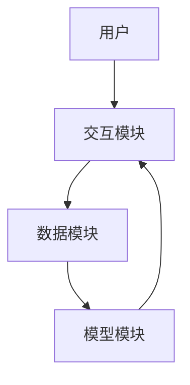
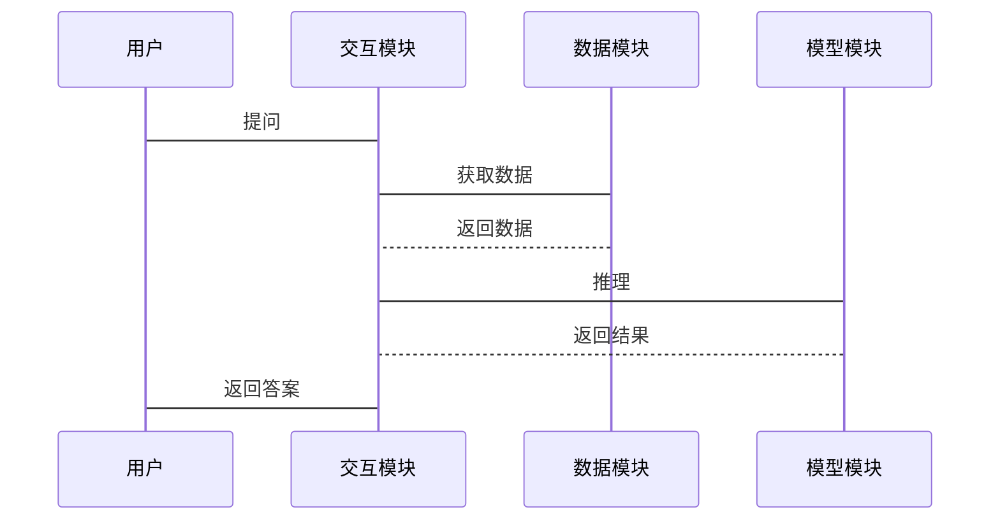

                 


# 定制化AI Agent：满足特定行业需求

**关键词**：定制化AI Agent、行业需求、自然语言处理、大模型、微调技术、领域模型、系统架构

**摘要**：定制化AI Agent是人工智能领域的重要发展方向，通过深度定制满足特定行业的复杂需求。本文从技术原理、系统架构、算法实现等多维度深入剖析定制化AI Agent的核心要素，并结合实际案例，探讨其在不同行业中的应用前景。

---

# 定制化AI Agent：满足特定行业需求

## 第1章: 定制化AI Agent的背景与概念

### 1.1 问题背景与需求分析
人工智能（AI）技术的快速发展为企业带来了前所未有的机遇，但也带来了新的挑战。传统AI系统往往难以满足特定行业的复杂需求，例如金融行业的风险管理、医疗行业的诊断支持等。这些行业需求具有高度的领域特定性，需要AI系统具备更强的定制化能力。

#### 1.1.1 传统AI系统的局限性
传统AI系统通常基于通用模型，难以适应特定行业的独特需求。例如，金融交易中的风险评估需要考虑市场波动、客户信用评分等复杂因素，而通用模型可能无法准确捕捉这些特征。

#### 1.1.2 行业定制化需求的兴起
随着企业对智能化转型的需求增加，定制化AI Agent的需求日益增长。企业希望通过定制化AI Agent实现特定场景下的高效决策和自动化操作。

#### 1.1.3 定制化AI Agent的定义与目标
定制化AI Agent是一种基于大模型技术的智能系统，通过深度学习和微调技术，为特定行业提供定制化的解决方案。其目标是将通用AI模型与行业知识相结合，满足特定场景下的复杂需求。

### 1.2 定制化AI Agent的核心要素
定制化AI Agent的核心要素包括领域知识、模型可定制性、交互能力等。以下是其核心要素的对比分析：

#### 1.2.1 核心概念与属性对比
| 属性 | 定制化AI Agent | 传统AI Agent |
|------|----------------|--------------|
| 领域适应性 | 高 | 低 |
| 可定制性 | 高 | 低 |
| 交互能力 | 强 | 弱 |

#### 1.2.2 定制化AI Agent的实体关系分析
```mermaid
er
actor: 定制化AI Agent
role: 提供定制化服务
```

### 1.3 定制化AI Agent的技术基础
定制化AI Agent的技术基础主要包括大模型技术、自然语言处理（NLP）和AI Agent的设计方法。

#### 1.3.1 大模型技术的发展
大模型技术（如GPT系列）为定制化AI Agent提供了强大的语义理解能力。通过大规模预训练，模型能够捕捉到语言中的复杂模式。

#### 1.3.2 自然语言处理与AI Agent的关系
NLP技术是定制化AI Agent的核心，它使得AI Agent能够理解用户意图并生成自然语言回复。例如，在医疗领域，AI Agent可以通过NLP技术分析病历数据并提供诊断建议。

#### 1.3.3 定制化AI Agent的实现路径
定制化AI Agent的实现通常包括以下几个步骤：
1. 预训练：使用通用大模型进行预训练。
2. 微调：针对特定行业数据进行微调。
3. 部署：将模型部署到实际应用场景中。

### 1.4 定制化AI Agent的行业应用现状
定制化AI Agent已经在多个行业得到广泛应用，例如金融、医疗和教育等。

#### 1.4.1 金融行业的定制化需求
在金融行业，定制化AI Agent可以帮助银行进行风险评估、客户咨询等任务。例如，AI Agent可以通过分析客户的财务数据，提供个性化的理财建议。

#### 1.4.2 医疗行业的定制化需求
在医疗行业，定制化AI Agent可以辅助医生进行诊断、病历管理和药物推荐。例如，AI Agent可以通过分析患者的症状，推荐可能的诊断方案。

#### 1.4.3 教育行业的定制化需求
在教育行业，定制化AI Agent可以为学生提供个性化的学习建议和辅导服务。例如，AI Agent可以根据学生的学习情况，推荐适合的学习资源。

### 1.5 本章小结
本章介绍了定制化AI Agent的背景、核心概念和技术基础。定制化AI Agent通过结合行业知识和大模型技术，能够为特定行业提供高效的解决方案。

---

## 第2章: 定制化AI Agent的核心概念与联系

### 2.1 定制化AI Agent的定义与特征
定制化AI Agent是一种基于大模型技术的智能系统，具有领域适应性强、可定制性高和交互能力强等特点。

#### 2.1.1 与传统AI Agent的主要区别
| 特性 | 定制化AI Agent | 传统AI Agent |
|------|----------------|--------------|
| 领域适应性 | 高 | 低 |
| 可定制性 | 高 | 低 |
| 交互能力 | 强 | 弱 |

#### 2.1.2 定制化AI Agent的核心属性对比
- 领域知识：定制化AI Agent需要具备特定行业的专业知识。
- 模型可定制性：定制化AI Agent可以通过微调技术适应不同行业的需求。
- 交互能力：定制化AI Agent能够通过自然语言与用户进行高效交互。

### 2.2 定制化AI Agent的实体关系分析
```mermaid
er
actor: 定制化AI Agent
role: 提供定制化服务
```

### 2.3 定制化AI Agent的核心原理
定制化AI Agent的核心原理包括知识表示、推理和自适应学习。

#### 2.3.1 知识表示
知识表示是定制化AI Agent的核心，通常采用图结构或向量表示。例如，医疗领域的知识可以通过疾病-症状图表示。

#### 2.3.2 推理
推理是定制化AI Agent的重要能力，通常基于逻辑推理或概率推理。例如，在金融领域，AI Agent可以通过推理分析市场趋势。

#### 2.3.3 自适应学习
自适应学习使得定制化AI Agent能够根据用户反馈不断优化自身性能。例如，在教育领域，AI Agent可以根据学生的学习情况调整教学策略。

### 2.4 定制化AI Agent的行业需求分析
定制化AI Agent在不同行业的应用需求各不相同，但其核心目标是提高效率和用户体验。

#### 2.4.1 金融行业的定制化需求
- 风险评估：AI Agent需要分析客户的财务数据，评估其信用风险。
- 客户咨询：AI Agent需要提供个性化的理财建议。

#### 2.4.2 医疗行业的定制化需求
- 病历分析：AI Agent需要分析患者的病历数据，辅助医生进行诊断。
- 药物推荐：AI Agent需要根据患者的症状推荐合适的药物。

#### 2.4.3 教育行业的定制化需求
- 学习建议：AI Agent需要根据学生的学习情况推荐适合的学习资源。
- 个性化辅导：AI Agent需要为学生提供个性化的辅导服务。

### 2.5 本章小结
本章深入探讨了定制化AI Agent的核心概念和原理，并分析了其在不同行业的应用需求。定制化AI Agent通过结合行业知识和大模型技术，能够为特定行业提供高效的解决方案。

---

## 第3章: 定制化AI Agent的算法原理

### 3.1 大模型的训练与微调
大模型的训练是定制化AI Agent的核心步骤。通常，我们首先进行预训练，然后针对特定行业数据进行微调。

#### 3.1.1 预训练
预训练是使用通用数据集对大模型进行训练。例如，我们可以使用公开的文本数据集进行预训练。

#### 3.1.2 微调
微调是针对特定行业数据对预训练模型进行进一步训练。例如，在金融领域，我们可以使用金融领域的数据对模型进行微调。

### 3.2 提示工程技术
提示工程（Prompt Engineering）是定制化AI Agent的重要技术，通过设计合适的提示语，引导模型生成符合需求的输出。

#### 3.2.1 提示设计
提示设计是提示工程的核心。例如，在金融领域，我们可以设计提示语指导模型生成股票分析报告。

#### 3.2.2 提示优化
提示优化是通过实验不断优化提示语，以提高模型的生成效果。例如，我们可以尝试不同的提示语，找到最能引导模型生成准确金融分析报告的提示语。

### 3.3 算法实现
定制化AI Agent的实现通常包括以下几个步骤：

#### 3.3.1 数据准备
数据准备是实现定制化AI Agent的第一步。例如，在金融领域，我们需要收集和整理相关的金融数据。

#### 3.3.2 模型训练
模型训练是使用准备好的数据对预训练模型进行微调。例如，我们可以使用金融领域的数据对模型进行微调。

#### 3.3.3 模型部署
模型部署是将训练好的模型部署到实际应用场景中。例如，我们可以将模型部署到银行的客户咨询系统中。

### 3.4 数学公式
以下是一些常用的数学公式：

#### 3.4.1 交叉熵损失函数
交叉熵损失函数用于衡量模型的预测值与真实值之间的差异：
$$
\text{loss} = -\sum_{i=1}^{n} y_i \log(p_i) + (1 - y_i) \log(1 - p_i)
$$

#### 3.4.2 优化器的更新公式
优化器的更新公式用于优化模型参数：
$$
\theta_{t+1} = \theta_t - \eta \cdot \nabla_{\theta} \text{loss}
$$
其中，$\eta$ 是学习率，$\nabla_{\theta} \text{loss}$ 是损失函数对参数 $\theta$ 的梯度。

### 3.5 代码实现
以下是一个简单的代码示例：

```python
import torch
import torch.nn as nn
import torch.optim as optim

class CustomizedAIAgent(nn.Module):
    def __init__(self):
        super(CustomizedAIAgent, self).__init__()
        self.fc1 = nn.Linear(100, 50)
        self.fc2 = nn.Linear(50, 10)

    def forward(self, x):
        x = torch.relu(self.fc1(x))
        x = torch.relu(self.fc2(x))
        return x

model = CustomizedAIAgent()
criterion = nn.CrossEntropyLoss()
optimizer = optim.SGD(model.parameters(), lr=0.01)

# 微调训练
for epoch in range(100):
    for inputs, labels in dataloader:
        outputs = model(inputs)
        loss = criterion(outputs, labels)
        optimizer.zero_grad()
        loss.backward()
        optimizer.step()
```

### 3.6 本章小结
本章详细介绍了定制化AI Agent的算法原理，包括大模型的训练与微调、提示工程技术以及具体的实现步骤。通过这些技术，我们可以实现高效的定制化AI Agent。

---

## 第4章: 定制化AI Agent的系统架构设计

### 4.1 问题场景介绍
定制化AI Agent的系统架构设计需要考虑多个方面，包括数据处理、模型训练和用户交互等。

#### 4.1.1 数据处理
数据处理是系统架构设计的第一步。我们需要收集和整理相关的行业数据，并进行预处理。

#### 4.1.2 模型训练
模型训练是系统架构设计的核心部分。我们需要设计高效的训练流程，确保模型能够快速收敛。

#### 4.1.3 用户交互
用户交互是系统架构设计的重要组成部分。我们需要设计友好的用户界面，确保用户能够方便地与AI Agent交互。

### 4.2 系统功能设计
系统功能设计需要考虑多个模块，包括数据模块、模型模块和交互模块。

#### 4.2.1 数据模块
数据模块负责数据的收集、存储和预处理。例如，我们可以使用数据库存储金融领域的数据。

#### 4.2.2 模型模块
模型模块负责模型的训练和推理。例如，我们可以使用深度学习框架（如TensorFlow或PyTorch）训练模型。

#### 4.2.3 交互模块
交互模块负责与用户的交互。例如，我们可以设计一个对话界面，用户可以通过输入问题与AI Agent交互。

### 4.3 系统架构图
以下是一个定制化AI Agent的系统架构图：



### 4.4 系统接口设计
系统接口设计需要考虑模块之间的通信方式。例如，交互模块可以通过API调用数据模块和模型模块。

#### 4.4.1 API设计
API设计是系统接口设计的核心。例如，我们可以设计一个API接口，用户可以通过调用该接口与AI Agent交互。

#### 4.4.2 接口实现
接口实现是系统接口设计的最后一步。我们需要编写具体的代码实现接口功能。

### 4.5 系统交互流程
系统交互流程是用户与AI Agent之间的交互过程。以下是一个简单的系统交互流程：



### 4.6 本章小结
本章详细介绍了定制化AI Agent的系统架构设计，包括问题场景、系统功能设计和系统交互流程。通过这些设计，我们可以实现高效的定制化AI Agent。

---

## 第5章: 定制化AI Agent的项目实战

### 5.1 项目背景与目标
本项目的目标是开发一个定制化AI Agent，用于金融领域的客户咨询。

#### 5.1.1 项目背景
金融行业的客户咨询需求日益增长，传统的客服系统难以满足客户的个性化需求。

#### 5.1.2 项目目标
开发一个能够提供个性化金融咨询服务的定制化AI Agent。

### 5.2 环境搭建
环境搭建是项目实战的第一步。我们需要安装必要的工具和库。

#### 5.2.1 安装Python
我们需要安装Python 3.8或更高版本。

#### 5.2.2 安装深度学习框架
我们可以选择使用TensorFlow或PyTorch框架。

#### 5.2.3 安装NLP库
我们需要安装NLP相关的库，例如spaCy和transformers。

### 5.3 数据准备
数据准备是项目实战的核心步骤。我们需要收集和整理相关的金融数据。

#### 5.3.1 数据收集
数据收集可以通过爬虫或其他数据采集工具完成。

#### 5.3.2 数据清洗
数据清洗是确保数据质量的重要步骤。我们需要去除重复数据和噪声数据。

#### 5.3.3 数据标注
数据标注是根据特定需求对数据进行标注。例如，我们可以标注客户的问题类型。

### 5.4 模型训练
模型训练是项目实战的核心步骤。我们需要使用收集到的数据对预训练模型进行微调。

#### 5.4.1 模型选择
我们可以选择GPT系列模型作为基础模型。

#### 5.4.2 微调训练
微调训练是使用金融领域的数据对模型进行进一步训练。

#### 5.4.3 模型评估
模型评估是通过测试数据对模型性能进行评估。

### 5.5 系统部署
系统部署是将训练好的模型部署到实际应用场景中。

#### 5.5.1 API接口设计
我们需要设计一个API接口，用户可以通过调用该接口与AI Agent交互。

#### 5.5.2 系统集成
系统集成是将AI Agent集成到现有的客服系统中。

#### 5.5.3 系统测试
系统测试是确保系统稳定性和可靠性的关键步骤。

### 5.6 本章小结
本章通过一个实际项目案例，详细介绍了定制化AI Agent的开发流程，包括环境搭建、数据准备、模型训练和系统部署。

---

## 第6章: 定制化AI Agent的总结与展望

### 6.1 本项目的核心优势
本项目的核心优势在于通过深度定制满足特定行业的复杂需求。

#### 6.1.1 高效性
定制化AI Agent能够快速响应用户需求，提高工作效率。

#### 6.1.2 可扩展性
定制化AI Agent可以通过模块化设计扩展到更多行业。

### 6.2 未来的发展方向
未来的发展方向包括模型优化、行业扩展和人机协作。

#### 6.2.1 模型优化
模型优化是提高定制化AI Agent性能的重要途径。例如，我们可以研究更高效的微调方法。

#### 6.2.2 行业扩展
行业扩展是将定制化AI Agent应用于更多行业的过程。例如，我们可以将AI Agent应用于教育、医疗等领域。

#### 6.2.3 人机协作
人机协作是未来的重要发展方向。例如，我们可以研究如何将AI Agent与人类专家协作，共同完成复杂任务。

### 6.3 本章小结
本章总结了定制化AI Agent的核心优势，并展望了未来的发展方向。通过不断优化和扩展，定制化AI Agent将在更多行业发挥重要作用。

---

## 附录

### 附录A: 定制化AI Agent的API文档
以下是一个定制化AI Agent的API文档示例：

```python
class CustomizedAIAgent:
    def __init__(self, model_path):
        self.model = load_model(model_path)
    
    def query(self, question):
        response = self.model.generate_response(question)
        return response
```

### 附录B: 定制化AI Agent的工具资源
以下是一些常用的定制化AI Agent开发工具：

- Hugging Face: 提供丰富的预训练模型和工具。
- TensorFlow: 开源深度学习框架。
- PyTorch: 开源深度学习框架。

---

通过以上内容，我们可以看到，定制化AI Agent在特定行业中的应用前景广阔。未来，随着技术的不断进步，定制化AI Agent将在更多领域发挥重要作用。

