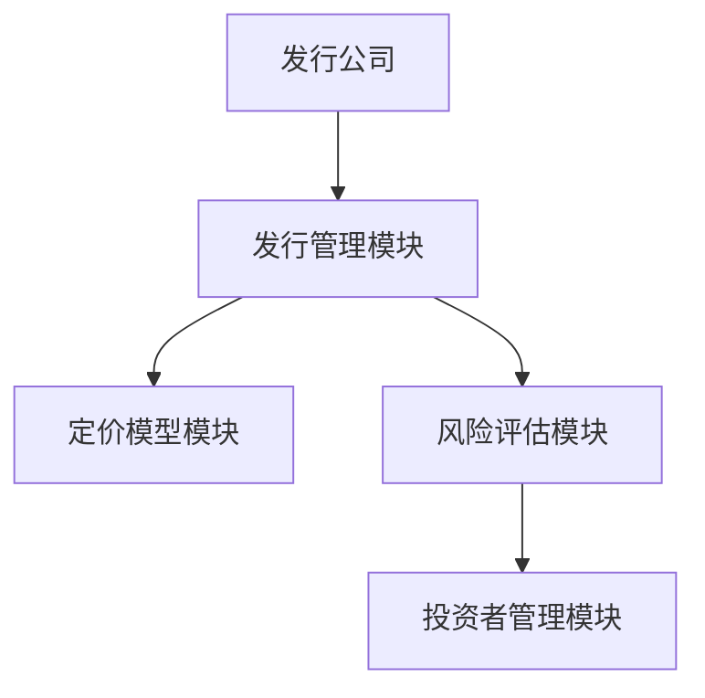

                 


# 定向增发策略：参与上市公司融资的机会

## 关键词：定向增发，融资策略，定价模型，风险评估，数学分析，系统设计

## 摘要：定向增发是上市公司融资的重要方式，本文从基本概念、定价策略、风险评估、数学模型、系统设计等多个维度，详细分析了参与定向增发的机会与挑战，提供了全面的策略指导。

---

## 第1章: 定向增发的基本概念与市场环境

### 1.1 定向增发的定义与特点

定向增发是指上市公司向特定投资者（如机构投资者、大股东等）非公开发行股票，以筹集资金的一种融资方式。其特点包括：发行对象特定、发行价格低于市场价格、锁定期较长等。

**特点对比表：**

| 特性        | 公开发行（IPO）       | 定向增发         |
|-------------|----------------------|-----------------|
| 发行对象     | 不特定公众           | 特定投资者       |
| 发行价格     | 市场定价             | 可低于市场价     |
| 审批流程     | 较复杂               | 较简化           |
| 融资用途     | 首次公开发行          | 多样化           |

### 1.2 定向增发的市场环境

定向增发的市场需求主要来源于企业扩张、偿还债务等，而市场供给则受到政策、市场环境等因素的影响。监管框架主要涉及证监会对发行的审核和信息披露的要求。

---

## 第2章: 定向增发的参与主体与流程

### 2.1 定向增发的参与主体

#### 发行公司
发行公司是定向增发的主体，负责制定发行方案、确定投资者等。

#### 投资者
投资者包括机构投资者、大股东等，他们在定向增发中购买股票，获得投资收益。

#### 中介机构
包括保荐机构、律师事务所、会计师事务所等，负责协助发行公司完成发行工作。

### 2.2 定向增发的基本流程

1. 确定发行方案：包括发行股数、定价方式、募集资金用途等。
2. 确定投资者：选择合适的投资者参与增发。
3. 发行定价：根据市场情况确定发行价格。
4. 审批与发行：提交证监会审批，完成发行。

---

## 第3章: 定向增发的定价策略与模型

### 3.1 定价策略的制定

#### 市场定价法
根据市场价确定发行价格，确保公平合理。

#### 折价发行法
以低于市场价发行，吸引特定投资者。

#### 综合定价法
结合市场价和公司基本面进行定价。

### 3.2 定价模型的数学分析

#### 市场价值评估模型
$$ P = P_0 \times (1 + r) $$
其中，$P$ 为发行价格，$P_0$ 为基准价格，$r$ 为溢价率。

#### 投资者价值评估模型
$$ V = \frac{CF}{(1 + r)^n} $$
其中，$CF$ 为未来现金流，$r$ 为折现率，$n$ 为时间。

---

## 第4章: 定向增发的风险评估与管理

### 4.1 定向增发的主要风险

#### 市场风险
市场波动可能导致股价下跌，影响投资者收益。

#### 公司风险
公司经营不善可能影响股价。

#### 流动性风险
定向增发的股票可能流动性较差，难以变现。

### 4.2 风险管理策略

#### 风险分散化
通过投资多样化来分散风险。

#### 风险对冲
利用衍生品对冲市场风险。

#### 风险监控与预警
定期监控市场和公司状况，及时预警。

---

## 第5章: 定向增发的案例分析与策略总结

### 5.1 成功案例分析

#### 案例一：某行业龙头企业的增发
通过定向增发筹集资金用于技术研发和市场拓展，实现业绩增长。

#### 案例二：某成长型企业的增发
通过增发引入战略投资者，提升市场竞争力。

### 5.2 失败案例分析

#### 案例一：某企业的增发失败原因
由于市场环境不佳，增发后股价大幅下跌。

#### 案例二：某行业的增发失败教训
公司基本面不佳，导致投资者亏损。

---

## 第6章: 定向增发的未来发展趋势与投资机会

### 6.1 未来发展趋势

#### 定向增发的市场潜力
随着企业融资需求增加，定向增发市场潜力巨大。

#### 定向增发的产品创新
引入更多创新产品，如可转换债券等。

#### 定向增发的监管变化
监管政策可能更加严格，推动市场规范化。

### 6.2 投资机会分析

#### 高成长企业的投资机会
投资于高成长企业，分享其增长红利。

#### 行业整合的投资机会
通过定向增发实现行业整合，提升投资回报。

#### 创新企业的投资机会
投资于技术创新企业，获取超额收益。

---

## 第7章: 定向增发的系统设计与实现

### 7.1 系统设计概述

#### 系统目标
设计一个支持定向增发的系统，实现发行、定价、风险评估等功能。

#### 系统功能模块
- 发行管理模块
- 投资者管理模块
- 定价模型模块
- 风险评估模块

#### 系统架构设计



---

## 第8章: 定向增发的数学模型与算法实现

### 8.1 数学模型概述

#### 市场价值评估模型
$$ P = P_0 \times (1 + r) $$
其中，$P$ 为发行价格，$P_0$ 为基准价格，$r$ 为溢价率。

#### 投资者价值评估模型
$$ V = \frac{CF}{(1 + r)^n} $$
其中，$CF$ 为未来现金流，$r$ 为折现率，$n$ 为时间。

### 8.2 算法实现

#### 市场价值评估算法

```python
def market_value_assessment(P0, r):
    return P0 * (1 + r)
```

#### 投资者价值评估算法

```python
def investor_value_assessment(CF, r, n):
    return CF / (1 + r) ** n
```

---

## 第9章: 定向增发的总结与展望

### 9.1 总结

定向增发是一种重要的融资方式，本文从多个维度进行了详细分析，提供了参与策略和风险管理的建议。

### 9.2 展望

未来，定向增发市场将更加规范化，技术也将更加创新，为投资者带来更多机会。

---

通过本文的分析，读者可以全面了解定向增发的策略、定价、风险及实现方法，为参与上市公司融资提供有力指导。

