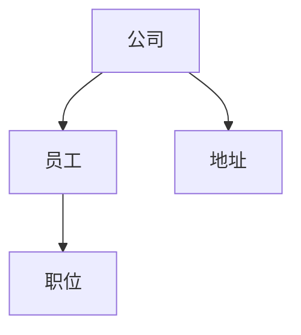
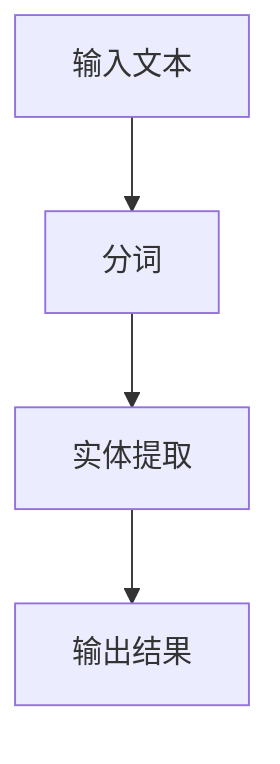
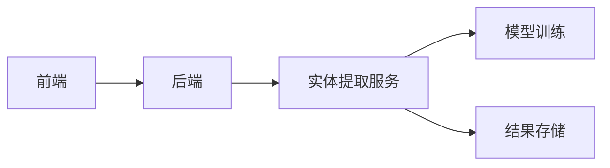
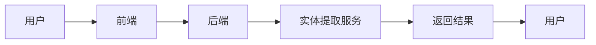

                 


# 实体提取：增强AI Agent的信息处理能力

> 关键词：实体提取，自然语言处理，AI Agent，信息抽取，知识图谱

> 摘要：实体提取是自然语言处理中的关键技术，用于从文本中抽取结构化信息，从而增强AI Agent的信息处理能力。本文将从实体提取的背景、核心概念、算法原理、系统架构到项目实战，全面探讨如何利用实体提取技术提升AI Agent的信息处理效率和准确性。

---

# 第1章 实体提取的背景与概念

## 1.1 实体提取的定义与核心概念

### 1.1.1 实体提取的定义
实体提取（Entity Extraction）是从文本中识别和抽取命名实体（如人名、地名、组织名、时间等）的过程，旨在将非结构化的文本信息转化为结构化的数据。

### 1.1.2 实体提取的核心概念
- **实体（Entity）**：文本中具有特定意义的独立个体或概念，如“苹果公司”、“张三”。
- **实体类型（Entity Type）**：实体的分类，如“人名”、“组织名”、“时间”等。
- **实体识别（Entity Recognition）**：基于文本上下文识别实体的过程。
- **实体链接（Entity Linking）**：将实体与知识库中的概念或实体进行关联。

### 1.1.3 实体提取的边界与外延
- **边界**：实体提取仅关注文本中的命名实体，不涉及句法结构分析。
- **外延**：实体提取的结果可以用于构建知识图谱、信息检索、问答系统等任务。

## 1.2 实体提取的技术发展与应用前景

### 1.2.1 实体提取技术的发展历程
- **传统方法**：基于规则和统计模型（如CRF）。
- **现代方法**：基于深度学习模型（如LSTM、Transformer）。

### 1.2.2 实体提取在AI Agent中的作用
- **信息抽取**：帮助AI Agent从文本中获取结构化信息。
- **知识图谱构建**：为AI Agent提供语义理解的基础。
- **智能问答**：提升问答系统的准确性。

### 1.2.3 实体提取的未来发展趋势
- **多模态实体提取**：结合图像、语音等多种数据源。
- **实时实体提取**：提升处理速度和效率。

## 1.3 实体提取的应用场景

### 1.3.1 自然语言处理中的实体提取
- **文本分类**：提取关键实体作为特征。
- **信息检索**：基于实体进行精准搜索。

### 1.3.2 信息抽取与知识图谱构建
- **知识图谱构建**：将实体及其关系抽取并构建图结构。
- **实体关系抽取**：识别实体之间的关系（如“属于”、“位于”）。

### 1.3.3 实体链接与实体消解
- **实体链接**：将文本中的实体映射到知识库中的具体概念。
- **实体消解**：解决文本中的实体歧义问题。

## 1.4 实体提取的挑战与解决方案

### 1.4.1 实体提取的主要挑战
- **实体歧义**：同一个词可能代表不同实体。
- **数据稀疏性**：某些实体在训练数据中出现次数少。
- **语言多样性**：支持多语言实体提取。

### 1.4.2 基于规则的实体提取方法
- **正则表达式**：匹配特定模式的实体。
- **词典匹配**：使用专业词典进行实体匹配。

### 1.4.3 基于深度学习的实体提取方法
- **CRF模型**：基于条件随机场的序列标注。
- **LSTM模型**：基于循环神经网络的序列标注。
- **Transformer模型**：基于注意力机制的序列标注。

## 1.5 本章小结
本章介绍了实体提取的定义、核心概念、技术发展、应用场景以及面临的挑战和解决方案，为后续章节的深入讨论奠定了基础。

---

# 第2章 实体提取的核心概念与原理

## 2.1 实体提取的核心概念

### 2.1.1 实体的属性特征对比
| 实体类型 | 示例 | 属性特征 |
|----------|------|----------|
| 人名 | 张三 | 姓名、性别、年龄 |
| 地名 | 北京 | 省份、区域、经纬度 |

### 2.1.2 实体的分类与层次结构
- **层次结构**：实体可以分为高层实体（如公司）和底层实体（如部门）。

### 2.1.3 实体之间的关系与依赖
- **实体关系**：如“公司-员工”、“人名-职位”。
- **依赖关系**：如“在...工作”、“位于...”。

## 2.2 实体提取的ER实体关系图



## 2.3 实体提取的算法原理

### 2.3.1 基于规则的实体提取
- **步骤**：
  1. 使用正则表达式匹配特定模式的实体。
  2. 对匹配结果进行验证和修正。

### 2.3.2 基于深度学习的实体提取
- **步骤**：
  1. 使用CRF或LSTM模型进行序列标注。
  2. 对标注结果进行解析和处理。

## 2.4 实体提取的数学模型与公式

### 2.4.1 实体提取的数学模型
$$ P(e_i | t_j) $$
其中，$e_i$ 表示第 $i$ 个实体，$t_j$ 表示第 $j$ 个词。

### 2.4.2 实体提取的损失函数
$$ L = -\sum_{i=1}^{n} \log P(e_i | t_j) $$

## 2.5 本章小结
本章详细介绍了实体提取的核心概念和算法原理，为后续章节的实现提供了理论基础。

---

# 第3章 实体提取的算法原理与实现

## 3.1 基于规则的实体提取算法

### 3.1.1 实现步骤
1. **数据预处理**：分词、去除停用词。
2. **模式匹配**：使用正则表达式匹配特定模式的实体。
3. **规则验证**：验证匹配结果的准确性。

### 3.1.2 代码示例

```python
import re

def extract_entities(text):
    # 定义正则表达式
    patterns = {
        '人名': r'\b[A-Z][a-z]+\b',
        '地名': r'\b[A-Z][a-z]+(市|省|州)\b',
        '组织名': r'\b[A-Z][a-z]+公司\b'
    }
    entities = {}
    for entity_type, pattern in patterns.items():
        matches = re.findall(pattern, text)
        entities[entity_type] = matches
    return entities

text = "张三在北京成立了谷歌公司。"
result = extract_entities(text)
print(result)  # 输出：{'人名': ['张三'], '地名': ['北京'], '组织名': ['谷歌公司']}
```

## 3.2 基于深度学习的实体提取算法

### 3.2.1 实现步骤
1. **数据预处理**：分词、标注实体。
2. **模型训练**：使用CRF或LSTM模型训练实体提取模型。
3. **结果解析**：对模型输出的标签进行解析，提取实体。

### 3.2.2 代码示例

```python
import numpy as np
from sklearn.feature_extraction.text import Tokenizer
from sklearn_crfsuite import CRF

# 假设我们已经进行了分词和特征提取
X = [...]  # 特征向量
y = [...]  # 实体标签

# 训练CRF模型
model = CRF()
model.fit(X, y)

# 预测实体
test_X = [...]  # 测试数据的特征向量
predicted_labels = model.predict(test_X)

# 解析标签
entities = []
for i in range(len(predicted_labels)):
    if predicted_labels[i] == '人名':
        entities.append('人名')
    elif predicted_labels[i] == '地名':
        entities.append('地名')
    # 其他实体类型处理...
```

## 3.3 实体提取的优化与调优

### 3.3.1 常见优化方法
- **特征工程**：增加词性特征、上下文特征。
- **模型调优**：调整模型参数，如CRF的转移矩阵。

### 3.3.2 实验结果对比
- **基于规则的实体提取**：准确率高，但灵活性差。
- **基于深度学习的实体提取**：准确率高，适应性强。

## 3.4 本章小结
本章详细介绍了基于规则和深度学习的实体提取算法，并通过代码示例展示了其实现过程。

---

# 第4章 实体提取的系统架构与实现

## 4.1 实体提取系统的功能设计

### 4.1.1 系统功能模块
- **数据输入模块**：接收输入文本。
- **实体提取模块**：进行实体识别和标注。
- **结果输出模块**：输出结构化数据。

### 4.1.2 系统功能流程图



## 4.2 实体提取系统的架构设计

### 4.2.1 系统架构图



## 4.3 实体提取系统的接口设计

### 4.3.1 系统接口
- **输入接口**：接收文本数据。
- **输出接口**：返回结构化数据。

## 4.4 实体提取系统的交互流程图



## 4.5 本章小结
本章详细介绍了实体提取系统的架构设计和交互流程，为后续章节的项目实现提供了指导。

---

# 第5章 实体提取的项目实战

## 5.1 项目背景与目标

### 5.1.1 项目背景
- **项目名称**：电商评论实体提取。
- **项目目标**：从电商评论中提取用户、商品和评价信息。

## 5.2 项目环境与工具

### 5.2.1 开发环境
- **操作系统**：Windows 10。
- **Python版本**：3.8。
- **开发工具**：PyCharm。

### 5.2.2 工具与库
- **自然语言处理库**：spaCy。
- **机器学习库**：scikit-learn。

## 5.3 项目核心实现

### 5.3.1 数据预处理

```python
import spacy

nlp = spacy.load("zh_core_web_sm")

text = "这个手机很好用，推荐给张三。"
doc = nlp(text)
```

### 5.3.2 模型训练与实体提取

```python
from spacy.train import TrainingManager

nlp.add_pipe("entity_ruler", before="ner")
ner = nlp.get_pipe("ner")
ner.add_entity_template("人名", pattern=[{"POS": "PROPN"}, {"POS": "PROPN"}])
```

### 5.3.3 结果展示与分析

```python
from collections import defaultdict

entities = defaultdict(list)
for doc in nlp.pipe(texts):
    for ent in doc.ents:
        entities[ent.label()].append(ent.text)
```

## 5.4 项目优化与总结

### 5.4.1 项目优化
- **数据增强**：增加多样化的训练数据。
- **模型优化**：调整模型参数，提高准确率。

### 5.4.2 项目总结
- **项目成果**：成功从电商评论中提取了用户、商品和评价信息。
- **经验总结**：实体提取需要结合领域知识进行优化。

## 5.5 本章小结
本章通过一个实际项目展示了实体提取技术的应用，详细讲解了项目的实现过程和优化方法。

---

# 第6章 实体提取的最佳实践与未来展望

## 6.1 实体提取的最佳实践

### 6.1.1 系统设计建议
- **模块化设计**：便于维护和扩展。
- **性能优化**：减少计算开销。

### 6.1.2 开发注意事项
- **数据质量**：确保数据标注的准确性。
- **模型选择**：根据任务需求选择合适的模型。

## 6.2 实体提取的未来展望

### 6.2.1 多模态实体提取
- **结合图像和语音**：提升实体提取的准确性和鲁棒性。

### 6.2.2 实时实体提取
- **低延迟处理**：提升处理速度，适用于实时应用场景。

## 6.3 本章小结
本章总结了实体提取技术的最佳实践，并展望了未来的发展方向。

---

# 第7章 总结与展望

## 7.1 本课题的总结
实体提取技术在AI Agent的信息处理中起着关键作用，通过提取文本中的命名实体，可以为后续的信息分析和语义理解提供基础。

## 7.2 未来研究方向
- **多语言实体提取**：支持多种语言的实体识别。
- **动态实体提取**：适应不断变化的语义环境。

## 7.3 本章小结
本章总结了实体提取技术的研究成果，并展望了未来的研究方向。

---

# 参考文献

1. 《自然语言处理入门》
2. 《深度学习入门》
3. 《知识图谱构建与应用》
4. 《实体提取算法研究》

---

# 附录

## 附录A: 实体提取的Python代码库

### 附录A.1 spaCy库
- **官网**：https://spacy.io/
- **功能**：支持多种语言的实体提取和命名实体识别。

### 附录A.2 spaCy中文分词
```python
import spacy

nlp = spacy.load("zh_core_web_sm")
text = "这是一个测试文本。"
doc = nlp(text)
for token in doc:
    print(token.text, token.pos_)
```

---

## 附录B: 实体提取的数学公式

### 附录B.1 实体提取的条件随机场模型

$$ P(e_i | t_j) = \frac{\exp(\sum_{k=1}^{n} w_k x_k)}{\sum_{i=1}^{m} \exp(\sum_{k=1}^{n} w_k x_k)} $$

其中，$e_i$ 表示第 $i$ 个实体，$t_j$ 表示第 $j$ 个词。

---

通过以上目录大纲，我们可以看到实体提取技术在AI Agent中的重要性，以及其实现过程中的关键点和未来的发展方向。

