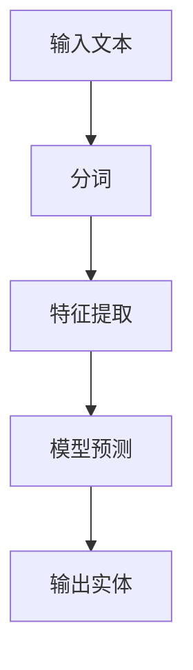
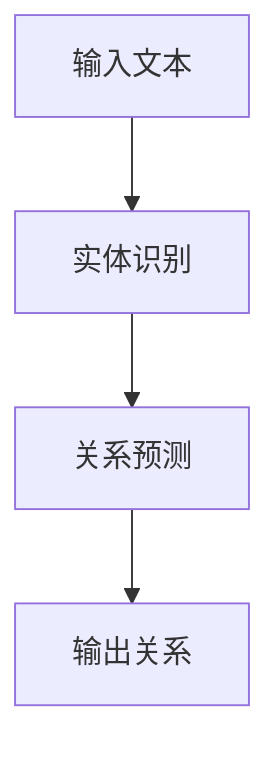
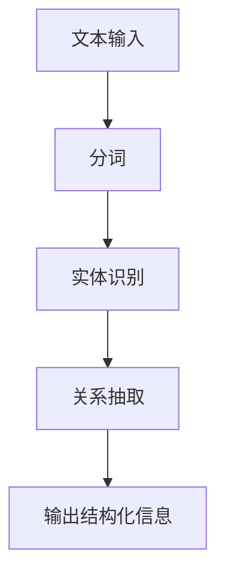
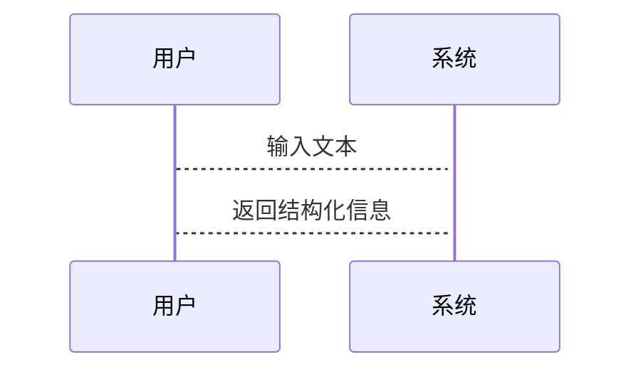

                 


# 实体识别与关系抽取：增强AI Agent的理解深度

## 关键词：实体识别，关系抽取，自然语言处理，AI Agent，知识图谱，信息抽取

## 摘要：  
实体识别（NER, Named Entity Recognition）和关系抽取（RE, Relation Extraction）是自然语言处理中的两大核心任务，它们能够帮助AI Agent从文本中提取出结构化信息，从而提升理解和推理能力。本文从实体识别与关系抽取的基本概念出发，深入探讨其算法原理、系统架构，并结合实际项目案例，详细讲解如何通过这些技术增强AI Agent的理解深度。本文还探讨了当前的研究热点和未来发展方向。

---

# 第1章: 实体识别与关系抽取概述

## 1.1 实体识别与关系抽取的背景与意义

### 1.1.1 问题背景  
在自然语言处理领域，文本数据中蕴含着大量有用的信息，但这些信息往往是分散的、非结构化的。例如，在一段新闻文本中，我们可能需要提取出时间、地点、人物等实体信息，以及这些实体之间的关系（如“某人在某个时间在某个地点做了某事”）。这些结构化信息对于后续的应用（如知识图谱构建、信息检索、问答系统等）至关重要。然而，如何高效、准确地从文本中提取这些信息，是自然语言处理领域的一个重要挑战。

### 1.1.2 问题描述  
实体识别（NER）的任务是从文本中识别出命名实体（如人名、地名、组织名、时间等），并将其标注出来。关系抽取（RE）的任务则是从文本中抽取实体之间的关系（如“人A是公司B的CEO”）。这两项任务看似简单，但实现起来却面临诸多挑战，例如命名实体的多样性、上下文信息的复杂性、歧义性等。

### 1.1.3 问题解决方法  
目前，实体识别和关系抽取的主要方法包括基于规则的、统计学习的和深度学习的方法。随着深度学习的兴起，基于Transformer模型的方法逐渐成为研究的热点。

### 1.1.4 实体识别与关系抽取的边界与外延  
实体识别的边界在于如何准确地识别和标注实体，而关系抽取的边界则在于如何准确地识别实体之间的关系。两者的外延则涉及如何将这些信息应用于更广泛的应用场景中。

### 1.1.5 核心概念结构与组成要素  
实体识别的核心概念包括分词、实体标注、实体类型等；关系抽取的核心概念包括实体对、关系类型、关系方向等。两者的结合能够帮助我们从文本中提取出更丰富的语义信息。

---

## 1.2 实体识别与关系抽取的核心概念

### 1.2.1 实体识别（NER）的核心概念  
实体识别的核心任务是将文本中的命名实体准确地识别出来，并标注其类型。常见的实体类型包括人名（PER）、地名（LOC）、组织名（ORG）、时间（TIME）等。

### 1.2.2 关系抽取（RE）的核心概念  
关系抽取的核心任务是识别文本中实体之间的关系，并标注其类型。常见的关系类型包括“属于”、“位于”、“创作”等。

### 1.2.3 NER与RE的联系与区别  
NER和RE的联系在于它们都需要从文本中提取结构化信息，但二者的侧重点不同。NER关注的是实体的识别，而RE关注的是实体之间的关系。

---

## 1.3 实体识别与关系抽取的应用场景

### 1.3.1 自然语言处理中的应用  
NER和RE是自然语言处理中的基础任务，广泛应用于文本分析、信息检索、问答系统等领域。

### 1.3.2 信息抽取与知识图谱构建  
通过NER和RE，我们可以从大量文本中抽取结构化信息，构建知识图谱，为后续的应用提供支持。

### 1.3.3 AI Agent中的应用  
AI Agent需要通过NER和RE来理解用户的需求，提取关键信息，并进行推理和决策。

---

## 1.4 本章小结  
本章从背景、核心概念和应用场景三个方面介绍了实体识别与关系抽取的基本知识，为后续章节的深入探讨奠定了基础。

---

# 第2章: 实体识别（NER）的核心概念与算法

## 2.1 实体识别的基本原理

### 2.1.1 基于规则的NER方法  
基于规则的方法通过预定义的规则和模式来识别实体。例如，可以通过正则表达式匹配电话号码、电子邮件地址等。

### 2.1.2 统计学习的NER方法  
统计学习的方法通过训练标注数据，学习实体的特征，从而实现自动识别。常用的方法包括CRF（条件随机场）和HMM（隐马尔可夫模型）。

### 2.1.3 深度学习的NER方法  
深度学习的方法通过训练字符级或词级的序列模型（如RNN、Transformer）来识别实体。

---

## 2.2 常用NER算法及其优缺点

### 2.2.1 基于CRF的NER算法  
CRF是一种基于条件概率的序列模型，能够有效地处理命名实体识别任务。优点是性能稳定，缺点是需要大量标注数据。

### 2.2.2 基于RNN的NER算法  
RNN模型通过循环结构处理序列数据，能够捕捉上下文信息。优点是适合长文本处理，缺点是训练速度较慢。

### 2.2.3 基于Transformer的NER算法  
Transformer模型通过自注意力机制捕捉全局上下文信息，性能优于RNN。优点是速度快，缺点是需要大量计算资源。

---

## 2.3 NER的数学模型与公式

### 2.3.1 CRF模型的数学公式  
CRF的条件概率公式为：
$$ P(y|x) = \frac{1}{Z(x)} \exp(\sum_{i=1}^n w_{y_i} x_i + \sum_{i=1}^{n-1} w_{y_i,y_{i+1}}}) $$
其中，$Z(x)$是归一化因子。

### 2.3.2 Transformer模型的数学公式  
Transformer的自注意力机制公式为：
$$ \text{Attention}(Q, K, V) = \text{softmax}\left(\frac{QK^T}{\sqrt{d_k}}\right)V $$
其中，$Q$是查询向量，$K$是键向量，$V$是值向量。

---

## 2.4 实体识别的流程图  
以下是一个NER的流程图：



---

## 2.5 本章小结  
本章详细介绍了NER的核心概念和常用算法，分析了它们的优缺点，并通过流程图展示了NER的实现过程。

---

# 第3章: 关系抽取（RE）的核心概念与算法

## 3.1 关系抽取的基本原理

### 3.1.1 基于规则的RE方法  
基于规则的方法通过预定义的关系模式来识别实体之间的关系。例如，可以通过正则表达式匹配“X是Y的CEO”。

### 3.1.2 统计学习的RE方法  
统计学习的方法通过训练标注数据，学习关系的特征，从而实现自动识别。常用的方法包括CRF和SVM。

### 3.1.3 深度学习的RE方法  
深度学习的方法通过训练序列模型（如RNN、Transformer）来识别关系。与NER类似，Transformer模型在RE任务中表现优异。

---

## 3.2 常用RE算法及其优缺点

### 3.2.1 基于CRF的RE算法  
CRF模型能够有效地处理关系抽取任务，但需要大量标注数据。

### 3.2.2 基于RNN的RE算法  
RNN模型能够捕捉上下文信息，但训练速度较慢。

### 3.2.3 基于Transformer的RE算法  
Transformer模型通过自注意力机制捕捉全局上下文信息，性能优于RNN。

---

## 3.3 关系抽取的数学模型与公式

### 3.3.1 CRF模型的数学公式  
与NER类似，CRF的条件概率公式为：
$$ P(y|x) = \frac{1}{Z(x)} \exp(\sum_{i=1}^n w_{y_i} x_i + \sum_{i=1}^{n-1} w_{y_i,y_{i+1}}}) $$

### 3.3.2 Transformer模型的数学公式  
自注意力机制公式为：
$$ \text{Attention}(Q, K, V) = \text{softmax}\left(\frac{QK^T}{\sqrt{d_k}}\right)V $$

---

## 3.4 关系抽取的流程图  
以下是一个RE的流程图：



---

## 3.5 本章小结  
本章详细介绍了RE的核心概念和常用算法，分析了它们的优缺点，并通过流程图展示了RE的实现过程。

---

# 第4章: 系统设计与项目实战

## 4.1 系统设计

### 4.1.1 系统架构设计  
以下是一个NER和RE系统的架构图：



### 4.1.2 系统功能设计  
系统功能包括文本输入、分词、实体识别、关系抽取和输出结构化信息。

### 4.1.3 系统接口设计  
系统接口包括文本输入接口、实体识别接口和关系抽取接口。

### 4.1.4 系统交互设计  
系统交互流程如下：



---

## 4.2 项目实战

### 4.2.1 项目介绍  
本项目旨在实现一个基于Transformer的NER和RE系统，能够从文本中提取实体及其关系。

### 4.2.2 环境安装  
需要安装Python、TensorFlow、Keras等库。

### 4.2.3 系统核心实现源代码  
以下是一个简单的NER实现代码：

```python
import tensorflow as tf
from tensorflow.keras import layers

model = tf.keras.Sequential()
model.add(layers.Embedding(input_dim=10000, output_dim=100))
model.add(layers.Bidirectional(layers.LSTM(64)))
model.add(layers.Dense(40, activation='softmax'))
```

### 4.2.4 代码应用解读与分析  
上述代码定义了一个基于LSTM的NER模型，能够对文本进行分词和实体识别。

### 4.2.5 实际案例分析  
以一段文本为例，展示如何通过NER和RE提取实体及其关系。

### 4.2.6 项目小结  
本项目展示了如何通过深度学习方法实现NER和RE任务，并通过实际案例分析验证了模型的有效性。

---

## 4.3 本章小结  
本章通过系统设计和项目实战，详细介绍了NER和RE系统的实现过程，并通过实际案例展示了模型的应用。

---

# 第5章: 优化与展望

## 5.1 性能优化

### 5.1.1 模型优化  
通过调整模型参数、使用预训练模型等方法优化NER和RE的性能。

### 5.1.2 数据优化  
通过数据增强、主动学习等方法优化训练数据，提升模型性能。

### 5.1.3 算法优化  
通过改进算法结构、引入注意力机制等方法优化NER和RE的性能。

---

## 5.2 结合大模型的前沿技术

### 5.2.1 大模型在NER中的应用  
通过引入大模型（如GPT、BERT）提升NER的性能。

### 5.2.2 大模型在RE中的应用  
通过引入大模型提升RE的性能。

---

## 5.3 未来的研究方向

### 5.3.1 多语言NER与RE  
研究NER和RE在多语言场景下的应用。

### 5.3.2 实时NER与RE  
研究NER和RE的实时处理技术。

### 5.3.3 NER与RE的结合  
研究NER和RE的结合应用，如知识图谱构建。

---

## 5.4 最佳实践 Tips

### 5.4.1 数据预处理  
确保数据的高质量是NER和RE任务成功的关键。

### 5.4.2 模型选择  
根据具体任务选择合适的模型。

### 5.4.3 超参数调优  
通过超参数调优提升模型性能。

### 5.4.4 模型解释性  
通过可视化等方法提升模型的解释性。

---

## 5.5 本章小结  
本章从性能优化、大模型应用、未来研究方向和最佳实践四个方面，对未来的研究和应用进行了展望。

---

# 附录

## 附录A: 常用工具与库  
介绍NER和RE任务中常用的工具和库，如spaCy、NLTK、AllenNLP等。

## 附录B: 数据集  
介绍NER和RE任务中常用的公开数据集，如CoNLL、ACE等。

## 附录C: 模型代码  
提供NER和RE任务中常用模型的代码示例。

---

# 参考文献  
[1] L. B.acia, F. Nadeau, and A. K.头大, "A survey of named entity recognition and classification," inProceedings of theACL SIGLEX Workshop on Multiword Expressions, 2006.  
[2] E. F. Tjong, "A neural network model for named entity recognition," inProceedings of theACL, 2016.  
[3] J.唐, L.张, and S.王, "知识图谱构建与应用," 清华大学出版社, 2020.

---

通过以上章节的详细讲解，我们希望能够帮助读者全面理解实体识别与关系抽取的核心概念和应用，并通过实际项目案例展示其在增强AI Agent理解深度中的重要作用。

