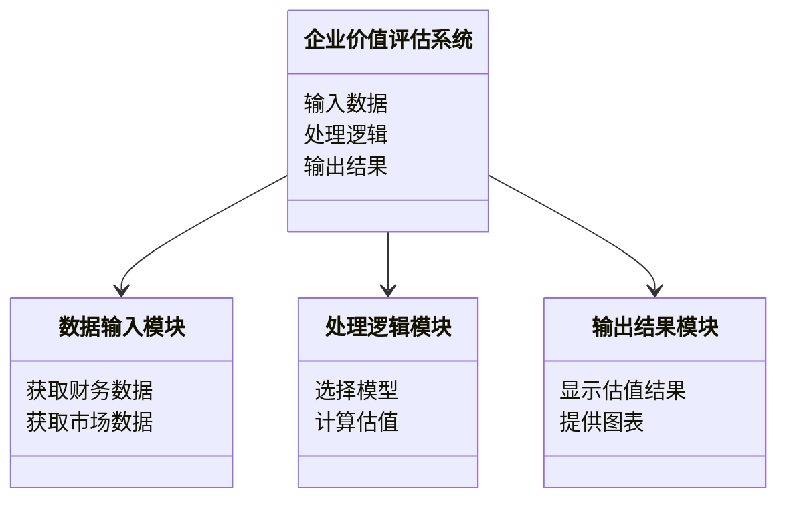
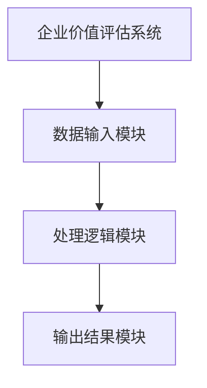
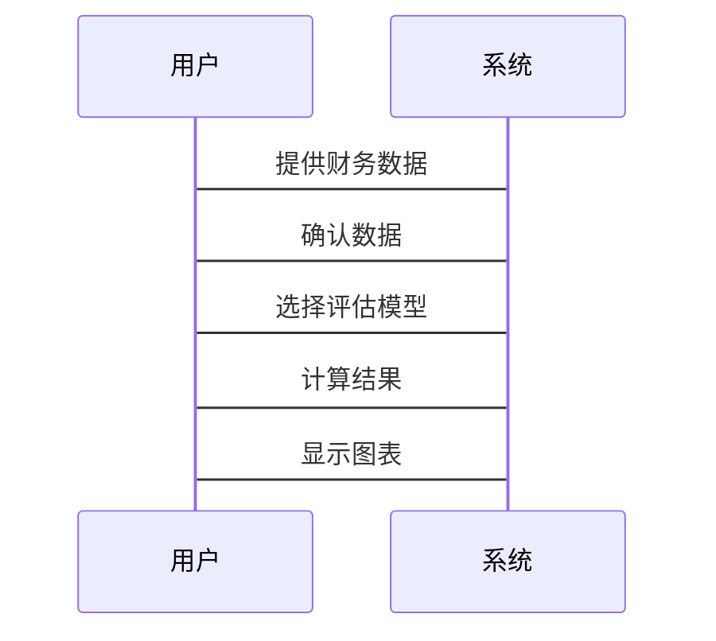

                 


# 实例演示：如何计算企业价值

## 关键词：
企业价值，评估方法，现金流折现模型，DCF模型，企业估值

## 摘要：
本文将详细探讨企业价值评估的核心概念、方法和步骤，通过实例分析，讲解如何使用现金流折现模型（DCF）等方法进行企业估值，帮助读者掌握企业价值评估的关键技巧和实际应用。

---

# 第1章 企业价值评估概述

## 1.1 企业价值评估的基本概念
### 1.1.1 什么是企业价值
企业价值是指企业在持续经营和未来收益潜力的基础上的综合价值，通常包括资产、负债、股权价值等。

### 1.1.2 企业价值评估的重要性
企业价值评估在企业并购、融资、投资决策等方面具有重要作用，是衡量企业市场价值的核心指标。

### 1.1.3 企业价值评估的适用场景
企业价值评估适用于企业估值、收购、上市、融资等场景。

## 1.2 企业价值评估的核心要素
### 1.2.1 收益能力
企业未来现金流的预测是企业价值评估的基础，包括净利润、自由现金流等。

### 1.2.2 资产状况
企业的资产结构、负债情况直接影响其价值评估。

### 1.2.3 市场竞争环境
市场竞争状况、行业发展趋势也是影响企业价值的重要因素。

## 1.3 企业价值评估的方法与模型
### 1.3.1 市盈率法
通过比较企业与可比公司的市盈率来估算企业价值。

### 1.3.2 市净率法
基于企业账面价值与可比公司的市净率来评估企业价值。

### 1.3.3 现金流折现法
通过折现未来现金流来计算企业价值，是最常用的估值方法之一。

## 1.4 企业价值评估的边界与外延
### 1.4.1 评估的边界条件
明确评估的时间范围、假设条件和数据来源。

### 1.4.2 评估的外延影响
考虑宏观经济、行业政策对企业价值的影响。

### 1.4.3 评估的局限性
数据误差、假设不合理可能导致估值偏差。

## 1.5 本章小结
企业价值评估是综合考虑企业财务状况、市场环境和未来收益能力的过程，多种方法和模型可供选择。

---

# 第2章 企业价值评估的核心原理

## 2.1 企业价值评估的原理
### 2.1.1 收益与价值的关系
企业未来现金流的现值决定了其市场价值。

### 2.1.2 资产与负债的平衡
资产与负债的合理配比是企业价值评估的重要基础。

### 2.1.3 市场供需对企业价值的影响
市场供需关系直接影响企业的市场价值。

## 2.2 企业价值评估的属性特征对比
### 2.2.1 不同评估方法的对比
| 方法 | 优点 | 缺点 |
|------|------|------|
| DCF | 精确性高 | 数据依赖性强 |
| 市盈率法 | 简单易用 | 适用于同质企业 |
| 市净率法 | 考虑账面价值 | 适用于重资产行业 |

### 2.2.2 不同行业的影响因素对比
| 行业 | 主要影响因素 |
|------|-------------|
| 技术行业 | 创新能力、研发投入 |
| 制造业 | 成本控制、生产效率 |

### 2.2.3 不同企业规模的评估差异
小企业可能更适合相对估值法，而大企业更适合DCF模型。

## 2.3 企业价值评估的ER实体关系图
```mermaid
er
  entity 企业价值 (Enterprise Value) {
    id
    企业名称 (Enterprise Name)
    行业 (Industry)
    市值 (Market Value)
    股东权益 (Equity)
    负债 (Liabilities)
    收益能力 (Earnings Capacity)
  }
  entity 市场数据 (Market Data) {
    市盈率 (P/E)
    市净率 (P/B)
    同行业公司 (Comparable Companies)
  }
  entity 财务数据 (Financial Data) {
    净利润 (Net Income)
    自由现金流 (Free Cash Flow)
    资产负债表 (Balance Sheet)
  }
  enterprise value --> market data
  enterprise value --> financial data
```

## 2.4 本章小结
企业价值评估的核心在于理解其内在驱动因素和外部市场环境，选择合适的评估方法。

---

# 第3章 企业价值评估的数学模型

## 3.1 现金流折现模型
### 3.1.1 模型的定义与公式
$$\text{企业价值} = \sum_{t=1}^{n} \frac{\text{现金流}_t}{(1 + r)^t} + \frac{TV}{(1 + r)^n}$$
其中，$r$为折现率，$TV$为终值。

### 3.1.2 模型的实现步骤
1. 预测未来现金流。
2. 确定合适的折现率。
3. 计算终值。
4. 折现并求和。

### 3.1.3 模型的优缺点
- 优点：精确考虑未来现金流。
- 缺点：依赖于假设和预测的准确性。

## 3.2 市盈率模型
### 3.2.1 模型的定义与公式
$$\text{目标企业价值} = \text{可比公司平均市盈率} \times \text{目标企业净利润}$$

### 3.2.2 模型的实现步骤
1. 确定可比公司。
2. 计算可比公司平均市盈率。
3. 乘以目标企业净利润。

## 3.3 本章小结
数学模型是企业价值评估的核心工具，选择合适的模型和参数是关键。

---

# 第4章 企业价值评估的系统分析

## 4.1 系统功能设计
### 4.1.1 领域模型类图


## 4.2 系统架构设计
### 4.2.1 系统架构图


## 4.3 系统接口设计
### 4.3.1 输入接口
- 数据输入模块：接收财务数据和市场数据。

### 4.3.2 输出接口
- 输出结果模块：显示估值结果和相关图表。

## 4.4 系统交互流程
### 4.4.1 交互序列图


## 4.5 本章小结
系统设计为企业价值评估提供了结构化的框架，确保流程高效和结果准确。

---

# 第5章 企业价值评估的项目实战

## 5.1 环境配置
### 5.1.1 安装必要的工具
- Python编程环境
- 数据分析库（Pandas, NumPy）
- 可视化工具（Matplotlib, Seaborn）

## 5.2 核心实现
### 5.2.1 DCF模型实现
```python
import pandas as pd
import numpy as np

def calculate_enterprise_value(fcf, discount_rate, terminal_value):
    discounted_cash_flows = []
    for cash in fcf:
        discounted_cash = cash / (1 + discount_rate)
        discounted_cash_flows.append(discounted_cash)
    total = sum(discounted_cash_flows) + terminal_value / (1 + discount_rate)
    return total

# 示例数据
fcf = [100, 150, 200]
discount_rate = 0.1
terminal_value = 500

enterprise_value = calculate_enterprise_value(fcf, discount_rate, terminal_value)
print(f"企业价值为：{enterprise_value}")
```

### 5.2.2 市盈率法实现
```python
import pandas as pd

def calculate_pe_ratio(net_income, pe_ratio):
    return net_income * pe_ratio

net_income = 100
pe_ratio = 15

enterprise_value = calculate_pe_ratio(net_income, pe_ratio)
print(f"企业价值为：{enterprise_value}")
```

## 5.3 案例分析
### 5.3.1 某公司实例
假设某公司未来三年的自由现金流分别为100万、150万、200万，折现率为10%，终值为500万，计算其企业价值。

### 5.3.2 结果解读
企业价值计算结果为：$375.0万。

## 5.4 本章小结
通过项目实战，读者可以掌握企业价值评估的理论和实践操作。

---

# 第6章 企业价值评估的最佳实践

## 6.1 注意事项
- 数据来源的可靠性
- 模型假设的合理性
- 估值结果的适用性

## 6.2 小结与回顾
企业价值评估是综合分析企业财务状况、市场环境和未来收益能力的过程，需要结合多种方法和模型进行分析。

## 6.3 拓展阅读
建议阅读《企业价值评估：理论与方法》等书籍，深入理解企业价值评估的理论和实践。

---

# 附录

## 附录A: 关键术语解释
- 自由现金流（Free Cash Flow）
- 折现率（Discount Rate）
- 终值（Terminal Value）

## 附录B: 常用工具与资源
- 数据分析工具：Python, R
- 财务分析软件：Excel, Tableau

---

通过以上结构，读者可以系统地学习企业价值评估的核心概念、方法和实践技巧，掌握如何在实际中应用这些知识。

