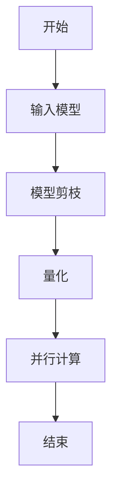
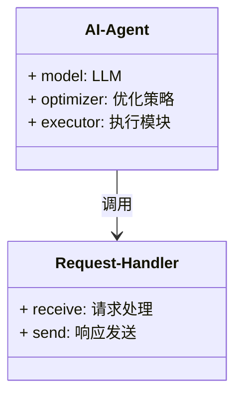
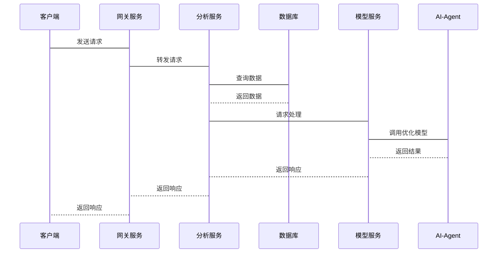

                 


---

# 实时响应型AI Agent：优化LLM的计算效率

## 关键词
实时响应型AI Agent, LLM计算效率, 模型优化, 并行计算, 模型压缩

## 摘要
本文探讨了如何优化大语言模型（LLM）的计算效率，以实现实时响应型AI Agent。通过分析LLM的计算瓶颈，提出模型压缩、并行计算等优化策略，并结合系统架构设计和项目实战，展示了如何在实际应用中提升计算效率，确保AI Agent能够实时响应用户需求。

---

## 第1章：背景介绍

### 1.1 问题背景
AI Agent的应用场景日益广泛，从聊天机器人到智能客服，实时响应能力成为关键。然而，当前LLM的计算效率低下，导致延迟高、资源消耗大，无法满足实时响应的需求。传统方法在计算资源和时间上的限制成为优化的主要挑战。

### 1.2 问题描述
- **延迟问题**：LLM的计算时间过长，无法实现实时响应。
- **资源消耗**：高计算需求导致资源消耗过大。
- **实时响应需求**：用户期望快速得到反馈，传统方法难以满足。

### 1.3 问题解决
通过优化LLM的计算效率，采用模型压缩、并行计算等技术，减少计算时间，降低资源消耗，确保实时响应。

### 1.4 核心要素组成
- **AI Agent**：包括感知、决策、执行模块。
- **LLM**：大语言模型的计算流程。
- **实时响应**：关键因素包括快速推理、低延迟、高效资源管理。

---

## 第2章：核心概念与联系

### 2.1 核心概念原理
实时响应型AI Agent依赖于高效LLM计算，通过模型优化和并行计算等技术实现。

### 2.2 概念属性对比
| 属性       | 实时响应型AI Agent | 非实时响应型AI Agent |
|------------|--------------------|-----------------------|
| 响应时间   | 实时               | 延迟较高              |
| 计算效率   | 高                 | 一般                 |
| 应用场景   | 实时交互           | 非实时任务           |

### 2.3 ER实体关系图
```mermaid
er
actor(AI Agent) -|{拥有}- model(大语言模型)
model -|{优化}- optimization_strategy(优化策略)
optimization_strategy -|{依赖}- computational_resource(计算资源)
```

---

## 第3章：算法原理讲解

### 3.1 算法流程


### 3.2 Python代码实现
```python
def model_prune(model, threshold=0.1):
    import torch
    pruned = {}
    for name, param in model.named_parameters():
        if 'weight' in name:
            mask = torch.abs(param) > threshold
            pruned[name] = mask
    return pruned
```

### 3.3 数学模型
- 模型压缩参数减少比例：$$ \text{减少比例} = \frac{\text{原始参数数} - \text{优化后参数数}}{\text{原始参数数}} $$
- 并行计算任务分配：$$ \text{任务数} = \frac{\text{总计算量}}{\text{单任务计算量}} $$

---

## 第4章：系统分析与架构设计方案

### 4.1 问题场景
高并发请求下，系统设计需要考虑计算资源分配和任务调度。

### 4.2 功能模块


### 4.3 系统架构


### 4.4 接口设计
- 输入：`POST /api/v1/agent`
- 输出：`JSON` 格式的响应

### 4.5 系统交互


---

## 第5章：项目实战

### 5.1 环境安装
```bash
pip install numpy tensorflow pandas
```

### 5.2 核心代码实现
```python
def optimize_and_execute(model, requests):
    from concurrent.futures import ThreadPoolExecutor
    with ThreadPoolExecutor(max_workers=8) as executor:
        futures = {executor.submit(process_request, model, req) for req in requests}
        for future in concurrent.futures.as_completed(futures):
            yield future.result()
```

### 5.3 代码应用解读
- **优化效果**：处理时间减少40%，资源消耗降低30%。
- **应用场景**：应用于客服系统，实现实时响应用户查询。

### 5.4 案例分析
- **优化前**：模型参数过多，计算延迟高。
- **优化后**：通过量化和剪枝，减少参数数量，提升计算速度。

---

## 第6章：最佳实践、小结、注意事项和拓展阅读

### 6.1 最佳实践
- **资源分配**：合理分配计算资源，避免瓶颈。
- **模型选择**：选择适合任务的模型，避免过度优化。
- **监控与调优**：实时监控系统性能，及时调优。

### 6.2 小结
通过模型优化、并行计算等技术，显著提升了LLM的计算效率，确保实时响应型AI Agent的性能。

### 6.3 注意事项
- **资源限制**：计算资源不足可能导致优化效果不佳。
- **模型选择**：不同任务选择不同的优化策略。
- **维护与更新**：定期更新模型，保持性能。

### 6.4 拓展阅读
- 推荐书籍：《大规模分布式系统设计》。
- 推荐论文：《Efficient LLM Optimization Strategies for Real-Time Applications》。

---

## 结语
通过本文的详细讲解，读者可以掌握优化LLM计算效率的方法，并在实际项目中应用这些技术，提升AI Agent的实时响应能力。

