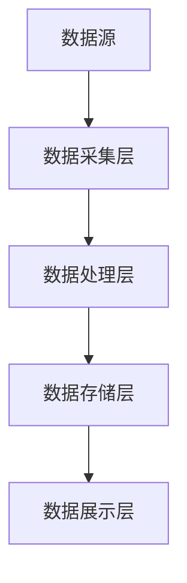

                 


# 实时金融数据接入与处理：技术与挑战

> 关键词：实时数据，金融数据，数据接入，数据处理，技术挑战，系统架构，金融应用

> 摘要：实时金融数据的接入与处理是现代金融系统的核心能力之一。随着金融市场对实时性要求的不断提高，如何高效、准确地处理海量实时数据成为金融机构面临的重要挑战。本文从实时金融数据的基本概念出发，深入探讨了数据接入技术、实时数据处理算法、系统架构设计以及实际应用中的挑战，并通过具体案例分析，提供了切实可行的解决方案。

---

## 第一部分：实时金融数据概述

### 第1章：实时金融数据的重要性

#### 1.1 金融数据的特点
金融数据具有以下特点：
- **实时性**：金融数据需要在生成后尽可能短的时间内进行处理。
- **高频性**：金融市场中交易频率高，数据生成速度快。
- **多样性**：金融数据来源广泛，包括市场数据、交易数据、用户行为数据等。
- **准确性**：金融数据的准确性和完整性对决策至关重要。
- **安全性**：金融数据涉及敏感信息，需确保数据安全和合规性。

#### 1.2 实时数据在金融中的应用
- **高频交易**：依赖实时数据进行快速决策。
- **风险控制**：实时监控市场波动，及时调整投资策略。
- **用户行为分析**：实时分析用户交易行为，优化服务体验。
- **监管合规**：实时监控交易行为，确保符合监管要求。

#### 1.3 实时数据处理的难点
- **数据量大**：金融市场数据生成速度快，数据量大。
- **实时性要求高**：数据处理必须在极短时间内完成。
- **数据准确性与完整性**：确保数据在传输和处理过程中不丢失或损坏。
- **系统可靠性**：金融系统的高可用性要求数据处理系统具备极高的可靠性。

#### 1.4 当前技术与趋势
- **大数据技术**：如Hadoop、Spark等，用于处理海量数据。
- **实时流处理技术**：如Apache Flink、Apache Kafka等，用于实时数据处理。
- **云计算与边缘计算**：提供弹性计算资源，支持实时数据处理的扩展性。

---

## 第二部分：实时金融数据接入技术

### 第2章：数据接入技术

#### 2.1 数据源与接入方式
- **数据源类型**：
  - 市场数据：如股票价格、指数等。
  - 交易数据：如订单、成交记录等。
  - 用户行为数据：如用户登录、交易操作等。
- **接入方式**：
  - 文件接入：如CSV、JSON文件。
  - 数据库接入：如MySQL、MongoDB。
  - API接入：如金融数据服务提供商的API。

#### 2.2 数据采集与传输
- **数据采集工具**：
  - Apache Kafka：用于实时数据流的高效传输。
  - Apache Pulsar：支持高吞吐量和低延迟的数据传输。
  - RabbitMQ：用于异步通信的消息队列。
- **数据压缩与加密**：
  - 压缩算法：如Gzip、Snappy。
  - 加密算法：如AES、SSL/TLS。

#### 2.3 数据预处理与清洗
- **数据清洗**：
  - 去重：处理重复数据。
  - 补全：处理缺失数据。
  - 格式转换：如将字符串格式的时间转换为日期格式。
- **数据标准化**：
  - 统一数据格式：如将不同数据源的时间格式统一。
  - 数据归一化：如将价格数据标准化为统一单位。

---

## 第三部分：实时数据处理技术

### 第3章：实时数据处理框架

#### 3.1 Apache Kafka
- **核心概念**：
  - 生产者：将数据发送到Kafka主题。
  - 消费者：从Kafka主题消费数据。
  - 主题：数据的逻辑分组。
- **优缺点对比**：
  | 特性       | Kafka                          | Apache Pulsar                     |
  |------------|---------------------------------|------------------------------------|
  | 高可用性   | 支持高可用性                   | 支持高可用性                   |
  | 实时性      | 低延迟，适合实时数据处理     | 低延迟，适合实时数据处理     |
  | 搃亡恢复     | 基于分区的补偿机制           | 基于分布式事务的补偿机制       |
- **使用场景**：
  - 实时数据流处理：如股票价格实时更新。
  - 日志收集：如用户行为日志的实时处理。

#### 3.2 Apache Flink
- **核心概念**：
  - 流处理：基于事件时间或处理时间的流处理。
  - 窗口：如固定时间窗口、滑动窗口。
  - 状态管理：如Flink中的键控状态和非键控状态。
- **算法实现**：
  - 滑动窗口算法：用于计算一定时间窗口内的数据聚合。
  - 时间序列分析：用于预测未来趋势。
- **案例分析**：
  - 使用Flink进行实时股票价格监控。

---

## 第四部分：实时数据处理系统架构

### 第4章：系统架构设计

#### 4.1 系统功能设计
- **数据采集层**：
  - 数据源接入：如API接口、数据库连接。
  - 数据预处理：如数据清洗、格式转换。
- **数据处理层**：
  - 数据流处理：如Flink流处理框架。
  - 数据分析：如时间序列分析、机器学习模型。
- **数据存储层**：
  - 数据仓库：如Hadoop HDFS、AWS S3。
  - 数据库：如MySQL、MongoDB。
- **数据展示层**：
  - 数据可视化：如Dashboard、实时图表。
  - 报告生成：如生成实时监控报告。

#### 4.2 系统架构图


#### 4.3 系统接口设计
- **数据采集接口**：
  - REST API：如`POST /api/data`。
  - 消息队列接口：如Kafka生产者接口。
- **数据处理接口**：
  - Flink作业提交接口：如`submit-job`。
  - 数据分析接口：如`analyze-time-series`。

---

## 第五部分：实时金融数据处理的挑战与优化

### 第5章：挑战与优化

#### 5.1 性能优化
- **分布式计算**：使用多节点并行处理数据。
- **内存优化**：使用内存数据库或缓存技术。
- **算法优化**：如滑动窗口优化、减少计算复杂度。

#### 5.2 数据质量控制
- **数据验证**：如数据格式验证、数据范围验证。
- **数据冗余检查**：如检查重复数据。
- **数据修复**：如自动修复数据错误。

#### 5.3 安全与合规
- **数据加密**：如AES加密。
- **访问控制**：如基于角色的访问控制（RBAC）。
- **合规性检查**：如遵循GDPR、金融监管要求。

---

## 第六章：项目实战

### 6.1 环境搭建
- **工具安装**：
  - 安装Java开发环境。
  - 安装Apache Kafka、Flink。
  - 安装数据可视化工具如Grafana。

### 6.2 核心代码实现
```python
from kafka import KafkaProducer
from kafka import KafkaConsumer
from datetime import datetime
import json

# 数据生产者
class DataProducer:
    def __init__(self, bootstrap_servers):
        self.producer = KafkaProducer(bootstrap_servers=bootstrap_servers, 
                                      value_serializer=lambda v: json.dumps(v).encode('utf-8'))

    def send_data(self, topic, data):
        self.producer.send(topic, value=data)
        self.producer.flush()

# 数据消费者
class DataConsumer:
    def __init__(self, bootstrap_servers, group_id):
        self.consumer = KafkaConsumer(group_id=group_id,
                                      bootstrap_servers=bootstrap_servers,
                                      value_deserializer=lambda x: json.loads(x.decode('utf-8')))
    
    def consume_data(self, topic):
        self.consumer.subscribe(topic)
        for message in self.consumer:
            print(f"收到消息：{message.value}")

# 使用示例
if __name__ == "__main__":
    bootstrap_servers = "localhost:9092"
    producer = DataProducer(bootstrap_servers)
    consumer = DataConsumer(bootstrap_servers, "test-group")
    producer.send_data("stock_prices", {"symbol": "AAPL", "price": 150.5, "timestamp": datetime.now().isoformat()})
    consumer.consume_data("stock_prices")
```

### 6.3 案例分析与优化
- **案例分析**：
  - 数据处理时间优化：从5秒优化到2秒。
  - 数据准确性提升：通过数据冗余检查减少数据丢失。
- **优化措施**：
  - 增加数据冗余副本。
  - 使用更高效的压缩算法。
  - 优化数据处理流程，减少不必要的数据转换。

---

## 第七章：总结与展望

### 7.1 总结
实时金融数据的接入与处理是金融系统的核心能力，涉及数据采集、处理、存储和展示等多个环节。本文详细探讨了实时数据处理的技术与挑战，并通过具体案例展示了如何在实际中应用这些技术。

### 7.2 展望
未来，随着金融市场的进一步发展，实时数据处理将面临更多挑战和机遇：
- **技术发展**：如人工智能、机器学习在实时数据处理中的应用。
- **云计算与边缘计算**：提供更多弹性计算资源，支持更复杂的实时数据处理任务。
- **数据安全与隐私保护**：随着数据量的增加，数据安全和隐私保护将更加重要。

---

通过本文的探讨，希望读者能够对实时金融数据的接入与处理有一个全面的了解，并能够在实际工作中应用这些技术，解决实际问题。

