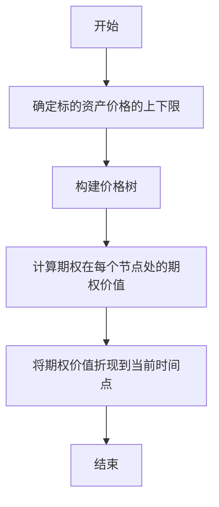
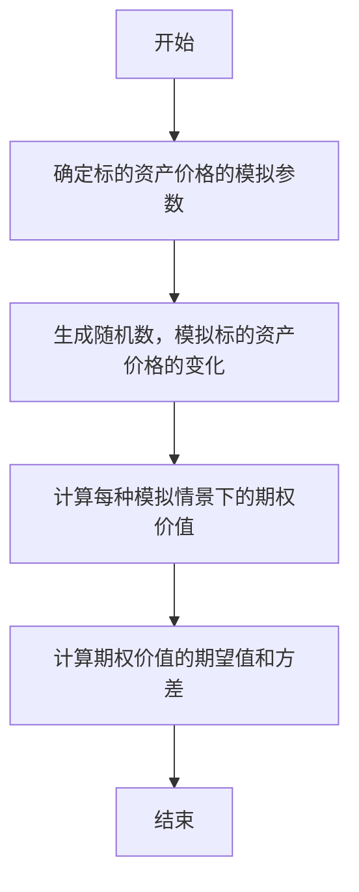
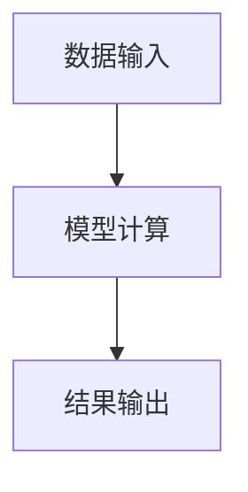
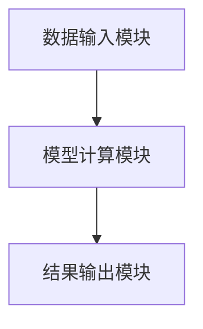

                 


# 实物期权估值：灵活性和不确定性的价值量化

**关键词**：实物期权、期权估值、灵活性、不确定性、风险管理

**摘要**：实物期权是一种将企业投资决策中的灵活性和不确定性转化为可量化价值的工具。本文将深入探讨实物期权的定义、定价模型、数学原理以及实际应用，帮助读者理解如何通过量化灵活性和不确定性来优化企业决策。

---

## 第1章: 实物期权的基本概念与应用背景

### 1.1 实物期权的定义与特点

#### 1.1.1 实物期权的定义
实物期权是指企业拥有的某些资产或项目中所隐含的期权，这些期权赋予企业在未来某个时间点以特定价格购买或出售标的资产的权利。与金融期权不同，实物期权的标的资产是实物资产，如房地产、机器设备等。

#### 1.1.2 实物期权的核心特点
- **标的资产的实物性**：实物期权的标的资产是实物资产，具有特定的市场和使用场景。
- **灵活性**：实物期权赋予企业在未来根据市场变化调整决策的权利，体现了灵活性。
- **不确定性**：实物期权的价值受到未来市场环境变化的影响，具有不确定性。

#### 1.1.3 实物期权与金融期权的对比
| 特性               | 实物期权              | 金融期权              |
|--------------------|-----------------------|-----------------------|
| 标的资产           | 实物资产（如房地产）   | 金融资产（如股票）    |
| 使用场景           | 企业投资决策          | 金融市场交易          |
| 风险因素           | 市场需求、经营风险     | 价格波动、流动性风险   |

### 1.2 实物期权的应用背景

#### 1.2.1 企业投资决策中的不确定性
企业在进行投资项目时，可能面临市场需求变化、成本波动等不确定性。实物期权可以帮助企业在决策中考虑这些不确定性，从而优化投资策略。

#### 1.2.2 资产收购与剥离中的灵活性价值
企业收购或剥离资产时，实物期权可以帮助企业量化资产的潜在价值，避免因市场变化导致的损失。

#### 1.2.3 项目开发中的期权特性
在项目开发过程中，实物期权可以帮助企业量化项目的潜在价值，尤其是在项目可能因市场变化而调整的情况下。

### 1.3 实物期权的价值量化意义

#### 1.3.1 灵活性价值的定义
灵活性价值是指企业因拥有实物期权而能够在未来根据市场变化调整决策所带来的价值。

#### 1.3.2 不确定性对价值的影响
不确定性可能导致标的资产的价值波动，实物期权通过量化这种波动，帮助企业更好地应对不确定性。

#### 1.3.3 实物期权在风险管理中的作用
实物期权可以帮助企业在风险管理中量化潜在损失，制定更有效的风险管理策略。

### 1.4 本章小结
本章介绍了实物期权的基本概念、特点及其在企业投资决策中的应用背景，强调了实物期权在量化灵活性和不确定性方面的价值。

---

## 第2章: 实物期权定价模型概述

### 2.1 实物期权定价的基本原理

#### 2.1.1 期权定价的基本框架
期权定价的核心是通过数学模型计算期权的理论价格，考虑标的资产的价格波动、行权价、时间等因素。

#### 2.1.2 实物期权的独特性
实物期权的标的资产具有特定的市场和使用场景，其价格波动可能与企业经营风险相关。

#### 2.1.3 期权定价的核心假设
- 标的资产价格服从几何布朗运动
- 无套利机会
- 无交易成本

### 2.2 主流实物期权定价模型

#### 2.2.1 Black-Scholes模型的扩展
Black-Scholes模型主要用于金融期权定价，但可以扩展用于实物期权定价。其基本公式为：

$$ C = S_0 N(d_1) - K e^{-rT} N(d_2) $$

其中：
- $S_0$：标的资产当前价格
- $K$：行权价
- $r$：无风险利率
- $T$：时间跨度
- $N(d)$：标准正态分布的累积分布函数
- $d_1 = \frac{\ln(S_0/K) + (r + \sigma^2/2)T}{\sigma \sqrt{T}}$
- $d_2 = d_1 - \sigma \sqrt{T}$

#### 2.2.2 二叉树模型的适用性
二叉树模型通过构建价格树来模拟标的资产的价格变化，适用于标的资产价格呈现树状分布的情况。

#### 2.2.3 蒙特卡洛模拟的应用
蒙特卡洛模拟通过模拟多种可能的市场情景，计算每种情景下的期权价值，进而得到期望值和方差。

### 2.3 实物期权定价的关键变量

#### 2.3.1 时间价值的计算
时间价值是期权价格的重要组成部分，反映了期权在未来时间点行权的可能性。

#### 2.3.2 行权价与标的资产价格的关系
行权价与标的资产价格的相对位置影响期权的内在价值和时间价值。

#### 2.3.3 波动率对期权价值的影响
波动率越高，期权的价值越高，因为标的资产价格波动越大，期权行权的可能性越高。

### 2.4 本章小结
本章介绍了实物期权定价的基本原理和主要模型，强调了时间价值、行权价和波动率对期权价值的影响。

---

## 第3章: 实物期权估值的数学模型与算法

### 3.1 Black-Scholes模型的扩展

#### 3.1.1 Black-Scholes公式的推导
通过假设标的资产价格服从几何布朗运动，推导出Black-Scholes公式，用于计算期权的理论价格。

#### 3.1.2 标的资产波动率的估计
波动率是期权定价的重要参数，通常通过历史数据或市场隐含波动率估计。

#### 3.1.3 模型的假设与限制
Black-Scholes模型假设无股息、无交易成本、标的资产价格服从几何布朗运动，但在实际应用中可能需要调整。

### 3.2 二叉树模型的实现

#### 3.2.1 二叉树模型的基本原理
通过构建价格树，模拟标的资产价格在每个时间点的可能值，计算期权在每个节点处的内在价值和时间价值。

#### 3.2.2 二叉树模型的实现步骤
1. 确定标的资产价格的上下限。
2. 构建价格树。
3. 计算期权在每个节点处的期权价值。
4. 将期权价值折现到当前时间点。

### 3.3 蒙特卡洛模拟的实现

#### 3.3.1 蒙特卡洛模拟的基本原理
通过模拟多种可能的市场情景，计算每种情景下的期权价值，进而得到期望值和方差。

#### 3.3.2 蒙特卡洛模拟的实现步骤
1. 确定标的资产价格的模拟参数。
2. 生成随机数，模拟标的资产价格的变化。
3. 计算每种模拟情景下的期权价值。
4. 计算期权价值的期望值和方差。

### 3.4 数学公式与算法流程图

#### 3.4.1 Black-Scholes模型的公式
$$ C = S_0 N(d_1) - K e^{-rT} N(d_2) $$

#### 3.4.2 二叉树模型的流程图


#### 3.4.3 蒙特卡洛模拟的流程图


### 3.5 本章小结
本章详细介绍了Black-Scholes模型和二叉树模型的数学公式和算法流程，强调了数学模型在实物期权定价中的重要性。

---

## 第4章: 实物期权估值的系统架构设计

### 4.1 系统功能设计

#### 4.1.1 系统功能模块
- 数据输入模块：接收标的资产价格、行权价、时间跨度等输入数据。
- 模型计算模块：选择合适的定价模型，计算期权价值。
- 结果输出模块：生成期权价值的报告或可视化图表。

#### 4.1.2 系统功能流程图


### 4.2 系统架构设计

#### 4.2.1 系统架构图


### 4.3 系统接口设计

#### 4.3.1 系统接口描述
- 数据输入接口：接收标的资产价格、行权价、时间跨度等参数。
- 模型计算接口：调用定价模型进行计算。
- 结果输出接口：返回期权价值的计算结果。

#### 4.3.2 接口交互流程图


### 4.4 系统交互设计

#### 4.4.1 用户与系统的交互流程
1. 用户输入标的资产价格、行权价、时间跨度等参数。
2. 系统调用定价模型进行计算。
3. 系统返回期权价值的计算结果。

### 4.5 本章小结
本章介绍了实物期权估值系统的功能设计、架构设计和接口设计，强调了系统模块化设计的重要性。

---

## 第5章: 实物期权估值的项目实战

### 5.1 环境安装

#### 5.1.1 安装Python环境
安装Python和必要的库，如numpy、pandas、scipy等。

#### 5.1.2 安装其他工具
安装matplotlib用于可视化，安装pymc用于蒙特卡洛模拟。

### 5.2 核心实现源代码

#### 5.2.1 Black-Scholes模型的实现
```python
import numpy as np
from scipy.stats import norm

def black_scholes(S, K, r, T, sigma):
    d1 = (np.log(S/K) + (r + sigma**2/2)*T) / (sigma*np.sqrt(T))
    d2 = d1 - sigma*np.sqrt(T)
    C = S * norm.cdf(d1) - K * np.exp(-r*T) * norm.cdf(d2)
    return C
```

#### 5.2.2 二叉树模型的实现
```python
def binomial_tree(S, K, r, T, sigma, n):
    dt = T/n
    df = np.exp(-r*dt)
    u = np.exp(sigma*np.sqrt(dt))
    d = 1/u
    p = (df * u * r + sigma**2 * u**2 / 2) / (u*d*(r + sigma**2 / 2))
    price_tree = np.zeros((n+1, n+1))
    price_tree[0,0] = S
    for i in range(1, n+1):
        for j in range(i+1):
            if j == 0:
                price_tree[i,j] = price_tree[i-1,j] * d
            else:
                price_tree[i,j] = price_tree[i-1,j-1] * u
    option_value = np.zeros((n+1, n+1))
    for j in range(n, -1, -1):
        if j == n:
            option_value[n,j] = np.maximum(0, price_tree[n,j] - K)
        else:
            option_value[n,j] = (option_value[n,j+1] + option_value[n,j]) * 0.5
    return option_value[0,0]
```

### 5.3 代码应用解读与分析

#### 5.3.1 Black-Scholes模型的代码解读
- 输入参数：标的资产价格(S)、行权价(K)、无风险利率(r)、时间跨度(T)、波动率(sigma)
- 输出结果：欧式看涨期权的理论价格

#### 5.3.2 二叉树模型的代码解读
- 输入参数：标的资产价格(S)、行权价(K)、无风险利率(r)、时间跨度(T)、波动率(sigma)、时间段数(n)
- 输出结果：欧式看涨期权的理论价格

### 5.4 实际案例分析

#### 5.4.1 案例背景
假设某企业拥有一项房地产资产，计划在未来某个时间点进行开发。企业希望量化该资产的期权价值，以便更好地进行投资决策。

#### 5.4.2 案例分析
使用Black-Scholes模型和二叉树模型分别计算期权价值，比较两种模型的计算结果，并分析其差异的原因。

### 5.5 项目小结
本章通过实际案例分析，展示了如何使用Black-Scholes模型和二叉树模型进行实物期权估值，并比较了两种模型的优缺点。

---

## 第6章: 实物期权估值的总结与展望

### 6.1 总结
实物期权是一种将企业投资决策中的灵活性和不确定性转化为可量化价值的工具。通过选择合适的定价模型，企业可以更好地应对市场变化，优化资源配置。

### 6.2 展望
随着人工智能和大数据技术的发展，实物期权的估值方法可能会更加精确和多样化。未来的研究方向可能包括：
- 更复杂的定价模型
- 更高效的数据处理方法
- 更多样化的应用领域

### 6.3 最佳实践 tips
- 在选择定价模型时，应根据具体情况选择最合适的模型。
- 在数据处理时，应尽量使用高质量的数据，并进行合理的数据清洗。
- 在系统设计时，应注重模块化设计，以便后续的优化和功能扩展。

### 6.4 小结
实物期权的估值不仅仅是计算一个数值，更是一种风险管理的工具。通过合理的模型选择和参数估计，企业可以更好地理解和量化不确定性带来的价值变化，从而做出更明智的投资决策。

---

**关键词**：实物期权、期权估值、灵活性、不确定性、风险管理

**摘要**：实物期权是一种将企业投资决策中的灵活性和不确定性转化为可量化价值的工具。本文将深入探讨实物期权的定义、定价模型、数学原理以及实际应用，帮助读者理解如何通过量化灵活性和不确定性来优化企业决策。

---

通过本文的详细讲解，读者可以全面理解实物期权的估值方法及其在企业决策中的应用。希望本文能为读者提供有价值的参考和启发。

