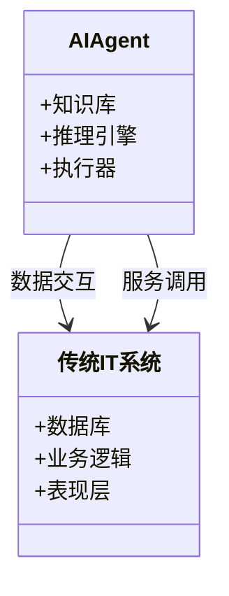

                 


# 第二部分: 核心概念与联系

## 第2章: AI Agent的核心原理与特征

### 2.1 AI Agent的定义与分类

AI Agent，即人工智能代理，是一种能够感知环境并采取行动以实现目标的智能实体。它可以分为以下几类：

1. **简单反射式Agent**：基于当前感知直接行动，没有内部状态。
2. **基于模型的反射式Agent**：维护内部状态，能够基于模型进行推理。
3. **目标驱动式Agent**：根据目标选择行动。
4. **效用驱动式Agent**：通过最大化效用函数来选择行动。
5. **学习式Agent**：通过经验改进性能。

每种类型都有其优缺点，适用于不同的应用场景。

### 2.2 传统IT系统的架构与特点

传统IT系统通常采用分层架构，包括数据层、业务逻辑层和表现层。其特点包括：

- **数据层**：负责数据的存储和检索，使用数据库技术。
- **业务逻辑层**：处理业务规则和逻辑，确保数据一致性。
- **表现层**：负责用户交互，通常采用MVC模式。

### 2.3 AI Agent与传统IT系统的协同机制

AI Agent与传统IT系统的协同机制包括：

- **数据共享**：AI Agent通过API访问传统系统的数据。
- **服务调用**：传统系统通过调用AI Agent的服务来增强功能。
- **事件驱动**：通过事件触发，实现系统的动态协作。

### 2.4 核心概念对比分析

以下是AI Agent与传统IT系统的对比分析：

| 特性            | AI Agent                          | 传统IT系统                     |
|-----------------|-----------------------------------|-------------------------------|
| 智能水平         | 高                                 | 低                             |
| 自主性           | 高                                 | 低                             |
| 学习能力         | 强                                 | 无                             |
| 可扩展性         | 高                                 | 中                             |
| 响应速度         | 快                                 | 较慢                            |

### 2.5 系统交互的Mermaid序列图

```mermaid
sequenceDiagram
    participant A: AI Agent
    participant T: 传统IT系统
    A -> T: 请求数据
    T -> A: 返回数据
    A -> T: 发起服务调用
    T -> A: 执行服务并返回结果
```

## 第3章: AI Agent的理论基础与传统IT系统架构

### 3.1 AI Agent的理论基础

AI Agent的理论基础包括：

- **感知**：通过传感器或API获取环境信息。
- **推理**：基于知识库进行逻辑推理。
- **决策**：根据推理结果做出决策。
- **执行**：通过执行器或API调用实现行动。

### 3.2 传统IT系统的分层架构

传统IT系统的分层架构包括：

- **数据层**：使用数据库存储数据。
- **业务逻辑层**：实现业务规则和逻辑。
- **表现层**：通过网页或API与用户交互。

### 3.3 两者的结合模型

以下是AI Agent与传统IT系统结合的模型：



### 3.4 理论基础的数学模型

AI Agent的决策过程可以表示为：

$$
决策 = \argmax_{a} U(a, s)
$$

其中，\( U(a, s) \) 是行动 \( a \) 在状态 \( s \) 下的效用函数。

### 3.5 分层架构的优缺点

- **优点**：结构清晰，职责分明。
- **缺点**：层次之间的耦合度较高，可能影响灵活性。

## 第四部分: 实现方法

## 第4章: AI Agent与传统IT系统的集成方法

### 4.1 技术选型

- **AI框架**：TensorFlow、PyTorch。
- **编程语言**：Python、Java。
- **API接口**：RESTful API。

### 4.2 系统设计

系统设计包括：

- **数据接口**：定义数据格式和接口规范。
- **业务逻辑接口**：实现业务逻辑的调用。
- **用户界面**：提供统一的用户交互界面。

### 4.3 实现步骤

1. **环境搭建**：安装所需库和工具。
2. **接口开发**：编写数据接口和业务逻辑接口。
3. **集成测试**：测试接口的兼容性和性能。
4. **部署上线**：将系统部署到生产环境。

### 4.4 系统交互的Mermaid序列图

```mermaid
sequenceDiagram
    participant A: AI Agent
    participant T: 传统IT系统
    A -> T: 调用服务
    T -> A: 执行服务
    A -> T: 返回结果
    T -> A: 确认完成
```

### 4.5 代码实现

以下是接口实现的示例代码：

```python
# 数据接口
def get_data():
    return database.query()

# 业务逻辑接口
def process_request(request):
    data = get_data()
    result = business_logic(data, request)
    return result
```

## 第5章: 项目实战

### 5.1 项目背景

本项目旨在实现一个AI Agent与传统ERP系统的集成，提升订单处理效率。

### 5.2 项目介绍

项目目标：提高订单处理的智能化水平。

项目范围：集成AI Agent到ERP系统中，实现智能订单推荐。

### 5.3 系统功能设计

功能模块包括：

- **数据采集**：从ERP系统获取订单数据。
- **智能推荐**：基于历史数据推荐最优订单处理方案。
- **结果反馈**：将推荐结果反馈给ERP系统。

### 5.4 系统架构设计

系统架构包括：

- **数据层**：存储订单数据。
- **业务逻辑层**：实现智能推荐算法。
- **表现层**：展示推荐结果。

### 5.5 系统交互的Mermaid序列图

```mermaid
sequenceDiagram
    participant A: AI Agent
    participant E: ERP系统
    A -> E: 请求订单数据
    E -> A: 返回订单数据
    A -> E: 发起推荐请求
    E -> A: 执行推荐并返回结果
```

### 5.6 核心代码实现

以下是核心代码实现：

```python
# 数据接口
import requests

def get_orders():
    response = requests.get('http://erp-system/orders')
    return response.json()

# 智能推荐算法
from sklearn import neighbors

def recommend_orders(orders):
    model = neighbors.KNeighborsClassifier(n_neighbors=3)
    model.fit(orders.data, orders.target)
    return model.predict(new_order)
```

### 5.7 测试与部署

1. **单元测试**：测试接口和算法的正确性。
2. **集成测试**：测试系统整体的性能和稳定性。
3. **部署上线**：将系统部署到生产环境，并进行监控和维护。

### 5.8 项目小结

通过本项目，我们成功实现了AI Agent与传统ERP系统的集成，提升了订单处理的智能化水平。

## 第六部分: 高级主题

## 第6章: 高级集成方案与优化策略

### 6.1 多AI Agent协作

多AI Agent协作可以通过以下方式实现：

1. **分布式架构**：多个AI Agent协同工作，各司其职。
2. **任务分配**：根据任务特点分配合适的AI Agent。

### 6.2 与云原生技术结合

将AI Agent部署到容器化平台，利用Kubernetes进行编排和管理。

### 6.3 挑战与解决方案

- **数据隐私**：采用数据脱敏技术，确保数据安全。
- **系统兼容性**：通过适配层实现不同系统间的兼容。

## 第7章: 未来发展趋势与挑战

### 7.1 技术趋势

- **智能化增强**：AI Agent将更加智能化，能够处理更复杂的任务。
- **分布式架构**：AI Agent将在分布式环境中广泛应用。

### 7.2 挑战

- **数据孤岛**：不同系统间数据不互通，影响协作效率。
- **安全性**：AI Agent的广泛应用带来了更多的安全风险。

### 7.3 未来展望

随着技术的发展，AI Agent与传统IT系统的集成将更加紧密，推动企业数字化转型的深入发展。

## 第七部分: 总结

## 第8章: 总结与展望

### 8.1 全文总结

本文详细探讨了AI Agent与传统IT系统的集成方法，从理论到实践，全面分析了实现过程中的关键问题。

### 8.2 未来展望

未来，随着AI技术的不断进步，AI Agent与传统IT系统的集成将更加智能化和高效化，为企业带来更大的价值。

### 8.3 最佳实践 Tips

- **数据安全**：高度重视数据安全，采取严格的数据保护措施。
- **系统兼容性**：确保不同系统间的兼容性，避免因兼容性问题导致系统崩溃。
- **持续优化**：定期优化系统，提升性能和用户体验。

### 8.4 小结

通过本文的探讨，我们对AI Agent与传统IT系统的集成有了全面的了解，希望对读者在实际应用中有所帮助。

---

# 关键词：AI Agent，传统IT系统，无缝集成，系统设计，项目实战

# 摘要：本文详细探讨了AI Agent与传统IT系统的无缝集成方法，从理论基础到项目实战，全面分析了实现过程中的关键问题，提出了有效的解决方案，并通过具体案例展示了集成的实际效果。

