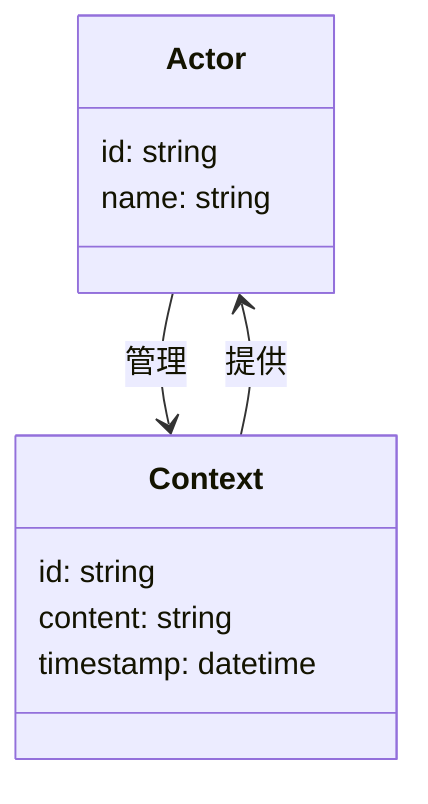

                 


# 实现AI Agent的上下文理解与管理

## 关键词：AI Agent，上下文理解，上下文管理，自然语言处理，知识图谱，对话系统，系统架构设计

## 摘要：  
本文详细探讨了AI Agent实现上下文理解与管理的关键技术，从核心概念、算法原理到系统架构设计，结合实际案例分析，为读者提供全面的技术解读与实践指南。

---

# 第一部分: AI Agent的上下文理解与管理基础

## 第1章: 背景介绍

### 1.1 问题背景
#### 1.1.1 上下文理解的定义
上下文理解是指AI Agent能够感知并解析当前对话或任务的背景信息、语境关系和情境含义，以便做出更准确的响应或决策。

#### 1.1.2 AI Agent的核心问题
- **语义理解不足**：AI Agent难以准确理解用户的意图和情感。
- **上下文关联性弱**：无法有效连接前后对话或任务的信息。
- **动态环境适应性差**：难以应对实时变化的上下文信息。

#### 1.1.3 上下文管理的重要性
- 提高AI Agent的交互准确性。
- 增强用户对话的连贯性和自然性。
- 支持复杂任务中的多轮推理和决策。

### 1.2 问题描述
#### 1.2.1 上下文理解的挑战
- 多义性和歧义性问题。
- 动态上下文的实时更新需求。
- 跨场景的语境关联复杂性。

#### 1.2.2 AI Agent与上下文的关系
AI Agent通过上下文理解与管理，能够更好地与用户交互，提供更智能化的服务。

#### 1.2.3 上下文管理的目标
- 实时跟踪和维护上下文信息。
- 提供上下文驱动的决策支持。
- 支持多轮对话和复杂任务的执行。

### 1.3 问题解决
#### 1.3.1 上下文理解的解决方案
- 基于自然语言处理的语义分析。
- 基于知识图谱的上下文推理。

#### 1.3.2 上下文管理的实现方法
- 建立上下文模型。
- 实现上下文的存储与检索。
- 提供上下文更新的机制。

#### 1.3.3 AI Agent的上下文驱动模型
- 上下文驱动的对话系统。
- 上下文驱动的任务执行模型。

### 1.4 边界与外延
#### 1.4.1 上下文理解的边界
- 数据范围的限制。
- 语境理解的深度。
- 知识库的覆盖范围。

#### 1.4.2 上下文管理的外延
- 动态上下文的实时更新。
- 多场景下的上下文关联。
- 上下文驱动的自适应系统。

#### 1.4.3 AI Agent与上下文的关系
- AI Agent通过上下文理解与用户进行交互。
- 上下文管理为AI Agent提供决策支持。
- 上下文理解与管理是AI Agent实现智能化的关键。

### 1.5 核心概念组成
#### 1.5.1 上下文理解的核心要素
- 信息抽取：从文本中提取实体、关系和事件。
- 语义分析：理解文本的深层含义。
- 上下文推理：基于上下文信息进行推理和预测。

#### 1.5.2 上下文管理的关键模块
- 上下文存储：维护当前对话或任务的上下文信息。
- 上下文检索：根据需求快速检索相关上下文。
- 上下文更新：实时更新上下文信息。

#### 1.5.3 AI Agent的上下文驱动模型
- 上下文驱动的对话系统：基于上下文信息生成对话响应。
- 上下文驱动的任务执行模型：根据上下文信息执行任务。

---

## 第二部分: 核心概念与联系

## 第2章: 核心概念原理

### 2.1 上下文理解的核心原理
#### 2.1.1 信息抽取
- 实体识别：从文本中提取命名实体（如人名、地名、组织名等）。
- 关系抽取：识别文本中的关系（如“属于”、“包含”等）。
- 事件抽取：识别文本中的事件及其参与者。

#### 2.1.2 语义分析
- 词义消歧：消除词语的多义性。
- 情感分析：识别文本中的情感倾向。
- 文本摘要：提取文本的关键信息。

#### 2.1.3 上下文推理
- 上下文关联：基于上下文信息进行推理。
- 上下文补全：填补对话中的缺失信息。
- 上下文预测：预测下一步的上下文信息。

### 2.2 概念属性特征对比表格
| 概念       | 属性               | 特征描述                       |
|------------|--------------------|----------------------------|
| 信息抽取   | 输入形式           | 文本数据                     |
|            | 输出形式           | 实体、关系、事件等           |
| 语义分析   | 输入形式           | 文本数据                     |
|            | 输出形式           | 情感、意图、主题等           |
| 上下文推理 | 输入形式           | 实体、关系、事件等           |
|            | 输出形式           | 推理结果                     |

### 2.3 ER实体关系图
```mermaid
er
actor
  - id: string
  - name: string
context
  - id: string
  - content: string
  - timestamp: datetime
```

### 2.4 概念间的关系
- 信息抽取是语义分析的基础。
- 语义分析是上下文推理的前提。
- 上下文推理是信息抽取和语义分析的延伸。

---

## 第三部分: 算法原理讲解

## 第3章: 算法原理

### 3.1 信息抽取算法
#### 3.1.1 算法流程
1. 文本预处理：分词、去除停用词。
2. 实体识别：使用命名实体识别模型。
3. 关系抽取：使用关系抽取模型。
4. 事件抽取：使用事件抽取模型。

#### 3.1.2 算法实现
```python
from spacy.lang.zh import Chinese
import spacy

nlp = spacy.load("zh_core_web_sm")
doc = nlp("今天天气不错，北京明天会下雨。")
for ent in doc.ents:
    print(ent.text, ent.label_)
```

#### 3.1.3 数学模型
- 基于概率论的实体识别模型。
- 基于图论的关系抽取模型。

### 3.2 语义分析算法
#### 3.2.1 算法流程
1. 文本表示：将文本转换为向量表示。
2. 情感分析：使用深度学习模型预测情感倾向。
3. 意图识别：基于向量相似度判断意图。

#### 3.2.2 算法实现
```python
from transformers import pipeline

sentiment_pipeline = pipeline("sentiment-analysis")
result = sentiment_pipeline("我非常喜欢这本书。")
print(result)
```

#### 3.2.3 数学模型
- 基于概率论的情感分析模型。
- 基于向量空间的意图识别模型。

### 3.3 上下文推理算法
#### 3.3.1 算法流程
1. 上下文表示：将上下文信息表示为向量。
2. 关系推理：基于上下文信息进行推理。
3. 预测结果：输出推理结果。

#### 3.3.2 算法实现
```python
from transformers import pipeline

reasoning_pipeline = pipeline("text-generation")
result = reasoning_pipeline("根据上下文信息，预测下一步会做什么。")
print(result)
```

#### 3.3.3 数学模型
- 基于图论的知识图谱推理模型。
- 基于符号逻辑的推理模型。

---

## 第四部分: 系统分析与架构设计

## 第4章: 系统分析与架构设计

### 4.1 项目背景与目标
- 项目背景：实现一个支持上下文理解与管理的AI Agent系统。
- 项目目标：提高AI Agent的对话准确性和任务执行效率。

### 4.2 系统功能设计
#### 4.2.1 领域模型


#### 4.2.2 系统架构设计


### 4.3 系统接口设计
- API接口：RESTful API设计。
- 数据格式：JSON格式。

### 4.4 系统交互流程图
```mermaid
sequenceDiagram
    Actor ->> 服务器: 发送对话请求
    服务器 ->> 信息抽取模块: 提取实体和关系
    信息抽取模块 ->> 语义分析模块: 分析语义
    语义分析模块 ->> 上下文管理模块: 更新上下文
    上下文管理模块 ->> 服务器: 返回上下文信息
    服务器 ->> Actor: 返回对话响应
```

---

## 第五部分: 项目实战

## 第5章: 项目实战

### 5.1 环境安装
```bash
pip install spacy transformers
python -m spacy download zh_core_web_sm
```

### 5.2 核心代码实现
#### 5.2.1 上下文理解的代码实现
```python
from spacy.lang.zh import Chinese
import spacy

nlp = spacy.load("zh_core_web_sm")
doc = nlp("明天北京会下雨吗？")
for ent in doc.ents:
    print(ent.text, ent.label_)
```

#### 5.2.2 上下文管理的代码实现
```python
class ContextManager:
    def __init__(self):
        self.contexts = {}

    def update_context(self, actor_id, context):
        self.contexts[actor_id] = context

    def get_context(self, actor_id):
        return self.contexts.get(actor_id, {})
```

### 5.3 实际案例分析
#### 5.3.1 案例背景
- 用户与AI Agent进行多轮对话。
- 需要实时更新上下文信息。

#### 5.3.2 案例实现
```python
context_manager = ContextManager()
context_manager.update_context("user1", {"weather": "sunny", "location": "Beijing"})
context = context_manager.get_context("user1")
print(context)
```

### 5.4 项目小结
- 上下文理解与管理是实现智能化AI Agent的关键技术。
- 通过实际案例分析，验证了算法和系统设计的有效性。

---

## 第六部分: 最佳实践

## 第6章: 最佳实践

### 6.1 小结
- 上下文理解与管理是AI Agent实现智能化的核心技术。
- 通过信息抽取、语义分析和上下文推理，可以提高对话的准确性和连贯性。

### 6.2 注意事项
- 确保上下文信息的实时更新。
- 处理多义性和歧义性问题。
- 处理动态上下文的实时变化。

### 6.3 拓展阅读
- 《自然语言处理入门》
- 《知识图谱与智能问答》
- 《对话系统的设计与实现》

---

## 结语
通过本文的系统介绍，读者可以全面了解AI Agent实现上下文理解与管理的核心技术，从理论到实践，为后续的研究和应用提供坚实的基础。

--- 

# 文章结束

