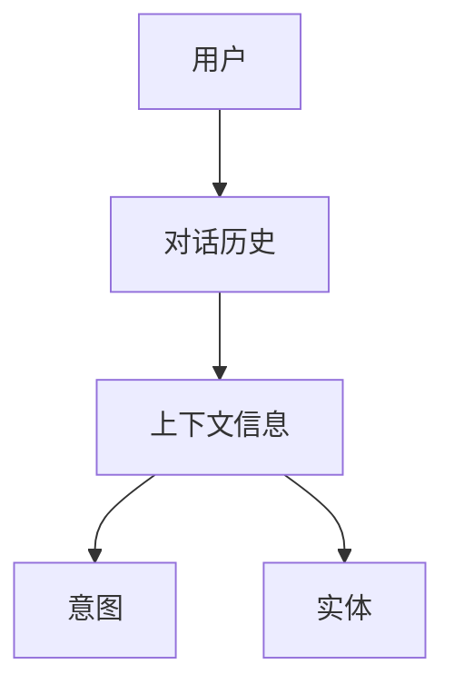
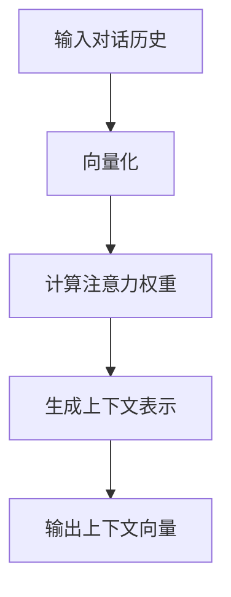
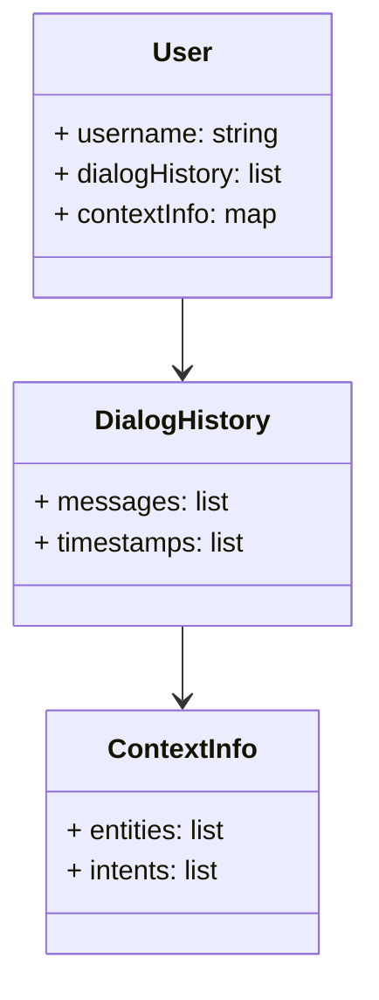
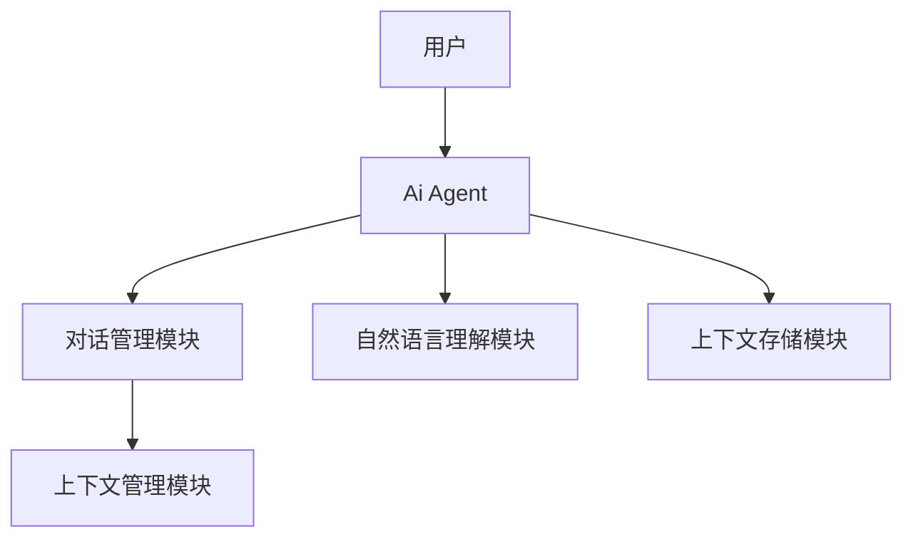
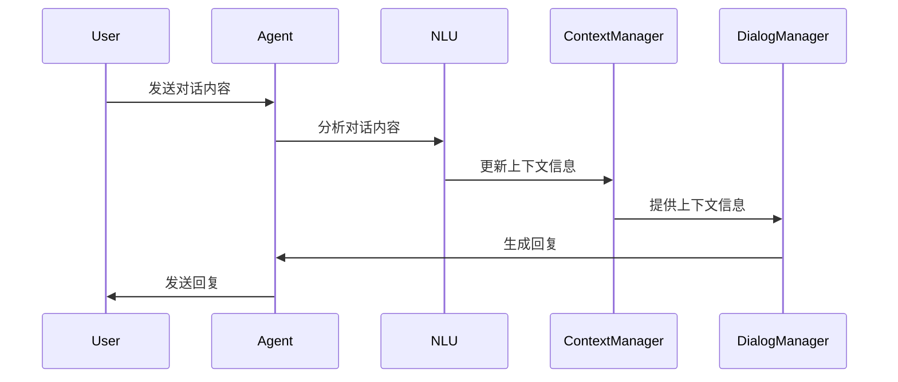

                 


# 实现AI Agent的上下文管理：保持对话连贯性

## 关键词：AI Agent, 上下文管理, 对话连贯性, 记忆机制, 意图识别, 注意力机制, 系统架构

## 摘要：  
在构建智能对话系统时，保持对话的连贯性是实现高效人机交互的核心挑战之一。上下文管理作为AI Agent的关键能力，决定了系统能否理解和记忆对话中的关键信息，从而做出连贯且合理的回复。本文将从背景介绍、核心概念、算法原理、系统架构等多个维度详细探讨AI Agent的上下文管理实现。通过对比不同方法的特征，结合实际案例分析，总结上下文管理的最佳实践，为开发者提供从理论到实践的完整指导。

---

# 第1章: AI Agent上下文管理的背景与核心概念

## 1.1 问题背景与描述

### 1.1.1 对话连贯性的定义与挑战  
在人机对话中，连贯性是指系统在当前对话轮次中能够合理地结合之前的信息，理解用户的意图并生成相关的回复。例如，当用户提到“我今天没时间”，系统需要根据上下文判断用户可能在拒绝某个安排，并在后续对话中保持一致的语境。然而，对话中的信息可能会涉及多个主题、意图和实体，这使得连贯性管理变得复杂。

### 1.1.2 上下文管理的核心问题  
上下文管理的核心问题在于如何有效地存储、检索和更新对话中的相关信息。这包括：

- **信息存储**：如何将对话历史、用户意图和实体信息组织成可检索的形式。  
- **信息关联**：如何建立不同信息之间的关联，以便在后续对话中能够准确地调用。  
- **信息更新**：如何根据对话的进展动态更新上下文信息，避免信息过时或冗余。

### 1.1.3 上下文管理的边界与外延  
上下文管理的边界在于对话本身，但其外延可以扩展到其他模块，例如自然语言理解（NLU）和对话管理（DM）。上下文信息是NLU的输入，同时又是DM的输出，形成了一个闭环。

### 1.1.4 核心要素  
上下文管理的核心要素包括：  
1. **对话历史**：记录用户和AI Agent的对话记录。  
2. **上下文信息**：从对话历史中提取的实体、意图和情感信息。  
3. **语义理解**：基于上下文信息进行意图识别和实体抽取的能力。  

## 1.2 本章小结  
本章从背景出发，明确了上下文管理的核心问题和关键要素，为后续章节的深入探讨奠定了基础。

---

# 第2章: 上下文管理的核心概念与联系

## 2.1 上下文管理的原理与机制

### 2.1.1 记忆机制  
记忆机制是上下文管理的核心，通过将对话历史存储为可检索的结构，确保AI Agent能够“记住”之前的对话内容。常见的记忆机制包括：  
- **基于向量的表示**：将对话内容转换为向量形式，便于后续处理。  
- **基于图的表示**：将对话内容表示为图结构，便于关联信息的检索。

### 2.1.2 关联性计算  
关联性计算是通过一定的算法，评估当前对话轮次与上下文之间的相关性。例如，可以使用余弦相似度来衡量两个向量之间的相似性。

### 2.1.3 意图识别与推理  
意图识别是通过自然语言处理技术，识别用户在当前对话中的意图。意图推理则是在上下文的基础上，预测用户后续可能的意图。

## 2.2 核心概念对比与特征分析

### 2.2.1 上下文管理与对话管理的对比  
| 特征             | 上下文管理                          | 对话管理                          |
|------------------|------------------------------------|------------------------------------|
| 核心目标         | 管理对话中的上下文信息              | 管理对话流程和状态                 |
| 输入             | 对话历史和实体信息                  | 当前对话轮次和上下文信息           |
| 输出             | 上下文表示                          | 对话动作（如选择回复或执行操作）   |

### 2.2.2 ER实体关系图  


## 2.3 本章小结  
本章通过对比和分析，明确了上下文管理与对话管理的区别和联系，为后续的算法实现提供了理论基础。

---

# 第3章: 上下文管理的算法原理

## 3.1 基于记忆机制的上下文管理

### 3.1.1 基于向量的表示方法  
将对话历史中的每一句话表示为向量，例如使用词嵌入（Word2Vec）或句子嵌入（Sentence-BERT）。这些向量可以存储在数据库中，以便后续检索。

### 3.1.2 基于图的关联方法  
将对话内容表示为图结构，节点表示实体和意图，边表示它们之间的关联关系。

### 3.1.3 基于序列的上下文建模  
使用序列模型（如LSTM或Transformer）对对话历史进行建模，生成上下文表示。

## 3.2 注意力机制在上下文管理中的应用

### 3.2.1 自注意力机制原理  
自注意力机制通过计算查询（Q）、键（K）和值（V）之间的相似性，生成注意力权重，从而得到上下文表示。

### 3.2.2 上下文窗口的注意力权重计算  
$$\text{Attention}(Q,K,V) = \text{softmax}(\frac{QK^T}{\sqrt{d}})V$$

### 3.2.3 多头注意力的实现  
多头注意力通过并行计算多个注意力头，提高模型的表达能力。

## 3.3 算法流程图  


## 3.4 本章小结  
本章详细讲解了基于记忆机制和注意力机制的上下文管理算法，为实现高效的上下文管理提供了技术参考。

---

# 第4章: 上下文管理的系统分析与架构设计

## 4.1 系统功能设计

### 4.1.1 领域模型  


### 4.1.2 系统架构  


## 4.2 接口设计与交互流程  


## 4.3 本章小结  
本章通过系统架构设计，展示了上下文管理在AI Agent中的实现方式，强调了模块之间的协作和接口设计的重要性。

---

# 第5章: 上下文管理的项目实战

## 5.1 实战环境与工具

### 5.1.1 环境安装  
安装必要的Python库，例如：  
- `transformers`：用于自然语言处理模型的加载。  
- `scikit-learn`：用于机器学习算法的实现。  

### 5.1.2 开发工具  
推荐使用Jupyter Notebook进行快速开发和调试。

## 5.2 核心代码实现

### 5.2.1 对话历史存储
```python
class DialogHistory:
    def __init__(self):
        self.messages = []
        self.timestamps = []
    
    def add_message(self, message, timestamp):
        self.messages.append(message)
        self.timestamps.append(timestamp)
```

### 5.2.2 上下文信息提取
```python
from transformers import pipeline

nlp = pipeline("text-classification", model="bert-base")

def extract_intent(text):
    return nlp(text)[0]['label']

def extract_entity(text):
    entities = []
    # 假设使用实体识别模型
    nlp_ent = pipeline("ner", model="bert-base")
    result = nlp_ent(text)
    for entity in result['entities']:
        entities.append(entity['word'])
    return entities
```

## 5.3 案例分析与优化  
通过具体案例分析，展示上下文管理在实际项目中的应用，并提出优化建议。

## 5.4 本章小结  
本章通过实战项目，展示了上下文管理的具体实现过程，帮助读者更好地理解和应用相关技术。

---

# 第6章: 上下文管理的最佳实践与小结

## 6.1 最佳实践

### 6.1.1 模块化设计  
将上下文管理模块独立出来，便于维护和扩展。  

### 6.1.2 持续优化  
定期更新自然语言处理模型，提升意图识别和实体抽取的准确率。  

### 6.1.3 日志与监控  
记录上下文管理过程中的日志，便于排查问题和优化性能。

## 6.2 小结  
上下文管理是实现AI Agent对话连贯性的关键，通过模块化设计、算法优化和持续监控，可以显著提升系统的性能和用户体验。

---

# 总结  
本文从背景介绍、核心概念、算法原理、系统架构到项目实战，全面探讨了AI Agent的上下文管理实现。通过对比分析和实际案例，总结了上下文管理的最佳实践，为开发者提供了从理论到实践的完整指导。

---

