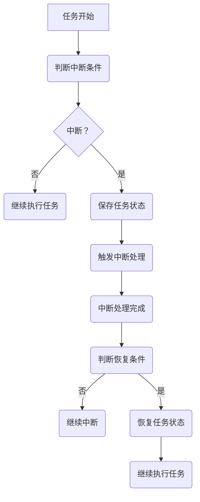
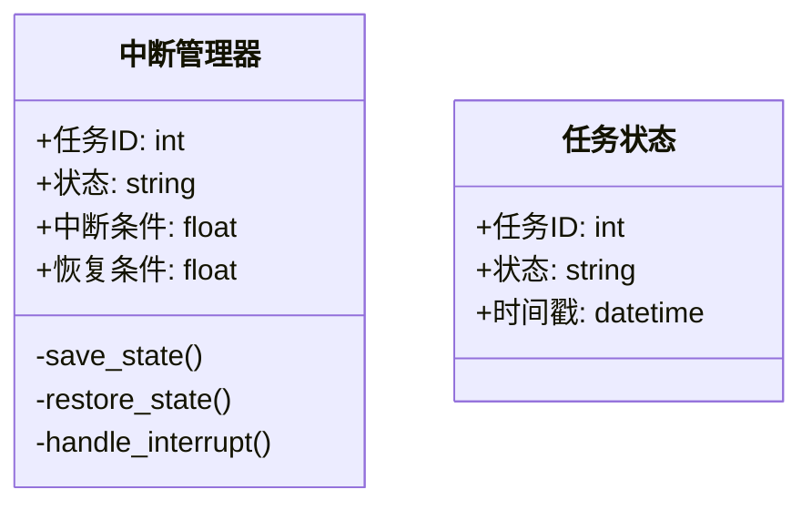
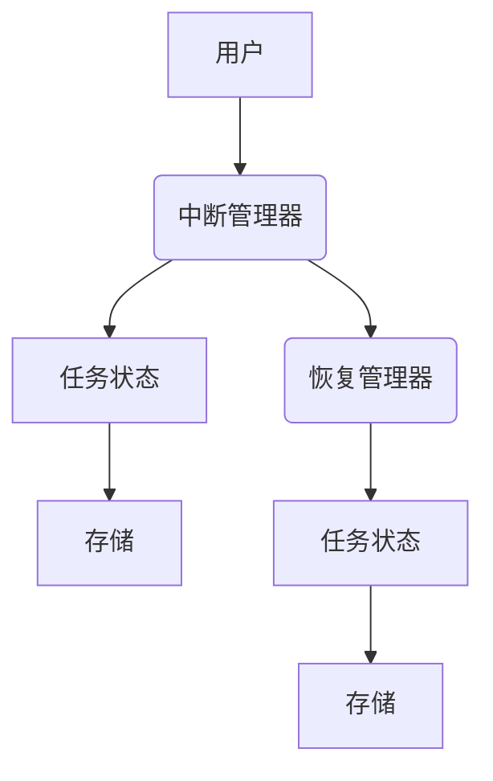

                 


# 实现AI Agent的任务中断与恢复功能

---

## 关键词：AI Agent，任务中断，任务恢复，中断机制，恢复策略，状态管理

---

## 摘要：本文详细探讨了AI Agent任务中断与恢复的核心原理、实现方法和系统设计。从任务中断的背景与问题背景出发，分析了任务中断与恢复的核心概念与联系，详细讲解了任务中断与恢复的算法原理，结合系统架构设计，通过具体项目实战案例，总结了实现AI Agent任务中断与恢复的最佳实践。

---

# 第一部分：AI Agent任务中断与恢复的背景与概念

## 第1章：AI Agent任务中断与恢复的背景介绍

### 1.1 AI Agent的基本概念

#### 1.1.1 AI Agent的定义与特点
AI Agent（人工智能代理）是一种能够感知环境、自主决策并执行任务的智能实体。其特点包括自主性、反应性、目标导向和适应性。AI Agent可以分为简单反射型、基于模型的反射型、目标驱动型和效用驱动型等。

#### 1.1.2 AI Agent的分类与应用场景
AI Agent可以分为以下几类：
- **简单反射型AI Agent**：基于当前输入直接做出反应，适用于简单的交互场景。
- **基于模型的反射型AI Agent**：通过内部模型理解和推理环境，适用于复杂场景。
- **目标驱动型AI Agent**：以特定目标为导向，主动规划和执行任务，适用于机器人控制、自动驾驶等领域。
- **效用驱动型AI Agent**：通过最大化效用函数来优化决策，适用于资源分配、调度优化等场景。

AI Agent的应用场景包括智能助手、自动驾驶、智能客服、机器人控制等。

#### 1.1.3 任务中断与恢复的必要性
在实际应用中，AI Agent可能会遇到任务中断的情况，例如网络中断、用户干预、环境变化等。任务中断与恢复功能是确保AI Agent能够适应动态环境、提高任务执行成功率的重要能力。

### 1.2 任务中断与恢复的背景与问题背景

#### 1.2.1 任务中断与恢复的定义
任务中断是指在任务执行过程中，由于某种原因（如外部干预、环境变化、系统错误等）导致任务暂停。任务恢复是指在中断发生后，系统重新拾起中断的任务，并在可能的情况下继续执行或重新启动任务。

#### 1.2.2 任务中断与恢复的场景分析
任务中断与恢复的场景包括：
- **用户干预**：用户在任务执行过程中主动暂停任务。
- **系统错误**：AI Agent或其依赖的系统出现错误，导致任务中断。
- **环境变化**：任务执行环境的变化导致任务无法继续执行。
- **资源限制**：系统资源耗尽，无法继续执行任务。

#### 1.2.3 任务中断与恢复的边界与外延
任务中断与恢复的边界包括：
- **任务执行阶段**：任务中断可以在任务执行的任何阶段发生。
- **任务恢复点**：任务恢复可以从任务中断点继续，也可以从任务起点重新开始。
- **任务依赖性**：任务恢复可能依赖于中断时的环境状态和任务状态。

任务中断与恢复的外延包括：
- **任务优先级**：中断任务时，可能需要重新评估任务优先级。
- **任务重新规划**：恢复任务时，可能需要重新规划任务执行路径。

### 1.3 任务中断与恢复的核心问题描述

#### 1.3.1 任务中断的触发条件
任务中断的触发条件包括：
- **外部信号**：用户或系统发送的中断信号。
- **内部状态**：AI Agent内部状态达到特定阈值，例如资源耗尽、错误发生。
- **环境变化**：任务执行环境的变化导致任务无法继续。

#### 1.3.2 任务恢复的实现机制
任务恢复的实现机制包括：
- **状态保存与恢复**：在任务中断时保存任务状态，在恢复时重新加载任务状态。
- **任务重新规划**：在恢复任务时，根据当前环境重新规划任务执行路径。
- **任务重试**：在恢复任务时，重新尝试中断的任务。

#### 1.3.3 任务中断与恢复的挑战与解决方案
任务中断与恢复的挑战包括：
- **任务状态管理**：如何有效地保存和恢复任务状态。
- **任务重新规划**：如何在中断后重新规划任务以适应新环境。
- **任务优先级**：如何在中断任务时处理任务优先级的变化。

解决方案包括：
- **状态管理机制**：通过持久化技术保存任务状态。
- **任务规划算法**：在中断后重新规划任务。
- **任务优先级管理**：动态调整任务优先级。

---

## 第2章：AI Agent任务中断与恢复的核心概念与联系

### 2.1 任务中断与恢复的核心概念

#### 2.1.1 任务状态管理
任务状态管理是任务中断与恢复的核心机制之一。任务状态包括任务当前的执行阶段、任务参数、环境状态等。

- **任务状态的定义与分类**
  - **任务执行阶段**：任务当前所处的阶段，例如准备阶段、执行阶段、完成阶段。
  - **任务参数**：任务执行所需的参数，例如目标、约束条件、优先级等。
  - **环境状态**：任务执行时的环境状态，例如传感器数据、外部系统状态等。

- **任务状态的保存与恢复机制**
  - **任务状态的保存**：在任务中断时，将任务当前的状态保存到存储介质中。
  - **任务状态的恢复**：在任务恢复时，从存储介质中加载任务状态，并继续执行任务。

- **任务状态管理的实现方式**
  - **内存存储**：任务状态保存在内存中，适用于短时间中断。
  - **持久化存储**：任务状态保存到磁盘或其他持久化存储介质中，适用于长时间中断。

#### 2.1.2 中断机制与恢复策略
中断机制与恢复策略是任务中断与恢复的核心机制之二。

- **中断触发条件**
  - **外部触发**：用户或系统发送的中断信号。
  - **内部触发**：任务执行过程中检测到特定条件，例如错误发生、资源耗尽。

- **中断处理流程**
  - **检测中断条件**：任务执行过程中实时检测是否满足中断条件。
  - **保存任务状态**：在检测到中断条件后，保存任务当前的状态。
  - **中断处理**：根据中断类型进行相应的处理，例如暂停任务、终止任务。

- **恢复策略**
  - **立即恢复**：中断后立即恢复任务，继续执行。
  - **延迟恢复**：中断后稍后恢复任务，适用于任务中断时间较长的情况。
  - **条件恢复**：在满足特定条件后恢复任务。

#### 2.1.3 任务中断与恢复的核心要素对比

| 核心要素 | 中断 | 恢复 |
|----------|------|------|
| 触发条件 | 错误、资源耗尽、外部信号 | 任务完成、用户请求、环境变化 |
| 处理机制 | 保存任务状态、暂停任务执行 | 加载任务状态、恢复任务执行 |
| 策略类型 | 主动中断、被动中断 | 立即恢复、延迟恢复、条件恢复 |

#### 2.1.4 ER实体关系图架构
以下是任务中断与恢复的ER实体关系图：

```mermaid
erDiagram
    actor 用户 {
        中断请求
    }
    actor 系统 {
        中断信号
    }
    entity 任务状态 {
        任务ID
        状态信息
        时间戳
    }
    用户 --> 中断请求
    系统 --> 中断信号
    中断请求 --> 任务状态
    中断信号 --> 任务状态
```

---

## 第3章：AI Agent任务中断与恢复的算法原理

### 3.1 任务中断与恢复的算法概述

#### 3.1.1 中断与恢复的算法流程
以下是任务中断与恢复的算法流程图：



#### 3.1.2 中断与恢复的数学模型
任务中断与恢复的数学模型可以表示为：

$$
触发中断 = \text{中断条件} \geq \text{阈值}
$$

$$
恢复任务 = \text{恢复条件} \geq \text{阈值}
$$

### 3.2 中断与恢复的实现算法

#### 3.2.1 中断触发条件判断算法
以下是中断触发条件判断算法：

```python
def check_interrupt_condition(current_state):
    threshold = 0.8
    if current_state >= threshold:
        return True
    else:
        return False
```

#### 3.2.2 任务状态保存算法
以下是任务状态保存算法：

```python
def save_task_state(task_id, state):
    # 将任务状态保存到存储介质
    storage = {
        'task_id': task_id,
        'state': state,
        'timestamp': datetime.now()
    }
    return storage
```

#### 3.2.3 中断处理与恢复算法
以下是中断处理与恢复算法：

```python
def handle_interrupt(task_id):
    # 保存任务状态
    state = get_current_state(task_id)
    save_task_state(task_id, state)
    # 处理中断
    handle_interrupt_logic(task_id)
    # 恢复任务
    restore_task_state(task_id)
```

### 3.3 算法实现的数学模型与公式

#### 3.3.1 中断触发条件的数学表达式
$$
\text{触发中断} = \text{中断条件} \geq \text{阈值}
$$

#### 3.3.2 任务状态保存的数学模型
$$
\text{状态保存} = \text{任务状态序列化}
$$

#### 3.3.3 恢复策略的数学公式
$$
\text{恢复策略} = \text{状态恢复函数}
$$

---

## 第4章：AI Agent任务中断与恢复的系统分析与架构设计

### 4.1 任务中断与恢复的系统分析

#### 4.1.1 问题场景介绍
任务中断与恢复的系统分析包括以下几个方面：
- **任务中断的触发条件**：用户或系统发送的中断信号。
- **任务恢复的条件**：任务完成、用户请求、环境变化。
- **任务中断与恢复的流程**：保存任务状态、中断处理、恢复任务状态。

### 4.2 系统功能设计

#### 4.2.1 领域模型设计
以下是任务中断与恢复的领域模型类图：



#### 4.2.2 系统架构设计
以下是任务中断与恢复的系统架构设计：



#### 4.2.3 系统接口设计
以下是任务中断与恢复的系统接口设计：

```mermaid
sequenceDiagram
    actor 用户
    actor 系统
    system 中断管理器
    system 恢复管理器
    用户 -> 中断管理器: 发送中断信号
    中断管理器 -> 恢复管理器: 保存任务状态
    恢复管理器 -> 中断管理器: 中断处理完成
    用户 -> 恢复管理器: 发送恢复信号
    恢复管理器 -> 中断管理器: 恢复任务状态
    中断管理器 -> 用户: 任务恢复完成
```

---

## 第5章：AI Agent任务中断与恢复的项目实战

### 5.1 项目实战环境安装

#### 5.1.1 开发环境要求
- Python 3.8+
- Mermaid图工具
- Markdown编辑器

#### 5.1.2 项目核心实现
以下是任务中断与恢复的核心实现代码：

```python
import datetime

class TaskStateManager:
    def save_task_state(self, task_id, state):
        return {
            'task_id': task_id,
            'state': state,
            'timestamp': datetime.datetime.now()
        }

    def restore_task_state(self, task_id):
        # 恢复任务状态
        pass

class InterruptManager:
    def __init__(self, task_id):
        self.task_id = task_id
        self.state = None
        self.interrupt_condition = 0.8
        self.resume_condition = 0.8

    def check_interrupt(self):
        return self.state >= self.interrupt_condition

    def handle_interrupt(self):
        state = self.save_task_state(self.task_id, self.state)
        # 处理中断逻辑
        pass

    def restore(self):
        self.state = self.restore_task_state(self.task_id)
```

### 5.2 项目核心实现解读

#### 5.2.1 中断管理器的实现
中断管理器负责检测中断条件、保存任务状态和处理中断。

#### 5.2.2 恢复管理器的实现
恢复管理器负责恢复任务状态和继续执行任务。

#### 5.2.3 状态管理器的实现
状态管理器负责保存和恢复任务状态。

### 5.3 项目实战案例分析

#### 5.3.1 案例背景
假设一个AI Agent正在执行一个复杂任务，任务执行过程中检测到系统资源耗尽，触发中断条件。

#### 5.3.2 中断处理
中断管理器检测到中断条件，保存任务状态并暂停任务执行。

#### 5.3.3 恢复任务
在系统资源恢复后，用户发送恢复信号，恢复管理器加载任务状态并继续执行任务。

### 5.4 项目总结
通过项目实战，我们可以看到任务中断与恢复的具体实现过程，包括任务状态管理、中断处理和恢复策略的实现。

---

## 第6章：AI Agent任务中断与恢复的最佳实践

### 6.1 最佳实践 tips
- **任务状态管理**：任务中断与恢复的核心是任务状态的保存与恢复。
- **任务重新规划**：在任务恢复时，可能需要重新规划任务执行路径。
- **任务优先级管理**：任务中断时，需要动态调整任务优先级。

### 6.2 小结
通过本文的详细讲解，我们可以看到AI Agent任务中断与恢复的核心原理、实现方法和系统设计。

### 6.3 注意事项
- **任务状态的持久化**：任务状态需要持久化存储，以确保任务恢复时能够正确加载。
- **任务中断的实时性**：任务中断的检测需要实时进行，以确保任务中断能够及时响应。
- **任务恢复的可靠性**：任务恢复时，需要确保任务状态的完整性和正确性。

### 6.4 拓展阅读
- **AI Agent的其他功能**：如任务规划、决策优化等。
- **任务中断与恢复的优化**：如任务中断点的优化、任务恢复策略的优化等。
- **AI Agent的实时性优化**：如降低任务中断的延迟。

---

# 结语
通过本文的详细讲解，我们全面探讨了AI Agent任务中断与恢复的核心原理、实现方法和系统设计。从任务中断的背景与问题背景出发，分析了任务中断与恢复的核心概念与联系，详细讲解了任务中断与恢复的算法原理，结合系统架构设计，通过具体项目实战案例，总结了实现AI Agent任务中断与恢复的最佳实践。

