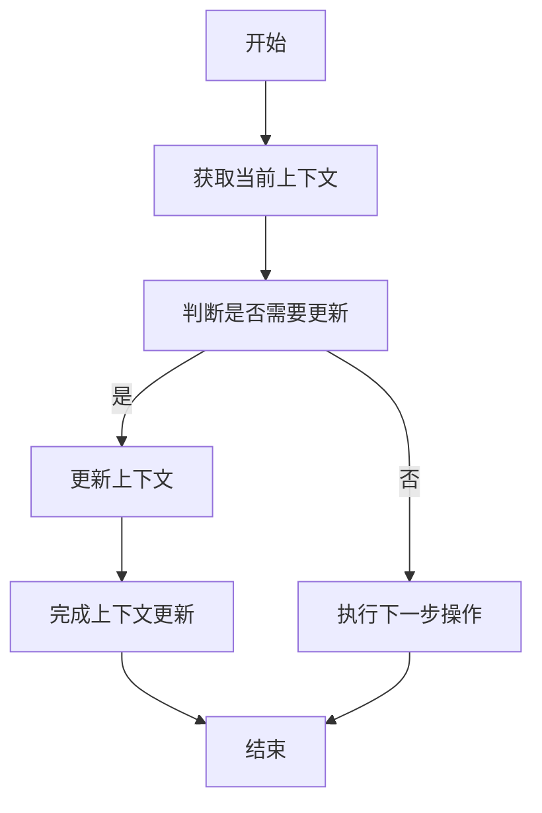
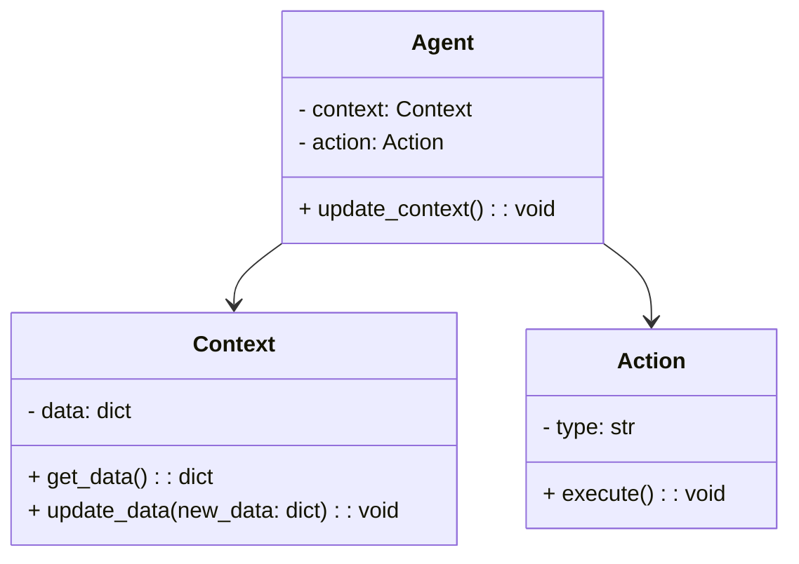
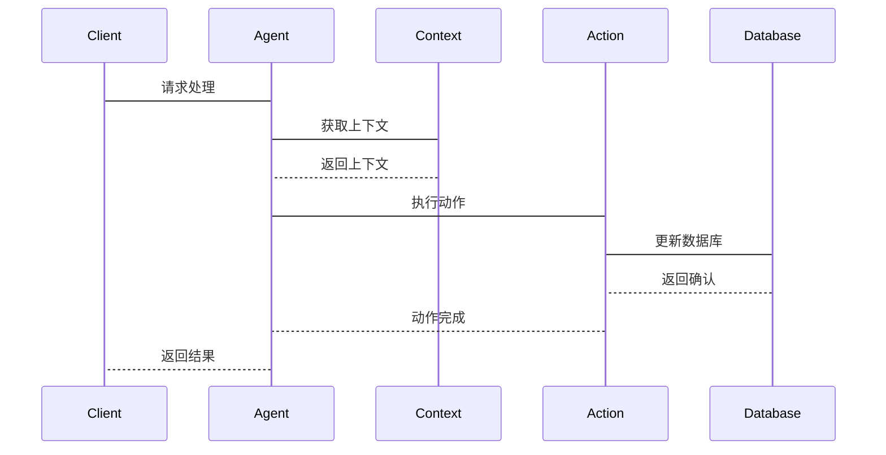

                 


# 实现AI Agent的动态上下文管理

> 关键词：AI Agent，动态上下文，上下文管理，智能代理，实时更新

> 摘要：本文深入探讨了AI Agent在动态上下文管理中的实现方法，分析了动态上下文管理的核心概念、算法原理、系统架构以及实际应用案例，提供了详细的实现方案和代码示例。

---

## 第一部分: AI Agent动态上下文管理的背景与概念

### 第1章: 动态上下文管理的背景与问题背景

#### 1.1 问题背景
##### 1.1.1 AI Agent的基本概念
AI Agent（智能代理）是一种能够感知环境、自主决策并执行任务的智能系统。它广泛应用于推荐系统、自动驾驶、智能助手等领域。

##### 1.1.2 动态上下文管理的必要性
在动态环境中，AI Agent需要实时感知和处理变化的上下文信息，例如用户需求的变化、环境条件的改变等。动态上下文管理是实现这一目标的关键。

##### 1.1.3 当前技术的局限性
现有的上下文管理方法往往静态、固定，难以应对快速变化的环境，导致AI Agent的决策和执行效率低下。

#### 1.2 问题描述
##### 1.2.1 动态上下文管理的核心问题
如何实时感知、更新和利用动态变化的上下文信息，以提高AI Agent的决策能力和执行效率。

##### 1.2.2 上下文变化的挑战
上下文的变化可能来自多个来源，例如用户行为、环境变化等，这些变化需要快速被AI Agent感知并处理。

##### 1.2.3 现有解决方案的不足
现有解决方案通常依赖静态上下文，难以应对动态变化的场景，导致系统灵活性和适应性不足。

#### 1.3 问题解决思路
##### 1.3.1 动态上下文管理的目标
实现对动态上下文的实时感知、更新和利用，提高AI Agent的决策能力和执行效率。

##### 1.3.2 解决方案的总体框架
构建一个动态上下文管理框架，包括上下文感知、上下文更新和上下文利用三个核心模块。

##### 1.3.3 核心技术的突破点
通过实时感知和更新上下文信息，结合动态规划算法，实现对动态上下文的有效管理。

#### 1.4 边界与外延
##### 1.4.1 动态上下文管理的边界
明确动态上下文管理的范围和限制，例如上下文的类型、变化的频率等。

##### 1.4.2 相关概念的区分
区分动态上下文管理与其他相关概念，例如静态上下文管理、实时计算等。

##### 1.4.3 技术的适用范围
确定动态上下文管理技术的适用场景，例如需要实时响应的系统。

#### 1.5 核心概念结构
##### 1.5.1 核心要素组成
动态上下文管理包括上下文感知、上下文更新和上下文利用三个核心要素。

##### 1.5.2 概念之间的关系
上下文感知是基础，上下文更新是关键，上下文利用是目标。

##### 1.5.3 系统架构的初步设想
初步设计一个包含感知层、更新层和利用层的系统架构。

---

### 第2章: 动态上下文管理的核心概念与联系

#### 2.1 核心概念原理
##### 2.1.1 动态上下文的核心特征
动态上下文具有实时性、多样性和不确定性等特征。

##### 2.1.2 上下文感知机制
通过传感器、API或其他数据源，实时感知环境中的变化。

##### 2.1.3 动态更新的实现方式
通过事件驱动或时间驱动的方式，实时更新上下文信息。

#### 2.2 核心概念属性对比
##### 2.2.1 动态性与静态性的对比
动态上下文能够实时变化，而静态上下文固定不变。

##### 2.2.2 上下文的粒度与层次
粒度越细，更新越频繁；层次越高，信息越复杂。

##### 2.2.3 实时性与延迟性的权衡
实时更新能够快速响应变化，但可能导致系统资源消耗过大。

#### 2.3 ER实体关系图
```mermaid
er
    actor: 用户
    agent: 智能代理
    context: 上下文
    action: 动作
    relation: 关联
    actor -[发起请求]-> agent
    agent -[获取上下文]-> context
    agent -[执行动作]-> action
    action -[影响上下文]-> context
```

---

### 第3章: 动态上下文管理的算法原理

#### 3.1 算法原理概述
##### 3.1.1 动态上下文管理的基本算法
动态上下文管理算法包括上下文感知、上下文更新和上下文利用三个步骤。

##### 3.1.2 算法的输入与输出
输入：环境中的变化信息；输出：更新后的上下文信息。

##### 3.1.3 算法的优化方向
通过优化算法的实时性和准确性，提高动态上下文管理的效率。

#### 3.2 算法流程图


#### 3.3 算法实现代码
```python
def update_context(context):
    # 更新上下文的逻辑
    pass

def dynamic_context_management():
    # 获取当前上下文
    current_context = get_current_context()
    # 判断是否需要更新
    if needs_update(current_context):
        new_context = update_context(current_context)
        return new_context
    else:
        return current_context
```

---

## 第二部分: 动态上下文管理的系统分析与架构设计

### 第4章: 问题场景介绍

#### 4.1 项目介绍
本文将设计一个动态上下文管理框架，用于实现AI Agent在动态环境中的高效管理。

#### 4.2 系统功能设计
##### 4.2.1 领域模型类图


#### 4.3 系统架构设计
##### 4.3.1 系统架构图


#### 4.4 系统接口设计
##### 4.4.1 API接口
- `get_context()`: 获取当前上下文
- `update_context(new_context)`: 更新上下文

#### 4.5 系统交互图


---

## 第三部分: 项目实战与案例分析

### 第5章: 项目实战

#### 5.1 环境安装
- 安装Python和必要的库：`pip install mermaid.py`

#### 5.2 核心实现
##### 5.2.1 上下文管理类
```python
class ContextManager:
    def __init__(self):
        self.context = {}

    def get_context(self):
        return self.context

    def update_context(self, new_context):
        self.context.update(new_context)
```

##### 5.2.2 Agent类
```python
class Agent:
    def __init__(self, context_manager):
        self.context_manager = context_manager

    def update_context(self, new_context):
        self.context_manager.update_context(new_context)
```

#### 5.3 代码应用解读
通过代码实现动态上下文管理，展示如何实时更新上下文信息。

#### 5.4 案例分析
分析一个实际案例，展示动态上下文管理在AI Agent中的应用。

---

## 第四部分: 总结与扩展

### 第6章: 总结与最佳实践

#### 6.1 最佳实践
- 定期更新上下文信息
- 确保系统的实时性和稳定性
- 优化算法的效率和准确性

#### 6.2 小结
动态上下文管理是实现高效AI Agent的关键技术，本文通过理论分析和实践案例，展示了其实现方法和应用价值。

#### 6.3 注意事项
- 注意系统的资源消耗
- 确保系统的安全性和可靠性
- 定期维护和优化系统

#### 6.4 拓展阅读
推荐相关的技术书籍和论文，供读者进一步学习。

---

通过以上内容，本文详细探讨了AI Agent的动态上下文管理的实现方法，从理论到实践，为读者提供了全面的指导和参考。

