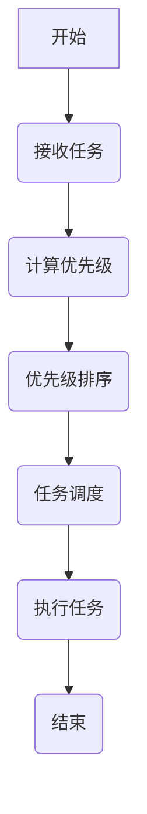
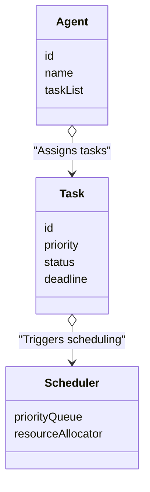
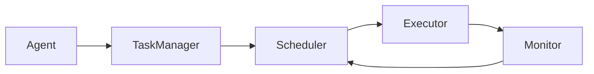
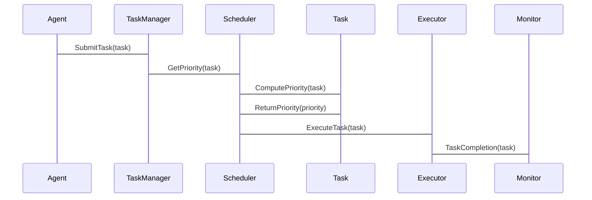

                 


# 实现AI Agent的动态任务优先级调度

## 关键词：AI Agent，动态任务优先级调度，多目标优化，任务调度算法，系统架构设计

## 摘要：本文详细探讨了AI Agent在动态任务优先级调度中的实现方法，从背景、核心概念到算法原理、系统设计，再到项目实战，全面解析动态任务优先级调度的关键技术。通过具体案例分析和代码实现，帮助读者理解如何设计和实现高效的动态任务优先级调度系统。

---

## 第一部分: AI Agent与动态任务优先级调度概述

### 第1章: 动态任务优先级调度的背景与概念

#### 1.1 问题背景与挑战

##### 1.1.1 AI Agent的定义与应用场景

AI Agent（人工智能代理）是指能够感知环境、自主决策并执行任务的智能实体。AI Agent广泛应用于自动驾驶、智能助手、机器人控制、分布式系统等领域。在这些场景中，AI Agent需要处理多个任务，而任务的优先级可能会随着环境变化而动态调整。

##### 1.1.2 动态任务优先级调度的必要性

在实际应用中，任务优先级并非固定不变。例如，在自动驾驶中，紧急避障任务可能需要优先于路径规划任务。动态任务优先级调度能够根据实时环境变化调整任务执行顺序，确保系统高效运行。

##### 1.1.3 当前调度算法的局限性

传统的静态任务优先级调度算法（如贪心算法）无法应对动态变化的环境。例如，在任务执行过程中，新的高优先级任务可能突然出现，静态调度无法快速响应，可能导致系统效率下降甚至崩溃。

#### 1.2 动态任务优先级调度的定义与特点

动态任务优先级调度是一种根据实时环境变化动态调整任务优先级的调度方法。其核心在于根据任务属性、系统状态和环境信息，动态计算任务优先级，并实时调整调度策略。

##### 动态任务优先级调度的特点：
1. **动态性**：优先级随时间变化而调整。
2. **实时性**：能够快速响应环境变化。
3. **多目标优化**：兼顾任务执行效率、资源利用率和系统稳定性。

#### 1.3 动态任务优先级调度的核心要素

##### 1.3.1 任务属性分析

任务属性是优先级计算的基础，包括任务类型、执行时间、截止时间、资源需求等。

##### 1.3.2 优先级计算模型

优先级计算模型需要考虑任务属性和系统状态，动态调整优先级。

##### 1.3.3 调度策略的选择

调度策略的选择影响任务执行效率和系统稳定性，需要在多个策略中权衡取舍。

### 第2章: 动态任务优先级调度的核心概念与联系

#### 2.1 核心概念原理

##### 2.1.1 任务优先级的动态变化机制

优先级动态变化机制包括优先级计算、优先级调整和任务调度三个步骤。

##### 2.1.2 多目标优化的调度模型

多目标优化的调度模型需要同时优化多个目标，如任务完成时间、资源利用率和系统稳定性。

##### 2.1.3 基于上下文的优先级调整策略

上下文信息包括系统状态、环境变化和任务属性，影响优先级调整。

#### 2.2 核心概念对比分析

##### 2.2.1 动态优先级与静态优先级的对比

| 特性               | 动态优先级调度             | 静态优先级调度             |
|--------------------|--------------------------|--------------------------|
| 优先级变化          | 动态调整                   | 固定不变                   |
| 响应环境变化能力    | 高                       | 低                       |
| 任务执行效率        | 高                       | 中等                     |

##### 2.2.2 不同调度算法的优缺点对比

| 调度算法             | 优点                     | 缺点                     |
|---------------------|--------------------------|--------------------------|
| 贪心算法             | 简单高效                 | 无法应对动态变化         |
| 最短作业优先算法     | 周转时间短               | 不能处理高优先级任务     |
| 高优先级优先算法     | 能够处理高优先级任务     | 无法优化资源利用率       |

##### 2.2.3 任务优先级与资源分配的关系

优先级高的任务通常需要更多的资源分配，但资源分配需要综合考虑多个任务的需求。

#### 2.3 实体关系图与流程图

##### 2.3.1 动态任务优先级调度的ER图

```mermaid
erDiagram
    agent {
        id
        name
        taskList
    }
    task {
        id
        priority
        status
        deadline
    }
    agent o--- task : "Assigns tasks"
    task o--- priority : "Defines priority"
```

##### 2.3.2 动态任务优先级调度的流程图



---

## 第二部分: 动态任务优先级调度算法原理

### 第3章: 动态任务优先级调度算法的数学模型

#### 3.1 动态任务优先级计算模型

##### 3.1.1 优先级计算的公式推导

优先级计算公式：

$$ priority = \alpha \cdot urgency + \beta \cdot resource\_requirement + \gamma \cdot deadline\_slack $$

其中，$\alpha$、$\beta$、$\gamma$是权重系数，$urgency$是紧急程度，$resource\_requirement$是资源需求，$deadline\_slack$是截止时间松弛量。

##### 3.1.2 优先级权重的分配策略

权重分配策略需要根据具体应用场景调整，通常通过历史数据训练得到。

##### 3.1.3 动态调整的数学表达式

动态调整公式：

$$ \Delta priority = \theta \cdot (current\_priority - target\_priority) $$

其中，$\theta$是调整速率，$current\_priority$是当前优先级，$target\_priority$是目标优先级。

#### 3.2 多目标优化的调度模型

##### 3.2.1 多目标优化的数学建模

多目标优化模型：

$$ \min \quad f_1(x) + f_2(x) + f_3(x) $$

其中，$f_1$、$f_2$、$f_3$是需要优化的目标函数。

##### 3.2.2 基于权重的优先级排序

优先级排序公式：

$$ P_i = w_1 \cdot t_i + w_2 \cdot r_i + w_3 \cdot d_i $$

其中，$w_1$、$w_2$、$w_3$是权重，$t_i$是任务执行时间，$r_i$是资源需求，$d_i$是截止时间。

##### 3.2.3 调度算法的收敛性分析

收敛性分析需要通过数学证明，确保算法在有限步内收敛到最优解。

#### 3.3 动态调整机制的数学表达

##### 3.3.1 优先级动态调整的公式

优先级动态调整公式：

$$ P_i(t+1) = P_i(t) + \mu \cdot (P_{target} - P_i(t)) $$

其中，$\mu$是调整步长，$P_{target}$是目标优先级。

##### 3.3.2 任务状态变化对优先级的影响

任务状态变化会影响优先级，例如任务完成、任务取消或任务更新。

##### 3.3.3 动态调整的收敛性分析

动态调整需要分析收敛速度和稳定性，确保系统稳定运行。

---

## 第三部分: 动态任务优先级调度的系统架构设计

### 第4章: 系统分析与架构设计方案

#### 4.1 问题场景介绍

动态任务优先级调度系统需要在复杂环境中高效运行，支持高并发任务处理和动态优先级调整。

#### 4.2 系统功能设计

##### 4.2.1 功能模块划分

功能模块包括任务接收、优先级计算、任务调度、执行监控和优先级调整。

##### 4.2.2 领域模型类图



#### 4.3 系统架构设计

##### 4.3.1 系统架构图



##### 4.3.2 接口设计与交互流程

接口设计包括任务接收接口、优先级调整接口和任务执行接口。

##### 4.3.3 序列图



---

## 第四部分: 项目实战与实现

### 第5章: 项目实战

#### 5.1 环境安装与配置

安装Python、依赖库和开发工具。

#### 5.2 核心代码实现

##### 5.2.1 优先级计算模块

```python
class PriorityCalculator:
    def __init__(self, alpha=0.5, beta=0.3, gamma=0.2):
        self.alpha = alpha
        self.beta = beta
        self.gamma = gamma

    def calculate_priority(self, task):
        urgency = task.urgency
        resource_requirement = task.resource_requirement
        deadline_slack = task.deadline_slack
        priority = self.alpha * urgency + self.beta * resource_requirement + self.gamma * deadline_slack
        return priority
```

##### 5.2.2 调度算法实现

```python
class DynamicScheduler:
    def __init__(self, agent):
        self.agent = agent

    def schedule_task(self, task):
        priority = self.agent.priority_calculator.calculate_priority(task)
        self.agent.scheduler_queue.append((task, priority))
        self.agent.scheduler_queue.sort(key=lambda x: -x[1])
        return self.agent.executor.execute_task(self.agent.scheduler_queue[0][0])
```

##### 5.2.3 代码解读与分析

解释代码实现，分析优先级计算和调度算法的工作流程。

#### 5.3 实际案例分析与实现

##### 5.3.1 案例分析

分析一个具体案例，如自动驾驶中的紧急避障任务调度。

##### 5.3.2 代码实现

实现案例中的动态任务优先级调度，解释代码实现细节。

##### 5.3.3 实验结果与分析

展示实验结果，分析算法的效率和效果。

#### 5.4 项目小结

总结项目成果，分析优缺点，提出改进建议。

---

## 第五部分: 最佳实践与总结

### 第6章: 最佳实践

#### 6.1 小结

总结动态任务优先级调度的核心思想和实现方法。

#### 6.2 注意事项

注意事项包括算法选型、权重调整和系统稳定性。

#### 6.3 拓展阅读

推荐相关领域的书籍和论文，供读者深入学习。

---

## 结语

动态任务优先级调度是实现高效AI Agent的核心技术，通过本文的详细讲解和实战案例，读者可以掌握动态任务优先级调度的实现方法，并在实际项目中灵活应用。

