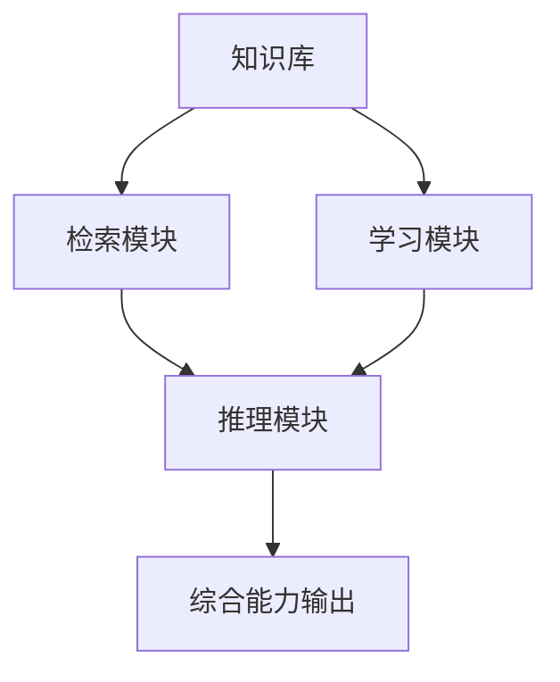
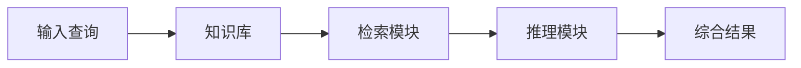
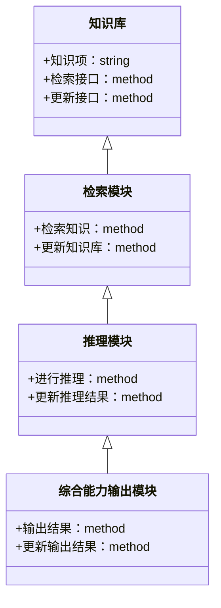
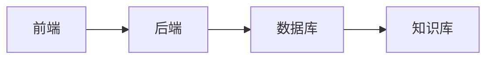
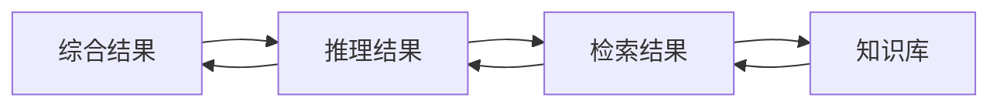

                 


# 实现AI Agent的动态知识检索与综合能力

> 关键词：AI Agent，动态知识检索，综合能力，知识表示，推理算法，系统架构

> 摘要：本文详细探讨了AI Agent实现动态知识检索与综合能力的核心技术与实现方法，从算法原理到系统架构，从数学模型到项目实战，全面解析AI Agent的设计与实现过程，为读者提供深度的技术见解。

---

# 第一部分: AI Agent的核心概念与背景

## 第1章: AI Agent的核心概念与背景

### 1.1 问题背景与问题描述
#### 1.1.1 动态知识检索的挑战
AI Agent需要在动态变化的环境中实时检索和处理信息，这要求其具备快速适应环境变化的能力。例如，在实时聊天机器人中，用户的问题可能涉及最新的事件或数据，AI Agent需要能够迅速调用最新的知识进行回答。

#### 1.1.2 综合能力的需求与目标
AI Agent的综合能力不仅包括单点知识的检索，还需要能够将多个来源的知识进行整合，形成连贯的推理结果。例如，在医疗领域，AI Agent需要能够整合病人的病史、症状、药物信息等多个来源的数据，提供综合诊断建议。

#### 1.1.3 边界与外延
动态知识检索与综合能力的边界在于实时性、准确性和连贯性。AI Agent需要在限定的时间内完成检索，并确保检索结果的准确性，同时在综合推理时保持逻辑连贯。

### 1.2 AI Agent的定义与特点
#### 1.2.1 AI Agent的基本定义
AI Agent是一种能够感知环境、自主决策并执行任务的智能实体。它通过传感器获取信息，利用推理引擎进行分析，并通过执行器与环境交互。

#### 1.2.2 动态知识检索的核心能力
动态知识检索是指AI Agent能够实时获取和更新知识库中的信息，并根据当前任务需求选择最相关的知识。例如，在自然语言处理中，AI Agent需要能够动态调用词典、百科知识库等资源。

#### 1.2.3 综合能力的实现机制
综合能力是指AI Agent能够将多个来源的知识进行整合，形成完整的知识图谱，并在此基础上进行推理和决策。例如，在金融领域，AI Agent需要能够整合市场数据、公司财报、行业趋势等多种信息，提供综合的市场分析报告。

### 1.3 核心概念与联系
#### 1.3.1 核心概念原理
动态知识检索与综合能力是AI Agent实现智能交互的核心，其原理包括知识表示、检索算法、推理机制和学习机制。这些机制共同作用，使得AI Agent能够动态适应环境并提供智能服务。

#### 1.3.2 概念属性特征对比表
以下是核心概念的属性特征对比表：

| 概念       | 属性             | 特征描述                                                                 |
|------------|------------------|--------------------------------------------------------------------------|
| 知识表示     | 表示方式         | 符号表示、向量表示、图表示                                             |
|            | 可扩展性         | 高，支持动态更新                                                         |
| 检索算法     | 算法类型         | 基于向量的检索、基于图的检索                                             |
|            | 复杂度           | 低复杂度（向量空间模型） vs 高复杂度（图模型）                           |
| 推理机制     | 推理类型         | 逻辑推理、概率推理、归纳推理                                             |
|            | 精度             | 高精度（逻辑推理） vs 低精度（概率推理）                                 |

#### 1.3.3 ER实体关系图架构
以下是AI Agent的知识检索与综合能力的实体关系图：



---

## 第2章: AI Agent的算法原理

### 2.1 知识表示与检索算法
#### 2.1.1 向量空间模型
向量空间模型是一种常用的文本表示方法，通过将文本映射到高维向量空间，计算文本之间的相似度。例如，使用余弦相似度进行检索：

$$ \text{余弦相似度} = \frac{\vec{A} \cdot \vec{B}}{|\vec{A}| |\vec{B}|} $$

#### 2.1.2 基于图的检索算法
基于图的检索算法将知识表示为图结构，通过节点相似度计算进行检索。例如，使用图嵌入方法：

$$ \text{节点相似度} = \sum_{i=1}^{n} w_{i} \times s_{i} $$

#### 2.1.3 知识图谱构建与查询
知识图谱构建是将知识表示为图结构的过程，通过SPARQL查询语言进行检索。例如，查询“李华的年龄”：

```sparql
SELECT ?age WHERE {
    ?person <name> "李华" .
    ?person <age> ?age .
}
```

### 2.2 推理与综合算法
#### 2.2.1 基于逻辑的推理算法
逻辑推理是通过逻辑规则进行推理的过程。例如，使用命题逻辑推理：

$$ \text{逻辑推理} = \bigwedge_{i=1}^{n} (P_i \rightarrow Q_i) $$

#### 2.2.2 基于概率的推理算法
概率推理是通过概率模型进行推理的过程。例如，使用贝叶斯网络进行推理：

$$ P(A|B) = \frac{P(B|A)P(A)}{P(B)} $$

#### 2.2.3 综合推理模型
综合推理模型结合了多种推理方法，例如，结合逻辑推理和概率推理的混合模型。

### 2.3 算法流程图
以下是知识检索与综合推理的算法流程图：



---

## 第3章: AI Agent的数学模型与公式

### 3.1 知识表示的数学模型
#### 3.1.1 向量空间模型公式
向量空间模型的相似度计算公式：

$$ \text{余弦相似度} = \frac{\vec{A} \cdot \vec{B}}{|\vec{A}| |\vec{B}|} $$

#### 3.1.2 图模型公式
图模型的相似度计算公式：

$$ \text{节点相似度} = \sum_{i=1}^{n} w_{i} \times s_{i} $$

### 3.2 推理算法的数学模型
#### 3.2.1 逻辑推理公式
逻辑推理的命题逻辑公式：

$$ \text{逻辑推理} = \bigwedge_{i=1}^{n} (P_i \rightarrow Q_i) $$

#### 3.2.2 概率推理公式
概率推理的贝叶斯公式：

$$ P(A|B) = \frac{P(B|A)P(A)}{P(B)} $$

---

## 第4章: AI Agent的系统分析与架构设计

### 4.1 问题场景介绍
AI Agent需要在动态环境中实时检索和处理信息，例如在智能客服系统中，AI Agent需要能够实时响应用户的问题，并结合上下文进行推理。

### 4.2 系统功能设计
系统功能设计包括知识检索模块、推理模块、综合能力输出模块等。以下是领域模型的Mermaid类图：



### 4.3 系统架构设计
系统架构设计包括前端、后端和数据库部分。以下是系统架构的Mermaid架构图：



### 4.4 系统接口设计
系统接口设计包括RESTful API和WebSocket接口。例如，使用RESTful API进行知识检索：

```http
GET /api/knowledge?query=keyword
```

### 4.5 系统交互流程图
系统交互的流程图如下：



---

## 第5章: AI Agent的项目实战

### 5.1 环境安装
安装Python和相关库，例如：

```bash
pip install numpy
pip install networkx
pip install spacy
```

### 5.2 系统核心实现
以下是知识检索模块的Python代码示例：

```python
import numpy as np
from sklearn.metrics.pairwise import cosine_similarity

# 向量表示
vec_A = np.array([1, 2, 3])
vec_B = np.array([4, 5, 6])

# 计算余弦相似度
similarity = cosine_similarity([vec_A], [vec_B])[0][0]
print(similarity)
```

### 5.3 实际案例分析
以医疗领域为例，AI Agent需要整合病人的病史、症状、药物信息等数据，提供综合诊断建议。

### 5.4 项目小结
在实现AI Agent的动态知识检索与综合能力时，需要注意数据质量、模型调优和系统安全等问题。

---

## 第6章: 最佳实践与注意事项

### 6.1 小结
AI Agent的动态知识检索与综合能力是实现智能系统的核心技术，需要结合知识表示、检索算法、推理机制和学习机制。

### 6.2 注意事项
- 数据质量是关键，确保知识库的准确性和完整性。
- 模型调优是实现高性能的重要步骤，需要结合实际场景进行优化。
- 系统安全性需要高度重视，避免数据泄露和逻辑漏洞。

### 6.3 拓展阅读
建议读者进一步阅读《深度学习》、《自然语言处理实战》等相关书籍，深入理解AI Agent的技术细节。

---

通过以上目录结构，我们可以系统地学习和实现AI Agent的动态知识检索与综合能力，为智能系统的设计与开发提供坚实的技术基础。

