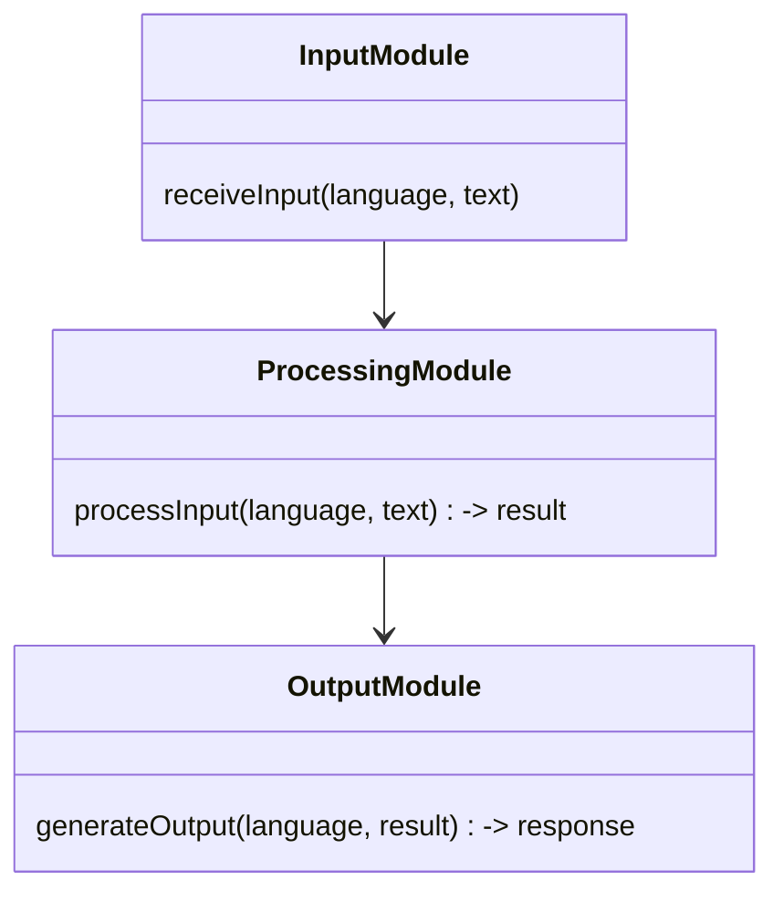
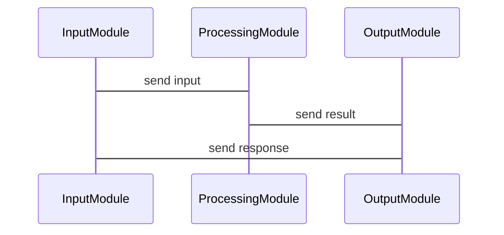

                 


# 实现AI Agent的多语言支持

> 关键词：AI Agent，多语言支持，自然语言处理，跨语言通信，系统架构

> 摘要：本文详细探讨了AI Agent实现多语言支持的核心技术与方法，涵盖背景、原理、系统设计、项目实战等各个方面，通过理论与实践相结合的方式，帮助读者全面理解和掌握AI Agent的多语言支持实现。

---

# 第一部分: AI Agent的背景与概述

## 第1章: AI Agent的基本概念与多语言支持的重要性

### 1.1 AI Agent的定义与核心功能

#### 1.1.1 AI Agent的定义
AI Agent（人工智能代理）是一种能够感知环境、自主决策并执行任务的智能实体。它通过与用户的交互，理解需求并提供相应的服务，广泛应用于对话系统、智能助手、自动化工具等领域。

#### 1.1.2 AI Agent的核心功能
- **感知模块**：通过输入（如文本、语音）理解用户需求。
- **决策模块**：基于理解的需求生成响应或行动计划。
- **执行模块**：将决策结果转化为实际操作（如生成文本、执行任务）。

#### 1.1.3 多语言支持在AI Agent中的作用
随着全球化的推进，AI Agent需要支持多种语言，以满足不同用户群体的需求，提升用户体验和市场覆盖范围。

### 1.2 多语言支持的必要性

#### 1.2.1 全球化背景下的多语言需求
在国际化市场中，用户可能使用多种语言进行交流，AI Agent需要能够理解并生成多种语言，以提供一致的服务体验。

#### 1.2.2 多语言支持对用户体验的提升
支持多种语言可以提高用户满意度，减少用户因语言障碍导致的使用困难。

#### 1.2.3 多语言支持的技术挑战
- 不同语言的语法结构差异。
- 多语言模型的训练难度。
- 处理多语言数据时的计算资源消耗。

### 1.3 AI Agent与多语言支持的技术背景

#### 1.3.1 自然语言处理技术的发展
NLP技术的进步为AI Agent的多语言支持提供了基础，如BERT、GPT等模型的多语言版本。

#### 1.3.2 多语言模型的演进
从单一语言模型到多语言模型的演进，使得AI Agent能够处理多种语言的任务。

#### 1.3.3 当前主流的多语言支持技术
- 统一语言模型（如mBERT）。
- 多语言预训练模型（如XLM）。

### 1.4 本章小结
本章介绍了AI Agent的基本概念和多语言支持的重要性，强调了多语言支持在AI Agent中的必要性，并概述了当前的技术背景。

---

# 第二部分: AI Agent的核心概念与原理

## 第2章: AI Agent的工作原理

### 2.1 AI Agent的感知模块

#### 2.1.1 感知模块的功能与实现
感知模块负责接收用户的输入并进行解析，例如通过NLP技术将用户的自然语言输入转化为结构化数据。

#### 2.1.2 多语言输入的处理流程
1. **语言检测**：识别输入语言。
2. **分词与解析**：对不同语言进行分词和语法分析。
3. **语义理解**：理解输入的语义含义。

#### 2.1.3 感知模块的挑战与解决方案
- **挑战**：不同语言的语法结构差异。
- **解决方案**：使用多语言NLP模型进行统一处理。

### 2.2 AI Agent的决策模块

#### 2.2.1 决策模块的核心算法
决策模块基于感知到的信息，结合知识库和推理引擎生成响应或行动计划。

#### 2.2.2 多语言支持对决策的影响
- 多语言支持需要决策模块能够理解多种语言的上下文和语义。

#### 2.2.3 决策模块的优化策略
- 使用多语言预训练模型进行上下文理解。
- 建立多语言知识库，支持多种语言的推理。

### 2.3 AI Agent的执行模块

#### 2.3.1 执行模块的功能实现
执行模块负责将决策结果转化为实际操作，例如生成多语言的文本响应或执行特定任务。

#### 2.3.2 多语言输出的生成过程
1. **语言选择**：根据用户语言偏好选择输出语言。
2. **文本生成**：使用多语言生成模型生成响应。
3. **结果优化**：对生成的文本进行润色和校对。

#### 2.3.3 执行模块的性能优化
- 使用缓存技术优化多语言生成性能。
- 并行处理多语言任务。

### 2.4 本章小结
本章详细讲解了AI Agent的核心模块，包括感知、决策和执行模块的工作原理，重点分析了多语言支持在每个模块中的实现和挑战。

---

# 第三部分: 自然语言处理技术

## 第3章: 自然语言处理技术在多语言支持中的应用

### 3.1 多语言NLP模型的原理与实现

#### 3.1.1 多语言模型的训练
- 使用跨语言预训练技术（CLP）训练多语言模型。
- 通过参数共享机制处理多种语言。

#### 3.1.2 多语言模型的优势
- 减少训练数据的需求。
- 提高模型的通用性和迁移能力。

#### 3.1.3 多语言模型的挑战
- 语言间差异可能导致模型性能下降。
- 训练过程中需要平衡多种语言的学习。

### 3.2 多语言NLP模型的实现

#### 3.2.1 使用BERT进行多语言文本处理
- 示例代码：
  ```python
  from transformers import AutoTokenizer, AutoModelForMaskedLM
  tokenizer = AutoTokenizer.from_pretrained('bert-base-multilingual-cased')
  model = AutoModelForMaskedLM.from_pretrained('bert-base-multilingual-cased')
  ```

#### 3.2.2 多语言文本生成
- 使用GPT模型生成多语言文本：
  ```python
  import torch
  input_ids = tokenizer.encode("Hello, how are you?", add_special_tokens=True)
  input_ids = input_ids.unsqueeze(0)  # 扩展 batch size
  output = model.generate(input_ids, max_length=50)
  generated_text = tokenizer.decode(output[0], skip_special_tokens=True)
  ```

#### 3.2.3 多语言模型的评估
- 使用BLEU、ROUGE等指标评估生成文本的质量。

### 3.3 多语言NLP的挑战与解决方案

#### 3.3.1 语言间的语法差异
- 解决方案：使用语言特定的语法分析工具。

#### 3.3.2 跨语言语义理解
- 解决方案：基于跨语言嵌入（XLM）进行语义匹配。

### 3.4 本章小结
本章探讨了自然语言处理技术在多语言支持中的应用，重点分析了多语言模型的训练、实现和评估方法，并提出了应对挑战的解决方案。

---

# 第四部分: 跨语言通信协议与接口设计

## 第4章: 跨语言通信协议的设计与实现

### 4.1 跨语言通信协议的核心要素

#### 4.1.1 协议的定义
- 定义数据的结构和格式。
- 规定数据的传输方式。

#### 4.1.2 协议的设计原则
- 简洁性：减少数据传输的开销。
- 可扩展性：支持未来协议的扩展。
- 跨语言兼容性：支持多种语言的解析和生成。

### 4.2 跨语言接口的设计

#### 4.2.1 接口的设计方法
- 使用RESTful API设计跨语言接口。
- 定义统一的请求格式和响应格式。

#### 4.2.2 接口的设计工具
- 使用OpenAPI（Swagger）定义接口规范。
- 自动生成不同语言的客户端代码。

### 4.3 跨语言通信协议的实现

#### 4.3.1 使用JSON-RPC协议
- 示例代码：
  ```json
  {
    "jsonrpc": "2.0",
    "method": "translate",
    "params": ["en", "Hello, world!"],
    "id": 1
  }
  ```

#### 4.3.2 使用HTTP协议实现
- 示例代码：
  ```python
  import requests
  response = requests.post('http://localhost:8080/api/translate', 
                           json={"source": "en", "target": "es", "text": "Hello, world!"})
  print(response.json())
  ```

#### 4.3.3 接口的测试与验证
- 使用Postman测试接口的可用性。
- 使用自动化测试框架验证接口的正确性。

### 4.4 本章小结
本章详细讲解了跨语言通信协议的设计与实现，重点分析了协议的核心要素和接口的设计方法，并通过示例代码展示了实现过程。

---

# 第五部分: AI Agent的系统架构与设计

## 第5章: AI Agent的系统架构设计

### 5.1 系统架构的核心要素

#### 5.1.1 模块划分
- **输入模块**：接收多语言输入。
- **处理模块**：解析并处理输入。
- **输出模块**：生成多语言输出。

#### 5.1.2 模块之间的关系
- 输入模块与处理模块之间通过数据传递进行交互。
- 处理模块与输出模块之间通过上下文进行交互。

### 5.2 系统架构的实现

#### 5.2.1 系统架构的类图设计


#### 5.2.2 系统架构的交互流程


### 5.3 系统架构的优化

#### 5.3.1 并行处理
- 使用多线程或异步处理提高系统的响应速度。

#### 5.3.2 负载均衡
- 在多语言任务处理中实现负载均衡，确保系统的稳定性。

### 5.4 本章小结
本章通过类图和序列图展示了AI Agent的系统架构，并详细讲解了系统的实现和优化方法。

---

# 第六部分: 项目实战与实现

## 第6章: 项目实战与实现

### 6.1 项目背景与目标

#### 6.1.1 项目背景
开发一个多语言支持的AI Agent，能够理解并生成多种语言的文本。

#### 6.1.2 项目目标
- 实现多语言文本的理解和生成。
- 提供高效的跨语言通信接口。

### 6.2 系统环境搭建

#### 6.2.1 环境要求
- Python 3.8+
- 安装必要的库（如transformers、requests）

#### 6.2.2 环境搭建步骤
1. 安装Python和pip。
2. 安装所需的库：
   ```bash
   pip install transformers requests
   ```

### 6.3 系统核心实现

#### 6.3.1 感知模块的实现
```python
from transformers import AutoTokenizer, AutoModelForMaskedLM

tokenizer = AutoTokenizer.from_pretrained('bert-base-multilingual-cased')
model = AutoModelForMaskedLM.from_pretrained('bert-base-multilingual-cased')

def process_input(text):
    inputs = tokenizer.encode_plus(text, add_special_tokens=True, return_tensors='pt')
    outputs = model.generate(inputs['input_ids'], max_length=50)
    return tokenizer.decode(outputs[0], skip_special_tokens=True)
```

#### 6.3.2 决策模块的实现
```python
import requests

def translate(source_lang, target_lang, text):
    response = requests.post('http://localhost:8080/api/translate',
                            json={"source": source_lang, "target": target_lang, "text": text})
    return response.json()['result']
```

#### 6.3.3 执行模块的实现
```python
def generate_response(language, result):
    # 使用多语言生成模型生成响应
    pass
```

### 6.4 功能测试与优化

#### 6.4.1 功能测试
1. 测试多语言输入的处理。
2. 测试跨语言通信接口的正确性。

#### 6.4.2 性能优化
- 使用缓存技术优化模型加载时间。
- 并行处理多语言任务。

### 6.5 本章小结
本章通过实际项目案例，详细讲解了AI Agent的多语言支持实现，包括环境搭建、核心代码实现和功能测试。

---

# 第七部分: 优化与扩展

## 第7章: 优化与扩展

### 7.1 性能优化

#### 7.1.1 模型优化
- 使用更高效的模型架构（如T5）。
- 剥离不必要的参数，减少计算量。

#### 7.1.2 系统优化
- 使用分布式计算提高处理能力。
- 优化接口的响应速度。

### 7.2 功能扩展

#### 7.2.1 支持更多语言
- 扩展模型的训练数据，支持更多语言。
- 更新接口文档，支持更多语言的输入和输出。

#### 7.2.2 增加高级功能
- 实时翻译功能。
- 多语言对话记忆功能。

### 7.3 未来发展方向

#### 7.3.1 技术趋势
- 更强大的多语言模型（如MarianMT）。
- 跨语言推理能力的提升。

#### 7.3.2 应用场景扩展
- 多语言客服系统。
- 全球化电商平台的多语言支持。

### 7.4 本章小结
本章探讨了AI Agent多语言支持的优化与扩展方向，分析了未来的技术趋势和应用场景。

---

# 第八部分: 总结与展望

## 第8章: 总结与展望

### 8.1 本项目的核心成果

#### 8.1.1 实现了多语言支持的AI Agent。
#### 8.1.2 提供了高效的跨语言通信接口。

### 8.2 技术总结

#### 8.2.1 自然语言处理技术的应用。
#### 8.2.2 跨语言通信协议的设计与实现。

### 8.3 未来展望

#### 8.3.1 更强大的多语言模型。
#### 8.3.2 更广泛的应用场景。

### 8.4 致谢

#### 8.4.1 感谢参与项目的团队成员。
#### 8.4.2 感谢提供技术支持的公司和机构。

### 8.5 参考文献

#### 8.5.1 列出参考的文献和资料。

---

# 附录: 代码实现与详细说明

## 附录A: 环境搭建与依赖管理

### A.1 安装Python与pip
```bash
python --version
pip --version
```

### A.2 安装依赖库
```bash
pip install transformers requests
```

## 附录B: 核心代码实现

### B.1 感知模块实现
```python
from transformers import AutoTokenizer, AutoModelForMaskedLM

tokenizer = AutoTokenizer.from_pretrained('bert-base-multilingual-cased')
model = AutoModelForMaskedLM.from_pretrained('bert-base-multilingual-cased')

def process_input(text):
    inputs = tokenizer.encode_plus(text, add_special_tokens=True, return_tensors='pt')
    outputs = model.generate(inputs['input_ids'], max_length=50)
    return tokenizer.decode(outputs[0], skip_special_tokens=True)
```

### B.2 跨语言通信接口实现
```python
import requests

def translate(source_lang, target_lang, text):
    response = requests.post('http://localhost:8080/api/translate',
                            json={"source": source_lang, "target": target_lang, "text": text})
    return response.json()['result']
```

### B.3 输出模块实现
```python
def generate_response(language, result):
    # 使用多语言生成模型生成响应
    pass
```

## 附录C: 测试与验证

### C.1 功能测试
1. 测试多语言输入的处理。
2. 测试跨语言通信接口的正确性。

### C.2 性能测试
- 使用工具（如JMeter）进行压力测试。
- 优化模型的响应时间。

---

# 结束语

通过本文的详细讲解，读者可以全面了解AI Agent多语言支持的实现方法和相关技术。从理论到实践，从设计到实现，本文为读者提供了完整的解决方案。未来，随着技术的进步，AI Agent的多语言支持将更加智能化和多样化，为用户提供更优质的服务体验。

