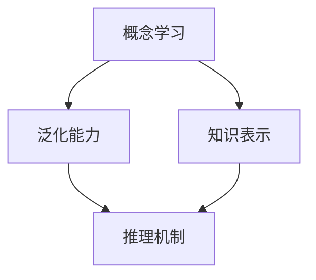
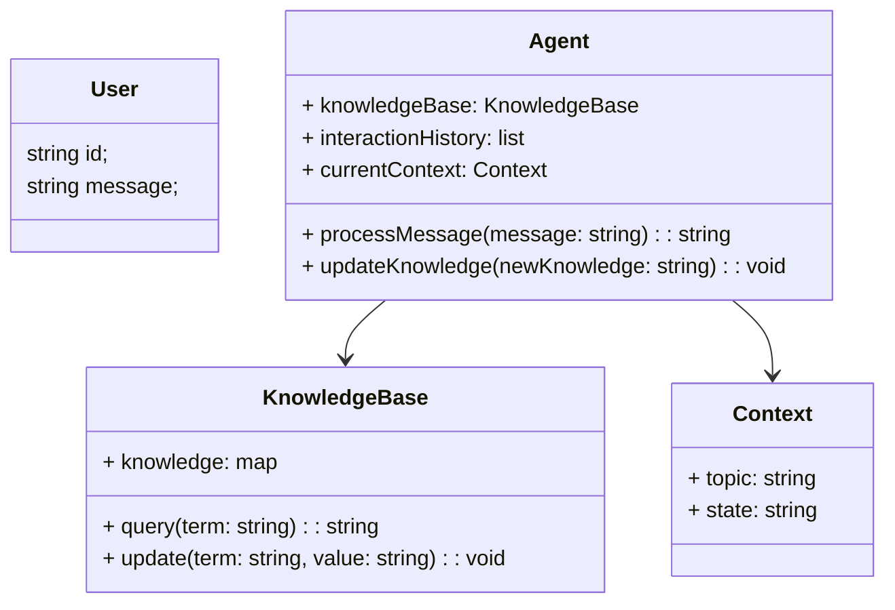

                 


# 实现AI Agent的概念学习与泛化能力

## 关键词
AI Agent，概念学习，泛化能力，监督学习，无监督学习，强化学习，知识表示，数学模型

## 摘要
本文深入探讨AI Agent的概念学习与泛化能力，分析其实现方法，包括监督、无监督和强化学习的原理，结合系统架构设计和实际案例，提供详细的代码示例和数学模型，最终总结最佳实践。

---

# 第一部分: AI Agent的概念学习与泛化能力基础

## 第1章: AI Agent的背景与概念

### 1.1 问题背景
#### 1.1.1 人工智能发展的现状
人工智能（AI）技术快速发展，AI Agent在多个领域得到广泛应用，如自动驾驶、智能助手和推荐系统。

#### 1.1.2 AI Agent的核心问题
AI Agent需具备概念学习和泛化能力，以适应多样化的应用场景。

#### 1.1.3 概念学习与泛化能力的重要性
概念学习帮助AI Agent理解数据，泛化能力使其在新数据上表现良好。

### 1.2 问题描述
#### 1.2.1 AI Agent的基本定义
AI Agent是具备自主决策能力的智能体，通过环境交互完成目标。

#### 1.2.2 概念学习的定义与特点
概念学习是通过数据学习抽象概念，数据驱动，模型依赖。

#### 1.2.3 泛化能力的定义与目标
泛化能力是AI Agent在新数据上的性能，目标是稳定性和鲁棒性。

### 1.3 问题解决
#### 1.3.1 AI Agent实现概念学习的必要性
概念学习为AI Agent提供理解和推理的基础。

#### 1.3.2 泛化能力在AI Agent中的作用
泛化能力提升AI Agent的适应性和应用场景广度。

#### 1.3.3 解决方案的初步框架
结合概念学习和泛化能力，构建高效的AI Agent系统。

### 1.4 边界与外延
#### 1.4.1 AI Agent概念学习的边界
概念学习专注于抽象层次，不涉及具体实现细节。

#### 1.4.2 泛化能力的适用范围
适用于数据分布变化的情况，需在模型复杂度和泛化能力之间平衡。

#### 1.4.3 相关概念的对比与区分
概念学习与数据挖掘、机器学习等其他概念的区别与联系。

### 1.5 核心要素组成
#### 1.5.1 数据输入与处理
数据预处理、特征提取，确保输入数据的质量和适用性。

#### 1.5.2 知识表示与存储
选择合适的知识表示方法，如符号逻辑、向量表示，存储结构化数据。

#### 1.5.3 学习算法与推理机制
采用监督、无监督或强化学习算法，构建推理框架，连接概念与决策。

---

## 第2章: AI Agent的核心概念与联系

### 2.1 概念学习的原理
#### 2.1.1 基于监督学习的概念提取
利用标记数据训练分类器，提取类别特征，形成概念。

#### 2.1.2 基于无监督学习的概念发现
通过聚类和主题建模发现数据中的潜在概念，无需标记数据。

#### 2.1.3 基于强化学习的概念优化
通过奖励机制，优化概念表示，提升在动态环境中的适用性。

### 2.2 泛化能力的实现
#### 2.2.1 泛化的定义与分类
泛化能力是指AI Agent在未见数据上的表现，分为分类、回归、NLP等类型。

#### 2.2.2 泛化能力的度量方法
准确率、F1分数、困惑度等指标衡量模型的泛化能力。

#### 2.2.3 泛化与概念学习的关系
概念学习为泛化提供基础，泛化能力依赖于对概念的深入理解。

### 2.3 概念学习与泛化的联系
#### 2.3.1 概念学习为泛化提供基础
概念理解越深，泛化能力越强。

#### 2.3.2 泛化能力依赖于概念的深度理解
通过概念提取优化泛化表现。

#### 2.3.3 概念学习与泛化的协同优化
两者协同优化，提升AI Agent的整体性能。

### 2.4 核心概念的对比表格
| 概念 | 定义 | 特点 | 应用场景 |
|------|------|------|----------|
| 概念学习 | 通过数据学习抽象概念 | 数据驱动、模型依赖 | 分类、聚类、NLP |
| 泛化能力 | 在新数据上的表现 | 稳定性、鲁棒性 | 预测、推荐、决策 |

### 2.5 ER实体关系图


---

## 第3章: AI Agent的算法原理

### 3.1 监督学习实现概念提取
#### 3.1.1 算法流程
数据预处理 → 特征提取 → 训练分类器 → 概念提取。

#### 3.1.2 代码示例
```python
from sklearn.tree import DecisionTreeClassifier
import pandas as pd

# 数据加载与预处理
data = pd.read_csv('data.csv')
X = data.drop('label', axis=1)
y = data['label']

# 模型训练
model = DecisionTreeClassifier()
model.fit(X, y)

# 概念提取
features = model.feature_importances_
```

#### 3.1.3 数学模型
分类器的损失函数：$$ L = \sum_{i=1}^{n} (y_i - \hat{y}_i)^2 $$

优化器：$$ \theta = \theta - \eta \frac{\partial L}{\partial \theta} $$

### 3.2 无监督学习发现概念
#### 3.2.1 算法流程
数据加载 → 特征提取 → 聚类 → 主题建模。

#### 3.2.2 代码示例
```python
from sklearn.cluster import KMeans
import pandas as pd

# 数据加载与预处理
data = pd.read_csv('data.csv')
X = data.drop('label', axis=1)

# 聚类
model = KMeans(n_clusters=3)
model.fit(X)
clusters = model.labels_
```

#### 3.2.3 数学模型
K-means目标函数：$$ \arg \min \sum_{i=1}^{k} \sum_{x_j \in S_i} (x_j - \mu_i)^2 $$

### 3.3 强化学习优化泛化能力
#### 3.3.1 算法流程
环境交互 → 状态感知 → 动作选择 → 奖励机制 → 模型优化。

#### 3.3.2 代码示例
```python
import gym
from stable_baselines3 import PPO

# 环境初始化
env = gym.make('CartPole-v0')

# 模型训练
model = PPO('MlpPolicy', env)
model.learn(total_timesteps=10000)
```

#### 3.3.3 数学模型
策略梯度：$$ \nabla J(\theta) = \mathbb{E}[ \nabla \log \pi_\theta(a|s) Q_\theta(s,a) ] $$

---

## 第4章: AI Agent的系统分析与架构设计

### 4.1 问题场景介绍
AI Agent在智能客服中的应用，处理用户咨询，涉及多轮对话和知识库查询。

### 4.2 系统功能设计
- 用户交互模块：处理输入和输出，解析用户意图。
- 知识库模块：存储和管理知识，支持快速查询。
- 推理引擎：基于知识库进行推理，生成回答。

### 4.3 领域模型类图


### 4.4 系统架构设计
分层架构：数据层、逻辑层、应用层，确保各模块独立性和可扩展性。

### 4.5 接口设计与交互
API接口定义，如RESTful API，用于各模块间的通信。

---

## 第5章: 项目实战

### 5.1 环境安装
安装必要的库，如Python、TensorFlow、Scikit-learn等。

### 5.2 核心代码实现
实现AI Agent的概念学习和泛化能力，如分类、聚类和主题建模。

### 5.3 代码解读
详细解释关键代码段，如数据预处理、模型训练、结果分析等。

### 5.4 案例分析
分析实际案例，展示AI Agent在概念学习和泛化能力上的应用效果。

### 5.5 项目小结
总结项目实现的关键点，经验教训，未来改进方向。

---

## 第6章: 最佳实践与小结

### 6.1 小结
总结全书内容，强调概念学习和泛化能力的重要性。

### 6.2 注意事项
- 数据质量的重要性
- 模型选择的策略
- 调参和优化的技巧

### 6.3 拓展阅读
推荐相关书籍和论文，如《机器学习实战》、《深度学习》。

---

# 结语
通过系统学习和实践，读者可以掌握AI Agent的概念学习与泛化能力，提升在实际应用中的技术能力。

