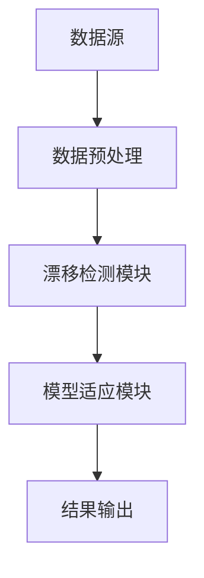

                 


# 实现AI Agent的概念漂移检测与适应

## 关键词：概念漂移检测，AI Agent，机器学习，模型适应，动态环境

## 摘要：  
概念漂移检测与适应是AI Agent在动态环境中保持性能和准确性的关键能力。本文系统地探讨了概念漂移的定义、类型及其对AI Agent的影响，详细分析了概念漂移检测的核心原理与算法，深入讲解了适应策略的设计与实现，并通过实际案例展示了如何在项目中应用这些方法。文章最后总结了最佳实践，为读者提供了从理论到实践的全面指导。

---

## 第一部分：概念漂移检测与适应的背景与基础

### 第1章：概念漂移的基本概念

#### 1.1 什么是概念漂移
概念漂移（Concept Drift）是指数据分布或目标与预测之间的关系在时间上发生变化的现象。这种变化可能导致模型性能下降，甚至失效。概念漂移可以分为以下三种类型：

1. **突然漂移（Sudden Drift）**：数据分布突然发生变化。
2. **逐步漂移（Incremental Drift）**：数据分布逐渐变化。
3. **周期性漂移（Seasonal Drift）**：数据分布随时间周期性变化。

概念漂移在现实场景中普遍存在，例如金融市场的波动、用户行为的变化等。

#### 1.2 AI Agent的基本概念
AI Agent是一种能够感知环境、自主决策并执行任务的智能实体。它可以分为以下几类：

1. **简单反射型AI Agent**：基于简单的规则做出反应。
2. **基于模型的反射型AI Agent**：利用内部模型进行决策。
3. **目标驱动型AI Agent**：根据目标选择行动。
4. **实用驱动型AI Agent**：通过优化实用函数做出决策。

AI Agent的核心在于其感知和决策能力，而概念漂移检测与适应是确保其长期稳定运行的关键。

#### 1.3 概念漂移检测与适应的重要性
概念漂移检测与适应对AI Agent的重要性体现在以下几个方面：

1. **模型性能维护**：及时检测漂移，防止模型性能下降。
2. **环境适应能力**：帮助AI Agent在动态环境中保持高效。
3. **可靠性提升**：通过适应机制，增强系统的鲁棒性。

---

## 第二部分：概念漂移检测的核心原理

### 第2章：概念漂移检测的核心原理

#### 2.1 统计学方法
统计学方法通过分析数据分布的变化来检测概念漂移。常用的方法包括：

1. **Kolmogorov-Smirnov检验**：用于比较两个分布是否相同。
2. **Z-检验**：用于均值差异的显著性检验。
3. **经验分布函数（ECDF）**：比较当前数据与历史数据的分布差异。

#### 2.2 机器学习方法
机器学习方法通过训练模型来检测概念漂移。常用的方法包括：

1. **One-Class SVM**：用于检测异常点。
2. **Isolation Forest**：基于树结构的异常检测。
3. **XGBoost**：通过特征重要性分析检测分布变化。

#### 2.3 深度学习方法
深度学习方法利用神经网络的特征提取能力来检测概念漂移。常用的方法包括：

1. **自动编码器（Autoencoder）**：通过重建误差检测数据变化。
2. **变分自编码器（VAE）**：通过 latent space 的变化检测概念漂移。
3. **对抗网络（GAN）**：通过判别器检测数据分布的变化。

---

## 第三部分：概念漂移适应的算法原理

### 第3章：概念漂移适应的算法框架

#### 3.1 数据预处理
数据预处理是概念漂移适应的第一步，包括数据清洗、特征选择和数据增强。

#### 3.2 模型更新
模型更新是适应的核心，常用方法包括：

1. **在线学习（Online Learning）**：实时更新模型参数。
2. **增量学习（Incremental Learning）**：逐步更新模型。
3. **模型重训练（Re-training）**：定期重新训练模型。

#### 3.3 性能评估
性能评估是验证适应效果的关键，常用指标包括准确率、召回率和F1分数。

---

## 第四部分：系统分析与架构设计

### 第4章：系统架构设计

#### 4.1 系统功能设计
系统功能包括数据采集、漂移检测、模型适应和结果输出。

#### 4.2 系统架构图
以下是系统架构的Mermaid图：



#### 4.3 接口设计
系统接口包括数据输入接口、模型更新接口和结果输出接口。

---

## 第五部分：项目实战

### 第5章：项目实战

#### 5.1 环境安装
需要安装的库包括numpy、pandas、scikit-learn和tensorflow。

#### 5.2 代码实现
以下是概念漂移检测的Python代码示例：

```python
from sklearn.datasets import make_classification
from sklearn.svm import OneClassSVM
import numpy as np

# 生成数据
X, y = make_classification(n_samples=100, n_features=2, n_informative=2, random_state=42)

# 训练模型
model = OneClassSVM()
model.fit(X)

# 检测概念漂移
new_X = np.random.randn(100, 2) * 2 + 3
score = model.score_samples(new_X)
print("Anomaly scores:", score)
```

#### 5.3 案例分析
通过实际案例分析，验证算法的有效性和适应性。

---

## 第六部分：最佳实践

### 第6章：总结与展望

#### 6.1 本章总结
概念漂移检测与适应是AI Agent在动态环境中保持高效的关键能力。

#### 6.2 注意事项
在实际应用中，需注意数据质量、模型选择和性能评估。

#### 6.3 拓展阅读
推荐阅读相关领域的最新研究和书籍，以进一步深入学习。

---

通过以上步骤，我们可以系统地实现AI Agent的概念漂移检测与适应，确保其在动态环境中的稳定性和高效性。

