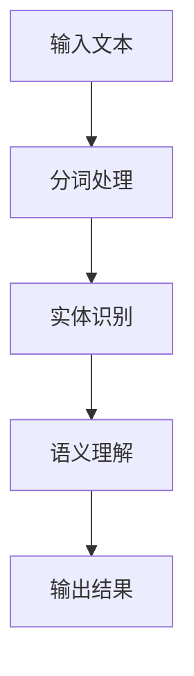
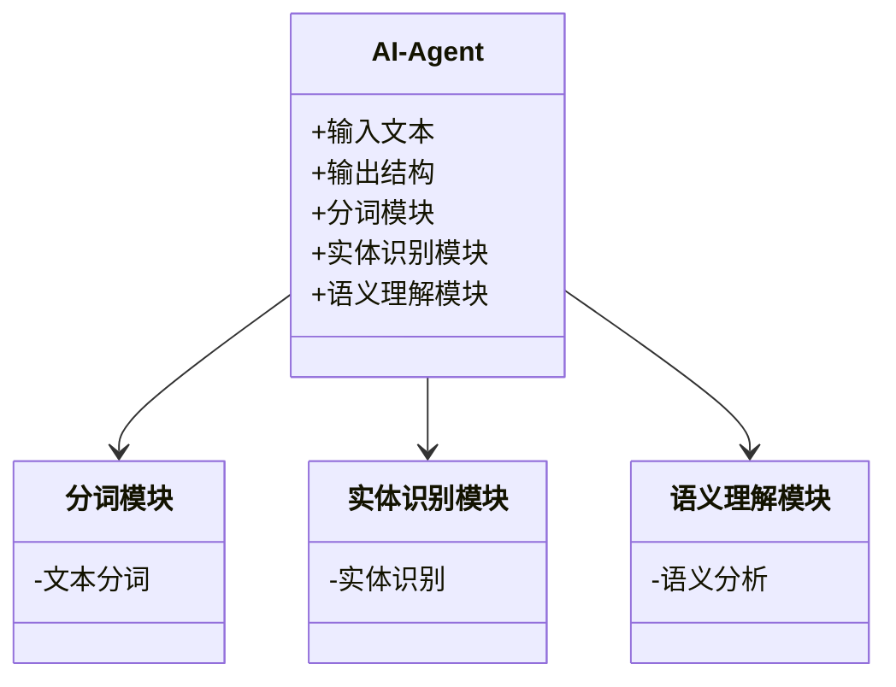
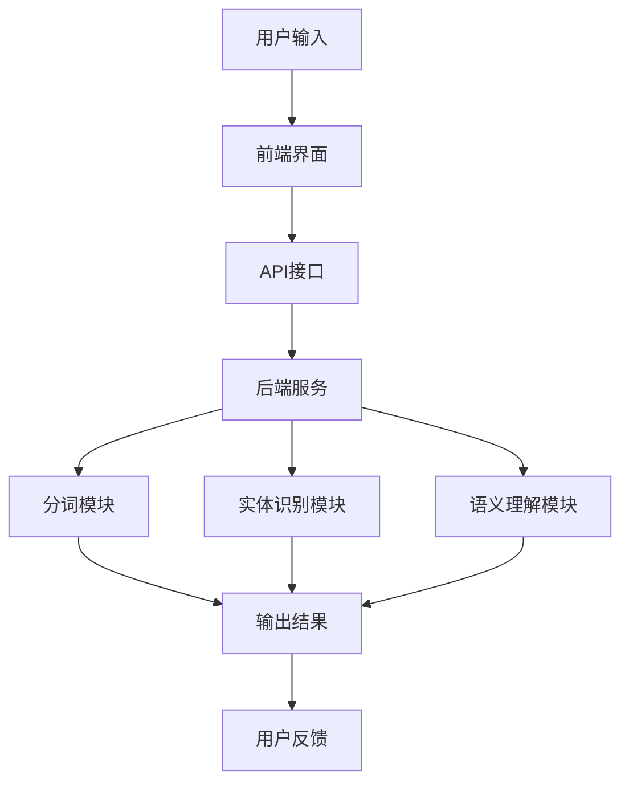
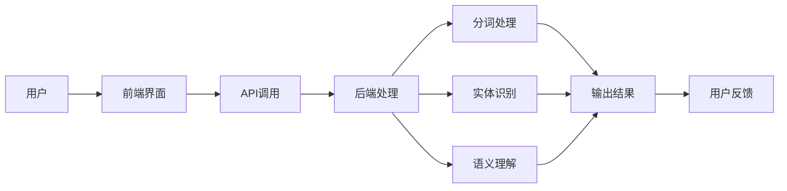

                 


# 实现AI Agent的自然语言理解能力

> 关键词：AI Agent, 自然语言理解, NLP, 深度学习, 机器学习, 计算机视觉

> 摘要：本文旨在通过系统性的介绍，探讨如何实现AI Agent的自然语言理解能力。文章从背景介绍、算法原理、系统架构设计、项目实战、性能优化与部署等多方面展开，结合实际案例，详细阐述了实现AI Agent自然语言理解能力的关键技术与方法。通过本文，读者将能够深入了解AI Agent自然语言理解的核心原理，并掌握实际应用中的关键技术。

---

## 目录

1. [AI Agent与自然语言理解的背景介绍](#1)
2. [自然语言理解的算法原理](#2)
3. [自然语言理解的系统架构设计](#3)
4. [自然语言理解的数据处理与模型训练](#4)
5. [自然语言理解的项目实战](#5)
6. [自然语言理解的性能优化与部署](#6)
7. [实现AI Agent自然语言理解能力的总结与展望](#7)

---

## 第1章: AI Agent与自然语言理解的背景介绍

### 1.1 问题背景
自然语言理解（NLU）是人工智能领域的重要分支，旨在使计算机能够理解人类的自然语言输入。AI Agent作为能够自主感知环境并执行任务的智能体，其自然语言理解能力是实现人机交互的关键。

#### 1.1.1 AI Agent的基本概念
AI Agent（人工智能代理）是指在计算机系统中，能够感知环境并采取行动以实现目标的实体。AI Agent可以是软件程序、智能助手或其他智能系统。

#### 1.1.2 自然语言理解的核心问题
NLU的核心问题包括文本的分词、实体识别、语义理解和意图识别。这些任务需要结合语言学知识和机器学习技术来实现。

#### 1.1.3 问题解决的必要性与重要性
实现AI Agent的自然语言理解能力，可以使其更好地与人类交互，理解用户需求，并提供更智能的服务。

### 1.2 核心概念与问题描述
#### 1.2.1 AI Agent的定义与特点
AI Agent具有自主性、反应性、目标导向性和社会性等特点。

#### 1.2.2 自然语言理解的定义与目标
NLU的目标是将自然语言文本转换为计算机可理解的结构化数据。

#### 1.2.3 问题的边界与外延
NLU的应用范围包括文本分类、信息提取、问答系统、对话系统等。

### 1.3 核心概念的联系与对比
#### 1.3.1 核心概念的属性特征对比表
| 特性 | AI Agent | 自然语言理解 |
|------|----------|--------------|
| 目标 | 执行任务 | 理解语言输入 |
| 输入 | 多种类型 | 文本、语音 |
| 输出 | 行为、决策 | 结构化数据 |

#### 1.3.2 ER实体关系图架构
```mermaid
graph TD
A[AI Agent] --> B[自然语言理解]
C[输入文本] --> B[自然语言理解]
D[输出结构] <-- B[自然语言理解]
```

### 1.4 本章小结
本章介绍了AI Agent和自然语言理解的基本概念、核心问题和实现目标，为后续章节奠定了基础。

---

## 第2章: 自然语言理解的算法原理

### 2.1 分词算法
#### 2.1.1 分词的基本原理
分词是将连续的文本分割成有意义的词语或短语的过程。

#### 2.1.2 基于统计的分词方法
使用词语频率和上下文信息进行分词，常用算法包括最大匹配法和最小生成法。

#### 2.1.3 基于深度学习的分词方法
使用神经网络模型（如LSTM）进行分词，具有较高的准确率。

### 2.2 实体识别算法
#### 2.2.1 实体识别的定义与目标
实体识别是识别文本中的命名实体（如人名、地名、组织名）的过程。

#### 2.2.2 基于规则的实体识别
通过预定义的规则和模式进行实体识别。

#### 2.2.3 基于模型的实体识别
使用机器学习模型（如CRF）进行实体识别。

### 2.3 语义理解算法
#### 2.3.1 语义理解的基本原理
语义理解是理解文本的语义含义，通常使用词嵌入（如Word2Vec）和句嵌入（如BERT）进行。

#### 2.3.2 基于规则的语义理解
通过预定义的语法规则和模板进行语义理解。

#### 2.3.3 基于深度学习的语义理解
使用 Transformer 模型（如BERT）进行语义理解。

### 2.4 算法流程图


### 2.5 本章小结
本章详细介绍了自然语言理解的核心算法，包括分词、实体识别和语义理解的原理和实现方法。

---

## 第3章: 自然语言理解的系统架构设计

### 3.1 系统功能设计
#### 3.1.1 领域模型设计


### 3.2 系统架构设计
#### 3.2.1 系统架构图


### 3.3 系统接口设计
#### 3.3.1 接口定义
系统提供RESTful API接口，用于接收自然语言输入并返回结构化输出。

#### 3.3.2 接口交互流程
用户通过前端界面发送输入文本，系统调用后端服务进行处理，并返回结果。

### 3.4 系统交互流程图


### 3.5 本章小结
本章详细介绍了自然语言理解系统的架构设计，包括功能模块划分和接口设计。

---

## 第4章: 自然语言理解的数据处理与模型训练

### 4.1 数据预处理
#### 4.1.1 数据清洗
去除噪声数据，如特殊字符、停用词等。

#### 4.1.2 数据标注
对文本数据进行分词和实体标注。

#### 4.1.3 数据转换
将文本数据转换为模型可接受的输入格式。

### 4.2 模型训练
#### 4.2.1 模型选择
选择适合任务的模型，如BERT、GPT等。

#### 4.2.2 模型训练代码
使用深度学习框架（如TensorFlow）进行模型训练。

#### 4.2.3 模型调优
通过调整超参数和优化策略提升模型性能。

### 4.3 本章小结
本章介绍了自然语言理解的数据处理和模型训练过程，为后续实现奠定了基础。

---

## 第5章: 自然语言理解的项目实战

### 5.1 项目介绍
本项目旨在实现一个具备自然语言理解能力的AI Agent，能够进行文本分类、实体识别和语义理解。

### 5.2 项目实现
#### 5.2.1 环境搭建
安装所需的依赖库，如Python、TensorFlow、jieba等。

#### 5.2.2 核心代码实现
```python
import jieba
from spacy.lang.zh import Chinese

# 分词示例
text = "今天天气很好"
words = jieba.lcut(text)
print(words)

# 实体识别示例
nlp = Chinese()
doc = nlp(text)
for ent in doc.ents:
    print(ent.text, ent.label_)
```

#### 5.2.3 系统集成
将各个模块集成到AI Agent中，实现完整的自然语言理解功能。

### 5.3 项目小结
本章通过实际项目展示了如何实现自然语言理解能力，帮助读者掌握关键技术。

---

## 第6章: 自然语言理解的性能优化与部署

### 6.1 性能优化
#### 6.1.1 模型压缩
通过知识蒸馏、剪枝等技术减少模型大小。

#### 6.1.2 推理优化
优化模型推理速度，减少计算资源消耗。

### 6.2 系统部署
#### 6.2.1 环境配置
配置生产环境，确保系统稳定运行。

#### 6.2.2 服务部署
使用Docker容器化部署，确保系统易于扩展和维护。

### 6.3 本章小结
本章介绍了如何优化自然语言理解系统的性能，并将其部署到生产环境。

---

## 第7章: 实现AI Agent自然语言理解能力的总结与展望

### 7.1 总结
本文详细介绍了实现AI Agent自然语言理解能力的关键技术，包括算法原理、系统架构设计和项目实战。

### 7.2 展望
未来的研究方向包括多模态自然语言理解、模型的可解释性以及实时性优化。

### 7.3 本章小结
总结全文，展望未来的研究方向。

---

通过本文的系统介绍，读者可以全面了解实现AI Agent自然语言理解能力的技术细节，并掌握实际应用中的关键技术。

