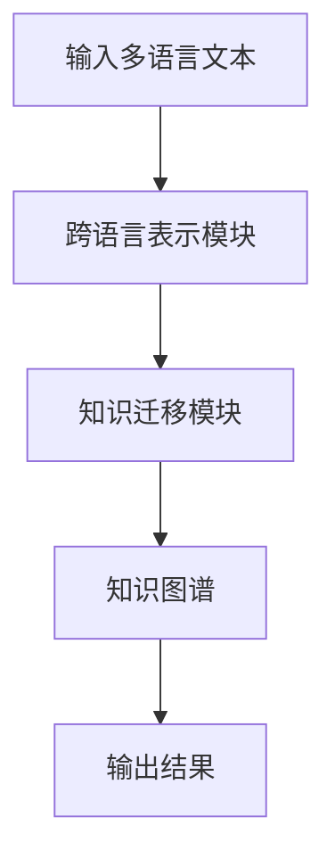

                 


# 实现AI Agent的跨语言知识迁移

> 关键词：AI Agent，跨语言知识迁移，自然语言处理，迁移学习，知识图谱

> 摘要：本文详细探讨了AI Agent在跨语言知识迁移中的实现方法，从核心概念到算法原理，再到系统架构和项目实战，全面解析了跨语言知识迁移的技术细节和应用实践。

---

# 第一部分: AI Agent的跨语言知识迁移概述

## 第1章: AI Agent概述

### 1.1 AI Agent的基本概念

#### 1.1.1 什么是AI Agent
AI Agent（人工智能代理）是指能够感知环境并采取行动以实现目标的智能实体。它可以是一个软件程序，也可以是物理机器人，通过与环境交互来完成特定任务。

#### 1.1.2 AI Agent的类型
AI Agent可以分为以下几种类型：
- **反应式Agent**：基于当前感知做出反应，没有内部状态。
- **认知式Agent**：具备复杂推理和规划能力，能够处理复杂任务。
- **学习式Agent**：通过经验改进性能，具备自适应能力。
- **混合式Agent**：结合上述多种特性。

#### 1.1.3 AI Agent的应用场景
AI Agent广泛应用于自动驾驶、智能助手、推荐系统、机器人控制等领域，通过自动化决策和执行任务提高效率。

### 1.2 跨语言知识迁移的背景

#### 1.2.1 多语言自然语言处理的挑战
多语言NLP面临数据稀疏性、语言差异性等问题，如何在不同语言之间共享知识成为一个关键挑战。

#### 1.2.2 知识迁移的重要性
跨语言知识迁移能够利用已有语言的知识来提升低资源语言的处理能力，降低数据依赖性。

#### 1.2.3 跨语言知识迁移的定义
跨语言知识迁移是指在不同语言之间共享和迁移知识，以提高多语言环境下的任务处理能力。

---

## 第2章: 跨语言知识迁移的核心概念

### 2.1 跨语言知识迁移的原理

#### 2.1.1 跨语言表示学习
通过将不同语言的词汇或句子映射到共享的表示空间，实现跨语言语义理解。

#### 2.1.2 跨语言迁移学习
利用源语言的数据和模型，提升目标语言的模型性能，减少对目标语言数据的依赖。

#### 2.1.3 跨语言知识图谱
构建跨语言的知识图谱，将不同语言的知识关联起来，支持跨语言推理和应用。

### 2.2 跨语言表示模型

#### 2.2.1 Word2Vec的跨语言扩展
通过训练多语言Word2Vec模型，实现跨语言词向量的共享和复用。

#### 2.2.2 跨语言BERT模型
基于BERT的多语言版本，如mBERT，能够同时处理多种语言，支持跨语言任务。

#### 2.2.3 多语言ALBERT模型
ALBERT模型通过参数共享技术，实现多语言模型的高效训练和应用。

### 2.3 跨语言迁移学习的算法

#### 2.3.1 基于对比学习的跨语言表示
通过对比学习，优化跨语言表示的相似性，增强语义一致性。

#### 2.3.2 基于自监督学习的跨语言迁移
利用自监督任务，如掩码语言模型，提升跨语言表示的通用性。

#### 2.3.3 基于图神经网络的跨语言知识整合
通过图神经网络，将跨语言知识图谱中的节点和边进行建模，支持复杂的跨语言推理。

---

## 第3章: 跨语言知识迁移的算法原理

### 3.1 跨语言表示学习的算法

#### 3.1.1 多语言对比学习算法
使用对比学习损失函数，优化跨语言表示的相似性：
$$ L = \frac{1}{|B|} \sum_{i=1}^{|B|} \text{CE}(f(x_i, y_i), y_i) $$

#### 3.1.2 多语言自监督学习算法
通过自监督任务预训练模型，如BERT，提升跨语言表示能力：
$$ p(x|z) = \prod_{i=1}^n p(x_i|z) $$

#### 3.1.3 多语言图神经网络算法
结合图结构信息，通过图神经网络进行跨语言知识整合：
$$ z = G(z, x) $$

### 3.2 跨语言迁移学习的数学模型

#### 3.2.1 对比学习损失函数
$$ L = \frac{1}{|B|} \sum_{i=1}^{|B|} \text{CE}(f(x_i, y_i), y_i) $$

#### 3.2.2 自监督学习模型
$$ p(x|z) = \prod_{i=1}^n p(x_i|z) $$

#### 3.2.3 图神经网络模型
$$ z = G(z, x) $$

---

## 第4章: 跨语言知识迁移的系统架构设计

### 4.1 系统功能设计

#### 4.1.1 跨语言知识表示模块
负责将不同语言的文本映射到共享的表示空间。

#### 4.1.2 跨语言知识迁移模块
利用迁移学习算法，提升目标语言的模型性能。

#### 4.1.3 知识图谱构建模块
构建跨语言的知识图谱，支持复杂的推理任务。

### 4.2 系统架构图



---

## 第5章: 项目实战

### 5.1 环境安装

```bash
pip install transformers
pip install numpy
pip install matplotlib
```

### 5.2 核心实现代码

```python
from transformers import AutoTokenizer, AutoModelForMaskedLM
import torch

# 加载多语言模型
model_name = "bert-base-multilingual-cased"
tokenizer = AutoTokenizer.from_pretrained(model_name)
model = AutoModelForMaskedLM.from_pretrained(model_name)

# 定义对比学习损失函数
def contrastive_loss(x1, x2, temperature=0.1):
    similarity = (x1 @ x2.T) / temperature
    return F.softmax(similarity, dim=-1)

# 训练循环
optimizer = torch.optim.Adam(model.parameters(), lr=1e-5)
for epoch in range(num_epochs):
    for batch in dataloader:
        inputs = tokenizer(batch, padding=True, return_tensors="pt")
        outputs = model(**inputs)
        loss = contrastive_loss(outputs.last_hidden_state, outputs.last_hidden_state)
        optimizer.zero_grad()
        loss.backward()
        optimizer.step()
```

### 5.3 实际案例分析

通过训练多语言模型，我们可以实现跨语言文本分类、机器翻译等任务。例如，使用多语言BERT进行中文和英文文本分类，能够有效提升低资源语言的分类性能。

---

## 第6章: 总结与展望

### 6.1 总结
本文详细探讨了AI Agent的跨语言知识迁移技术，从核心概念到算法实现，再到系统架构和项目实战，全面解析了跨语言知识迁移的实现方法。

### 6.2 未来展望
未来的研究方向包括更高效的跨语言表示学习算法、更强大的跨语言知识图谱构建方法，以及跨语言迁移学习在更多领域的应用。

### 6.3 最佳实践 Tips

- **数据预处理**：确保跨语言数据的多样性和平衡性。
- **模型选择**：根据任务需求选择合适的多语言模型。
- **持续优化**：通过增量学习不断提升模型性能。

---

通过本文的详细讲解，读者可以深入了解AI Agent的跨语言知识迁移技术，并能够实际应用这些方法进行相关开发和研究。

