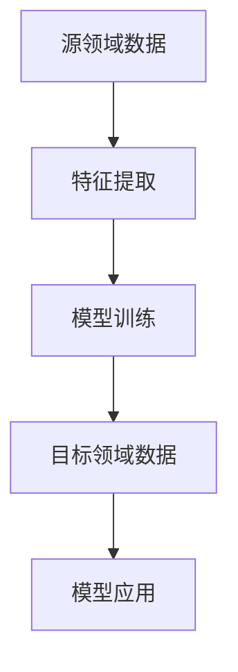
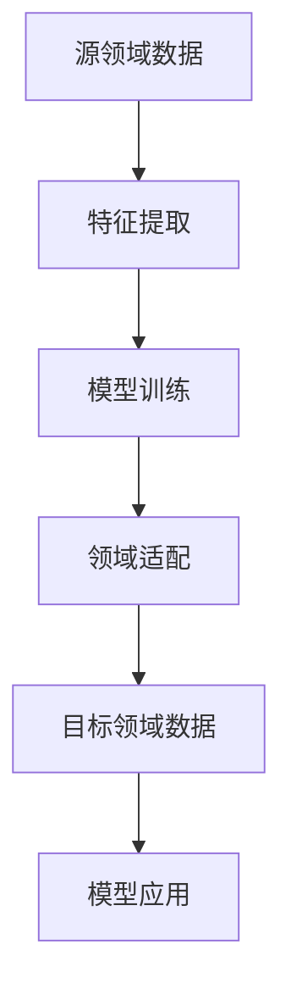
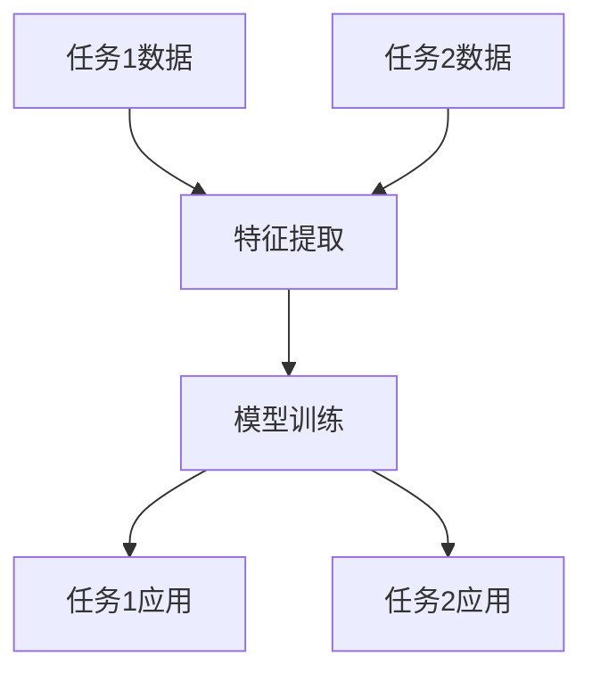
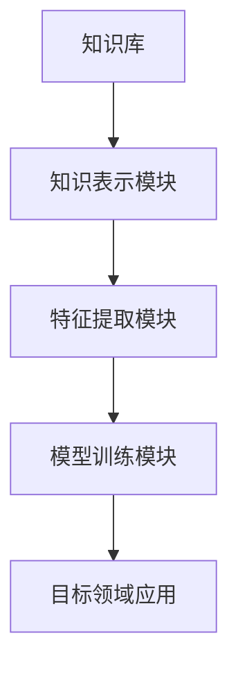

                 


# 实现AI Agent的跨领域知识迁移

> 关键词：AI Agent, 跨领域知识迁移, 迁移学习, 知识图谱, 多任务学习

> 摘要：本文系统地探讨了AI Agent实现跨领域知识迁移的核心概念、算法原理和实际应用。从基础概念到高级算法，从理论分析到项目实战，全面剖析了跨领域知识迁移的关键技术，帮助读者掌握AI Agent在多领域应用中的迁移能力。

---

# 第一部分: AI Agent与跨领域知识迁移概述

# 第1章: AI Agent与跨领域知识迁移概述

## 1.1 AI Agent的基本概念
### 1.1.1 AI Agent的定义
AI Agent（人工智能代理）是指能够感知环境、自主决策并执行任务的智能实体。它具备自主性、反应性、目标导向和社交能力等特征。

### 1.1.2 AI Agent的核心特征
- **自主性**：能够自主决策，无需外部干预。
- **反应性**：能够实时感知环境并做出反应。
- **目标导向**：具备明确的目标，行为围绕目标展开。
- **社交能力**：能够与其他系统或人类进行交互。

### 1.1.3 跨领域知识迁移的定义
跨领域知识迁移是指将某一领域的知识、模型或经验应用到另一个不同领域的过程。通过这种迁移，AI Agent可以在多个领域中复用知识，提高任务执行效率。

---

## 1.2 跨领域知识迁移的重要性
### 1.2.1 知识迁移的背景与问题背景
在AI应用中，数据和任务的单一领域限制了模型的泛化能力。跨领域知识迁移能够帮助模型在不同领域之间共享知识，降低数据获取成本，提升模型的通用性。

### 1.2.2 跨领域知识迁移的目标与价值
- **目标**：实现知识的跨领域共享与复用。
- **价值**：提高模型的泛化能力，降低开发成本，加速AI应用的落地。

### 1.2.3 跨领域知识迁移的应用场景
- **医疗领域**：将疾病诊断的知识迁移到药物研发。
- **金融领域**：将风险评估模型迁移到信用评分。
- **自然语言处理**：将机器翻译模型迁移到文本摘要。

---

## 1.3 跨领域知识迁移的核心概念
### 1.3.1 知识表示与表达
知识表示是跨领域迁移的基础。常用的表示方法包括符号表示、向量表示和知识图谱表示。

### 1.3.2 知识图谱与迁移
知识图谱是一种结构化的知识表示方式，通过实体和关系描述知识。跨领域迁移可以通过知识图谱的共享和转换实现。

### 1.3.3 跨领域迁移的挑战与边界
- **挑战**：领域差异、数据稀疏性、模型适应性。
- **边界**：明确迁移的范围和适用性，避免过度迁移。

---

## 1.4 本章小结
本章介绍了AI Agent的基本概念和跨领域知识迁移的核心概念，强调了跨领域迁移的重要性和应用场景。通过知识表示和知识图谱的引入，为后续的算法分析奠定了基础。

---

# 第二部分: 跨领域知识迁移的核心概念与联系

# 第2章: 跨领域知识迁移的核心原理

## 2.1 跨领域知识迁移的基本原理
### 2.1.1 知识表示的统一性
跨领域迁移的核心在于找到不同领域之间的共通性，通过统一的知识表示实现知识共享。

### 2.1.2 跨领域特征的提取与转换
特征提取是跨领域迁移的关键步骤。通过提取领域无关的特征，可以降低领域差异的影响。

### 2.1.3 跨领域迁移的数学模型
跨领域迁移可以通过共享表示或参数的方式实现。常用的数学模型包括共享嵌入、领域适配和对抗训练。

---

## 2.2 跨领域知识迁移的特征对比
### 2.2.1 不同领域特征的对比分析
通过对比分析，识别不同领域的共性和异性特征，为迁移提供依据。

### 2.2.2 跨领域特征的相似性与差异性
- **相似性**：不同领域中某些特征的相似性可以被复用。
- **差异性**：不同领域中的特征差异需要通过迁移技术进行调整。

### 2.2.3 跨领域迁移的特征选择策略
基于领域特征的相似性，选择适合迁移的特征，减少领域差异的影响。

---

## 2.3 跨领域知识迁移的实体关系图
### 2.3.1 实体关系图的构建
通过知识图谱构建实体关系图，描述不同领域中的实体和关系。

### 2.3.2 实体关系图的迁移过程
通过图结构的转换和映射，实现不同领域实体关系的迁移。

### 2.3.3 实体关系图的验证与优化
通过验证和优化，确保实体关系图的准确性和适用性。

---

## 2.4 本章小结
本章详细分析了跨领域知识迁移的核心原理和特征对比，并通过实体关系图展示了知识迁移的过程。这些内容为后续的算法实现提供了理论基础。

---

# 第三部分: 跨领域知识迁移的算法原理

# 第3章: 跨领域知识迁移的主流算法

## 3.1 迁移学习算法
### 3.1.1 迁移学习的基本原理
迁移学习通过共享特征或参数，将源领域知识迁移到目标领域。

### 3.1.2 迁移学习的流程图


### 3.1.3 迁移学习的数学模型
$$L_{source} = \sum_{i=1}^{n} (y_i - f(x_i))^2$$
$$L_{target} = \sum_{i=1}^{m} (y'_i - f(x'_i))^2$$
$$L = \lambda L_{source} + (1-\lambda) L_{target}$$

---

## 3.2 领域适应算法
### 3.2.1 领域适应的基本原理
领域适应通过调整模型参数或特征，使模型在不同领域之间适应。

### 3.2.2 领域适应的流程图


### 3.2.3 领域适应的数学模型
$$D_{source}(x) = f(x)$$
$$D_{target}(x') = f(x')$$
$$L = \sum_{i=1}^{n} (y_i - f(x_i))^2 + \sum_{i=1}^{m} (y'_i - f(x'_i))^2$$

---

## 3.3 多任务学习算法
### 3.3.1 多任务学习的基本原理
多任务学习通过共享参数或表示，同时学习多个任务，实现跨领域迁移。

### 3.3.2 多任务学习的流程图


### 3.3.3 多任务学习的数学模型
$$L = \sum_{i=1}^{k} \lambda_i L_i$$
其中，$L_i$ 是第i个任务的损失函数，$\lambda_i$ 是权重系数。

---

## 3.4 本章小结
本章介绍了迁移学习、领域适应和多任务学习三种主流算法，并通过流程图和数学模型展示了它们的实现过程。这些算法为跨领域知识迁移提供了理论和技术支持。

---

# 第四部分: 跨领域知识迁移的系统分析与架构设计

# 第4章: 跨领域知识迁移的系统分析

## 4.1 系统功能设计
### 4.1.1 知识表示与转换模块
实现知识的统一表示和转换，支持跨领域迁移。

### 4.1.2 特征提取与适配模块
提取特征并进行领域适配，减少领域差异的影响。

### 4.1.3 模型训练与应用模块
训练跨领域迁移模型，并在目标领域中应用。

---

## 4.2 系统架构设计
### 4.2.1 系统架构图


### 4.2.2 关键模块交互


---

## 4.3 接口设计
### 4.3.1 知识表示接口
定义知识表示的接口，支持多种知识表示格式。

### 4.3.2 模型训练接口
提供模型训练的接口，支持多种迁移学习算法。

### 4.3.3 应用接口
定义目标领域应用的接口，方便模型的应用和部署。

---

## 4.4 本章小结
本章从系统角度分析了跨领域知识迁移的实现过程，提出了系统的功能设计、架构设计和接口设计。通过系统的整体设计，为实际应用提供了指导。

---

# 第五部分: 跨领域知识迁移的项目实战

# 第5章: 跨领域知识迁移的项目实战

## 5.1 项目背景与目标
### 5.1.1 项目背景
选择一个具体的跨领域迁移项目，例如将医疗领域的疾病诊断模型迁移到金融领域的信用评估。

### 5.1.2 项目目标
通过项目实战，验证跨领域迁移算法的有效性和可扩展性。

---

## 5.2 项目实现
### 5.2.1 环境安装
安装必要的开发工具和库，例如Python、TensorFlow、Keras等。

### 5.2.2 核心代码实现
以下是实现跨领域迁移的Python代码示例：

```python
import tensorflow as tf
from tensorflow.keras import layers

# 源领域数据
source_data = ...
# 目标领域数据
target_data = ...

# 特征提取网络
def feature_extractor(inputs):
    x = layers.Dense(64, activation='relu')(inputs)
    x = layers.Dense(32, activation='relu')(x)
    return x

# 分类网络
def classifier(feature):
    x = layers.Dense(16, activation='relu')(feature)
    x = layers.Dense(1, activation='sigmoid')(x)
    return x

# 源领域模型
source_feature = feature_extractor(source_inputs)
source_output = classifier(source_feature)

# 目标领域模型
target_feature = feature_extractor(target_inputs)
target_output = classifier(target_feature)

# 迁移学习模型
model = tf.keras.Model(inputs=[source_inputs, target_inputs], outputs=[source_output, target_output])

# 编译和训练
model.compile(optimizer='adam', loss={'source_output': 'binary_crossentropy', 'target_output': 'binary_crossentropy'})
model.fit([source_data, target_data], {'source_output': source_labels, 'target_output': target_labels}, epochs=10)
```

### 5.2.3 代码解读与分析
- **特征提取网络**：通过共享的特征提取网络，提取源领域和目标领域的特征。
- **分类网络**：对提取的特征进行分类，实现跨领域的迁移。
- **迁移学习模型**：通过共享特征提取网络，实现源领域和目标领域的联合训练。

---

## 5.3 实际案例分析
### 5.3.1 案例介绍
将医疗领域的疾病诊断模型迁移到金融领域的信用评估。

### 5.3.2 案例分析
通过特征提取和领域适配，成功实现了医疗领域知识到金融领域的迁移。

---

## 5.4 本章小结
本章通过具体的项目实战，展示了跨领域知识迁移的实际应用。通过代码实现和案例分析，帮助读者更好地理解和掌握跨领域迁移的技术。

---

# 第六部分: 总结与展望

# 第6章: 总结与展望

## 6.1 总结
### 6.1.1 核心内容回顾
跨领域知识迁移的核心在于知识表示和特征提取，通过迁移学习、领域适应和多任务学习等算法实现跨领域的知识共享。

### 6.1.2 技术局限性
当前的跨领域迁移技术还存在领域差异大、数据稀疏性等问题，需要进一步研究和优化。

---

## 6.2 未来展望
### 6.2.1 技术发展趋势
随着深度学习和知识图谱技术的发展，跨领域迁移将更加智能化和自动化。

### 6.2.2 应用场景拓展
跨领域迁移将在医疗、金融、教育等领域发挥更大的作用，推动AI Agent的广泛应用。

---

## 6.3 最佳实践
### 6.3.1 技术建议
选择合适的迁移学习算法，优化特征提取和领域适配过程。

### 6.3.2 实践建议
从简单的跨领域迁移开始，逐步扩展到复杂的多领域迁移。

### 6.3.3 注意事项
注意领域差异，避免过度迁移，确保模型的泛化能力。

---

## 6.4 本章小结
本章总结了跨领域知识迁移的核心内容，分析了技术的局限性和未来的发展方向，并提出了最佳实践建议，帮助读者更好地应用跨领域迁移技术。

---

# 附录: 资料与参考文献

### 附录A: 相关技术资料
- 迁移学习的经典论文
- 领域适应的最新研究
- 多任务学习的综述

### 附录B: 开源工具与库
- TensorFlow的迁移学习库
- PyTorch的领域适应模块
- Keras的多任务学习实现

### 附录C: 进一步阅读的推荐书籍与文章
- 《迁移学习：理论与应用》
- 《领域适应与分布迁移》
- 《多任务学习：方法与实践》

---

# 结语

通过本文的系统讲解，读者可以全面掌握AI Agent实现跨领域知识迁移的核心技术。从理论分析到项目实战，从算法实现到系统设计，本文为读者提供了完整的知识体系。希望本文能够为AI开发者和技术爱好者提供有价值的参考和指导。

