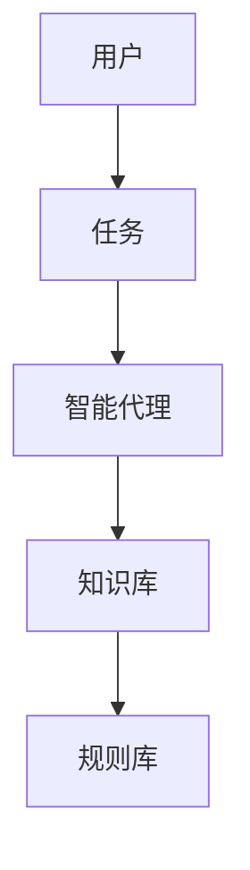
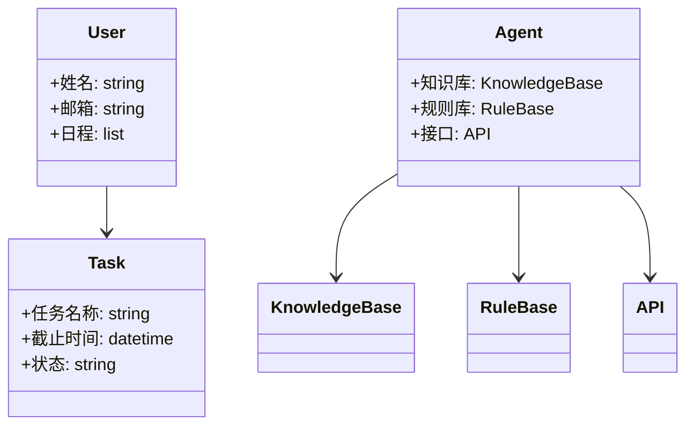
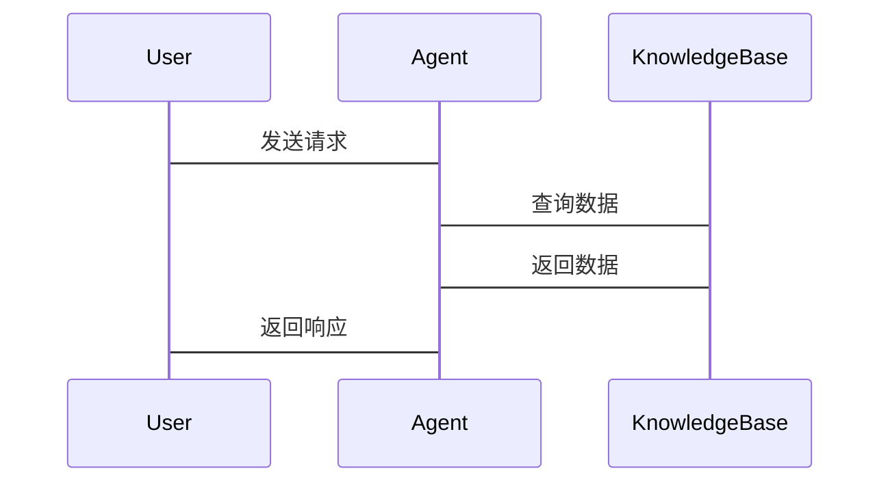

                 


# 实现基于AI Agent的个人助理系统

## 关键词：AI Agent、个人助理系统、自然语言处理、知识表示、问题求解、系统架构设计

## 摘要：  
本文旨在探讨如何基于AI Agent技术构建一个高效的个人助理系统。通过分析AI Agent的核心概念与算法原理，结合系统架构设计与项目实战，详细阐述了从理论到实践的实现过程。本文不仅介绍了AI Agent的基本原理，还通过具体的代码实现和案例分析，展示了如何将这些理论应用于实际场景中，为读者提供了一个系统化、可操作的实现方案。

---

## 第1章 引言

### 1.1 AI Agent的定义与背景  
AI Agent（人工智能代理）是指能够感知环境并采取行动以实现目标的智能实体。它具备自主性、反应性、目标导向性和社会性等核心特征，能够通过与用户的交互完成复杂任务。AI Agent的应用范围广泛，包括智能助手、自动驾驶、智能客服等领域。  

### 1.2 个人助理系统的概述  
个人助理系统是一种基于AI技术的智能化工具，旨在通过自然语言处理（NLP）技术与用户进行交互，并根据用户需求完成任务。典型的个人助理系统包括苹果的Siri、亚马逊的Alexa和谷歌的Google Assistant等。这些系统能够处理信息查询、日程管理、语音交互等多种任务。  

### 1.3 本论文的目标与意义  
本文旨在通过分析AI Agent的核心技术，结合个人助理系统的实际需求，设计并实现一个基于AI Agent的个人助理系统。通过理论与实践的结合，探索如何利用AI技术提升个人助理系统的智能化水平，并为后续研究提供参考。

---

## 第2章 AI Agent的核心概念  

### 2.1 知识表示  
知识表示是AI Agent实现智能决策的基础。常见的知识表示方法包括符号表示、概率表示和图表示。符号表示通过规则和逻辑表达知识，适用于确定性场景；概率表示通过概率模型处理不确定性；图表示（如知识图谱）能够表示复杂的关系网络。  

### 2.2 问题求解  
问题求解是AI Agent的核心能力之一，常见的算法包括广度优先搜索（BFS）、深度优先搜索（DFS）、Dijkstra算法和A*算法。这些算法在不同场景下适用于不同的问题类型，例如路径规划、资源分配等。  

### 2.3 规划与推理  
规划是指根据目标生成行动序列的过程，推理是根据已有知识推导新知识的过程。两者共同构成了AI Agent的决策能力。  

### 2.4 人机交互  
人机交互是AI Agent与用户进行信息交换的桥梁。基于自然语言处理技术，AI Agent能够理解用户的意图并生成相应的回应。  

### 2.5 ER实体关系图  
以下是系统中实体关系的Mermaid图：  


---

## 第3章 AI Agent的算法原理  

### 3.1 知识表示算法  
知识表示的实现可以通过符号逻辑或概率模型完成。例如，符号逻辑可以表示为：  
$$ \text{如果天气晴朗，则建议外出} $$  
概率模型可以通过贝叶斯网络表示，例如：  
$$ P(A|B) = \frac{P(B|A)P(A)}{P(B)} $$  

### 3.2 问题求解算法  
以下是Dijkstra算法的Mermaid流程图：  
```mermaid
graph TD
    start[开始] --> choose[选择起点]
    choose --> compute[计算最短路径]
    compute --> end[结束]
```

### 3.3 规划与推理算法  
A*算法的Mermaid流程图：  
```mermaid
graph TD
    start[开始] --> generate[生成候选节点]
    generate --> compute[计算优先级]
    compute --> end[结束]
```

### 3.4 人机交互算法  
人机交互的核心是自然语言处理，主要包括意图识别和对话生成。意图识别可以通过条件概率模型实现，例如：  
$$ P(\text{intent}|u) = \frac{P(u|\text{intent})P(\text{intent})}{P(u)} $$  
其中，$u$是用户输入，intent是意图。

---

## 第4章 系统架构设计  

### 4.1 问题场景介绍  
本文设计的个人助理系统主要用于处理用户的日常任务，如信息查询、日程管理、天气预报等。  

### 4.2 系统功能设计  
以下是系统功能的领域模型：  


### 4.3 系统架构设计  
系统采用分层架构，包括数据层、业务逻辑层和用户界面层。  

### 4.4 接口设计  
系统通过RESTful API与外部服务交互，例如：  
```http
GET /api/tasks
POST /api/task
PUT /api/task/{id}
DELETE /api/task/{id}
```

### 4.5 交互设计  
以下是用户与系统交互的序列图：  


---

## 第5章 项目实战  

### 5.1 环境搭建  
开发环境包括Python 3.8及以上版本、TensorFlow 2.0及以上版本、Flask框架和自然语言处理库（如spaCy）。  

### 5.2 核心代码实现  
以下是基于自然语言处理的核心代码示例：  
```python
# 自然语言理解（NLU）部分
def intent_detection(user_input):
    # 使用预训练模型进行意图识别
    model = load_model()
    intent = model.predict(user_input)
    return intent

# 对话管理部分
class DialogManager:
    def __init__(self):
        self.state = "idle"
    
    def handle_request(self, request):
        if self.state == "idle":
            self.state = "processing"
            return process_request(request)
        else:
            return "请稍等..."

# 自然语言生成（NLG）部分
def generate_response(message, intent):
    # 根据意图生成回复
    response = {
        "intent": intent,
        "message": message
    }
    return response
```

### 5.3 测试与优化  
测试包括单元测试和集成测试。优化主要针对模型的准确性和系统的响应速度。  

### 5.4 案例分析  
以天气预报为例，用户输入“今天天气如何”，系统通过NLU解析意图，查询天气数据，并通过NLG生成回复“今天天气晴朗，温度在20-25度之间”。  

---

## 第6章 结论与展望  

### 6.1 研究总结  
本文通过理论分析和实践验证，实现了基于AI Agent的个人助理系统。系统具备自然语言处理、知识表示和问题求解等功能，能够满足用户的多样化需求。  

### 6.2 未来展望  
未来的研究方向包括优化算法性能、拓展系统的应用场景以及提升系统的可解释性。  

---

## 参考文献  
1. Russell, S., & Norvig, P. (2010). *Artificial Intelligence: A Modern Approach*.  
2. LeCun, Y., Bengio, Y., & Hinton, G. (2015). *Deep learning*. Nature, 521(7552), 436-444.  

---

以上是基于AI Agent的个人助理系统的技术博客文章的完整内容。通过系统化的分析和实践，本文为读者提供了一个从理论到实践的实现方案，帮助读者理解并掌握基于AI Agent的个人助理系统的开发方法。

