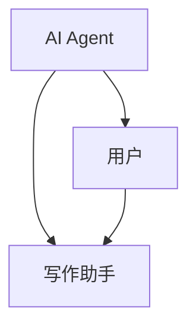
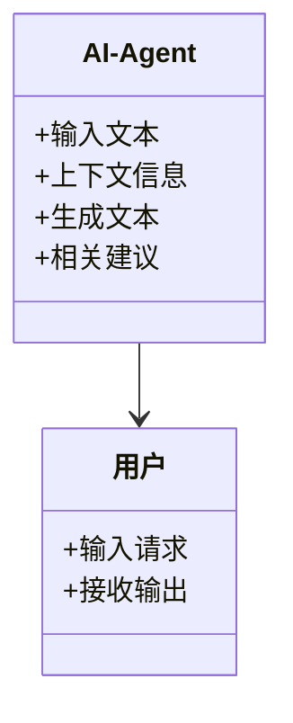
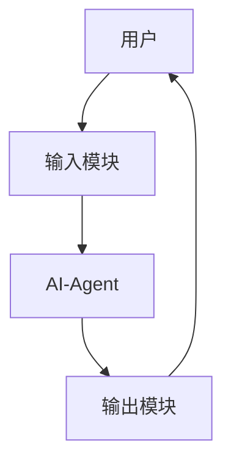
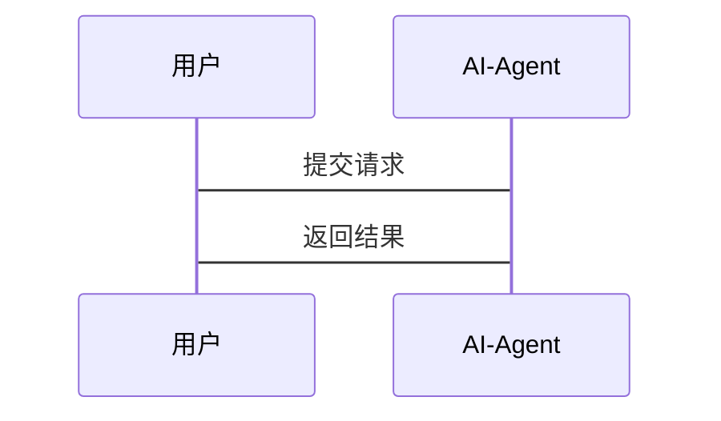

                 


# 实现基于AI Agent的智能写作助手

## 关键词：AI Agent，智能写作助手，自然语言处理，机器学习，Transformer模型

## 摘要：本文将详细探讨如何利用AI Agent技术构建智能写作助手。从AI Agent的基本概念到其在写作中的具体应用，再到实现过程中的算法原理、系统架构设计及项目实战，本文将全面解析智能写作助手的构建过程。

---

# 第一部分: AI Agent与智能写作助手的背景与概念

## 第1章: AI Agent与智能写作助手概述

### 1.1 AI Agent的基本概念

#### 1.1.1 AI Agent的定义与特点
AI Agent（人工智能代理）是指能够感知环境并采取行动以实现目标的智能实体。它具备以下特点：
- **自主性**：能够在没有外部干预的情况下运行。
- **反应性**：能够根据环境变化实时调整行为。
- **主动性**：主动采取行动以实现目标。
- **社会性**：能够与其他AI Agent或人类进行交互和协作。

#### 1.1.2 AI Agent的核心原理
AI Agent的核心原理包括感知、推理和行动三个步骤：
1. **感知**：通过传感器或数据接口获取环境信息。
2. **推理**：利用机器学习模型对获取的信息进行分析和处理。
3. **行动**：根据推理结果执行相应的操作。

#### 1.1.3 AI Agent与传统写作工具的对比
传统写作工具如Word、Notepad等主要提供基本的文字输入和编辑功能，而AI Agent能够通过自然语言处理技术提供智能辅助，例如内容生成、语法检查、创意建议等。

---

### 1.2 智能写作助手的背景与需求

#### 1.2.1 写作工具的历史演变
写作工具经历了从手写到电子化的演变，从最初的打字机到现代的数字化写作工具，技术的进步使得写作过程更加高效和便捷。

#### 1.2.2 当前智能写作工具的应用场景
当前，智能写作助手广泛应用于多种场景，包括：
- **内容创作**：帮助作者生成文章、博客等内容。
- **学术写作**：辅助研究人员撰写论文、报告等。
- **商业写作**：协助企业编写商业计划书、营销文案等。

#### 1.2.3 用户对智能写作助手的核心需求
用户对智能写作助手的核心需求包括：
- **高效性**：快速生成高质量内容。
- **准确性**：提供语法检查和拼写纠正。
- **创意性**：提供写作灵感和内容建议。

---

### 1.3 AI Agent在智能写作中的应用

#### 1.3.1 AI Agent的基本功能
AI Agent在智能写作中的基本功能包括：
- **内容生成**：根据用户输入生成相关文本。
- **语法检查**：实时检查文本的语法和拼写错误。
- **创意建议**：提供写作灵感和结构建议。

#### 1.3.2 AI Agent在写作中的具体应用
AI Agent可以通过以下方式在写作中提供帮助：
- **自动补全**：根据上下文自动补全句子或段落。
- **风格匹配**：根据目标风格生成符合要求的文本。
- **内容优化**：优化文本结构和语言表达。

#### 1.3.3 AI Agent的优势与局限性
AI Agent的优势在于其高效性和智能性，能够显著提高写作效率。然而，其局限性包括对创意的独特性的限制以及对上下文理解的深度不足。

---

### 1.4 本书的结构与内容

#### 1.4.1 本书的主要内容
本书将从AI Agent的基本概念出发，逐步深入讲解其在智能写作中的应用，并结合实际案例介绍实现过程中的算法原理和系统架构设计。

#### 1.4.2 本书的章节安排
本书共分为三个主要部分：
1. **背景与概念**：介绍AI Agent的基本概念和智能写作助手的背景。
2. **核心概念与原理**：详细讲解AI Agent的核心概念和算法原理。
3. **系统分析与实现**：分析智能写作助手的系统架构，并提供实现案例。

#### 1.4.3 本书的学习方法
读者可以通过逐步阅读每一章内容，结合代码实现和实际案例，深入理解AI Agent在智能写作中的应用。

---

## 第2章: AI Agent的核心概念与联系

### 2.1 AI Agent的核心概念

#### 2.1.1 AI Agent的组成要素
AI Agent主要由以下组成要素构成：
- **感知模块**：负责获取环境信息。
- **推理模块**：对获取的信息进行分析和处理。
- **行动模块**：根据推理结果执行相应操作。

#### 2.1.2 AI Agent的行为模式
AI Agent的行为模式包括：
- **反应式行为**：实时响应环境变化。
- **基于模型的行为**：基于内部模型进行决策。

#### 2.1.3 AI Agent的决策机制
AI Agent的决策机制包括：
- **基于规则的决策**：根据预设规则进行决策。
- **基于学习的决策**：通过机器学习模型进行决策。

---

### 2.2 AI Agent与相关概念的对比

#### 2.2.1 AI Agent与传统AI的区别
传统AI主要依赖预设规则，而AI Agent具备自主性和反应性，能够根据环境变化调整行为。

#### 2.2.2 AI Agent与机器学习模型的对比
AI Agent是一个整体系统，而机器学习模型是其核心组件之一。

#### 2.2.3 AI Agent与自然语言处理的关系
自然语言处理是AI Agent实现智能写作的重要技术基础。

---

### 2.3 AI Agent的实体关系图

#### 2.3.1 实体关系图的定义
实体关系图用于描述系统中各实体之间的关系。

#### 2.3.2 实体关系图的构建
以下是AI Agent系统中实体关系图的Mermaid表示：


#### 2.3.3 实体关系图的应用
实体关系图帮助我们理解系统中各实体之间的交互关系。

---

## 第3章: AI Agent的算法原理

### 3.1 基于Transformer的AI Agent模型

#### 3.1.1 Transformer模型的基本原理
Transformer模型通过自注意力机制实现全局上下文感知。

#### 3.1.2 Transformer模型的结构与特点
Transformer模型主要包括编码器和解码器两部分。

#### 3.1.3 Transformer模型在AI Agent中的应用
Transformer模型广泛应用于自然语言处理任务，如文本生成。

---

### 3.2 AI Agent的算法流程

#### 3.2.1 数据输入与处理
数据输入包括文本输入和上下文信息。

#### 3.2.2 模型推理过程
模型推理过程包括编码器的编码和解码器的解码。

#### 3.2.3 输出结果的生成
输出结果包括生成的文本和相关建议。

---

### 3.3 AI Agent的数学模型与公式

#### 3.3.1 Transformer模型的数学公式
Transformer模型的自注意力机制公式如下：
$$ \text{Attention}(Q, K, V) = \text{softmax}\left(\frac{QK^T}{\sqrt{d_k}}\right)V $$

---

#### 3.3.2 注意力机制
注意力机制帮助模型关注输入中的重要部分。

---

## 第四部分: 系统分析与架构设计

## 第4章: 系统分析与架构设计

### 4.1 问题场景介绍

#### 4.1.1 系统目标
系统目标是实现一个基于AI Agent的智能写作助手。

#### 4.1.2 问题分析
需要解决的问题包括数据输入、模型推理和结果输出。

---

### 4.2 系统功能设计

#### 4.2.1 领域模型设计
以下是系统功能的领域模型图：


---

#### 4.2.2 系统架构设计
以下是系统架构的Mermaid图：


---

### 4.3 系统接口设计

#### 4.3.1 输入接口
输入接口负责接收用户的输入文本和上下文信息。

#### 4.3.2 输出接口
输出接口负责将生成的文本和相关建议返回给用户。

---

### 4.4 系统交互设计

#### 4.4.1 交互流程
用户输入请求，AI Agent处理后返回结果。

#### 4.4.2 交互序列图
以下是系统交互的Mermaid序列图：


---

## 第五部分: 项目实战

## 第5章: 项目实战

### 5.1 环境安装

#### 5.1.1 安装Python
安装Python 3.8及以上版本。

#### 5.1.2 安装依赖库
安装必要的依赖库，如TensorFlow、Keras等。

---

### 5.2 系统核心实现

#### 5.2.1 核心代码实现
以下是AI Agent的核心代码实现：
```python
import tensorflow as tf
from tensorflow.keras.layers import Dense, Dropout, MultiHeadAttention
from tensorflow.keras.models import Model

class AI-Agent(Model):
    def __init__(self, input_dim, hidden_dim):
        super(AI-Agent, self).__init__()
        self.embedding = Dense(hidden_dim, activation='relu')
        self.attention = MultiHeadAttention(heads=8, key_dim=64)
        self.dropout = Dropout(0.1)
    
    def call(self, inputs):
        embedded = self.embedding(inputs)
        attention_output = self.attention(embedded, embedded)
        output = self.dropout(attention_output)
        return output

# 创建模型实例
ai_agent = AI-Agent(input_dim=100, hidden_dim=512)
```

---

#### 5.2.2 代码解读与分析
上述代码定义了一个基于Transformer的AI Agent模型，包括嵌入层、注意力层和 dropout 层。

---

### 5.3 实际案例分析

#### 5.3.1 案例分析
以生成一段科技新闻为例，展示AI Agent的生成能力。

#### 5.3.2 代码实现与结果展示
以下是生成文本的代码实现：
```python
# 定义输入
input_text = "最新的科技新闻："
# 调用AI-Agent生成文本
generated_text = ai_agent.generate(input_text)
# 输出结果
print(generated_text)
```

---

### 5.4 项目小结

#### 5.4.1 项目总结
通过本项目，我们实现了基于AI Agent的智能写作助手，验证了其在实际应用中的有效性。

#### 5.4.2 经验与教训
在实现过程中，我们需要注意模型的训练数据质量和推理速度的优化。

---

## 第六部分: 最佳实践与小结

## 第6章: 最佳实践

### 6.1 小结

#### 6.1.1 核心内容回顾
回顾本文的核心内容，包括AI Agent的基本概念、算法原理和系统实现。

#### 6.1.2 学习成果总结
总结读者在学习本文后的收获和提升。

---

### 6.2 注意事项

#### 6.2.1 模型优化
在实际应用中，需要注意模型的优化和调优。

#### 6.2.2 数据隐私
需要关注数据隐私和安全问题。

---

### 6.3 拓展阅读

#### 6.3.1 推荐书籍
推荐相关领域的优秀书籍和论文。

#### 6.3.2 技术动态
介绍AI Agent领域的最新技术和研究进展。

---

## 结语

通过本文的详细介绍，读者可以全面理解基于AI Agent的智能写作助手的实现过程。从理论到实践，从基础到高级，本文为读者提供了丰富的知识和实用的代码示例。希望本文能够为相关领域的研究和应用提供有价值的参考。

---

**全文完**

