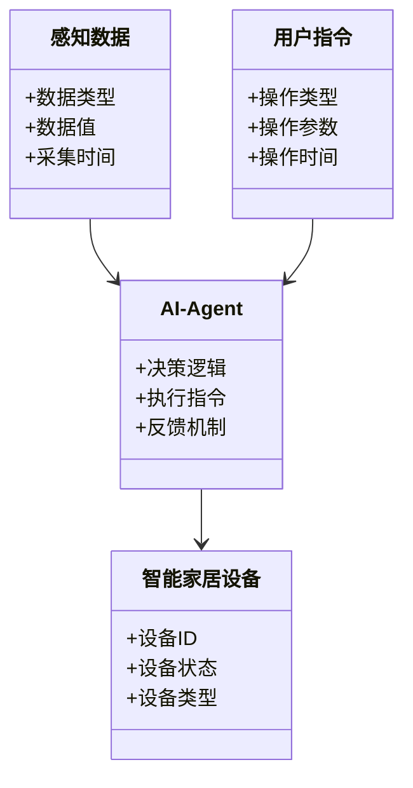

                 


# 实现基于AI Agent的智能家居控制系统

> 关键词：AI Agent, 智能家居, 物联网, 强化学习, 系统架构

> 摘要：本文详细探讨了基于AI Agent的智能家居控制系统的设计与实现。从AI Agent的基本概念到其在智能家居中的具体应用，从系统架构设计到实际案例分析，全面解析了如何利用AI Agent提升智能家居的智能化水平，为读者提供了一套完整的解决方案和实施路径。

---

## 第一部分: AI Agent与智能家居控制系统概述

### 第1章: 背景介绍与核心概念

#### 1.1 问题背景
智能家居的概念早已不是新鲜事物，但传统的智能家居控制系统往往依赖于固定的预设模式，难以适应用户行为和环境变化的动态需求。例如，当用户不在家时，系统无法根据天气变化自动调节室内温湿度，或在夜晚根据家庭成员的作息自动调整照明亮度。这些问题凸显了传统智能家居系统在灵活性和智能化方面的不足。

#### 1.2 核心概念与联系
- **AI Agent（智能体）**：AI Agent是一种能够感知环境、自主决策并执行动作的智能实体。在智能家居中，AI Agent可以用于实时监控家庭环境并根据数据做出决策。
- **智能家居系统**：由多个智能设备和传感器组成的系统，能够通过物联网技术实现设备之间的互联互通和协同控制。

#### 1.3 系统架构与流程
- **感知层**：通过传感器收集环境数据，如温度、湿度、光照强度等。
- **决策层**：AI Agent根据感知数据和用户需求制定控制策略。
- **执行层**：根据决策结果，驱动智能家居设备执行相应的动作。

### 第2章: AI Agent的核心原理

#### 2.1 感知与信息处理
- **感知模块**：AI Agent通过传感器获取环境数据，如温度、光线、声音等。
- **数据预处理**：对获取的数据进行清洗、归一化等处理，确保数据的可用性。

#### 2.2 决策与规划
- **决策算法**：基于强化学习的决策算法，通过不断试错优化控制策略。
- **基于规则的决策**：根据预设规则做出决策，如“如果室内温度超过25℃，则开启空调”。

#### 2.3 执行与反馈
- **执行机制**：将决策结果转化为具体的设备控制指令，如“开启空调并设置温度为22℃”。
- **反馈机制**：设备执行动作后，将反馈信息传递给AI Agent，用于后续决策优化。

---

## 第二部分: 基于AI Agent的智能家居控制系统设计

### 第3章: 系统需求分析

#### 3.1 功能需求
- **设备管理**：支持多种智能家居设备的接入与管理，如智能灯泡、智能空调、智能门锁等。
- **场景控制**：支持自定义场景模式，如离家模式、回家模式、睡眠模式等。
- **用户交互**：提供友好的用户界面，支持语音控制、手机APP控制等方式。
- **数据管理**：记录设备运行数据和用户操作日志，支持数据查询和分析。

### 第4章: 系统架构设计

#### 4.1 系统架构
- **设备层**：包括各种智能家居设备，如智能灯泡、智能空调等。
- **感知层**：通过传感器收集环境数据，如温度、光照强度等。
- **决策层**：AI Agent根据感知数据和用户需求制定控制策略。
- **控制层**：将决策结果转化为具体的设备控制指令。
- **用户界面层**：提供与用户交互的界面，如手机APP、语音助手等。

#### 4.2 实体关系图


### 第5章: 系统实现

#### 5.1 环境搭建
- **开发工具**：安装Python、TensorFlow、OpenCV等开发库。
- **硬件设备**：接入智能家居设备，如智能灯泡、智能空调等。
- **物联网平台**：选择合适的物联网平台，如MQTT协议。

#### 5.2 AI Agent实现
```python
class AI-Agent:
    def __init__(self):
        self.sensors = []
        self.devices = []
        self.rules = {}

    def perceive(self):
        # 获取传感器数据
        data = [s感知数据 for s in self.sensors]
        return data

    def decide(self, data):
        # 根据数据和规则做出决策
        action = self.rules.apply(data)
        return action

    def execute(self, action):
        # 执行动作
        device = self.devices.select(action)
        device 控制动作
```

#### 5.3 数学模型与公式
- **Q-learning算法**：用于强化学习的决策过程。
  $$ Q(s, a) = Q(s, a) + \alpha \times [r + \gamma \times \max Q(s', a) - Q(s, a)] $$
  其中：
  - \( Q(s, a) \)：状态s下动作a的Q值
  - \( \alpha \)：学习率
  - \( r \)：奖励值
  - \( \gamma \)：折扣因子
  - \( s' \)：下一步状态

### 第6章: 实际案例分析

#### 6.1 案例背景
假设用户希望在晚上10点后自动关闭客厅的主灯，并开启夜灯。传统的智能家居系统可能需要用户手动设置定时任务，而基于AI Agent的系统可以根据用户的作息习惯自动调整。

#### 6.2 系统实现
```python
# 示例代码：AI Agent自动调整灯光
from datetime import datetime

class 灯光控制AI-Agent:
    def __init__(self):
        self.当前时间 = datetime.now().time()

    def 决策(self):
        if self.当前时间.hour >= 22 or self.当前时间.hour < 6:
            return "关闭主灯，开启夜灯"
        else:
            return "保持当前灯光状态"

    def 执行(self, 指令):
        if 指令 == "关闭主灯，开启夜灯":
            self.主灯关闭()
            self.夜灯开启()
        elif 指令 == "保持当前灯光状态":
            pass

    def 运行(self):
        while True:
            指令 = self.决策()
            self.执行(指令)
            time.sleep(60)  # 每分钟检查一次
```

#### 6.3 案例分析
- **决策逻辑**：AI Agent根据当前时间判断是否需要调整灯光。
- **执行逻辑**：根据决策结果，关闭主灯并开启夜灯，或保持当前状态。
- **优化**：通过强化学习不断优化决策策略，使灯光控制更加符合用户的实际需求。

### 第7章: 系统优化与扩展

#### 7.1 系统优化
- **性能优化**：优化传感器数据采集频率，减少不必要的数据传输。
- **算法优化**：改进强化学习算法，加快决策速度，提高决策准确率。

#### 7.2 功能扩展
- **多设备协同**：实现多个设备的协同控制，如联动空调、窗帘等。
- **用户个性化**：根据用户的使用习惯自动生成个性化场景模式。

#### 7.3 安全性提升
- **数据加密**：对传输的数据进行加密处理，防止数据泄露。
- **权限管理**：严格控制设备的访问权限，防止未经授权的设备接入。

---

## 第三部分: 总结与展望

### 第8章: 总结
基于AI Agent的智能家居控制系统通过实时感知环境、自主决策和执行动作，显著提升了智能家居的智能化水平。本文详细介绍了AI Agent的核心原理、系统架构设计、实现方法和实际案例，为读者提供了一套完整的解决方案。

### 第9章: 展望
未来，随着AI技术的不断进步，智能家居系统将更加智能化和个性化。AI Agent将不仅仅局限于单个设备的控制，而是能够实现整个家庭的智能化管理，甚至与其他智能家居系统协同工作，构建更加智能和高效的居住环境。

---

## 参考文献
- 强化学习相关文献
- 物联网相关文献
- 智能家居系统设计相关文献

---

通过本文的详细讲解，读者可以全面了解基于AI Agent的智能家居控制系统的设计与实现过程，并能够将其应用到实际项目中，推动智能家居技术的发展与进步。

