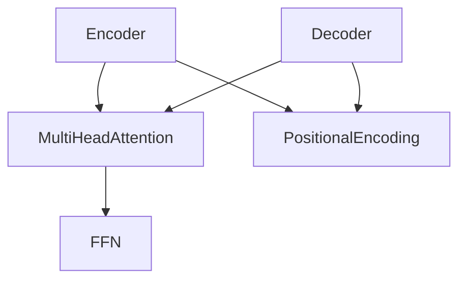
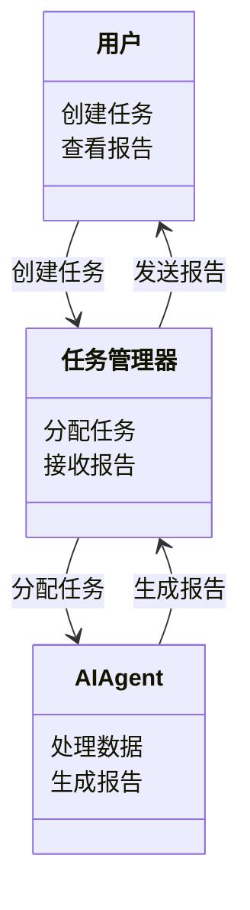

                 


# 实现基于AI Agent的智能情报分析系统

> 关键词：AI Agent，情报分析，自然语言处理，机器学习，智能系统，系统架构

> 摘要：本文详细介绍了基于AI Agent的智能情报分析系统的实现过程。从背景和概述开始，逐步深入探讨了系统的核心概念、算法原理、系统架构设计，以及具体的项目实战。通过丰富的实例和详细的代码解析，展示了如何利用自然语言处理和机器学习技术构建高效的智能情报分析系统。

---

## 第一部分: 背景与概述

### 第1章: 基于AI Agent的智能情报分析系统概述

#### 1.1 AI Agent的基本概念与定义

- **1.1.1 什么是AI Agent**  
  AI Agent（人工智能代理）是指能够感知环境并采取行动以实现目标的智能实体。它可以是一个软件程序、一个机器人，甚至是一个复杂的系统。

- **1.1.2 AI Agent的核心特征**  
  AI Agent具备以下核心特征：  
  - **自主性**：能够在没有外部干预的情况下自主运行。  
  - **反应性**：能够感知环境并实时做出反应。  
  - **目标导向性**：所有行为都围绕特定目标展开。  
  - **学习能力**：能够通过经验改进性能。

- **1.1.3 智能情报分析系统的定义**  
  智能情报分析系统是一种利用AI Agent技术，对海量数据进行处理、分析和决策支持的系统。它能够从非结构化数据中提取有价值的信息，并为用户提供决策支持。

#### 1.2 智能情报分析系统的背景与意义

- **1.2.1 当前情报分析的挑战**  
  - 数据量大：现代情报分析面对的是海量数据，包括文本、图像、视频等多种形式。  
  - 数据复杂性高：数据来源多样化，且数据之间可能存在复杂的关联关系。  
  - 分析效率低：传统的人工分析方式效率低下，难以应对实时性要求高的场景。

- **1.2.2 AI Agent在情报分析中的作用**  
  AI Agent能够快速处理海量数据，发现隐藏在数据中的模式和关联，帮助用户做出更明智的决策。此外，AI Agent还能够实时监控数据流，及时发现异常情况。

- **1.2.3 智能情报分析系统的价值**  
  - 提高情报分析效率。  
  - 增强决策的准确性。  
  - 实现情报分析的自动化和智能化。

#### 1.3 系统设计的基本原则

- **1.3.1 模块化设计**  
  系统应划分为多个功能模块，每个模块负责特定的任务，如数据采集、数据处理、数据分析等。

- **1.3.2 高可用性**  
  系统必须具备高可用性，确保在部分模块出现故障时，整个系统仍能正常运行。

- **1.3.3 可扩展性**  
  系统应具备良好的扩展性，能够方便地添加新的功能模块或升级现有功能。

### 第2章: 智能情报分析系统的系统设计

#### 2.1 系统设计的背景与目标

- **2.1.1 系统设计的背景**  
  随着数据量的急剧增加，传统的手动情报分析方式已经难以满足需求。引入AI Agent技术，能够显著提高情报分析的效率和准确性。

- **2.1.2 系统设计的目标**  
  - 提供高效的海量数据分析能力。  
  - 实现实时数据监控和异常检测。  
  - 提供智能化的决策支持。

#### 2.2 系统设计的核心要素

- **2.2.1 数据来源**  
  数据来源多样化，包括文本文件、数据库、网络流等。

- **2.2.2 数据处理**  
  数据预处理是关键步骤，包括数据清洗、数据转换等。

- **2.2.3 数据分析**  
  利用自然语言处理和机器学习技术对数据进行分析，提取有价值的信息。

- **2.2.4 结果输出**  
  将分析结果以用户友好的形式展示，如文本报告、可视化图表等。

#### 2.3 系统设计的关键技术

- **2.3.1 自然语言处理**  
  自然语言处理技术用于对文本数据进行分词、实体识别、情感分析等操作。

- **2.3.2 机器学习**  
  机器学习算法用于数据分类、聚类、回归等任务，帮助发现数据中的模式和关联。

- **2.3.3 数据可视化**  
  数据可视化技术用于将分析结果以图表形式展示，方便用户理解和分析。

---

## 第二部分: 核心概念与联系

### 第3章: AI Agent的核心概念与联系

#### 3.1 核心概念的原理

- AI Agent通过感知环境和采取行动来实现目标。在情报分析系统中，AI Agent能够实时监控数据流，识别异常情况，并提供预警。

#### 3.2 核心概念的特征对比

以下是AI Agent与传统自动化的特征对比：

| **特征**       | **AI Agent**          | **传统自动化**         |
|-----------------|-----------------------|------------------------|
| **自主性**       | 高                   | 低                     |
| **适应性**       | 高                   | 低                     |
| **决策能力**     | 强                   | 无                     |
| **学习能力**     | 强                   | 无                     |

#### 3.3 ER实体关系图架构

以下是系统的ER实体关系图：

```mermaid
er
actor: 用户
agent: AI Agent
task: 任务
data: 数据
report: 报告

actor --> task: 创建任务
task --> agent: 分配给AI Agent
agent --> data: 处理数据
data --> report: 生成报告
actor <-- report: 查看报告
```

---

### 第4章: AI Agent的算法原理

#### 4.1 算法原理的概述

AI Agent的核心算法包括生成式AI和强化学习。生成式AI用于生成文本，强化学习用于决策优化。

#### 4.2 生成式AI的原理

生成式AI的典型模型是Transformer。以下是Transformer的结构：



其中，`FFN`表示前馈神经网络。

#### 4.3 强化学习的原理

强化学习的典型算法是Q-learning，其数学表达式为：

$$ Q(s, a) = r + \gamma \max_{a'} Q(s', a') $$

其中，\( Q(s, a) \) 表示状态 \( s \) 下采取动作 \( a \) 的价值，\( r \) 是奖励，\( \gamma \) 是折扣因子。

---

### 第5章: 系统架构设计

#### 5.1 系统功能设计

以下是系统的功能模块：



#### 5.2 系统架构设计

以下是系统的架构图：


---

### 第6章: 项目实战

#### 6.1 环境安装

安装所需的Python包：

```bash
pip install numpy
pip install pandas
pip install transformers
pip install pytorch
```

#### 6.2 核心代码实现

以下是生成式AI的实现代码：

```python
import torch
from transformers import AutoModelForCausalLM, AutoTokenizer

model = AutoModelForCausalLM.from_pretrained("gpt2")
tokenizer = AutoTokenizer.from_pretrained("gpt2")

inputs = tokenizer("生成一段关于...", return_tensors="pt")
outputs = model.generate(inputs.input_ids, max_length=50)
print(tokenizer.decode(outputs[0], skip_special_tokens=True))
```

---

## 第三部分: 总结与展望

### 第7章: 总结与展望

#### 7.1 最佳实践 tips

- 确保数据质量，进行充分的数据清洗。  
- 定期更新模型，保持系统的高性能。  
- 提供良好的用户界面，方便用户操作。

#### 7.2 小结

本文详细介绍了基于AI Agent的智能情报分析系统的实现过程，从背景到设计，从算法到项目实战，全面展示了系统的构建过程。

#### 7.3 注意事项

- 数据隐私问题需要特别注意。  
- 系统的可扩展性和高可用性需要在设计阶段充分考虑。

#### 7.4 拓展阅读

- 《深度学习》—— Ian Goodfellow  
- 《自然语言处理入门》—— 练出超

