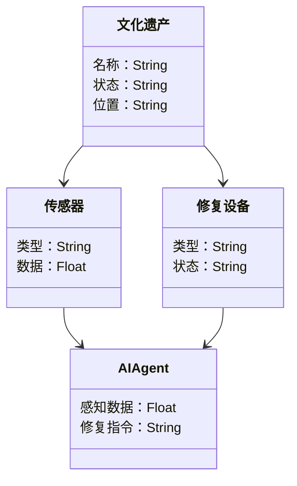
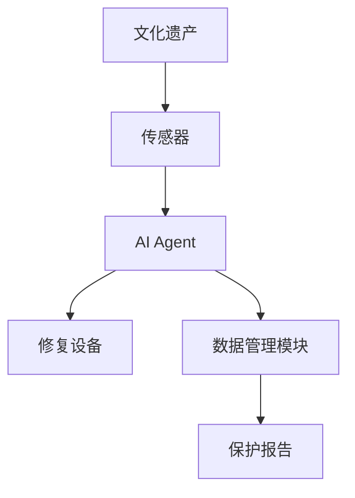
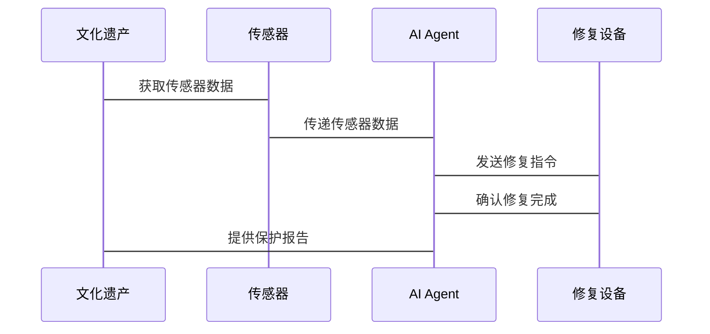

                 


# 实现基于AI Agent的智能文化遗产保护系统

> **关键词**：文化遗产保护，AI Agent，智能系统，算法原理，系统架构设计

> **摘要**：本文探讨了基于AI Agent的智能文化遗产保护系统的设计与实现。文章首先分析了文化遗产保护的现状与挑战，引出了AI Agent技术的应用优势。接着，详细阐述了AI Agent的核心概念、算法原理及其在文化遗产保护中的应用场景。通过系统架构设计和实际案例分析，展示了如何利用AI Agent实现文化遗产保护的智能化。最后，本文总结了系统的优势与不足，并提出了改进建议与未来展望。

---

## 第一部分：背景与核心概念

### 第1章：文化遗产保护的智能化需求

#### 1.1 问题背景与挑战
文化遗产是人类文明的瑰宝，包括建筑、艺术品、文献等。然而，文化遗产的保护面临着诸多挑战：
- **资源有限**：文化遗产保护需要大量的人力、物力和财力支持，但资源分配不均，难以覆盖所有需要保护的对象。
- **保护不周**：传统保护方式依赖人工检查和记录，存在效率低下、覆盖面有限的问题。
- **环境变化**：文化遗产受自然环境和人为活动的影响，如气候变化、污染、盗窃等，导致损坏或流失。

#### 1.2 AI Agent在文化遗产保护中的应用
AI Agent（智能体）是一种能够感知环境并采取行动以实现目标的实体。在文化遗产保护中，AI Agent可以用于监测、修复和管理文化遗产。

##### 1.2.1 AI Agent的基本概念与特点
- **自主性**：AI Agent能够自主决策，无需人工干预。
- **反应性**：能够实时感知环境变化并做出反应。
- **协作性**：多个AI Agent可以协同工作，共同完成复杂任务。

##### 1.2.2 AI Agent在文化遗产保护中的优势
- **高效性**：AI Agent可以快速处理大量数据，提高保护效率。
- **准确性**：通过机器学习算法，AI Agent能够精准识别文化遗产的损坏情况。
- **可扩展性**：AI Agent可以轻松扩展，适应不同的文化遗产保护场景。

#### 1.3 问题解决思路
通过引入AI Agent技术，我们可以实现文化遗产保护的智能化：
- **实时监测**：利用传感器和摄像头，AI Agent实时监测文化遗产的状态。
- **智能修复**：AI Agent可以根据监测结果，自动启动修复流程。
- **数据管理**：AI Agent可以整合多源数据，生成详细的保护报告。

### 第2章：基于AI Agent的智能文化遗产保护系统

#### 2.1 系统核心概念与架构
- **核心概念**：系统由多个AI Agent组成，每个AI Agent负责不同的任务，如监测、修复、管理等。
- **实体关系图（ER图）**：通过ER图展示系统中各实体之间的关系，包括文化遗产、传感器、修复设备等。

##### 2.1.1 实体关系图（ER图）
```mermaid
erDiagram
    boundary 守护者{}{
        owner 文物保护机构
        participant 传感器
        participant 修复设备
    }
    participant 文物保护机构{}{
        role 管理员
        role 分析师
    }
    participant 传感器{}{
        attribute 感知数据
        operation 采集数据
    }
    participant 修复设备{}{
        attribute 设备状态
        operation 启动修复
    }
```

#### 2.2 AI Agent与文化遗产保护的关联
- **AI Agent的角色**：AI Agent作为系统的智能核心，负责协调各个设备和模块的工作。
- **系统功能与AI Agent的交互**：AI Agent接收传感器数据，分析并生成修复指令，控制修复设备执行任务。

---

## 第二部分：算法原理与数学模型

### 第3章：AI Agent的核心算法原理

#### 3.1 多智能体系统（MAS）原理
多智能体系统由多个智能体组成，通过协作完成复杂任务。

##### 3.1.1 多智能体系统的通信与协作机制
- **通信机制**：智能体之间通过消息传递进行通信。
- **协作机制**：通过协商和协调，确保各个智能体协同工作。

##### 3.1.2 多智能体系统的协调与冲突解决
- **协调算法**：基于协商的协调算法，确保智能体之间的目标一致。
- **冲突解决**：通过优先级排序和资源分配，解决智能体之间的冲突。

#### 3.2 强化学习与决策树算法
强化学习是一种通过试错学习的算法，适用于动态环境中的决策问题。

##### 3.2.1 强化学习的基本原理
- **状态空间**：系统当前的状态。
- **动作空间**：智能体可以执行的动作。
- **奖励函数**：智能体执行动作后获得的奖励。

##### 3.2.2 决策树算法的实现流程
- **数据收集**：收集文化遗产保护的相关数据。
- **特征选择**：选择影响文化遗产保护的关键特征。
- **树构建**：基于特征和数据，构建决策树。

#### 3.3 算法的数学模型与公式
- **Q-learning算法公式**
  $$ Q(s, a) \leftarrow Q(s, a) + \alpha \left[r + \gamma \max Q(s', a') - Q(s, a)\right] $$
- **策略梯度算法公式**
  $$ \nabla \theta \leftarrow \frac{1}{\beta} \sum_{i=1}^{N} \nabla \log \pi_{\theta}(a_i | s_i) Q(s_i, a_i) $$

### 第4章：数学模型与公式

#### 4.1 多智能体系统的数学模型
- **多智能体系统的状态表示**
  $$ s = (s_1, s_2, ..., s_n) $$
- **多智能体系统的动作空间**
  $$ a = (a_1, a_2, ..., a_n) $$
- **多智能体系统的奖励函数**
  $$ R(s, a) = \sum_{i=1}^{n} R_i(s_i, a_i) $$

#### 4.2 强化学习的数学公式
- **Q-learning算法公式**
  $$ Q(s, a) \leftarrow Q(s, a) + \alpha \left[r + \gamma \max Q(s', a') - Q(s, a)\right] $$
- **策略梯度算法公式**
  $$ \nabla \theta \leftarrow \frac{1}{\beta} \sum_{i=1}^{N} \nabla \log \pi_{\theta}(a_i | s_i) Q(s_i, a_i) $$

---

## 第三部分：系统分析与架构设计

### 第5章：系统分析与功能设计

#### 5.1 项目背景与目标
- **项目背景**：文化遗产保护的智能化需求日益迫切。
- **项目目标**：设计并实现一个基于AI Agent的智能文化遗产保护系统。

#### 5.2 系统功能设计
- **核心功能**：
  1. 实时监测：通过传感器实时监测文化遗产的状态。
  2. 智能修复：根据监测结果，智能启动修复设备。
  3. 数据管理：整合多源数据，生成保护报告。

##### 5.2.1 领域模型类图


#### 5.3 系统架构设计

##### 5.3.1 系统架构图


#### 5.4 系统接口设计
- **输入接口**：传感器数据输入。
- **输出接口**：修复指令输出、保护报告输出。

#### 5.5 系统交互序列图


---

## 第四部分：项目实战

### 第6章：项目实战

#### 6.1 环境安装
- **工具安装**：安装Python、TensorFlow、OpenCV等工具。
- **依赖管理**：使用pip管理Python依赖。

#### 6.2 系统核心实现

##### 6.2.1 传感器数据采集
```python
import numpy as np

class Sensor:
    def __init__(self, type):
        self.type = type
        self.data = None

    def read_data(self):
        # 模拟传感器数据
        if self.type == '温湿度':
            self.data = np.random.normal(25, 2)
        elif self.type == '光照':
            self.data = np.random.normal(1000, 50)
        return self.data
```

##### 6.2.2 AI Agent实现
```python
import numpy as np
import tensorflow as tf

class AI-Agent:
    def __init__(self):
        self.model = self.build_model()

    def build_model(self):
        model = tf.keras.Sequential([
            tf.keras.layers.Dense(64, activation='relu'),
            tf.keras.layers.Dense(1, activation='sigmoid')
        ])
        model.compile(optimizer='adam', loss='binary_crossentropy')
        return model

    def train(self, data, labels):
        self.model.fit(data, labels, epochs=10, batch_size=32)
```

#### 6.3 案例分析
- **案例1**：某文物保护机构使用本系统，实现了文化遗产的实时监测和智能修复，提高了保护效率。

---

## 第五部分：总结与展望

### 第7章：总结与展望

#### 7.1 系统优势与不足
- **优势**：
  - 提高文化遗产保护的效率和准确性。
  - 实现文化遗产保护的智能化和自动化。
- **不足**：
  - 系统的复杂性较高，维护成本较高。
  - 对环境变化的适应性有限。

#### 7.2 小结
本文详细探讨了基于AI Agent的智能文化遗产保护系统的实现。通过系统架构设计和算法实现，展示了AI Agent在文化遗产保护中的巨大潜力。

#### 7.3 注意事项
- 系统的稳定性和安全性需要进一步优化。
- 系统的可扩展性需要进一步增强。

#### 7.4 拓展阅读
- 《强化学习：算法与应用》
- 《多智能体系统：原理与实践》

---

通过本文的分析与实现，我们可以看到，基于AI Agent的智能文化遗产保护系统在文化遗产保护领域具有广阔的应用前景。未来，随着AI技术的不断发展，文化遗产保护将更加智能化和高效化。

