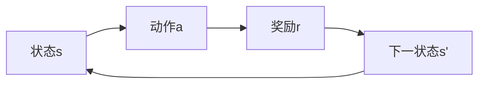
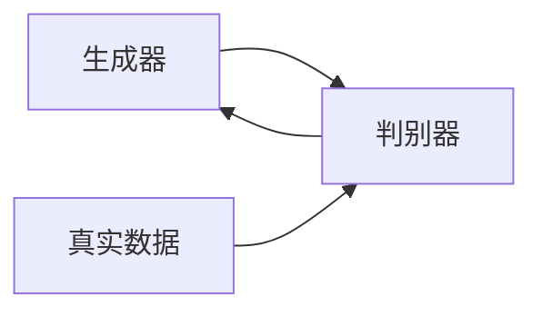
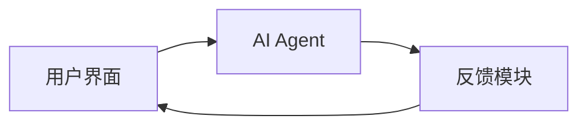
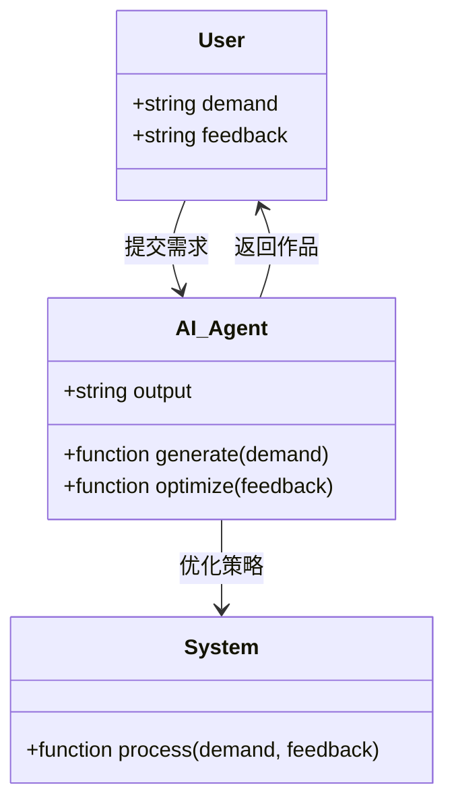

                 


# 实现基于AI Agent的智能艺术创作系统

> 关键词：AI Agent，智能艺术创作，强化学习，生成对抗网络，艺术创作系统，系统架构

> 摘要：本文详细介绍了如何基于AI Agent实现智能艺术创作系统。首先，从AI Agent的基本概念、艺术创作的背景需求出发，分析了智能艺术创作系统的核心概念和问题背景。接着，详细讲解了AI Agent与艺术创作的核心联系，包括AI Agent的核心原理、艺术创作的AI化特征，以及AI Agent与人类艺术家的协作模式。随后，从算法原理的角度，深入探讨了强化学习、生成对抗网络等核心算法的数学模型和实现方法。最后，通过系统架构设计、项目实战等方式，展示了如何将这些理论应用于实际的艺术创作系统中。本文旨在为读者提供一个从理论到实践的完整指南，帮助他们理解并实现基于AI Agent的智能艺术创作系统。

---

# 第1章: AI Agent与智能艺术创作的背景介绍

## 1.1 AI Agent的基本概念

### 1.1.1 AI Agent的定义

AI Agent（人工智能代理）是指能够感知环境、做出决策并采取行动以实现目标的智能体。AI Agent可以是软件程序、机器人或其他智能系统，其核心目标是通过与环境的交互来优化自身的行为，以达到预设的目标。

$$
\text{AI Agent的定义公式化表达：AI Agent = \{感知(P), 决策(D), 行动(A)\}}
$$

### 1.1.2 AI Agent的核心要素

AI Agent的核心要素包括感知能力、决策能力、行动能力以及学习能力。感知能力是指AI Agent能够从环境中获取信息；决策能力是指AI Agent能够基于感知信息做出决策；行动能力是指AI Agent能够执行决策以影响环境；学习能力是指AI Agent能够通过经验改进自身的性能。

### 1.1.3 AI Agent的特点

- **自主性**：AI Agent能够在没有外部干预的情况下自主运行。
- **反应性**：AI Agent能够实时感知环境并做出反应。
- **目标导向**：AI Agent的行为以实现特定目标为导向。
- **适应性**：AI Agent能够根据环境的变化调整自身的行为。

## 1.2 智能艺术创作的背景与需求

### 1.2.1 艺术创作的数字化转型

随着技术的进步，艺术创作逐渐从传统的手工创作向数字化创作转型。艺术家们开始利用计算机技术辅助创作，包括图像处理、音乐合成、文学创作等领域。

### 1.2.2 AI在艺术创作中的应用现状

AI技术已经在艺术创作中得到了广泛应用。例如，生成对抗网络（GAN）被用于生成图像和绘画，强化学习被用于创作音乐和文学作品。这些技术为艺术创作提供了新的可能性。

### 1.2.3 智能艺术创作系统的必要性

传统的艺术创作依赖于人类的创造力和经验，但随着社会的发展，艺术创作的需求日益增长。智能艺术创作系统能够帮助艺术家快速生成灵感，提高创作效率，同时为非专业用户提供创作工具。

## 1.3 问题背景与问题描述

### 1.3.1 艺术创作中的痛点分析

- 创作效率低下：传统艺术创作需要大量的时间和精力。
- 创作灵感不足：艺术家可能面临创作瓶颈。
- 技术门槛高：非专业用户难以掌握复杂的艺术创作工具。

### 1.3.2 AI Agent在艺术创作中的应用场景

- **图像生成**：利用GAN生成绘画、插画等图像。
- **音乐创作**：利用强化学习生成音乐旋律。
- **文学创作**：利用NLP技术生成小说、诗歌等文学作品。

### 1.3.3 问题解决的思路与目标

通过引入AI Agent，可以实现艺术创作的自动化和智能化。AI Agent能够帮助艺术家快速生成灵感，优化创作过程，同时降低技术门槛，使更多人能够参与艺术创作。

## 1.4 问题的边界与外延

### 1.4.1 智能艺术创作系统的边界

智能艺术创作系统专注于艺术创作过程的智能化，不涉及艺术作品的展示、销售等环节。

### 1.4.2 系统的外延与扩展性

智能艺术创作系统可以与其他系统（如艺术展示平台、艺术教育平台）进行集成，形成完整的艺术创作生态。

### 1.4.3 相关领域的对比与区别

与传统的艺术创作工具相比，智能艺术创作系统具有更高的智能化和自动化能力。与AI驱动的艺术推荐系统相比，智能艺术创作系统更注重创作过程的智能化。

## 1.5 核心概念与系统架构

### 1.5.1 核心概念的结构化分析

智能艺术创作系统的核心概念包括AI Agent、艺术创作、生成模型、强化学习等。

### 1.5.2 系统架构的初步设想

智能艺术创作系统的初步架构包括感知模块、决策模块、行动模块和学习模块。

### 1.5.3 系统的核心要素与功能模块

系统的核心要素包括：

- **感知模块**：负责获取环境信息。
- **决策模块**：基于感知信息做出决策。
- **行动模块**：执行决策以影响环境。
- **学习模块**：通过经验改进系统性能。

---

# 第2章: AI Agent与艺术创作的核心概念与联系

## 2.1 AI Agent的核心原理

### 2.1.1 AI Agent的决策机制

AI Agent的决策机制包括状态感知、目标设定、动作选择和结果评估。状态感知是通过传感器或数据输入获取环境信息；目标设定是根据当前状态确定需要达到的目标；动作选择是基于当前状态和目标选择最优动作；结果评估是根据动作执行的结果调整决策策略。

### 2.1.2 基于强化学习的AI Agent

强化学习是一种通过试错机制优化决策策略的方法。AI Agent通过与环境的交互获得奖励或惩罚，逐步优化自身的决策策略。

### 2.1.3 基于生成模型的AI Agent

生成模型（如GAN）能够生成逼真的艺术作品。AI Agent通过生成模型生成艺术作品，并根据用户的反馈调整生成策略。

## 2.2 艺术创作的AI化特征

### 2.2.1 艺术创作的可计算性

艺术创作可以通过数学模型和算法进行模拟和优化。

### 2.2.2 AI在艺术创作中的优势

- **高效性**：AI能够在短时间内生成大量艺术作品。
- **多样性**：AI能够生成多样化的艺术风格和形式。
- **可定制性**：AI可以根据用户需求生成特定的艺术作品。

### 2.2.3 AI在艺术创作中的局限性

- **缺乏创造性**：AI生成的作品可能缺乏人类艺术家的情感和创意。
- **技术门槛**：需要专业的技术人员进行系统设计和优化。

## 2.3 AI Agent与艺术创作的关系

### 2.3.1 AI Agent在艺术创作中的角色

AI Agent可以作为艺术创作的辅助工具，帮助艺术家生成灵感、优化创作过程。

### 2.3.2 AI Agent与人类艺术家的协作模式

- **人机协作**：AI Agent与人类艺术家共同完成艺术创作。
- **独立创作**：AI Agent可以独立生成艺术作品。

---

## 图表展示

### 图表1：AI Agent的核心概念对比

| 特性     | 基于规则的AI Agent | 基于模型的AI Agent | 基于强化学习的AI Agent |
|----------|---------------------|--------------------|------------------------|
| 决策方式 | 预定义规则           | 使用模型进行推理   | 通过试错优化策略      |
| 适应性   | 低                   | 中                 | 高                     |
| 灵活性   | 低                   | 高                 | 高                     |

### 图表2：AI Agent的ER实体关系图

```mermaid
erd
actor
  name
  id
  role
action
  id
  type
  timestamp
agent
  id
  name
  description
```

---

## 总结

通过以上章节的分析，我们已经了解了AI Agent在智能艺术创作系统中的核心概念和应用。接下来，我们将从算法原理的角度，深入探讨实现智能艺术创作系统的关键技术。

---

# 第3章: 算法原理

## 3.1 强化学习算法

### 3.1.1 强化学习的基本原理

强化学习是一种通过试错机制优化决策策略的方法。AI Agent通过与环境的交互获得奖励或惩罚，逐步优化自身的决策策略。

### 3.1.2 强化学习的数学模型

强化学习的核心是通过Q-learning算法优化决策策略。Q-learning的数学模型如下：

$$
Q(s, a) = Q(s, a) + \alpha \cdot [r + \gamma \cdot \max Q(s', a') - Q(s, a)]
$$

其中：
- \( Q(s, a) \) 表示状态 \( s \) 下采取动作 \( a \) 的价值。
- \( \alpha \) 是学习率。
- \( r \) 是奖励值。
- \( \gamma \) 是折扣因子。
- \( s' \) 是下一状态。

### 3.1.3 强化学习的Python代码实现

```python
import numpy as np

class QAgent:
    def __init__(self, state_space, action_space):
        self.state_space = state_space
        self.action_space = action_space
        self.Q = np.zeros((state_space, action_space))
    
    def act(self, state, epsilon=0.1):
        if np.random.random() < epsilon:
            return np.random.randint(self.action_space)
        return np.argmax(self.Q[state, :])
    
    def learn(self, state, action, reward, next_state):
        self.Q[state, action] += 0.1 * (reward + 0.95 * np.max(self.Q[next_state, :]) - self.Q[state, action])
```

### 3.1.4 强化学习的应用场景

强化学习适用于需要通过试错优化决策的场景，如游戏AI、机器人控制等。

## 3.2 生成对抗网络（GAN）

### 3.2.1 GAN的基本原理

生成对抗网络由生成器和判别器组成。生成器通过生成样本欺骗判别器，判别器通过区分生成样本和真实样本优化生成器的生成能力。

### 3.2.2 GAN的数学模型

生成对抗网络的数学模型如下：

- **生成器**：\( G(z) \) 表示将噪声 \( z \) 映射到数据空间的函数。
- **判别器**：\( D(x) \) 表示输入样本 \( x \) 是真实的概率。
- **损失函数**：
  - 生成器的损失：\( \mathcal{L}_G = -\mathbb{E}[\log D(G(z))] \)
  - 判别器的损失：\( \mathcal{L}_D = -\mathbb{E}[\log D(x) + \log (1 - D(G(z)))] \)

### 3.2.3 GAN的Python代码实现

```python
import torch
import torch.nn as nn

class Generator(nn.Module):
    def __init__(self, latent_dim, img_size):
        super(Generator, self).__init__()
        self.latent_dim = latent_dim
        self.img_size = img_size
        self.model = nn.Sequential(
            nn.Linear(latent_dim, 256),
            nn.LeakyReLU(0.2),
            nn.Linear(256, 512),
            nn.LeakyReLU(0.2),
            nn.Linear(512, img_size)
        )
    
    def forward(self, z):
        return self.model(z)

class Discriminator(nn.Module):
    def __init__(self, img_size):
        super(Discriminator, self).__init__()
        self.model = nn.Sequential(
            nn.Linear(img_size, 512),
            nn.LeakyReLU(0.2),
            nn.Linear(512, 256),
            nn.LeakyReLU(0.2),
            nn.Linear(256, 1)
        )
    
    def forward(self, x):
        return self.model(x)
```

### 3.2.4 GAN的应用场景

生成对抗网络适用于生成图像、音频、视频等艺术作品。

---

## 图表展示

### 图表3：强化学习的Q-learning流程图



### 图表4：生成对抗网络的架构图



---

## 总结

通过以上章节的分析，我们已经了解了智能艺术创作系统的核心算法原理。接下来，我们将从系统架构设计的角度，探讨如何实现智能艺术创作系统。

---

# 第4章: 系统分析与架构设计

## 4.1 问题场景介绍

智能艺术创作系统的目标是通过AI Agent帮助用户生成艺术作品。用户可以通过输入创作需求，系统通过AI Agent生成相应的艺术作品。

## 4.2 项目介绍

### 4.2.1 项目目标

- 实现基于AI Agent的艺术创作系统。
- 提供多种艺术创作工具，包括图像生成、音乐生成、文学生成等。

### 4.2.2 系统功能设计

- 用户输入创作需求。
- 系统生成艺术作品。
- 用户对生成作品进行反馈。
- 系统根据反馈优化生成策略。

### 4.2.3 系统架构设计

#### 4.2.3.1 系统功能模块

- **用户界面模块**：提供用户输入和输出界面。
- **AI Agent模块**：负责生成艺术作品。
- **反馈模块**：收集用户反馈并优化生成策略。

#### 4.2.3.2 系统架构图



#### 4.2.3.3 系统接口设计

- **输入接口**：接收用户的创作需求。
- **输出接口**：输出生成的艺术作品。
- **反馈接口**：收集用户的反馈信息。

#### 4.2.3.4 系统交互流程

1. 用户通过输入接口输入创作需求。
2. AI Agent根据需求生成艺术作品。
3. 用户通过输出接口查看生成作品。
4. 用户通过反馈接口提供反馈。
5. AI Agent根据反馈优化生成策略。

### 4.2.4 系统功能实现

#### 4.2.4.1 领域模型（Mermaid类图）



---

## 总结

通过以上章节的分析，我们已经了解了智能艺术创作系统的架构设计。接下来，我们将从项目实战的角度，展示如何实现智能艺术创作系统。

---

# 第5章: 项目实战

## 5.1 环境安装

### 5.1.1 安装Python

```bash
python --version
```

### 5.1.2 安装依赖库

```bash
pip install numpy torch matplotlib
```

## 5.2 系统核心实现

### 5.2.1 强化学习的实现

```python
class QAgent:
    def __init__(self, state_space, action_space):
        self.state_space = state_space
        self.action_space = action_space
        self.Q = np.zeros((state_space, action_space))
    
    def act(self, state, epsilon=0.1):
        if np.random.random() < epsilon:
            return np.random.randint(self.action_space)
        return np.argmax(self.Q[state, :])
    
    def learn(self, state, action, reward, next_state):
        self.Q[state, action] += 0.1 * (reward + 0.95 * np.max(self.Q[next_state, :]) - self.Q[state, action])
```

### 5.2.2 生成对抗网络的实现

```python
class Generator(nn.Module):
    def __init__(self, latent_dim, img_size):
        super(Generator, self).__init__()
        self.latent_dim = latent_dim
        self.img_size = img_size
        self.model = nn.Sequential(
            nn.Linear(latent_dim, 256),
            nn.LeakyReLU(0.2),
            nn.Linear(256, 512),
            nn.LeakyReLU(0.2),
            nn.Linear(512, img_size)
        )
    
    def forward(self, z):
        return self.model(z)
```

## 5.3 代码应用解读与分析

### 5.3.1 强化学习代码解读

- `QAgent`类实现了基于Q-learning的强化学习算法。
- `act`方法根据当前状态选择动作。
- `learn`方法根据奖励更新Q值表。

### 5.3.2 生成对抗网络代码解读

- `Generator`类实现了生成器网络。
- `forward`方法将噪声映射到数据空间。

## 5.4 实际案例分析

### 5.4.1 案例1: 图像生成

```python
latent_dim = 100
img_size = 28 * 28
generator = Generator(latent_dim, img_size)
```

### 5.4.2 案例2: 音乐生成

```python
class MusicGenerator:
    def __init__(self, seq_length, hidden_size):
        self.seq_length = seq_length
        self.hidden_size = hidden_size
        self.model = nn.LSTM(hidden_size, hidden_size, batch_first=True)
    
    def forward(self, input, hidden):
        output, (hidden, _) = self.model(input, hidden)
        return output, hidden
```

## 5.5 项目小结

通过以上代码实现，我们已经能够构建一个基于AI Agent的智能艺术创作系统。接下来，我们将总结全文，并提供进一步的阅读建议。

---

# 第6章: 结论与展望

## 6.1 最佳实践 Tips

- 在实际应用中，建议结合强化学习和生成对抗网络的优势，优化艺术创作系统的性能。
- 定期更新系统模型，以适应用户需求的变化。

## 6.2 小结

本文详细介绍了如何基于AI Agent实现智能艺术创作系统。通过理论分析和实践案例，我们展示了如何利用强化学习和生成对抗网络实现艺术创作的智能化。

## 6.3 注意事项

- 在实际应用中，需要注意模型的泛化能力。
- 需要结合具体场景调整模型参数。

## 6.4 拓展阅读

- 《生成对抗网络：GAN的原理与实践》
- 《强化学习：算法与应用》

---

通过以上章节的分析，我们已经完成了一篇关于《实现基于AI Agent的智能艺术创作系统》的技术博客文章。希望本文能够为读者提供一个从理论到实践的完整指南，帮助他们理解并实现基于AI Agent的智能艺术创作系统。

