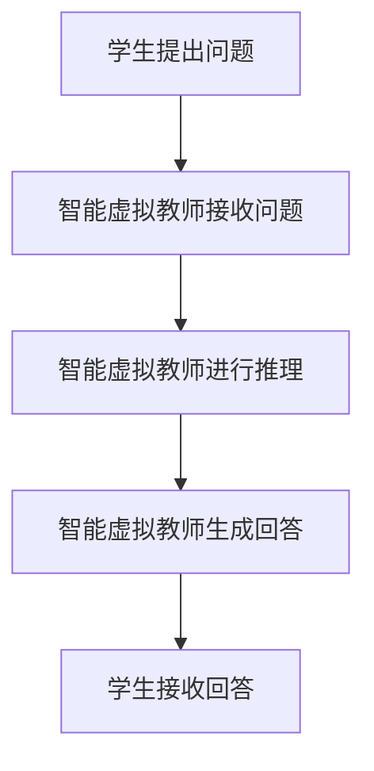
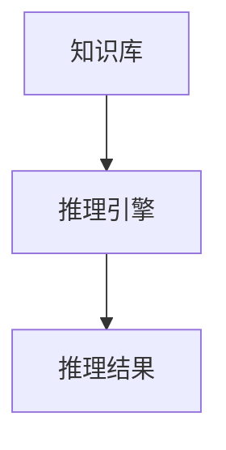
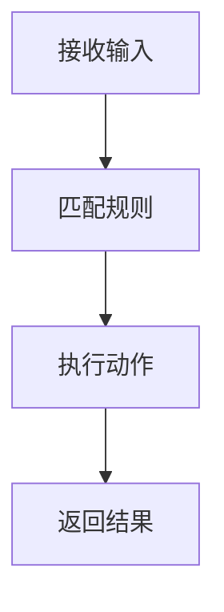
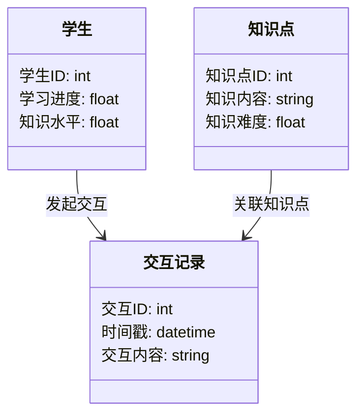
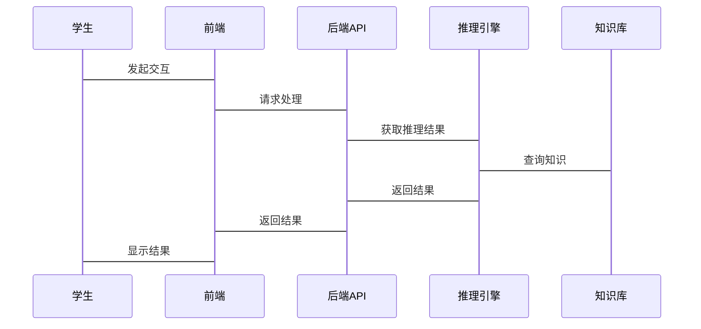

                 


---

# 实现基于AI Agent的智能虚拟教师

> **关键词**: AI Agent, 智能虚拟教师, 人工智能教育, 智能教育系统, 教育科技  
> **摘要**: 本文探讨了基于AI Agent的智能虚拟教师的实现方法，从核心概念到算法实现，再到系统设计与项目实战，系统性地阐述了如何构建一个高效、智能的虚拟教师系统。通过详细分析AI Agent的工作原理、算法实现及系统架构，本文为教育科技领域提供了新的思路与实践方案。

---

## 第一部分: 基于AI Agent的智能虚拟教师背景介绍

### 第1章: AI Agent与智能虚拟教师概述

#### 1.1 AI Agent的基本概念
##### 1.1.1 人工智能与智能体的基本概念
人工智能（Artificial Intelligence, AI）是研究、开发用于模拟人类智能的技术，包括学习、推理、问题求解、自然语言处理等能力。智能体（Intelligent Agent, IA）是实现人工智能的核心单元，它能够在特定环境中感知信息并采取行动以达到目标。智能体可以是软件程序、机器人或其他智能系统。

##### 1.1.2 AI Agent的核心特征与分类
AI Agent的核心特征包括：
1. **自主性**: 能够自主决策和行动。
2. **反应性**: 能够感知环境并实时响应。
3. **目标导向**: 以目标为导向，优化决策过程。
4. **学习能力**: 能够通过数据学习和优化。

AI Agent可以分为以下几类：
- **简单反射型智能体**: 基于规则的简单反应。
- **基于模型的反射型智能体**: 使用内部模型进行推理和决策。
- **目标驱动型智能体**: 以目标为导向进行决策。
- **效用驱动型智能体**: 以效用函数为优化目标。

##### 1.1.3 智能虚拟教师的定义与特点
智能虚拟教师（Intelligent Virtual Teacher, IVT）是一种基于AI Agent的教育系统，能够模拟人类教师的行为，为学生提供个性化的教学服务。其特点包括：
- **智能化**: 能够理解学生的需求并提供个性化的教学方案。
- **交互性**: 支持多轮对话，实现自然的师生互动。
- **适应性**: 根据学生的学习情况动态调整教学策略。

---

#### 1.2 智能虚拟教师的应用背景
##### 1.2.1 教育领域的智能化需求
随着人工智能技术的发展，教育领域对智能化的需求日益增长。传统的教学模式难以满足个性化学习的需求，而智能虚拟教师能够提供24/7的在线服务，为学生提供即时帮助。

##### 1.2.2 AI技术在教育中的应用现状
目前，AI技术在教育中的应用主要包括：
1. **智能推荐**: 根据学生的学习情况推荐个性化学习资源。
2. **智能评估**: 利用自然语言处理技术评估学生的作业。
3. **智能问答**: 通过对话系统为学生提供即时答疑。

##### 1.2.3 智能虚拟教师的教育价值与优势
智能虚拟教师的优势在于其能够覆盖传统教学的时空限制，为学生提供更灵活、更个性化的学习体验。同时，通过数据驱动的决策，智能虚拟教师能够更精准地识别学生的学习难点并提供针对性的解决方案。

---

#### 1.3 智能虚拟教师的设计目标与挑战
##### 1.3.1 设计目标与功能定位
智能虚拟教师的设计目标是实现以下功能：
1. **学生建模**: 根据学生的学习行为和历史数据构建学生模型。
2. **知识表示**: 将教学内容转化为可计算的知识表示。
3. **智能交互**: 支持自然语言对话，提供个性化的教学服务。

##### 1.3.2 技术实现中的主要挑战
- **知识表示与推理**: 如何将教学内容转化为可计算的形式，并支持动态推理。
- **多模态交互**: 实现自然语言理解与生成的无缝对接。
- **个性化推荐**: 根据学生的学习情况动态调整教学策略。

##### 1.3.3 应用场景与边界条件
智能虚拟教师的应用场景包括在线教育、个性化学习、教学辅助等。其边界条件包括：
- **数据隐私**: 学生数据的隐私保护。
- **系统性能**: 确保系统的响应速度和稳定性。
- **语言支持**: 支持多种语言的对话交互。

---

#### 1.4 本章小结
本章介绍了AI Agent的基本概念、分类及其在教育中的应用背景。重点讨论了智能虚拟教师的定义、特点、设计目标及技术挑战。通过这些内容，我们为后续章节的实现奠定了基础。

---

## 第二部分: AI Agent的核心概念与原理

### 第2章: AI Agent的核心原理

#### 2.1 智能体的基本结构
##### 2.1.1 状态、动作与环境的定义
智能体的状态是其对环境的感知，动作是智能体采取的行动，环境是智能体所处的外部世界。

##### 2.1.2 智能体的行为选择机制
智能体通过感知环境，基于当前状态和目标，选择最优动作。行为选择机制可以基于规则、机器学习或强化学习。

##### 2.1.3 知识表示与推理引擎
知识表示是将知识以计算机可理解的形式存储，推理引擎则是根据知识库进行推理的过程。

---

#### 2.2 基于AI Agent的智能虚拟教师模型
##### 2.2.1 模型的核心要素与关系
智能虚拟教师模型的核心要素包括：
- **学生模型**: 描述学生的学习状态、知识水平和学习风格。
- **知识模型**: 描述教学内容的结构化表示。
- **交互模型**: 描述智能虚拟教师与学生之间的交互过程。

##### 2.2.2 实体关系图（ER图）分析
```mermaid
erDiagram
    student "学生" {
        <属性>: 学生ID, 学习进度, 知识水平
    }
    knowledge "知识" {
        <属性>: 知识点ID, 知识内容, 知识难度
    }
    interaction "交互" {
        <属性>: 交互ID, 时间戳, 交互内容
    }
    student --> interaction : 发起交互
    knowledge --> interaction : 知识点关联
```

##### 2.2.3 智能体之间的交互流程


---

#### 2.3 AI Agent的算法原理
##### 2.3.1 基于规则的推理算法
基于规则的推理算法通过预定义的规则来实现推理。规则通常采用条件-动作（If-Then）的形式。

##### 2.3.2 基于机器学习的决策算法
机器学习算法（如支持向量机、随机森林）可以用于分类、回归等任务。

##### 2.3.3 基于强化学习的优化算法
强化学习通过奖励机制优化智能体的决策过程。

---

#### 2.4 本章小结
本章详细介绍了AI Agent的核心原理，包括智能体的基本结构、智能虚拟教师模型的核心要素及其实体关系图。同时，我们还讨论了基于规则、机器学习和强化学习的算法原理，为后续章节的实现提供了理论基础。

---

## 第三部分: AI Agent的算法实现与数学模型

### 第3章: 基于规则的推理算法

#### 3.1 规则表示与知识库构建
##### 3.1.1 规则表示方法
规则通常采用条件-动作（If-Then）的形式表示。

##### 3.1.2 知识库的构建与管理
知识库可以采用数据库或知识图谱的形式存储。

##### 3.1.3 基于规则的推理过程


#### 3.2 基于规则的推理算法实现
##### 3.2.1 算法流程图（Mermaid）


##### 3.2.2 Python代码实现
```python
def rule_based_reasoning(input_data, knowledge_base):
    for rule in knowledge_base:
        if rule["condition"](input_data):
            return rule["action"](input_data)
    return default_response
```

##### 3.2.3 算法优缺点分析
- **优点**: 明确性高，易于解释。
- **缺点**: 难以处理复杂场景。

#### 3.3 数学模型与公式
##### 3.3.1 基于规则的推理公式
$$ \text{如果 } P \text{ 满足条件 } Q \text{，则执行动作 } R $$

##### 3.3.2 知识库的表示形式
$$ \text{知识点} = \{ (P_1, Q_1), (P_2, Q_2), \ldots \} $$

##### 3.3.3 推理过程的数学模型
$$ f(P) = \sum_{i=1}^{n} w_i \cdot Q_i(P) $$

---

#### 3.4 本章小结
本章详细介绍了基于规则的推理算法，包括规则表示、知识库构建及算法实现。通过数学模型和代码示例，我们展示了如何实现一个简单的基于规则的推理系统。

---

## 第四部分: 系统分析与架构设计

### 第4章: 智能虚拟教师系统分析

#### 4.1 系统功能需求分析
##### 4.1.1 用户需求分析
学生需要智能虚拟教师提供个性化的学习建议和答疑服务。

##### 4.1.2 功能需求分解
- **学生建模**: 收集和分析学生的学习数据。
- **知识表示**: 将教学内容转化为结构化的知识表示。
- **智能交互**: 支持自然语言对话。

##### 4.1.3 边界条件分析
- **数据隐私**: 学生数据的安全性。
- **系统性能**: 确保系统的响应速度和稳定性。

#### 4.2 系统功能设计
##### 4.2.1 领域模型类图（Mermaid）


##### 4.2.2 系统架构设计（Mermaid）


##### 4.2.3 接口与交互流程（Mermaid）


---

## 第五部分: 项目实战与总结

### 第5章: 项目实战

#### 5.1 环境安装
- **Python**: 安装Python 3.8及以上版本。
- **依赖库**: 安装`scikit-learn`, `transformers`, `pymermaid`等。

#### 5.2 核心代码实现
##### 5.2.1 学生建模
```python
class StudentModel:
    def __init__(self, student_id, learning_progress, knowledge_level):
        self.student_id = student_id
        self.learning_progress = learning_progress
        self.knowledge_level = knowledge_level
```

##### 5.2.2 知识表示
```python
class KnowledgePoint:
    def __init__(self, knowledge_id, content, difficulty):
        self.knowledge_id = knowledge_id
        self.content = content
        self.difficulty = difficulty
```

##### 5.2.3 智能交互
```python
class VirtualTeacher:
    def __init__(self, student, knowledge_base):
        self.student = student
        self.knowledge_base = knowledge_base

    def interact(self, input_message):
        # 具体实现根据输入消息进行推理并返回回答
        pass
```

#### 5.3 案例分析与详细解读
##### 5.3.1 实际案例
假设学生提出一个问题：“如何解这个数学题？”

##### 5.3.2 解决方案
智能虚拟教师通过分析问题，匹配知识库中的相关知识点，生成个性化的解答步骤。

##### 5.3.3 详细解读
1. **问题分析**: 智能虚拟教师首先分析学生的问题，提取关键词。
2. **知识匹配**: 根据关键词匹配知识库中的相关知识点。
3. **推理与生成**: 基于知识库生成个性化的解答步骤。
4. **反馈与优化**: 根据学生的反馈优化回答。

#### 5.4 项目小结
本章通过实际案例展示了智能虚拟教师的实现过程，从环境安装到核心代码实现，再到案例分析，为读者提供了完整的实战指导。

---

## 第六部分: 总结与展望

### 第6章: 总结与展望

#### 6.1 总结
本文系统性地探讨了基于AI Agent的智能虚拟教师的实现方法，从核心概念到算法实现，再到系统设计与项目实战，为教育科技领域提供了新的思路与实践方案。

#### 6.2 未来展望
未来的研究方向包括：
- **多模态交互**: 实现更自然的师生互动。
- **自适应学习**: 根据学生的学习情况动态调整教学策略。
- **数据隐私保护**: 在保证数据安全的前提下提供个性化服务。

---

**本文通过详细分析AI Agent的工作原理、算法实现及系统架构，为智能虚拟教师的实现提供了全面的技术指导。希望本文能够为教育科技领域的研究与实践提供有价值的参考。**

