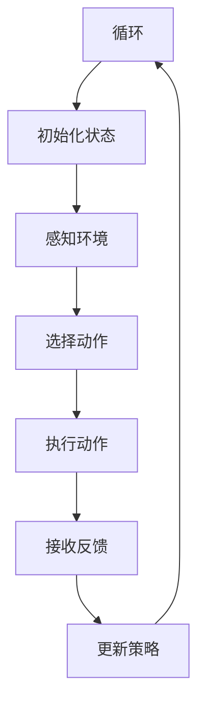
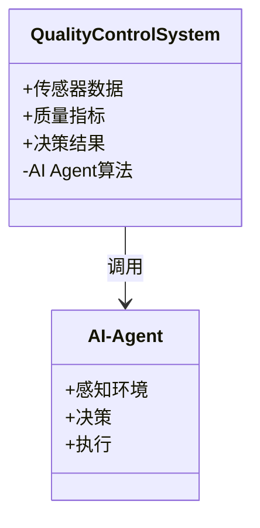
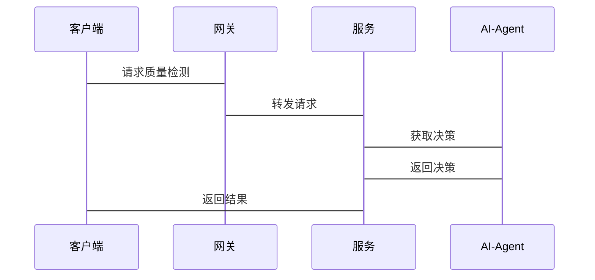

                 


# 实现基于AI Agent的智能质量控制系统

> 关键词：AI Agent，智能质量控制，算法原理，系统架构，项目实战，质量管理

> 摘要：本文详细介绍了如何基于AI Agent实现智能质量控制系统。从问题背景、核心概念到算法原理，再到系统架构设计和项目实战，最后总结了最佳实践和未来研究方向。本文内容涵盖了从理论到实践的全过程，旨在为读者提供全面的技术指导。

---

## 第1章 背景介绍

### 1.1 问题背景
质量管理是企业生产和服务过程中的核心环节，传统质量控制方法依赖人工检查或固定的自动化设备，存在效率低、适应性差、难以应对复杂场景等问题。随着AI技术的快速发展，基于AI Agent的质量控制系统逐渐成为研究热点。

### 1.2 问题描述
传统质量控制方法在面对复杂场景时，如非线性关系、动态变化和多因素干扰，往往显得力不从心。基于AI Agent的质量控制可以实时感知、分析和决策，能够有效解决这些问题。

### 1.3 问题解决
通过引入AI Agent，可以实现对质量数据的实时分析、动态优化和自适应调整，从而提高质量控制的效率和准确性。

### 1.4 概念结构与核心要素
智能质量控制系统由感知层、决策层和执行层组成。感知层负责数据采集，决策层基于AI算法进行分析和决策，执行层负责具体操作。

---

## 第2章 核心概念与联系

### 2.1 AI Agent的核心原理
AI Agent是一种能够感知环境、自主决策并执行任务的智能体。其核心原理包括感知、推理、规划和执行。

### 2.2 智能质量控制与AI Agent的关系
智能质量控制依赖AI Agent实现数据处理和决策优化，AI Agent则通过质量控制任务获得数据和反馈，进一步提升自身的智能性。

### 2.3 核心概念对比
以下是AI Agent与传统控制算法的对比表格：

| 特性                | AI Agent               | 传统算法             |
|---------------------|------------------------|----------------------|
| 学习能力            | 强大，支持深度学习      | 较弱，依赖预设规则    |
| 灵活性              | 高，适应复杂场景        | 低，适应性有限        |
| 决策能力            | 强，基于实时数据        | 弱，依赖预设逻辑      |

### 2.4 ER实体关系图
以下是质量控制系统中的实体关系图：

```mermaid
erDiagram
    customer[客户] {
        id
        name
    }
    product[产品] {
        id
        name
        quality
    }
    test[测试] {
        id
        result
        timestamp
    }
    customer --> test : 进行测试
    product --> test : 关联测试
```

---

## 第3章 AI Agent的算法原理

### 3.1 算法原理概述
基于强化学习的AI Agent算法通过与环境的交互，不断优化自身行为，以达到最优质量控制效果。

### 3.2 算法流程图
以下是算法流程图：



### 3.3 算法实现
以下是Python实现代码：

```python
import numpy as np
import gym

# 定义强化学习算法
class AI_Agent:
    def __init__(self, env):
        self.env = env
        self.gamma = 0.99  # 折扣因子
        self.lr = 0.001    # 学习率
        self.epsilon = 1.0  # 探索率
        self.model = self._build_model()

    def _build_model(self):
        # 简单的神经网络模型
        import tensorflow as tf
        model = tf.keras.Sequential([
            tf.keras.layers.Dense(24, activation='relu', input_dim=4),
            tf.keras.layers.Dense(24, activation='relu'),
            tf.keras.layers.Dense(self.env.action_space.n, activation='linear')
        ])
        model.compile(optimizer=tf.keras.optimizers.Adam(learning_rate=self.lr),
                      loss='mean_squared_error')
        return model

    def remember(self, state, action, reward, next_state):
        # 记忆单元（简单实现，可扩展）
        pass

    def act(self, state):
        # 选择动作
        if np.random.random() < self.epsilon:
            return self.env.action_space.sample()
        predicted = self.model.predict(np.array([state]))[0]
        return np.argmax(predicted)

    def learn(self, state, action, reward, next_state):
        # 线性回放
        target = reward + self.gamma * np.max(self.model.predict(np.array([next_state]))[0])
        target_vec = self.model.predict(np.array([state]))[0]
        target_vec[action] = target
        self.model.fit(np.array([state]), np.array([target_vec]), epochs=1, verbose=0)
```

### 3.4 数学公式
强化学习的核心公式是：

$$ Q(s, a) = Q(s, a) + \alpha (r + \gamma \max Q(s', a') - Q(s, a)) $$

其中：
- \( Q(s, a) \) 是当前状态 \( s \) 下执行动作 \( a \) 的价值
- \( \alpha \) 是学习率
- \( r \) 是奖励
- \( \gamma \) 是折扣因子

---

## 第4章 系统架构设计

### 4.1 问题场景介绍
以制造业中的产品质量检测为例，设计一个基于AI Agent的智能质量控制系统。

### 4.2 领域模型设计
以下是领域模型：



### 4.3 系统架构设计
以下是系统架构图：

```mermaid
archiecture
    客户端 --> 网关 : 请求
    网关 --> 数据库 : 查询
    数据库 --> 服务 : 返回数据
    服务 --> AI-Agent : 调用
    AI-Agent --> 服务 : 返回决策
    服务 --> 客户端 : 返回结果
```

### 4.4 接口设计
以下是接口设计：



---

## 第5章 项目实战

### 5.1 环境安装
安装必要的库：

```bash
pip install gym numpy tensorflow
```

### 5.2 核心代码实现
以下是核心代码：

```python
import gym
from gym import spaces
from gym.utils import seeding

class QualityControlEnv(gym.Env):
    def __init__(self):
        self.observation_space = spaces.Box(low=0, high=1, shape=(4,))
        self.action_space = spaces.Discrete(3)
        self.seed()

    def seed(self, seed=None):
        self.np_random, seed = seeding.np_random(seed)
        return seed

    def reset(self):
        # 初始化环境
        return self.np_random.uniform(0, 1, 4)

    def step(self, action):
        # 执行动作并返回反馈
        state = self.np_random.uniform(0, 1, 4)
        reward = 1.0 if action == 1 else 0.0
        done = False
        return state, reward, done, {}
```

### 5.3 案例分析
以下是案例分析：

```python
env = QualityControlEnv()
agent = AI_Agent(env)
for _ in range(1000):
    state = env.reset()
    while True:
        action = agent.act(state)
        next_state, reward, done, _ = env.step(action)
        agent.learn(state, action, reward, next_state)
        if done:
            break
```

---

## 第6章 高级主题与应用案例

### 6.1 多AI Agent协作
多AI Agent协作可以提高系统的鲁棒性和效率。

### 6.2 模型优化
通过迁移学习和在线学习优化AI Agent的性能。

### 6.3 应用案例
以下是AI Agent在不同领域的应用案例：

1. **制造业**：产品质量检测
2. **服务业**：服务质量优化
3. **医疗**：患者诊断辅助

---

## 第7章 总结与展望

### 7.1 总结
本文详细介绍了基于AI Agent的智能质量控制系统，涵盖了从理论到实践的全过程。

### 7.2 最佳实践
- 定期更新模型
- 优化系统架构
- 监控系统性能

### 7.3 注意事项
- 数据质量至关重要
- 系统安全性需严格保证
- 避免过度依赖AI

### 7.4 未来研究方向
- 多AI Agent协作
- 模型的实时优化
- 新兴领域的应用

---

通过本文的介绍，读者可以全面了解基于AI Agent的智能质量控制系统的设计与实现，为实际应用提供了有价值的参考。

