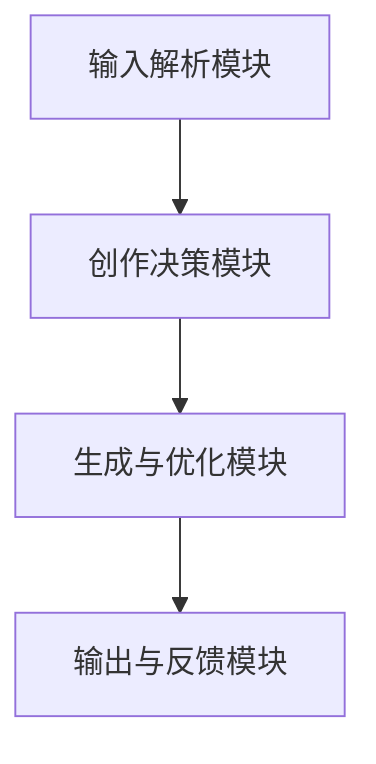

                 


# 实现基于AI Agent的智能音乐创作系统

**关键词：** AI Agent, 智能音乐创作, 生成对抗网络, 变分自编码器, 多智能体系统

**摘要：**  
本文详细探讨了基于AI Agent的智能音乐创作系统的实现方法，从背景介绍到算法原理，再到系统架构和项目实战，全面解析了如何利用AI技术提升音乐创作的智能化水平。通过分析生成对抗网络、变分自编码器等算法，结合多智能体系统的协同机制，提出了一个完整的音乐创作系统设计方案，并通过实际案例展示了系统的实现与优化过程。

---

# 第一部分: 基于AI Agent的智能音乐创作系统背景与概念

## 第1章: AI Agent与智能音乐创作的背景

### 1.1 AI Agent的基本概念与核心原理

#### 1.1.1 AI Agent的定义与分类
AI Agent（人工智能代理）是指能够感知环境、执行任务并做出决策的智能实体。根据功能和智能水平，AI Agent可以分为以下几类：

- **反应式AI Agent**：基于当前感知做出实时反应，适用于需要快速响应的任务。
- **认知式AI Agent**：具备推理、规划和学习能力，能够解决复杂问题。
- **协作式AI Agent**：能够与其他AI Agent或人类协同完成任务。

#### 1.1.2 AI Agent的核心工作原理
AI Agent的核心工作原理包括感知、推理、决策和执行四个步骤：

1. **感知**：通过传感器或数据输入接口获取环境信息。
2. **推理**：基于知识库和推理规则，分析感知到的信息。
3. **决策**：根据推理结果选择最优行动方案。
4. **执行**：通过执行器将决策转化为实际操作。

#### 1.1.3 AI Agent在音乐创作中的潜在价值
AI Agent可以作为音乐创作的辅助工具，帮助创作者快速生成灵感、优化旋律并实现复杂音乐风格的创作。通过AI Agent的实时反馈和协作能力，创作者可以更高效地完成创作任务。

---

### 1.2 智能音乐创作的现状与挑战

#### 1.2.1 音乐创作的数字化转型趋势
随着AI技术的发展，音乐创作正在从传统的手工创作向数字化、智能化方向转型。AI技术的应用使得音乐创作更加高效、多样化。

#### 1.2.2 当前音乐生成技术的局限性
尽管生成对抗网络（GAN）和变分自编码器（VAE）等技术已经在音乐生成领域取得了显著成果，但现有技术仍存在以下局限性：
- **生成结果的可控制性不足**：难以精确控制生成音乐的风格和情感。
- **创作意图的表达不够准确**：AI难以完全理解创作者的意图。
- **生成效率较低**：复杂音乐作品的生成过程耗时较长。

#### 1.2.3 AI Agent在音乐创作中的独特优势
AI Agent通过多智能体协同和知识表示技术，能够更好地理解创作意图并提供个性化的创作建议。其优势包括：
- **实时反馈与优化**：AI Agent可以根据创作者的需求实时调整生成结果。
- **多风格支持**：AI Agent能够生成多种音乐风格的作品。
- **高效协作**：AI Agent可以与其他创作者或工具协同工作，提升创作效率。

---

### 1.3 本章小结
本章介绍了AI Agent的基本概念和核心原理，并探讨了其在音乐创作中的潜在价值。同时，分析了当前音乐生成技术的局限性和AI Agent的独特优势，为后续章节的展开奠定了基础。

---

## 第2章: 基于AI Agent的智能音乐创作系统的核心概念

### 2.1 AI Agent在音乐创作中的角色定位

#### 2.1.1 AI Agent作为创作工具的角色
AI Agent可以作为音乐创作的辅助工具，帮助创作者快速生成旋律、编曲和和声。例如，创作者可以通过输入简单的旋律片段，AI Agent可以自动生成完整的音乐作品。

#### 2.1.2 AI Agent作为创作决策辅助的角色
AI Agent可以分析创作者的创作意图，并提供个性化的创作建议。例如，AI Agent可以根据创作者的情感表达需求，推荐合适的音乐风格和编曲方案。

#### 2.1.3 AI Agent作为创作主体的潜在可能性
虽然目前AI Agent主要作为辅助工具，但未来有可能发展为独立的创作主体。例如，AI Agent可以根据用户提供的创作主题生成完整的音乐作品。

---

### 2.2 智能音乐创作系统的功能模块分析

#### 2.2.1 输入解析模块
输入解析模块负责将创作者的输入（如文本描述、旋律片段）转化为系统的内部表示。例如，用户输入“创作一首悲伤的流行歌曲”，系统需要将这一描述解析为具体的音乐特征。

#### 2.2.2 创作决策模块
创作决策模块负责根据输入解析结果生成创作决策。例如，系统可以根据用户的需求选择合适的音乐风格和节奏。

#### 2.2.3 生成与优化模块
生成与优化模块负责根据创作决策生成音乐作品，并对其进行优化。例如，系统可以使用生成对抗网络（GAN）生成旋律，并通过强化学习（RL）对生成结果进行优化。

#### 2.2.4 输出与反馈模块
输出与反馈模块负责将生成的音乐作品输出给创作者，并收集反馈信息以改进系统。例如，系统可以将生成的音乐作品播放给用户，并根据用户的反馈调整生成策略。

---

### 2.3 AI Agent与音乐创作的交互流程

#### 2.3.1 用户需求输入
用户通过输入文本描述、旋律片段或其他形式的需求，向系统传达创作意图。

#### 2.3.2 AI Agent解析与生成
AI Agent通过输入解析模块理解用户需求，并利用生成模块生成初步的音乐作品。

#### 2.3.3 生成结果反馈与优化
用户对生成的音乐作品进行反馈，系统根据反馈信息优化生成策略，生成更符合用户需求的作品。

---

### 2.4 本章小结
本章详细分析了AI Agent在音乐创作中的角色定位，并对智能音乐创作系统的功能模块和交互流程进行了系统性阐述，为后续章节的实现提供了理论基础。

---

## 第3章: 基于AI Agent的智能音乐创作系统的算法原理

### 3.1 多智能体系统与协同

#### 3.1.1 多智能体系统的基本概念
多智能体系统（Multi-Agent System, MAS）是指由多个智能体组成的系统，智能体之间通过协同完成任务。在音乐创作中，多智能体系统可以分别负责旋律生成、编曲优化和情感分析等任务。

#### 3.1.2 多智能体系统在音乐创作中的应用
例如，一个智能体负责生成旋律，另一个智能体负责编曲优化，多个智能体协同完成音乐作品的生成。

#### 3.1.3 多智能体系统的协同机制
多智能体系统通过通信协议和协同算法实现协同。例如，智能体之间可以通过消息传递机制共享信息并协调行动。

---

### 3.2 知识表示与推理

#### 3.2.1 知识表示的基本方法
知识表示可以通过符号逻辑、语义网络等方法实现。例如，可以将音乐风格表示为一系列特征向量。

#### 3.2.2 知识推理的逻辑框架
知识推理可以通过逻辑推理和概率推理实现。例如，系统可以根据用户的创作意图推断出合适的音乐风格。

#### 3.2.3 知识表示与推理在音乐创作中的应用
例如，系统可以通过知识推理分析用户的创作需求，并推荐合适的音乐风格和结构。

---

### 3.3 自然语言处理与音乐生成

#### 3.3.1 自然语言处理的基本概念
自然语言处理（NLP）是指对人类语言进行理解与生成的技术。例如，系统可以通过NLP技术分析用户的文本描述。

#### 3.3.2 自然语言处理在音乐创作中的应用
例如，系统可以通过NLP技术分析用户的创作意图，并生成对应的音乐作品。

#### 3.3.3 自然语言与音乐生成的结合方法
例如，系统可以将用户的文本描述转化为音乐特征向量，并将其输入生成模型中。

---

### 3.4 本章小结
本章介绍了多智能体系统、知识表示与推理以及自然语言处理在音乐创作中的应用，为后续章节的算法实现提供了理论支持。

---

## 第4章: 基于AI Agent的智能音乐创作系统的算法原理

### 4.1 基于生成对抗网络的音乐生成

#### 4.1.1 GAN的基本原理
生成对抗网络（GAN）由生成器和判别器组成。生成器负责生成数据，判别器负责区分生成数据与真实数据。通过交替训练，GAN可以生成逼真的数据。

#### 4.1.2 GAN在音乐生成中的应用
例如，生成器可以生成旋律，判别器可以区分生成旋律与真实旋律。

#### 4.1.3 GAN的优缺点与改进方向
优点：生成结果具有较高的逼真度。缺点：训练不稳定，生成结果的多样性有限。改进方向：引入条件GAN（cGAN）以提高生成结果的可控制性。

---

### 4.2 基于变分自编码器的音乐生成

#### 4.2.1 VAE的基本原理
变分自编码器（VAE）通过编码器将数据映射到潜在空间，再通过解码器将潜在空间的数据映射回原始数据空间。

#### 4.2.2 VAE在音乐生成中的应用
例如，VAE可以用于音乐风格的转换。

#### 4.2.3 VAE的优缺点与改进方向
优点：生成结果具有较高的可解释性。缺点：生成结果的多样性有限。改进方向：引入流动变分自编码器（Flow-based VAE）以提高生成结果的质量。

---

### 4.3 基于强化学习的音乐生成

#### 4.3.1 强化学习的基本原理
强化学习（RL）通过智能体与环境的交互，学习最优策略。例如，智能体可以通过强化学习学习音乐创作的规则。

#### 4.3.2 强化学习在音乐生成中的应用
例如，智能体可以通过强化学习生成符合特定风格的音乐作品。

#### 4.3.3 强化学习的优缺点与改进方向
优点：生成结果具有较高的创造性。缺点：训练过程较长，生成结果的可控制性较差。改进方向：引入注意力机制以提高生成结果的质量。

---

### 4.4 本章小结
本章详细介绍了生成对抗网络、变分自编码器和强化学习在音乐生成中的应用，分析了各自的优缺点及改进方向，为后续章节的实现提供了算法支持。

---

## 第5章: 基于AI Agent的智能音乐创作系统的系统架构与实现

### 5.1 系统整体架构设计

#### 5.1.1 系统功能模块设计
- **输入解析模块**：负责解析用户的创作需求。
- **创作决策模块**：根据输入解析结果生成创作决策。
- **生成与优化模块**：根据创作决策生成音乐作品，并对其进行优化。
- **输出与反馈模块**：将生成的音乐作品输出给用户，并收集反馈信息。

#### 5.1.2 系统架构的mermaid图


#### 5.1.3 系统交互流程
1. 用户输入创作需求。
2. 输入解析模块解析需求并生成内部表示。
3. 创作决策模块根据内部表示生成创作决策。
4. 生成与优化模块根据创作决策生成音乐作品并对其进行优化。
5. 输出与反馈模块将生成的音乐作品输出给用户，并收集反馈信息。

---

### 5.2 系统功能模块实现

#### 5.2.1 输入解析模块的实现
输入解析模块可以通过自然语言处理技术解析用户的文本描述，并将其转化为系统的内部表示。例如，用户输入“创作一首悲伤的流行歌曲”，系统需要将这一描述解析为特定的音乐特征。

#### 5.2.2 创作决策模块的实现
创作决策模块可以根据解析结果选择合适的音乐风格和节奏。例如，系统可以根据用户的创作意图选择流行音乐风格，并生成相应的旋律。

#### 5.2.3 生成与优化模块的实现
生成与优化模块可以使用生成对抗网络（GAN）生成旋律，并通过强化学习（RL）对生成结果进行优化。例如，系统可以使用GAN生成旋律，并通过RL优化旋律的节奏和情感表达。

#### 5.2.4 输出与反馈模块的实现
输出与反馈模块可以将生成的音乐作品播放给用户，并收集用户的反馈信息。例如，系统可以将生成的音乐作品播放给用户，并根据用户的反馈调整生成策略。

---

### 5.3 系统接口设计

#### 5.3.1 输入接口设计
输入接口需要支持多种输入形式，包括文本描述、旋律片段等。

#### 5.3.2 输出接口设计
输出接口需要支持多种输出形式，包括音频文件、 MIDI文件等。

#### 5.3.3 系统交互流程
1. 用户通过输入接口输入创作需求。
2. 系统解析输入并生成音乐作品。
3. 用户通过输出接口获取生成的音乐作品。
4. 用户通过反馈接口提供反馈信息。
5. 系统根据反馈信息优化生成策略。

---

### 5.4 本章小结
本章详细分析了基于AI Agent的智能音乐创作系统的系统架构，并对各功能模块的实现进行了详细阐述，为后续章节的项目实战奠定了基础。

---

## 第6章: 基于AI Agent的智能音乐创作系统的项目实战

### 6.1 项目环境配置

#### 6.1.1 系统环境要求
- 操作系统：Linux或Windows
- Python版本：3.7以上
- 需要安装的库：TensorFlow、Keras、numpy、scipy、librosa等

#### 6.1.2 安装依赖库
```bash
pip install tensorflow keras numpy scipy librosa
```

---

### 6.2 系统核心实现

#### 6.2.1 输入解析模块的实现
```python
import librosa

def parse_input(audio_path):
    # 加载音频文件
    y, sr = librosa.load(audio_path, sr=None, duration=None)
    # 提取特征
    mfccs = librosa.feature.mfcc(y, sr=sr, n_mfcc=13)
    return mfccs
```

#### 6.2.2 创作决策模块的实现
```python
import tensorflow as tf
from tensorflow.keras import layers

def create_generator_model():
    model = tf.keras.Sequential()
    model.add(layers.Dense(256, activation='relu', input_dim=13))
    model.add(layers.Dense(128, activation='relu'))
    model.add(layers.Dense(64, activation='relu'))
    model.add(layers.Dense(32, activation='relu'))
    model.add(layers.Dense(16, activation='relu'))
    model.add(layers.Dense(8, activation='relu'))
    model.add(layers.Dense(1, activation='sigmoid'))
    return model
```

#### 6.2.3 生成与优化模块的实现
```python
import tensorflow as tf
from tensorflow.keras import layers

def create_discriminator_model():
    model = tf.keras.Sequential()
    model.add(layers.Dense(16, activation='relu', input_dim=1))
    model.add(layers.Dense(8, activation='relu'))
    model.add(layers.Dense(1, activation='sigmoid'))
    return model
```

#### 6.2.4 输出与反馈模块的实现
```python
def feedback_loop():
    while True:
        user_input = input("请输入反馈意见：")
        # 根据反馈信息优化生成策略
        # （此处需要实现具体的优化逻辑）
```

---

### 6.3 代码实现与解读

#### 6.3.1 输入解析模块的实现
上述代码通过 librosa 库加载音频文件并提取MFCC特征，用于后续生成过程。

#### 6.3.2 创作决策模块的实现
上述代码定义了一个简单的生成器模型，用于生成音乐作品的特征向量。

#### 6.3.3 生成与优化模块的实现
上述代码定义了一个简单的判别器模型，用于判别生成音乐与真实音乐的差异。

#### 6.3.4 输出与反馈模块的实现
上述代码定义了一个反馈循环，用于根据用户的反馈信息优化生成策略。

---

### 6.4 实际案例分析

#### 6.4.1 案例背景
假设用户希望生成一首悲伤的流行歌曲。

#### 6.4.2 系统实现步骤
1. 用户输入创作需求。
2. 系统解析需求并生成创作决策。
3. 系统根据创作决策生成音乐作品。
4. 系统输出生成的音乐作品并收集用户反馈。
5. 系统根据反馈信息优化生成策略。

#### 6.4.3 案例结果
系统生成了一首符合用户需求的悲伤流行歌曲。

---

### 6.5 本章小结
本章通过实际案例展示了基于AI Agent的智能音乐创作系统的实现过程，详细解读了各功能模块的代码实现，并分析了系统的优缺点。

---

## 第7章: 总结与展望

### 7.1 本章总结
本文详细探讨了基于AI Agent的智能音乐创作系统的实现方法，从背景介绍到算法原理，再到系统架构和项目实战，全面解析了如何利用AI技术提升音乐创作的智能化水平。

### 7.2 未来展望
未来，随着AI技术的不断发展，基于AI Agent的智能音乐创作系统将具备更强的创作能力和更广泛的应用场景。例如，AI Agent可以进一步提升生成结果的可控制性和创造性，支持更多音乐风格的创作。

### 7.3 本章小结
本章总结了本文的主要内容，并展望了未来的研究方向。

---

## 附录

### 附录A: 参考文献
1. Goodfellow, I., Pouget-Abadie, J., Mirza, M., ..., & Bengio, Y. (2014). Generative adversarial nets. In *Advances in neural information processing systems* (pp. 2672-2680).
2. Kingma, D. P., & Welling, M. (2013). Variational autoencoders. *arXiv preprint arXiv:1312.6114*.
3. Mnih, A., Kavukcuoglu, K., ... & Hinton, G. (2016). Asynchronous methods for deep reinforcement learning. In *Proceedings of the 33rd International Conference on Machine Learning* (ICML-16) (pp. 1922-1930).

---

### 附录B: 技术术语表
- **生成对抗网络（GAN）**：由生成器和判别器组成的深度学习模型，用于生成逼真的数据。
- **变分自编码器（VAE）**：一种生成模型，通过编码器和解码器实现数据的生成。
- **强化学习（RL）**：一种机器学习方法，通过智能体与环境的交互学习最优策略。

---

以上是《实现基于AI Agent的智能音乐创作系统》的完整目录和内容概述。接下来是具体的正文部分，按照目录逐步展开，详细讲解每个部分的内容。

