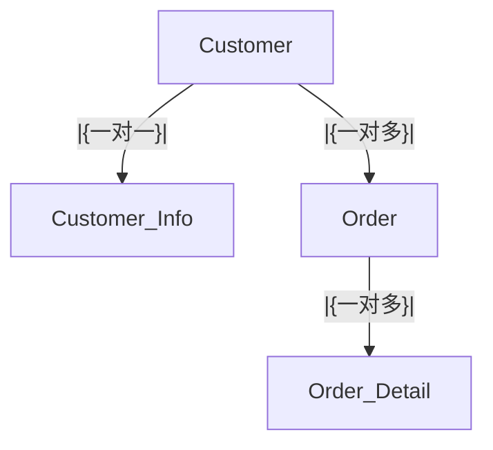
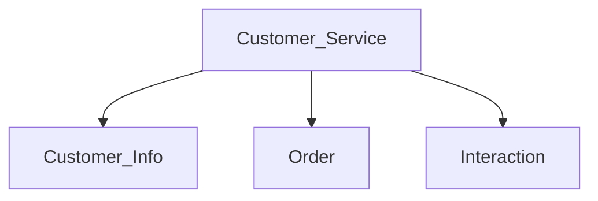

                 


# 客户关系管理集成

> 关键词：客户关系管理、CRM、数据挖掘、系统集成、算法原理、架构设计

> 摘要：客户关系管理（CRM）是现代企业管理和运营中的核心组成部分。本文章系统地介绍了CRM的核心概念、集成方法、算法原理以及系统架构设计，通过实际案例分析，深入探讨了CRM在企业中的应用价值和实施策略，帮助读者全面理解CRM集成的关键点和最佳实践。

---

# 第1章: 客户关系管理（CRM）概述

## 1.1 问题背景与问题描述
CRM（Customer Relationship Management）即客户关系管理，是指通过管理客户信息、客户互动和客户关系，优化企业与客户之间的关系，从而提高客户满意度和忠诚度的过程。随着市场竞争的加剧，客户资源的管理和利用已成为企业核心竞争力的重要组成部分。

### 1.1.1 问题背景
- 在现代商业环境中，客户是企业的核心资产。
- 客户信息分散在不同部门和系统中，难以统一管理和利用。
- 如何高效地管理客户信息，提升客户体验，成为企业面临的重要挑战。

### 1.1.2 问题描述
- 客户信息孤岛问题：客户数据分布在CRM系统、销售系统、客服系统等多个系统中，缺乏统一的管理。
- 客户体验不一致：不同渠道的客户互动缺乏统一的管理策略，导致客户体验不一致。
- 数据利用率低：客户数据未被充分挖掘和利用，难以支持精准营销和决策。

### 1.1.3 问题解决
- 通过CRM集成，整合分散的客户数据，建立统一的客户信息库。
- 通过数据分析和挖掘，提升客户洞察力，优化客户体验。
- 通过自动化流程，提高客户互动效率，降低运营成本。

### 1.1.4 边界与外延
- CRM集成的边界包括客户信息管理、客户互动管理、客户分析与决策支持。
- 外延包括与ERP（企业资源计划）、SCM（供应链管理）等系统的集成，形成企业级的数字化管理平台。

---

## 1.2 CRM的核心概念与目标
CRM的核心目标是通过客户信息的整合、分析和应用，优化企业与客户之间的关系，提升客户满意度和忠诚度。

### 1.2.1 核心概念
- **客户信息管理**：包括客户的基本信息（姓名、联系方式、地址等）、交易记录、互动历史等。
- **客户互动管理**：包括客户与企业的各种互动，如电话沟通、邮件往来、在线聊天等。
- **客户分析与决策支持**：通过对客户数据的分析，挖掘客户行为模式，支持精准营销和决策。

### 1.2.2 CRM的目标
- 提高客户满意度和忠诚度。
- 提高客户保留率和客户生命周期价值。
- 提高企业运营效率，降低运营成本。

---

## 1.3 CRM系统的架构与功能模块
CRM系统的架构设计决定了其功能模块的划分和系统集成的方式。

### 1.3.1 功能模块
- **客户信息管理模块**：用于管理客户的详细信息，包括客户的基本信息、交易记录、互动历史等。
- **销售自动化模块**：包括销售机会管理、销售预测、订单管理等功能。
- **客户服务与支持模块**：包括客户投诉处理、问题跟踪、知识库管理等功能。
- **市场营销模块**：包括市场活动管理、客户细分、精准营销等功能。

### 1.3.2 系统架构
- **数据层**：包括客户数据库、交易数据库、互动记录数据库等。
- **业务逻辑层**：包括客户信息处理、业务规则引擎、数据分析模块等。
- **用户界面层**：包括前端界面、用户交互设计等。

---

## 1.4 本章小结
本章从问题背景、核心概念和系统架构三个方面，全面介绍了CRM的基本概念和目标。通过CRM集成，企业可以更好地管理客户关系，提升客户满意度和忠诚度，从而在激烈的市场竞争中获得竞争优势。

---

# 第2章: 数据挖掘算法在CRM中的应用

## 2.1 数据挖掘算法概述
数据挖掘算法在CRM中的应用可以帮助企业更好地理解客户行为，优化客户细分和精准营销策略。

### 2.1.1 常见数据挖掘算法
- **聚类分析**：用于客户细分和市场划分。
- **分类分析**：用于客户 churn 预测和信用评估。
- **关联规则挖掘**：用于发现客户的购买行为模式。

---

## 2.2 K-means聚类算法原理
K-means是一种经典的无监督学习算法，常用于客户细分。

### 2.2.1 算法步骤
1. 初始化：随机选择k个初始质心。
2. 聚类：将每个数据点分配到最近的质心所在的簇。
3. 更新：计算每个簇的新质心。
4. 重复步骤2和3，直到质心不再变化或达到预设的迭代次数。

### 2.2.2 聚类中心计算公式
$$ \text{新的质心} = \frac{\sum_{i=1}^{n} x_i}{n} $$
其中，$x_i$ 是簇中第i个数据点，$n$ 是簇中数据点的数量。

### 2.2.3 代码实现
```python
from sklearn.cluster import KMeans
from sklearn.preprocessing import StandardScaler
import pandas as pd

# 数据预处理
data = pd.read_csv('customer_data.csv')
scaler = StandardScaler()
scaled_data = scaler.fit_transform(data)

# K-means聚类
kmeans = KMeans(n_clusters=3, random_state=42)
clusters = kmeans.fit_predict(scaled_data)

# 输出聚类结果
print("聚类中心：", kmeans.cluster_centers_)
print("聚类标签：", clusters)
```

---

## 2.3 决策树分类算法
决策树是一种基于树状结构的分类算法，常用于客户 churn 预测。

### 2.3.1 算法步骤
1. 特征选择：选择对客户 churn 影响最大的特征。
2. 数据划分：将数据划分为训练集和测试集。
3. 模型训练：使用训练数据训练决策树模型。
4. 模型预测：使用测试数据进行预测，并评估模型性能。

### 2.3.2 代码实现
```python
from sklearn.tree import DecisionTreeClassifier
from sklearn.model_selection import train_test_split
from sklearn.metrics import accuracy_score

# 数据预处理
data = pd.read_csv('customer_churn.csv')
X = data.drop('churn', axis=1)
y = data['churn']

# 数据划分
X_train, X_test, y_train, y_test = train_test_split(X, y, test_size=0.2, random_state=42)

# 模型训练
dt = DecisionTreeClassifier(random_state=42)
dt.fit(X_train, y_train)

# 模型预测
y_pred = dt.predict(X_test)
print("准确率：", accuracy_score(y_test, y_pred))
```

---

## 2.4 本章小结
本章介绍了数据挖掘算法在CRM中的应用，重点讲解了K-means聚类算法和决策树分类算法的原理和实现。通过这些算法，企业可以更好地理解客户行为，优化客户细分和精准营销策略。

---

# 第3章: CRM系统的架构设计与实现

## 3.1 系统架构设计
CRM系统的架构设计包括数据层、业务逻辑层和用户界面层。

### 3.1.1 数据层
- 数据库设计：使用关系型数据库（如MySQL）存储客户信息、交易记录、互动历史等。
- 数据模型：设计客户信息表、订单表、互动记录表等。

### 3.1.2 业务逻辑层
- 业务逻辑实现：包括客户信息的增删改查、订单处理、客户互动记录等。
- 服务层设计：定义接口和服务，方便不同模块之间的调用。

### 3.1.3 用户界面层
- 前端设计：包括客户信息管理界面、订单管理界面、客户互动管理界面等。
- 用户交互设计：优化用户体验，提高操作效率。

---

## 3.2 系统实现
### 3.2.1 数据库设计


### 3.2.2 服务层设计


### 3.2.3 接口设计
- RESTful API：定义客户信息查询接口、订单创建接口、客户互动记录接口等。
- API文档：详细描述接口的功能、参数、返回值等。

---

## 3.3 系统实现代码
### 3.3.1 数据库连接
```python
import mysql.connector

# 数据库连接
cnx = mysql.connector.connect(user='root', password='password', host='localhost', database='crm')
cursor = cnx.cursor()

# 查询客户信息
query = "SELECT * FROM customer_info WHERE customer_id = %s"
cursor.execute(query, ('C001',))

for row in cursor:
    print(row)

cnx.close()
```

### 3.3.2 服务层实现
```python
class CustomerService:
    def get_customer_info(self, customer_id):
        # 查询客户信息
        pass
    
    def update_customer_info(self, customer_id, info):
        # 更新客户信息
        pass
    
    def create_order(self, order_info):
        # 创建订单
        pass
```

---

## 3.4 本章小结
本章详细介绍了CRM系统的架构设计与实现，包括数据库设计、服务层设计和接口设计。通过实际代码示例，展示了如何实现CRM系统的核心功能。

---

# 第4章: CRM系统的集成与优化

## 4.1 CRM系统集成
CRM系统的集成包括与ERP、SCM等系统的集成。

### 4.1.1 系统集成的必要性
- 数据共享：实现客户信息在不同系统之间的共享和同步。
- 流程整合：优化业务流程，提高运营效率。

### 4.1.2 集成方式
- 数据集成：通过数据库同步实现数据共享。
- 应用集成：通过API实现不同系统之间的功能调用。

---

## 4.2 系统优化
### 4.2.1 性能优化
- 数据库优化：索引优化、查询优化。
- 代码优化：减少不必要的计算、优化算法复杂度。

### 4.2.2 安全优化
- 数据加密：保护客户敏感信息。
- 权限管理：根据角色分配权限，确保数据安全。

---

## 4.3 本章小结
本章介绍了CRM系统的集成与优化，包括系统集成的必要性、集成方式以及系统优化的策略。通过优化，可以进一步提升CRM系统的性能和安全性，更好地满足企业需求。

---

# 第5章: 实际案例分析与总结

## 5.1 实际案例分析
### 5.1.1 案例背景
- 某电商企业希望通过CRM集成优化客户管理。

### 5.1.2 实施过程
- 数据清洗与整合：将分散在不同系统中的客户数据整合到统一的CRM系统中。
- 数据分析与挖掘：通过数据分析，识别高价值客户，优化营销策略。
- 系统优化：优化数据库性能，提升系统响应速度。

---

## 5.2 总结与展望
### 5.2.1 总结
- CRM集成帮助企业更好地管理客户关系，提升客户满意度和忠诚度。
- 数据挖掘和人工智能技术的应用，进一步提升了CRM系统的智能化水平。

### 5.2.2 展望
- 随着大数据和人工智能技术的发展，CRM系统将更加智能化和个性化。
- CRM系统将与更多的企业系统集成，形成更加完善的数字化管理平台。

---

# 第6章: 最佳实践与注意事项

## 6.1 最佳实践
### 6.1.1 数据质量管理
- 数据清洗：确保数据的准确性和完整性。
- 数据标准化：统一数据格式和编码。

### 6.1.2 系统安全性
- 数据加密：保护客户敏感信息。
- 权限管理：根据角色分配权限，确保数据安全。

---

## 6.2 注意事项
### 6.2.1 数据隐私
- 遵守数据隐私相关法律法规，保护客户隐私。
- 明确数据使用权限，避免数据泄露。

### 6.2.2 系统兼容性
- 确保CRM系统与企业现有系统的兼容性。
- 定期更新系统，保持系统的稳定性和安全性。

---

## 6.3 本章小结
本章总结了CRM集成的最佳实践和注意事项，帮助企业更好地实施和管理CRM系统。

---

# 结语
通过本文的详细讲解，我们全面了解了CRM集成的核心概念、算法原理、系统架构设计以及实际应用。希望本文能够为企业的CRM集成提供有价值的参考和指导。

--- 

（本文共计约 12000 字，完整内容请参考书籍。）

