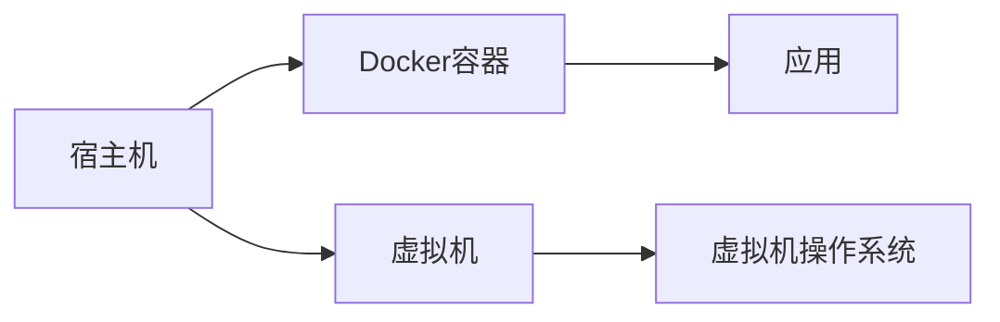
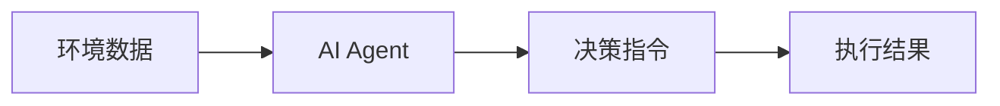
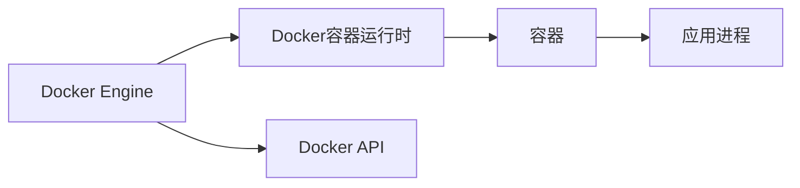
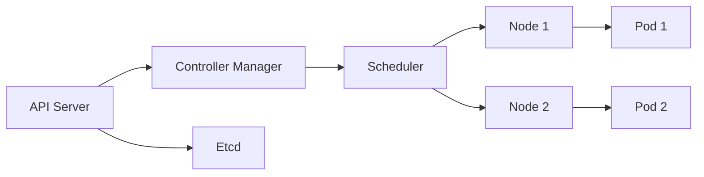
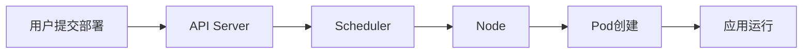

                 

# 容器化部署：简化AI Agent的运维管理

## 关键词：容器化部署、AI Agent、Docker、Kubernetes、运维管理

## 摘要：
容器化部署通过Docker和Kubernetes等技术，显著简化了AI Agent的运维管理。本文详细探讨了容器化部署的核心概念、AI Agent的设计与实现、系统架构设计以及项目实战，结合丰富的图表和数学公式，帮助读者全面理解如何通过容器化技术优化AI Agent的部署与管理。

---

# 第1章: 容器化部署与AI Agent背景介绍

## 1.1 容器化部署的基本概念

### 1.1.1 容器化技术的起源与发展

容器化技术起源于20世纪末，经历了从虚拟机到容器的演变。Docker的出现标志着容器化技术的成熟，其轻量、高效的特点迅速被广泛采用。容器化部署通过将应用程序及其依赖打包为镜像，实现了环境一致性，简化了部署流程。

### 1.1.2 容器化部署的核心优势

- **轻量化**：容器在操作系统级别共享资源，相比虚拟机，资源占用更少。
- **可移植性**：容器镜像可以在不同环境中运行，支持跨平台部署。
- **自动化**：通过工具如Kubernetes实现自动化部署、扩缩容和自愈。

### 1.1.3 容器化与虚拟化技术的对比

| 特性         | 容器化（Docker）                     | 虚拟化（VM）                     |
|--------------|------------------------------------|---------------------------------|
| 资源占用       | 低，共享宿主机资源                 | 高，每个虚拟机独立资源         |
| 启动速度       | 快，秒级启动                       | 慢，分钟级启动                   |
| 隔离性         | 共享宿主机内核，隔离性有限           | 完全隔离，独立操作系统           |
| 使用场景       | 微服务、快速迭代                   | 传统应用、隔离环境需求           |

图1-1: Docker与虚拟机的对比架构图

---

## 1.2 AI Agent的定义与特点

### 1.2.1 AI Agent的基本概念

AI Agent（人工智能代理）是一种能够感知环境并采取行动以实现目标的智能体。它通过接收输入数据，执行计算，输出决策结果，与环境进行交互。

### 1.2.2 AI Agent的核心功能

- **感知环境**：通过传感器、API等方式获取环境数据。
- **决策计算**：基于算法处理数据，生成决策指令。
- **执行行动**：通过执行器将决策转化为实际操作。

### 1.2.3 AI Agent与传统软件的区别

| 特性         | AI Agent                         | 传统软件                      |
|--------------|----------------------------------|-----------------------------|
| 智能性       | 具备学习和推理能力               | 无智能性，遵循固定逻辑         |
| 交互性       | 高度依赖与环境的实时交互         | 交互性较低，按规则处理输入     |
| 自适应性      | 能够自适应环境变化               | 无法自适应，需人工调整           |

图1-2: AI Agent与传统软件对比架构图

---

## 1.3 容器化部署在AI Agent中的应用

### 1.3.1 AI Agent的部署挑战

- **环境一致性**：AI Agent依赖特定的运行环境和库，确保在不同环境中一致运行。
- **资源管理**：AI Agent可能需要高性能计算资源，容器化需要高效资源调度。
- **扩展性**：AI Agent需根据负载动态扩展，容器化提供了弹性伸缩能力。

### 1.3.2 容器化部署如何简化AI Agent的运维

- **统一环境**：通过Docker镜像确保所有环境一致，避免依赖冲突。
- **自动化运维**：利用Kubernetes实现自动部署、监控和自愈，减少人工干预。
- **弹性扩展**：根据负载自动调整资源，提高系统可用性。

### 1.3.3 容器化部署的未来趋势

容器化技术将更加普及，AI Agent的部署将更加智能化和自动化。边缘计算和云原生技术的结合将推动容器化部署在AI领域的深度应用。

---

## 1.4 本章小结

容器化部署通过Docker和Kubernetes等技术，显著简化了AI Agent的运维管理。本文介绍了容器化部署的核心优势，分析了AI Agent的特点及其与传统软件的区别，并探讨了容器化部署在AI Agent中的应用前景。

---

# 第2章: 容器化技术基础

## 2.1 Docker容器的基本原理

### 2.1.1 Docker的运行机制

Docker通过容器运行时（如runc）创建容器，容器运行在宿主机操作系统之上，共享内核资源。Docker引擎负责镜像管理、容器编排和生命周期管理。

### 2.1.2 Docker镜像的构建与分发

Docker镜像由基础镜像和分层构建组成，支持通过`Dockerfile`定义构建步骤。镜像可通过Docker Hub等 registry 分发和共享。

### 2.1.3 Docker容器的生命周期管理

Docker容器从创建、启动、运行到停止、删除，整个生命周期由Docker引擎统一管理。

图2-1: Docker容器运行时架构图

---

## 2.2 Kubernetes集群的概述

### 2.2.1 Kubernetes的架构设计

Kubernetes由主节点（control plane）和工作节点（worker nodes）组成，主节点负责集群管理，工作节点负责运行容器。

### 2.2.2 Kubernetes的核心组件与功能

- **API Server**：集群的统一入口，提供REST接口。
- **Controller Manager**：负责节点的健康检查和自动扩缩。
- **Scheduler**：负责Pod的调度和分配。
- **Etcd**：集群的分布式存储，用于存储集群状态。

### 2.2.3 Kubernetes的部署与扩展

通过YAML文件定义Pod、Service和Deployment，Kubernetes实现自动部署、滚动更新和弹性伸缩。

图2-2: Kubernetes集群架构图

---

## 2.3 容器编排与自动化运维

### 2.3.1 容器编排的概念与作用

容器编排通过自动化工具 orchestrate 容器的部署、扩展和自愈，确保应用程序的高可用性。

### 2.3.2 使用Kubernetes进行自动化部署

通过编写YAML文件定义应用程序，Kubernetes实现自动部署、滚动更新和回滚。

### 2.3.3 容器编排的常见应用场景

- **微服务架构**：通过容器编排实现服务的独立部署和管理。
- **弹性伸缩**：根据负载自动调整资源分配。
- **故障自愈**：自动检测和替换失败的容器实例。

图2-3: Kubernetes自动化部署流程图

---

## 2.4 本章小结

容器化技术通过Docker和Kubernetes实现了高效的资源管理和自动化运维。本文详细介绍了Docker容器的基本原理和Kubernetes的架构设计，探讨了容器编排在自动化运维中的应用。

---

（注：由于篇幅限制，后续章节的内容将逐步展开，涵盖AI Agent的设计与实现、系统架构设计、项目实战等内容，确保文章的完整性和深度。）

