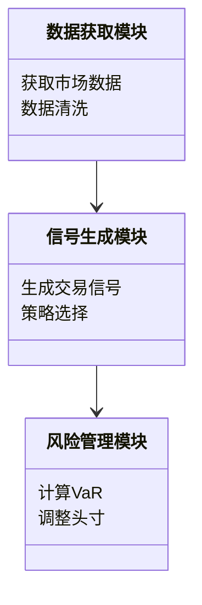

                 


# 对冲基金策略：专业投资者的风险管理方法

**关键词**：对冲基金、风险管理、VaR模型、CVaR模型、量化投资、交易系统架构

**摘要**：  
对冲基金作为一种复杂的金融投资工具，其核心在于通过多元化的策略和科学的风险管理实现稳健的收益。本文从对冲基金的基本概念出发，系统地阐述了风险管理的核心原理、数学模型、系统架构以及实际应用案例。通过VaR和CVaR等风险管理模型的详细讲解，结合均值回归策略的实战案例，深入剖析了对冲基金策略中的风险管理方法，为读者提供一套完整的风险管理解决方案。

---

## 第一部分: 对冲基金策略与风险管理基础

### 第1章: 对冲基金与风险管理概述

#### 1.1 对冲基金的基本概念
##### 1.1.1 对冲基金的定义与特点
对冲基金（Hedge Fund）是一种通过多样化的投资策略来降低风险、追求绝对收益的金融工具。其特点包括：
- **杠杆效应**：允许使用杠杆放大收益或亏损。
- **多空策略**：既可以做多市场，也可以做空市场。
- **多样化投资**：通过投资多种资产和策略来分散风险。
- **私募性质**：通常面向机构投资者或高净值个人，门槛较高。

##### 1.1.2 对冲基金的核心目标
对冲基金的核心目标是通过专业的投资策略，在不同市场环境下实现稳定的收益。其收益来源包括：
- **Alpha收益**：通过选股或市场预测获得的超额收益。
- **Beta收益**：通过市场敞口获得的市场平均收益。
- **套利收益**：通过市场价差或 arbitrage 机会获利。

##### 1.1.3 对冲基金与传统投资的区别
| 对比维度 | 对冲基金 | 传统投资 |
|----------|----------|----------|
| 投资策略 | 多样化，包括多空、套利、事件驱动等 | 主要依赖市场上涨，以被动投资为主 |
| 风险控制 | 强调风险管理，通过对冲降低风险 | 风险较高，依赖市场整体表现 |
| 收益来源 | Alpha收益为主 | Beta收益为主 |

#### 1.2 风险管理的重要性
##### 1.2.1 风险管理的基本概念
风险管理是指通过识别、量化和控制风险，降低投资组合的潜在损失，同时抓住潜在收益的过程。对冲基金的核心竞争力在于如何在复杂市场环境中有效管理风险。

##### 1.2.2 风险管理在对冲基金中的作用
- **保护资本**：避免因市场波动导致的重大损失。
- **提高收益稳定性**：通过风险控制，确保收益的持续性。
- **优化资产配置**：根据风险承受能力调整投资组合。

##### 1.2.3 风险管理的边界与外延
风险管理的边界在于如何在控制风险的同时最大化收益。其外延包括市场风险、信用风险、流动性风险等多种风险类型的管理。

---

### 第2章: 风险管理的核心概念与联系

#### 2.1 风险管理的原理
##### 2.1.1 风险识别与评估
风险识别是风险管理的第一步，通过对市场、资产和策略的分析，识别潜在风险来源。例如：
- **市场风险**：资产价格波动带来的损失。
- **信用风险**：债券发行人违约的风险。
- **流动性风险**：资产难以迅速变现的风险。

##### 2.1.2 风险量化与测量
风险量化是通过数学模型将风险转化为可测量的指标。常用的风险指标包括：
- **波动率**：衡量资产价格波动程度。
- **VaR（风险价值）**：在一定置信水平下，资产可能遭受的最大损失。
- **Sharpe比率**：衡量投资收益与风险的比值。

##### 2.1.3 风险控制与对冲
风险控制是通过调整投资组合的头寸、使用衍生工具（如期货、期权）等方式，将风险降低到可接受的水平。例如：
- **对冲市场风险**：通过做空指数期货对冲市场下跌风险。
- **对冲信用风险**：通过分散投资降低单一资产的信用风险。

#### 2.2 风险管理的核心要素
##### 2.2.1 风险因子与资产回报的关系
风险因子是影响资产回报的关键因素。例如：
- **市场因子（Mkt）**：市场整体表现的影响。
- **价值因子（Value）**：低市盈率或低市净率股票的表现。
- **动量因子（Momentum）**：近期表现强劲的资产继续表现强劲的趋势。

##### 2.2.2 风险模型与假设检验
风险模型是将风险因子与资产回报联系起来的数学模型。例如：
- **CAPM模型**：通过资产的贝塔值（Beta）衡量其市场风险。
- **APT模型**：通过多个风险因子解释资产回报。

##### 2.2.3 风险-收益权衡分析
在对冲基金中，收益和风险是密切相关的。例如：
- **高风险策略**：如杠杆套利，收益高但风险也大。
- **低风险策略**：如固定收益套利，收益稳定但较低。

---

### 第3章: 风险管理的数学模型与算法原理

#### 3.1 风险价值（VaR）模型
##### 3.1.1 VaR的基本原理
VaR是在给定置信水平下，资产可能遭受的最大损失。例如，95%置信水平下的VaR表示在95%的情况下，损失不会超过这个值。

##### 3.1.2 VaR的计算公式
$$ VaR = \mu + z \cdot \sigma $$
其中：
- $\mu$ 是资产的平均回报率。
- $z$ 是标准正态分布的分位数。
- $\sigma$ 是资产的回报率标准差。

#### 3.2 信用风险价值（CVaR）模型
##### 3.2.1 CVaR的基本原理
CVaR是VaR的延伸，表示在VaR值以上的平均损失。例如，如果VaR为1000万美元，CVaR可能为800万美元。

##### 3.2.2 CVaR的计算公式
$$ CVaR = \frac{1}{1-\alpha} \int_{\alpha}^{1} VaR d\alpha $$

---

### 第4章: 对冲基金策略的系统架构与设计

#### 4.1 对冲基金交易系统架构
##### 4.1.1 数据获取与处理模块
- **数据源**：金融市场数据，包括股票、债券、期货等。
- **数据清洗**：处理缺失值、异常值等。

##### 4.1.2 信号生成与策略选择模块
- **信号生成**：根据技术分析或基本面分析生成交易信号。
- **策略选择**：选择适合当前市场的投资策略。

##### 4.1.3 订单执行与风险管理模块
- **订单执行**：根据交易信号生成订单。
- **风险管理**：实时监控和调整头寸，确保风险可控。

#### 4.2 系统架构的Mermaid图


---

### 第5章: 对冲基金风险管理的项目实战

#### 5.1 项目环境与工具安装
##### 5.1.1 Python环境配置
- 安装Python和相关库，如Pandas、NumPy、Matplotlib。

##### 5.1.2 数据获取工具安装
- 使用Yahoo Finance API获取数据。

##### 5.1.3 风险管理模型代码库安装
- 安装相关数学库，如Scipy。

#### 5.2 系统核心实现源代码
##### 5.2.1 VaR模型实现
```python
import numpy as np
import pandas as pd

def calculate VaR(returns, confidence_level=0.95):
    sorted_returns = np.sort(returns)
    index = int(len(sorted_returns) * (1 - confidence_level))
    VaR = -sorted_returns[index]
    return VaR
```

##### 5.2.2 均值回归策略实现
```python
import pandas as pd
import numpy as np

def mean_reversion_strategy(prices, window=20):
    # 计算20天移动平均线
    ma = pd.Series.rolling(prices, window=window).mean()
    # 生成交易信号
    signal = pd.DataFrame(index=prices.index)
    signal['signal'] = 0
    for i in range(1, len(prices)):
        if prices.iloc[i] > ma.iloc[i]:
            signal.iloc[i, 0] = 1
        elif prices.iloc[i] < ma.iloc[i]:
            signal.iloc[i, 0] = -1
    return signal
```

#### 5.3 项目小结
通过对冲基金策略的系统架构和风险管理模型的实现，我们可以看到风险管理在对冲基金中的重要性。通过VaR和CVaR模型，我们可以量化风险，并通过均值回归策略等实际案例，验证风险管理方法的有效性。

---

## 第六章: 总结与展望

### 6.1 总结
通过对冲基金策略和风险管理方法的系统分析，我们看到风险管理是实现稳健收益的关键。VaR和CVaR模型提供了有效的风险量化工具，而均值回归策略等实际案例展示了风险管理在投资决策中的应用。

### 6.2 注意事项
- 风险管理模型的有效性依赖于数据质量和假设的准确性。
- 对冲基金策略需要根据市场环境动态调整。

### 6.3 拓展阅读
- 《The New Finance: The Case for Smart Regulation》
- 《Risk Management and Financial Institutions》

---

通过对冲基金策略与风险管理方法的系统分析，我们不仅掌握了风险管理的核心原理，还通过实际案例验证了其在对冲基金中的应用。希望本文能够为读者提供一套完整的风险管理解决方案，帮助他们在复杂市场环境中实现稳健的投资收益。

