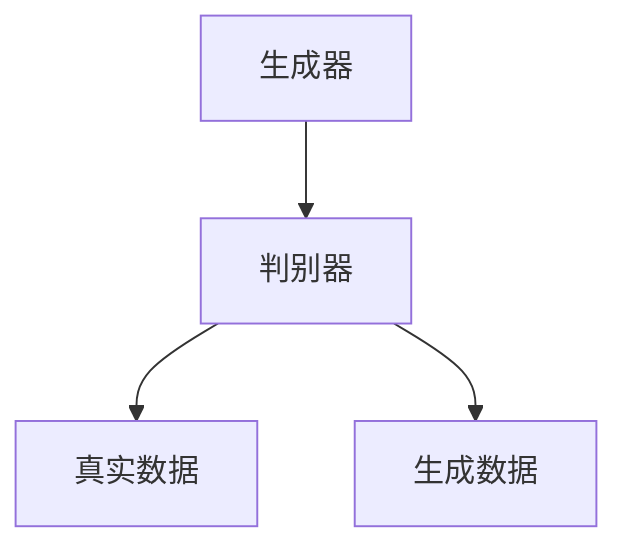
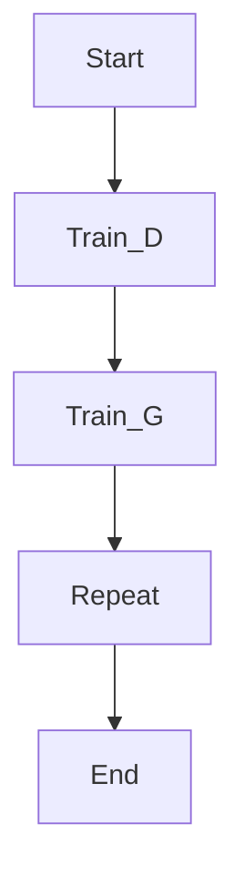
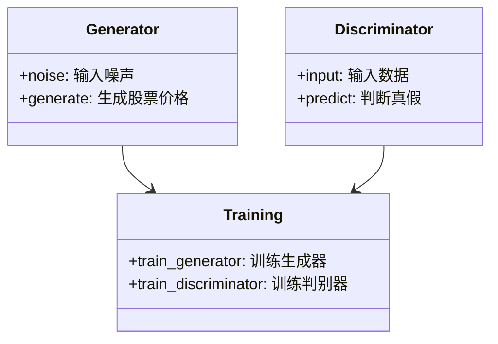
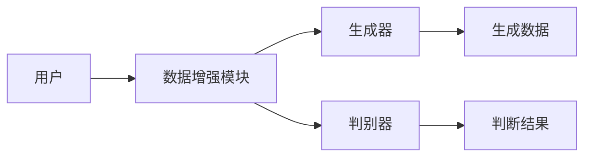
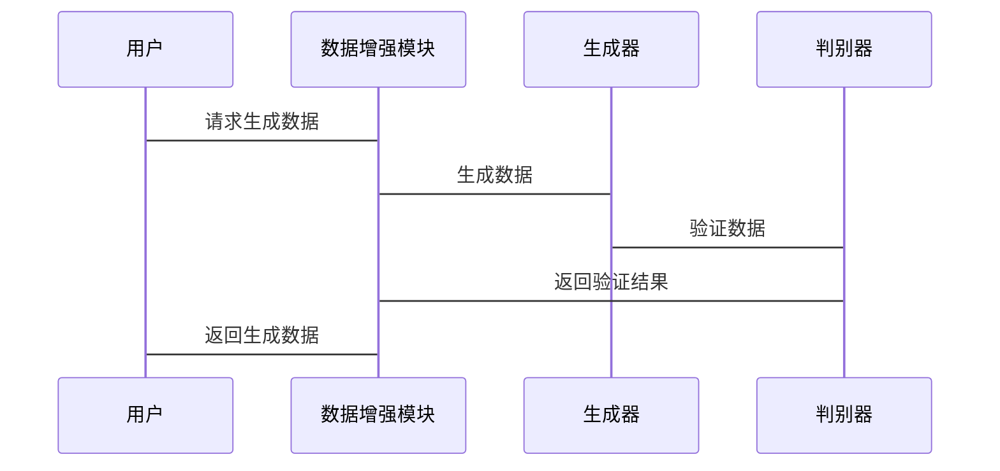

                 


# 对抗生成网络在金融数据增强中的应用

## 关键词

对抗生成网络, 金融数据增强, 深度学习, GAN, 金融数据分析

## 摘要

本文探讨了对抗生成网络（GANs）在金融数据增强中的应用。通过分析GANs的核心原理、系统架构设计以及实际项目案例，展示了如何利用GANs生成高质量的金融数据，提升模型性能和泛化能力。文章内容包括背景介绍、核心概念、算法原理、系统设计、项目实战和最佳实践，为读者提供全面而深入的技术指导。

---

## 第一部分: 对抗生成网络在金融数据增强中的应用概述

### 第1章: 背景介绍

#### 1.1 问题背景

金融数据通常具有高价值、复杂性和敏感性。然而，金融数据的获取和标注成本较高，且数据量可能不足，限制了模型的泛化能力。数据增强技术可以通过生成更多样化的数据来解决这些问题。对抗生成网络（GANs）作为一种强大的生成模型，能够生成逼真的金融数据，从而在不增加实际数据收集成本的情况下，提高模型性能。

#### 1.2 问题描述

金融数据增强的目标是通过生成更多的训练数据来提高模型的泛化能力。然而，传统数据增强方法可能无法生成具有高度真实性的数据。GANs通过生成器和判别器的对抗过程，能够生成高质量的数据，适用于金融时间序列预测、风险评估和欺诈检测等多种场景。

#### 1.3 数据增强的重要性

数据增强在金融领域的应用广泛，例如：

1. **金融时间序列预测**：通过生成更多的历史价格数据，帮助模型更好地捕捉市场趋势。
2. **信用评分**：生成更多样化的客户信用数据，提高模型的鲁棒性。
3. **欺诈检测**：生成正常交易数据，帮助模型更好地识别异常交易。

### 1.4 数据增强的边界与外延

- **边界**：数据增强应避免生成明显不合理的数据，例如负数的股票价格。
- **外延**：数据增强不仅限于生成数据，还可以用于数据清洗和数据扩展。

---

## 第二部分: 核心概念与联系

### 第2章: 对抗生成网络的核心原理

#### 2.1 GANs的基本原理

对抗生成网络由两部分组成：生成器（Generator）和判别器（Discriminator）。生成器的目标是生成与真实数据无法区分的数据，而判别器的目标是区分真实数据和生成数据。两者的对抗过程通过损失函数进行优化。

##### 2.1.1 生成器与判别器的对抗过程

- **生成器**：通过神经网络将随机噪声映射到数据空间，生成与真实数据相似的数据。
- **判别器**：通过神经网络判断输入数据是真实数据还是生成数据。

##### 2.1.2 损失函数的定义与优化

判别器的损失函数：
$$ L_D = -\mathbb{E}[\log(D(x)) + \log(1 - D(G(z)))] $$
生成器的损失函数：
$$ L_G = -\mathbb{E}[\log(D(G(z)))] $$

##### 2.1.3 GAN的训练流程

1. 初始化生成器和判别器的参数。
2. 训练判别器，使其能够区分真实数据和生成数据。
3. 训练生成器，使其生成的数据能够欺骗判别器。
4. 重复步骤2和3，直到生成器和判别器达到平衡。

#### 2.2 改进的GAN模型

##### 2.2.1 Wasserstein GAN（WGAN）

WGAN通过最小化Wasserstein距离，避免梯度消失问题，提高生成器的训练稳定性。

##### 2.2.2 CycleGAN

CycleGAN通过引入循环一致性损失，实现无监督学习，适用于跨市场的数据生成。

##### 2.2.3 其他改进模型的对比分析

| 模型   | 特点                              |
|--------|-----------------------------------|
| GAN    | 基础模型，训练不稳定               |
| WGAN   | 解决梯度消失问题，训练更稳定       |
| CycleGAN | 适用于无标签数据，跨领域生成     |

---

### 第3章: 核心概念与联系

#### 3.1 实体关系图

生成器和判别器的对抗关系：



#### 3.2 算法流程图

GAN的训练流程：



---

## 第三部分: 算法原理讲解

### 第4章: 对抗生成网络的数学模型

#### 4.1 损失函数

判别器的损失函数：
$$ L_D = -\mathbb{E}[\log(D(x)) + \log(1 - D(G(z)))] $$

生成器的损失函数：
$$ L_G = -\mathbb{E}[\log(D(G(z)))] $$

#### 4.2 生成器与判别器的对抗过程

生成器的更新规则：
$$ G \leftarrow \arg \min_G \mathbb{E}[\log(D(G(z)))] $$

判别器的更新规则：
$$ D \leftarrow \arg \min_D \mathbb{E}[\log(D(x)) + \log(1 - D(G(z)))] $$

#### 4.3 实际案例分析

假设我们使用Wasserstein GAN来生成股票价格数据。生成器将随机噪声映射到股票价格，判别器将判断输入数据是真实价格还是生成价格。通过不断优化生成器和判别器的参数，生成器能够生成逼真的股票价格数据。

---

## 第四部分: 系统分析与架构设计

### 第5章: 系统分析与架构设计方案

#### 5.1 问题场景介绍

我们设计一个基于GAN的金融数据增强系统，用于生成股票价格数据，帮助训练预测模型。

#### 5.2 项目介绍

项目名称：金融数据增强系统

目标：利用GAN生成逼真的股票价格数据，提高预测模型的性能。

#### 5.3 系统功能设计

##### 5.3.1 领域模型类图



##### 5.3.2 系统架构图



##### 5.3.3 接口和交互流程图



---

## 第五部分: 项目实战

### 第6章: 项目实战

#### 6.1 环境安装

- Python 3.8+
- TensorFlow或PyTorch
- scikit-learn等数据处理库

#### 6.2 系统核心实现源代码

##### 6.2.1 生成器代码

```python
import tensorflow as tf
import numpy as np

class Generator:
    def __init__(self, input_dim, output_dim):
        self.model = self.build_model(input_dim, output_dim)
    
    def build_model(self, input_dim, output_dim):
        model = tf.keras.Sequential([
            tf.keras.layers.Dense(256, activation='relu', input_dim=input_dim),
            tf.keras.layers.Dense(output_dim)
        ])
        return model

    def call(self, x):
        return self.model(x)
```

##### 6.2.2 判别器代码

```python
class Discriminator:
    def __init__(self, input_dim):
        self.model = self.build_model(input_dim)
    
    def build_model(self, input_dim):
        model = tf.keras.Sequential([
            tf.keras.layers.Dense(256, activation='relu', input_dim=input_dim),
            tf.keras.layers.Dense(1, activation='sigmoid')
        ])
        return model

    def call(self, x):
        return self.model(x)
```

#### 6.3 代码解读与分析

生成器通过多层感知机将随机噪声映射到股票价格空间。判别器通过多层感知机判断输入数据是真实数据还是生成数据。

#### 6.4 实际案例分析

假设我们使用生成器生成股票价格数据，判别器验证生成数据的合理性。通过不断优化生成器和判别器的参数，生成器能够生成逼真的股票价格数据，帮助训练预测模型。

#### 6.5 项目总结

通过本项目，我们展示了如何利用GAN生成逼真的金融数据，提高模型的泛化能力。生成器和判别器的对抗过程是关键，通过不断优化模型参数，可以生成高质量的数据。

---

## 第六部分: 最佳实践

### 第7章: 最佳实践

#### 7.1 小结

本文详细介绍了对抗生成网络在金融数据增强中的应用，包括GANs的核心原理、系统架构设计和项目实战。通过本文，读者可以理解如何利用GANs生成高质量的金融数据，提高模型性能。

#### 7.2 注意事项

- 在生成数据时，需确保数据的合理性和真实性。
- 需根据具体场景选择合适的GAN模型。
- 需对生成数据进行验证和分析，确保其适用性。

#### 7.3 拓展阅读

- 《Generative Adversarial Nets》（Goodfellow等，2014）
- 《Wasserstein GAN》（Arjovsky等，2017）
- 《CycleGAN: Instance-level Image Translation with Consistency Loss》（Zhu等，2017）

---

## 结语

对抗生成网络在金融数据增强中的应用具有重要的现实意义。通过本文的详细讲解，读者可以深入了解GANs的核心原理和应用场景，并能够实际操作生成器和判别器的代码，生成高质量的金融数据，提升模型的性能和泛化能力。

