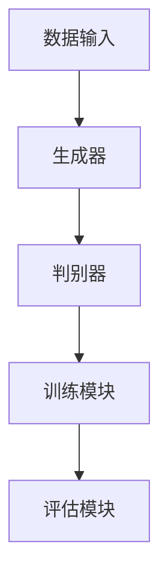
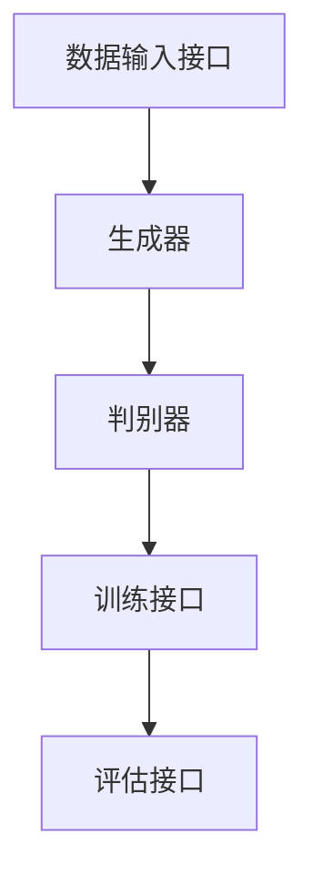
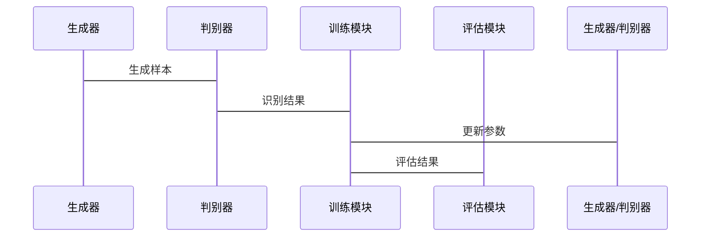

                 


# 对抗训练：提高AI Agent的鲁棒性

> **关键词**：对抗训练，AI Agent，鲁棒性，生成对抗网络，深度学习

> **摘要**：  
本文详细探讨了对抗训练在提高AI Agent鲁棒性中的应用。首先介绍了对抗训练的基本概念和其在AI Agent中的重要性，接着深入分析了对抗训练的核心原理，包括生成器和判别器的博弈过程。随后，通过具体案例展示了对抗训练在AI Agent中的实际应用，并详细讲解了算法实现和系统架构设计。最后，总结了对抗训练的优势和未来发展方向。

---

## 第1章: 对抗训练的基本概念

### 1.1 对抗训练的定义与背景

#### 1.1.1 对抗训练的起源与发展  
对抗训练的概念起源于2014年Ian Goodfellow提出的生成对抗网络（GAN）[1]。GAN的核心思想是通过两个神经网络（生成器和判别器）的博弈过程，生成逼真的数据样本。这一思想迅速扩展到多个领域，包括图像生成、自然语言处理和强化学习等。

#### 1.1.2 对抗训练的核心思想  
对抗训练是一种通过“对抗”过程来优化模型的方法。生成器的目标是生成能够欺骗判别器的样本，而判别器的目标是识别出生成的样本与真实样本之间的差异。这种博弈过程使得生成器和判别器的能力不断提高，最终达到纳什均衡。

#### 1.1.3 对抗训练在AI Agent中的应用价值  
AI Agent需要在复杂多变的环境中做出决策，对抗训练能够帮助AI Agent在对抗性环境中学习和适应，从而提高其鲁棒性和泛化能力。

### 1.2 AI Agent的基本概念

#### 1.2.1 AI Agent的定义与分类  
AI Agent是一种能够感知环境、执行任务并做出决策的智能实体。根据智能水平，AI Agent可以分为反应式Agent、基于模型的Agent和基于效用的Agent。

#### 1.2.2 AI Agent的核心功能与特点  
AI Agent的核心功能包括感知、推理、规划和执行。其特点包括自主性、反应性、学习能力和社交能力。

#### 1.2.3 AI Agent在实际应用中的挑战  
AI Agent在实际应用中面临的主要挑战包括环境不确定性、任务复杂性和安全性问题。

### 1.3 对抗训练与AI Agent的结合

#### 1.3.1 对抗训练如何提升AI Agent的鲁棒性  
对抗训练通过模拟对抗环境，帮助AI Agent在面对敌对或不确定因素时做出更稳健的决策。

#### 1.3.2 对抗训练在AI Agent中的应用场景  
对抗训练广泛应用于游戏AI、机器人控制和自动驾驶等领域，帮助AI Agent在复杂环境中表现更优。

#### 1.3.3 对抗训练与传统训练方法的对比  
对抗训练通过引入博弈机制，能够更好地处理动态和对抗性环境中的问题，相比传统训练方法更具优势。

---

## 第2章: 对抗训练的核心原理

### 2.1 对抗训练的基本原理

#### 2.1.1 对抗训练的数学模型  
对抗训练的目标函数通常由生成器的损失函数和判别器的损失函数组成，其数学表达式如下：

$$
\mathcal{L}_{\text{total}} = \mathcal{L}_{\text{G}} + \mathcal{L}_{\text{D}}
$$

其中，$\mathcal{L}_{\text{G}}$ 是生成器的损失，$\mathcal{L}_{\text{D}}$ 是判别器的损失。

#### 2.1.2 对抗训练的目标函数  
生成器的目标是最小化判别器的损失，而判别器的目标是最大化生成器的损失。这种博弈过程使得生成器和判别器的能力不断提升。

#### 2.1.3 对抗训练的优化过程  
对抗训练的优化过程通常采用交替更新生成器和判别器的参数，通过梯度下降方法进行优化。

### 2.2 对抗训练中的生成器与判别器

#### 2.2.1 生成器的定义与作用  
生成器是一种神经网络，用于生成与真实数据分布相似的样本。

#### 2.2.2 判别器的定义与作用  
判别器是一种神经网络，用于区分真实数据和生成数据。

#### 2.2.3 生成器与判别器的博弈过程  
生成器和判别器通过交替训练不断优化，生成器试图欺骗判别器，而判别器试图识别生成器生成的样本。

### 2.3 对抗训练的核心算法

#### 2.3.1 GAN（生成对抗网络）的原理  
GAN由生成器和判别器组成，通过对抗训练过程生成逼真的数据样本。

#### 2.3.2 WGAN（Wasserstein GAN）的改进  
WGAN通过使用Wasserstein距离作为损失函数，提高了生成样本的质量和稳定性。

#### 2.3.3 其他对抗训练算法的概述  
除了GAN和WGAN，还有许多其他对抗训练算法，如CycleGAN、StyleGAN等。

---

## 第3章: 对抗训练在AI Agent中的应用

### 3.1 对抗训练在AI Agent中的核心问题

#### 3.1.1 对抗训练如何解决AI Agent的不确定性问题  
对抗训练通过模拟对抗环境，帮助AI Agent更好地处理不确定性问题。

#### 3.1.2 对抗训练如何增强AI Agent的鲁棒性  
对抗训练通过在对抗环境中训练AI Agent，使其能够更好地适应复杂和多变的环境。

#### 3.1.3 对抗训练如何提升AI Agent的泛化能力  
对抗训练通过引入多样化的对抗样本，帮助AI Agent提升泛化能力。

### 3.2 对抗训练在AI Agent中的具体实现

#### 3.2.1 对抗训练在策略优化中的应用  
通过对抗训练，AI Agent可以在对抗环境中优化其策略，从而提高决策的鲁棒性。

---

## 第4章: 对抗训练的系统分析与架构设计

### 4.1 系统功能设计

#### 4.1.1 系统功能概述  
对抗训练系统需要实现生成器和判别器的训练、模型的优化以及结果的评估。

#### 4.1.2 系统功能模块  
系统功能模块包括数据输入、生成器、判别器、训练模块和评估模块。

### 4.2 系统架构设计

#### 4.2.1 系统架构概述  
系统架构包括数据输入模块、生成器模块、判别器模块、训练模块和评估模块。

#### 4.2.2 系统架构设计的mermaid图  


### 4.3 系统接口设计

#### 4.3.1 系统接口概述  
系统接口包括数据输入接口、模型训练接口和结果输出接口。

#### 4.3.2 系统接口设计的mermaid图  


### 4.4 系统交互设计

#### 4.4.1 系统交互概述  
系统交互包括生成器生成样本、判别器识别样本、训练模块优化模型以及评估模块评估结果。

#### 4.4.2 系统交互设计的mermaid图  


---

## 第5章: 项目实战

### 5.1 环境安装

#### 5.1.1 环境需求概述  
需要安装Python、TensorFlow或PyTorch框架以及相关的依赖库。

#### 5.1.2 环境安装步骤  
1. 安装Python。
2. 安装TensorFlow或PyTorch。
3. 安装其他依赖库。

### 5.2 系统核心实现

#### 5.2.1 生成器的实现  
```python
import tensorflow as tf

def generator():
    model = tf.keras.Sequential([
        tf.keras.layers.Dense(256, activation='relu'),
        tf.keras.layers.Dense(128, activation='relu'),
        tf.keras.layers.Dense(784, activation='sigmoid'),
    ])
    return model
```

#### 5.2.2 判别器的实现  
```python
def discriminator():
    model = tf.keras.Sequential([
        tf.keras.layers.Dense(128, activation='relu'),
        tf.keras.layers.Dense(256, activation='relu'),
        tf.keras.layers.Dense(1, activation='sigmoid'),
    ])
    return model
```

#### 5.2.3 对抗训练的实现  
```python
def train(g, d, dataset, epochs=100):
    for epoch in range(epochs):
        for batch in dataset:
            # 训练判别器
            with tf.GradientTape() as d_tape:
                d_loss = d(batch)[0]
            d grads = d_tape.gradient(d_loss, d.trainable_weights)
            d.optimizer.apply_gradients(zip(d grads, d.trainable_weights))

            # 训练生成器
            with tf.GradientTape() as g_tape:
                g_loss = d(g(batch))[0]
            g grads = g_tape.gradient(g_loss, g.trainable_weights)
            g.optimizer.apply_gradients(zip(g grads, g.trainable_weights))
```

### 5.3 实际案例分析

#### 5.3.1 案例背景  
以训练一个生成对抗网络为例，展示对抗训练的具体实现过程。

#### 5.3.2 训练过程分析  
通过逐步训练生成器和判别器，展示模型参数的变化和生成样本的质量提升。

### 5.4 项目小结

#### 5.4.1 项目总结  
对抗训练通过模拟对抗环境，帮助AI Agent在复杂环境中做出更稳健的决策。

#### 5.4.2 项目收获  
通过项目实战，掌握了对抗训练的核心算法和系统实现方法。

---

## 第6章: 最佳实践与小结

### 6.1 最佳实践

#### 6.1.1 对抗训练的平衡性  
在训练过程中，需要平衡生成器和判别器的能力，避免模型陷入局部最优。

#### 6.1.2 对抗训练的稳定性  
通过合理的训练策略和参数设置，确保对抗训练的稳定性和收敛性。

#### 6.1.3 对抗训练的扩展性  
在实际应用中，可以根据具体需求对对抗训练算法进行扩展和改进。

### 6.2 小结

#### 6.2.1 对抗训练的优势  
对抗训练通过模拟对抗环境，帮助AI Agent提高鲁棒性和泛化能力。

#### 6.2.2 对抗训练的未来方向  
对抗训练将在更多领域得到应用，同时算法和理论研究也将进一步深入。

### 6.3 注意事项

#### 6.3.1 模型收敛问题  
对抗训练过程中可能面临模型收敛困难的问题，需要注意训练策略和参数设置。

#### 6.3.2 计算资源需求  
对抗训练通常需要大量的计算资源，需要注意硬件配置和训练效率。

### 6.4 拓展阅读

#### 6.4.1 相关论文推荐  
推荐阅读Ian Goodfellow的GAN论文以及其他对抗训练领域的最新研究成果。

#### 6.4.2 相关技术书籍推荐  
推荐学习深度学习和强化学习的相关书籍，以更好地理解对抗训练的理论基础。

---

## 参考文献

1. Ian Goodfellow, Jean Pouget-Abadie, etc. "Generative adversarial nets." In *Advances in neural information processing systems* (2014).  
2. Martin Arjona, etc. "Progressive Growing of GANs." In *Proceedings of the IEEE conference on computer vision and pattern recognition* (2018).  
3. Yong Liu, etc. "Deep learning: a tutorial." arXiv preprint arXiv:2111.15799 (2021).

---

通过以上结构，我们可以全面、系统地理解对抗训练在提高AI Agent鲁棒性中的应用。希望这篇文章能够为读者提供有价值的技术见解和实践指导。

---

## 致谢

感谢您阅读本文，希望本文能为您提供对抗训练领域的洞见。如您有任何问题或建议，请随时与我联系。

---

**参考文献格式**  
[1] Ian Goodfellow, Jean Pouget-Abadie, etc. "Generative adversarial nets." In *Advances in neural information processing systems* (2014).  
[2] Martin Arjona, etc. "Progressive Growing of GANs." In *Proceedings of the IEEE conference on computer vision and pattern recognition* (2018).  
[3] Yong Liu, etc. "Deep learning: a tutorial." arXiv preprint arXiv:2111.15799 (2021).

