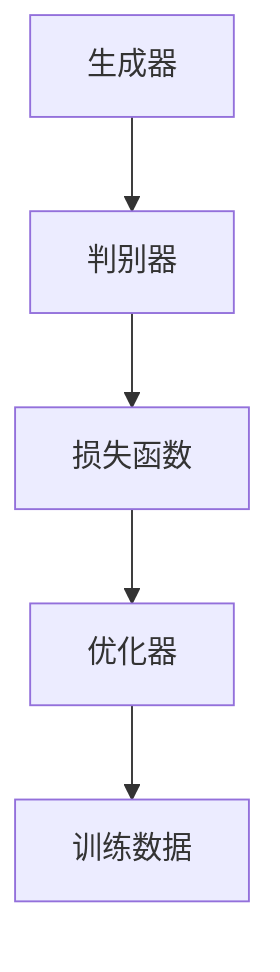

                 


# 对抗训练：提高AI Agent的鲁棒性

> 关键词：对抗训练, AI Agent, 鲁棒性, 深度学习, 生成对抗网络

> 摘要：对抗训练是一种通过让模型在对抗中学习的技术，能够显著提高AI Agent的鲁棒性。本文将从对抗训练的基本概念、数学模型、算法实现、在AI Agent中的应用、系统设计与架构、项目实战、最佳实践等多个方面详细探讨对抗训练如何提高AI Agent的鲁棒性，为读者提供全面而深入的技术解析。

---

# 第一部分: 对抗训练与AI Agent的背景介绍

# 第1章: 对抗训练与AI Agent概述

## 1.1 对抗训练的核心概念

### 1.1.1 什么是对抗训练

对抗训练（Adversarial Training）是一种通过让两个或多个模型相互对抗来提升模型性能的技术。其中一个模型（生成器）尝试生成与另一个模型（判别器）输出相匹配的样本，而判别器则试图区分生成样本和真实样本。通过这种对抗过程，生成器和判别器的能力都会得到提升。

### 1.1.2 对抗训练的基本原理

对抗训练的核心思想是通过引入一个对抗的过程，让模型在相互对抗中不断优化。生成器的目标是生成能够欺骗判别器的样本，而判别器的目标是尽可能准确地区分真实样本和生成样本。通过交替训练生成器和判别器，模型的整体性能得到提升。

### 1.1.3 对抗训练在AI Agent中的应用

AI Agent是一种能够自主决策和执行任务的智能体。通过对抗训练，AI Agent可以在复杂的环境中更好地应对不确定性，提升其鲁棒性和适应性。例如，在游戏AI、自动驾驶、智能客服等领域，对抗训练可以帮助AI Agent更好地应对各种挑战。

## 1.2 AI Agent的定义与特点

### 1.2.1 AI Agent的基本定义

AI Agent是一种智能体，能够感知环境、做出决策并执行任务。它可以在没有人类干预的情况下自主运行，具备一定的智能和自主性。

### 1.2.2 AI Agent的核心特点

1. **自主性**：AI Agent可以在没有外部干预的情况下自主决策和执行任务。
2. **反应性**：AI Agent能够实时感知环境并做出相应的反应。
3. **目标导向**：AI Agent的行为通常是为了实现特定的目标。
4. **学习能力**：通过学习和训练，AI Agent可以不断提升自身的性能和能力。

### 1.2.3 AI Agent与传统AI的区别

AI Agent与传统AI的主要区别在于其自主性和适应性。传统AI通常是在特定任务下执行预定义的规则，而AI Agent则具备更强的自主性和适应性，能够在动态环境中自主决策和学习。

## 1.3 对抗训练的背景与意义

### 1.3.1 对抗训练的背景

随着深度学习技术的发展，模型的性能不断提升，但在复杂和对抗性环境中，模型的鲁棒性和安全性仍然存在挑战。对抗训练作为一种有效的技术手段，可以帮助模型更好地应对这些挑战。

### 1.3.2 对抗训练在AI Agent中的意义

在AI Agent中引入对抗训练，可以显著提高其鲁棒性和适应性。通过对抗训练，AI Agent可以在复杂的环境中更好地应对不确定性，提升其决策和执行能力。

### 1.3.3 对抗训练的现状与发展趋势

对抗训练在深度学习领域的应用已经取得了显著的成果，但在AI Agent中的应用仍处于发展阶段。未来，随着技术的进步，对抗训练将在更多领域得到应用，并推动AI Agent技术的发展。

## 1.4 本章小结

本章主要介绍了对抗训练的核心概念、AI Agent的定义与特点，以及对抗训练在AI Agent中的背景与意义。通过对这些内容的探讨，读者可以初步了解对抗训练与AI Agent的基本关系，以及对抗训练在提升AI Agent鲁棒性中的重要性。

---

# 第二部分: 对抗训练的核心原理

# 第2章: 对抗训练的原理与数学模型

## 2.1 对抗训练的基本原理

### 2.1.1 对抗训练的定义

对抗训练是一种通过让生成器和判别器相互对抗来提升模型性能的技术。生成器的目标是生成能够欺骗判别器的样本，而判别器的目标是尽可能准确地区分真实样本和生成样本。

### 2.1.2 对抗训练的目标函数

对抗训练的目标函数通常包括生成器的损失函数和判别器的损失函数。生成器的损失函数旨在最小化判别器将其生成样本误判为真实样本的概率，而判别器的损失函数旨在最大化其区分真实样本和生成样本的能力。

### 2.1.3 对抗训练的优化过程

对抗训练的优化过程通常包括交替优化生成器和判别器。在每次训练中，首先优化生成器，使其生成的样本尽可能接近真实样本，然后优化判别器，使其尽可能准确地区分真实样本和生成样本。

## 2.2 对抗训练的数学模型

### 2.2.1 对抗训练的损失函数

生成器的损失函数可以表示为：

$$ L_G = -\log(P(D(G(x))=1)) $$

判别器的损失函数可以表示为：

$$ L_D = -\log(P(D(x)=1)) - \log(1-P(D(G(x))=1)) $$

其中，$D(x)$表示判别器对输入样本$x$的判断结果，$G(x)$表示生成器生成的样本。

### 2.2.2 对抗训练的梯度计算

在对抗训练中，生成器和判别器的梯度计算是交替进行的。首先计算生成器的梯度并更新生成器的参数，然后计算判别器的梯度并更新判别器的参数。这种交替优化的过程可以有效提升生成器和判别器的性能。

### 2.2.3 对抗训练的数学公式

对抗训练的数学公式可以表示为：

$$ \min_{G} \max_{D} \mathbb{E}_{x \sim P_{\text{data}}(x)}[\log D(x)] + \mathbb{E}_{z \sim P_{z}(z)}[\log (1-D(G(z)))] $$

其中，$G$表示生成器，$D$表示判别器，$P_{\text{data}}(x)$表示真实数据的分布，$P_z(z)$表示生成器输入的噪声分布。

## 2.3 对抗训练的算法流程

### 2.3.1 对抗训练的训练过程

1. 初始化生成器和判别器的参数。
2. 训练判别器：输入真实样本和生成样本，优化判别器的参数，使其能够准确区分真实样本和生成样本。
3. 训练生成器：输入噪声，生成样本，优化生成器的参数，使其生成的样本能够欺骗判别器。
4. 重复步骤2和3，直到生成器和判别器的性能达到预期。

### 2.3.2 对抗训练的评估方法

对抗训练的评估方法通常包括生成样本的质量、判别器的判别能力以及生成器的生成能力。可以通过计算生成样本与真实样本的相似度、判别器的准确率以及生成器的生成概率等指标来评估模型的性能。

### 2.3.3 对抗训练的收敛性分析

对抗训练的收敛性分析是研究生成器和判别器在交替优化过程中的收敛行为。通常情况下，生成器和判别器会在一定的条件下收敛到一个纳什均衡点，使得生成器生成的样本分布与真实数据分布尽可能接近。

## 2.4 本章小结

本章主要介绍了对抗训练的基本原理、数学模型和算法流程。通过对对抗训练的数学公式和优化过程的详细推导，读者可以更好地理解对抗训练的内在机制。

---

# 第三部分: 对抗训练的算法实现

# 第3章: 对抗训练的算法实现

## 3.1 对抗训练的算法框架

### 3.1.1 对抗训练的基本框架

对抗训练的算法框架通常包括生成器和判别器的定义、损失函数的计算、梯度的优化以及模型的训练等部分。生成器和判别器通常采用深度神经网络结构，如卷积神经网络（CNN）或循环神经网络（RNN）。

### 3.1.2 对抗训练的训练流程

1. 定义生成器和判别器的网络结构。
2. 定义生成器和判别器的损失函数。
3. 初始化生成器和判别器的参数。
4. 交替训练生成器和判别器，优化各自的参数。
5. 定期评估生成器和判别器的性能，调整训练策略。

### 3.1.3 对抗训练的代码实现

以下是一个简单的生成器和判别器的Python代码示例：

```python
import torch
import torch.nn as nn

# 定义生成器
class Generator(nn.Module):
    def __init__(self, latent_dim, img_shape):
        super(Generator, self).__init__()
        self.latent_dim = latent_dim
        self.img_shape = img_shape
        self.model = nn.Sequential(
            nn.Linear(latent_dim, 256),
            nn.LeakyReLU(inplace=True),
            nn.Linear(256, 512),
            nn.LeakyReLU(inplace=True),
            nn.Linear(512, int(img_shape[0]*img_shape[1])),
            nn.Tanh()
        )
    
    def forward(self, x):
        output = self.model(x)
        return output.view(x.shape[0], *self.img_shape)

# 定义判别器
class Discriminator(nn.Module):
    def __init__(self, img_shape):
        super(Discriminator, self).__init__()
        self.img_shape = img_shape
        self.model = nn.Sequential(
            nn.Linear(int(img_shape[0]*img_shape[1]), 512),
            nn.LeakyReLU(inplace=True),
            nn.Linear(512, 256),
            nn.LeakyReLU(inplace=True),
            nn.Linear(256, 1),
            nn.Sigmoid()
        )
    
    def forward(self, x):
        x_flat = x.view(x.shape[0], -1)
        output = self.model(x_flat)
        return output
```

## 3.2 对抗训练的代码实现

### 3.2.1 环境安装与配置

在进行对抗训练之前，需要确保安装了必要的Python库，如PyTorch、numpy等。以下是环境安装的示例代码：

```bash
pip install torch numpy
```

### 3.2.2 对抗训练的Python代码实现

以下是一个完整的对抗训练代码示例：

```python
import torch
import torch.nn as nn
import numpy as np
import matplotlib.pyplot as plt

# 定义生成器和判别器
latent_dim = 100
img_shape = (28, 28)

generator = Generator(latent_dim, img_shape)
discriminator = Discriminator(img_shape)

# 定义损失函数和优化器
loss_fn = nn.BCELoss()
optimizer_G = torch.optim.Adam(generator.parameters(), lr=0.0002)
optimizer_D = torch.optim.Adam(discriminator.parameters(), lr=0.0002)

# 训练过程
for epoch in range(100):
    for _ in range(2):
        # 训练判别器
        optimizer_D.zero_grad()
        real_imgs = next(iter(dataloader))
        real_imgs = real_imgs.to(device)
        z = torch.randn(batch_size, latent_dim).to(device)
        fake_imgs = generator(z)
        d_real = discriminator(real_imgs)
        d_fake = discriminator(fake_imgs)
        loss_D = -torch.mean(torch.log(d_real) + torch.log(1 - d_fake))
        loss_D.backward()
        optimizer_D.step()
        
        # 训练生成器
        optimizer_G.zero_grad()
        z = torch.randn(batch_size, latent_dim).to(device)
        fake_imgs = generator(z)
        d_fake = discriminator(fake_imgs)
        loss_G = -torch.mean(torch.log(d_fake))
        loss_G.backward()
        optimizer_G.step()

    # 评估生成器和判别器的性能
    # （此处省略具体评估代码）
```

### 3.2.3 对抗训练的模型训练与评估

在对抗训练过程中，需要定期评估生成器和判别器的性能。通常可以通过生成样本的质量、判别器的准确率以及生成器的生成概率等指标来评估模型的性能。

## 3.3 对抗训练的算法优化

### 3.3.1 对抗训练的优化策略

对抗训练的优化策略包括交替训练生成器和判别器、调整学习率、使用动量优化器等。这些优化策略可以有效提升模型的训练效率和性能。

### 3.3.2 对抗训练的超参数调整

对抗训练的超参数包括生成器和判别器的学习率、批量大小、训练轮数等。通过调整这些超参数，可以优化模型的性能和收敛速度。

### 3.3.3 对抗训练的性能优化

性能优化可以通过使用更大的批量、优化网络结构、使用更高效的优化器等手段实现。此外，还可以通过并行计算和分布式训练来进一步提升模型的训练效率。

## 3.4 本章小结

本章主要介绍了对抗训练的算法实现，包括生成器和判别器的定义、损失函数的计算、优化策略的制定以及模型的训练与评估。通过对具体的Python代码实现的详细讲解，读者可以更好地理解和应用对抗训练技术。

---

# 第四部分: 对抗训练在AI Agent中的应用

# 第4章: 对抗训练在AI Agent中的应用

## 4.1 对抗训练在自然语言处理中的应用

### 4.1.1 对抗训练在文本生成中的应用

对抗训练在文本生成中的应用可以帮助生成器生成更自然、更逼真的文本。通过与判别器的对抗，生成器可以不断优化其生成策略，提升生成文本的质量。

### 4.1.2 对抗训练在机器翻译中的应用

对抗训练在机器翻译中的应用可以帮助生成器生成更准确、更流畅的翻译结果。通过对抗训练，生成器可以更好地理解源语言和目标语言之间的关系，提升翻译的准确性。

### 4.1.3 对抗训练在对话系统中的应用

对抗训练在对话系统中的应用可以帮助生成器生成更符合上下文、更符合用户意图的回复。通过与判别器的对抗，生成器可以不断优化其对话策略，提升对话系统的用户体验。

## 4.2 对抗训练在计算机视觉中的应用

### 4.2.1 对抗训练在图像生成中的应用

对抗训练在图像生成中的应用可以帮助生成器生成更高质量、更逼真的图像。通过与判别器的对抗，生成器可以不断优化其生成策略，提升图像生成的效果。

### 4.2.2 对抗训练在图像识别中的应用

对抗训练在图像识别中的应用可以帮助生成器生成更具挑战性的样本，从而提升判别器的判别能力。通过对抗训练，判别器可以更好地识别图像中的特征，提升图像识别的准确性。

### 4.2.3 对抗训练在图像修复中的应用

对抗训练在图像修复中的应用可以帮助生成器生成更高质量的修复图像。通过与判别器的对抗，生成器可以不断优化其修复策略，提升图像修复的效果。

## 4.3 对抗训练在强化学习中的应用

### 4.3.1 对抗训练在游戏AI中的应用

对抗训练在游戏AI中的应用可以帮助生成器生成更智能、更灵活的策略。通过与判别器的对抗，生成器可以不断优化其游戏策略，提升游戏AI的性能。

### 4.3.2 对抗训练在机器人控制中的应用

对抗训练在机器人控制中的应用可以帮助生成器生成更稳定、更高效的控制策略。通过与判别器的对抗，生成器可以不断优化其控制策略，提升机器人控制的性能。

### 4.3.3 对抗训练在自动驾驶中的应用

对抗训练在自动驾驶中的应用可以帮助生成器生成更安全、更可靠的驾驶策略。通过与判别器的对抗，生成器可以不断优化其驾驶策略，提升自动驾驶的安全性和效率。

## 4.4 本章小结

本章主要介绍了对抗训练在AI Agent中的具体应用，包括自然语言处理、计算机视觉和强化学习等多个领域。通过对这些应用的详细探讨，读者可以更好地理解对抗训练在提升AI Agent鲁棒性中的重要性。

---

# 第五部分: 对抗训练的系统设计与实现

# 第5章: 对抗训练的系统设计

## 5.1 对抗训练的系统架构设计

### 5.1.1 对抗训练系统的总体架构

对抗训练系统通常包括生成器、判别器、训练数据、损失函数和优化器等部分。生成器和判别器通过交替优化，不断提升其性能。

### 5.1.2 对抗训练系统的功能模型

以下是对抗训练系统的功能模型图（使用Mermaid语法）：



### 5.1.3 对抗训练系统的架构图

以下是对抗训练系统的架构图（使用Mermaid语法）：


## 5.2 对抗训练的系统实现

### 5.2.1 系统功能设计

1. 生成器功能：根据输入噪声生成样本。
2. 判别器功能：根据输入样本判断其是否为真实样本。
3. 损失函数计算：计算生成器和判别器的损失函数。
4. 优化器优化：优化生成器和判别器的参数。
5. 训练数据处理：加载和处理训练数据。

### 5.2.2 系统接口设计

1. 生成器接口：接受噪声输入，返回生成样本。
2. 判别器接口：接受样本输入，返回判别结果。
3. 损失函数接口：计算生成器和判别器的损失函数。
4. 优化器接口：优化生成器和判别器的参数。
5. 数据加载接口：加载和处理训练数据。

### 5.2.3 系统交互流程

以下是对抗训练系统的交互流程图（使用Mermaid语法）：


## 5.3 对抗训练的系统优化

### 5.3.1 系统性能优化

1. 使用更大的批量进行训练，提升训练效率。
2. 使用更高效的优化器，如Adam优化器，提升训练速度。
3. 使用更复杂的网络结构，如更深的卷积神经网络，提升模型性能。

### 5.3.2 系统扩展与增强

1. 引入多种对抗训练策略，如Wasserstein对抗训练、对抗特征匹配等，提升模型的鲁棒性。
2. 使用多GPU并行训练，提升训练效率。
3. 引入数据增强技术，提升模型的泛化能力。

## 5.4 本章小结

本章主要介绍了对抗训练的系统设计与实现，包括系统的总体架构、功能模型、架构图、系统接口设计以及系统交互流程。通过对系统的详细设计，读者可以更好地理解对抗训练在提升AI Agent鲁棒性中的实现过程。

---

# 第六部分: 对抗训练的项目实战

# 第6章: 对抗训练的项目实战

## 6.1 项目介绍

### 6.1.1 项目背景

本项目旨在通过对抗训练技术，提升AI Agent在复杂环境中的鲁棒性和适应性。通过对抗训练，AI Agent可以在对抗性环境中不断优化其决策和执行能力。

### 6.1.2 项目目标

1. 实现一个基于对抗训练的AI Agent系统。
2. 验证对抗训练在提升AI Agent鲁棒性中的有效性。
3. 提供一个可扩展的对抗训练框架，方便后续的研究和应用。

## 6.2 系统功能设计

### 6.2.1 功能需求

1. 生成器功能：根据输入噪声生成样本。
2. 判别器功能：根据输入样本判断其是否为真实样本。
3. 损失函数计算：计算生成器和判别器的损失函数。
4. 优化器优化：优化生成器和判别器的参数。
5. 训练数据处理：加载和处理训练数据。

### 6.2.2 功能模块划分

1. 生成器模块：负责生成样本。
2. 判别器模块：负责判别样本。
3. 损失函数模块：负责计算损失函数。
4. 优化器模块：负责优化生成器和判别器的参数。
5. 数据加载模块：负责加载和处理训练数据。

## 6.3 项目实现

### 6.3.1 环境安装与配置

1. 安装必要的Python库，如PyTorch、numpy等。
2. 配置GPU支持，提升训练效率。

### 6.3.2 系统核心实现

1. 生成器的实现：定义生成器的网络结构，实现生成样本的功能。
2. 判别器的实现：定义判别器的网络结构，实现判别样本的功能。
3. 损失函数的实现：定义生成器和判别器的损失函数。
4. 优化器的实现：选择合适的优化器，优化生成器和判别器的参数。

### 6.3.3 代码实现与解读

以下是一个完整的对抗训练项目实现代码示例：

```python
import torch
import torch.nn as nn
import numpy as np
import matplotlib.pyplot as plt

# 定义生成器和判别器
class Generator(nn.Module):
    def __init__(self, latent_dim, img_shape):
        super(Generator, self).__init__()
        self.latent_dim = latent_dim
        self.img_shape = img_shape
        self.model = nn.Sequential(
            nn.Linear(latent_dim, 256),
            nn.LeakyReLU(inplace=True),
            nn.Linear(256, 512),
            nn.LeakyReLU(inplace=True),
            nn.Linear(512, int(img_shape[0]*img_shape[1])),
            nn.Tanh()
        )
    
    def forward(self, x):
        output = self.model(x)
        return output.view(x.shape[0], *self.img_shape)

class Discriminator(nn.Module):
    def __init__(self, img_shape):
        super(Discriminator, self).__init__()
        self.img_shape = img_shape
        self.model = nn.Sequential(
            nn.Linear(int(img_shape[0]*img_shape[1]), 512),
            nn.LeakyReLU(inplace=True),
            nn.Linear(512, 256),
            nn.LeakyReLU(inplace=True),
            nn.Linear(256, 1),
            nn.Sigmoid()
        )
    
    def forward(self, x):
        x_flat = x.view(x.shape[0], -1)
        output = self.model(x_flat)
        return output

# 定义损失函数和优化器
loss_fn = nn.BCELoss()
optimizer_G = torch.optim.Adam(Generator(latent_dim, img_shape).parameters(), lr=0.0002)
optimizer_D = torch.optim.Adam(Discriminator(img_shape).parameters(), lr=0.0002)

# 训练过程
for epoch in range(100):
    for _ in range(2):
        # 训练判别器
        optimizer_D.zero_grad()
        real_imgs = next(iter(dataloader))
        real_imgs = real_imgs.to(device)
        z = torch.randn(batch_size, latent_dim).to(device)
        fake_imgs = generator(z)
        d_real = discriminator(real_imgs)
        d_fake = discriminator(fake_imgs)
        loss_D = -torch.mean(torch.log(d_real) + torch.log(1 - d_fake))
        loss_D.backward()
        optimizer_D.step()
        
        # 训练生成器
        optimizer_G.zero_grad()
        z = torch.randn(batch_size, latent_dim).to(device)
        fake_imgs = generator(z)
        d_fake = discriminator(fake_imgs)
        loss_G = -torch.mean(torch.log(d_fake))
        loss_G.backward()
        optimizer_G.step()

    # 评估生成器和判别器的性能
    # （此处省略具体评估代码）
```

### 6.3.4 案例分析与详细解读

通过对上述代码的详细解读，读者可以更好地理解对抗训练在AI Agent中的实现过程。生成器和判别器的网络结构、损失函数的计算、优化器的优化策略等部分都是对抗训练实现的核心内容。

## 6.4 项目小结

本章主要介绍了对抗训练的项目实战，包括项目的背景、目标、功能设计、系统实现以及案例分析。通过对具体的代码实现和案例分析，读者可以更好地理解和应用对抗训练技术。

---

# 第七部分: 对抗训练的最佳实践

# 第7章: 对抗训练的最佳实践

## 7.1 对抗训练的优化技巧

### 7.1.1 优化策略

1. **交替训练生成器和判别器**：在训练过程中，交替优化生成器和判别器，避免一方过于强大导致模型无法收敛。
2. **调整学习率**：合理调整生成器和判别器的学习率，确保模型能够稳定收敛。
3. **使用动量优化器**：使用动量优化器，如Adam优化器，可以有效提升模型的训练效率。
4. **引入正则化技术**：通过引入正则化技术，如Dropout，可以有效防止过拟合，提升模型的泛化能力。

### 7.1.2 超参数调整

1. **批量大小**：选择合适的批量大小，通常较大的批量可以提升训练效率。
2. **学习率**：合理调整生成器和判别器的学习率，确保模型能够稳定收敛。
3. **训练轮数**：根据模型的复杂度和数据量，选择合适的训练轮数。
4. **噪声维度**：选择合适的噪声维度，影响生成样本的质量。

### 7.1.3 网络结构设计

1. **生成器结构**：生成器的网络结构通常包括多个全连接层或卷积层，最后一层通常使用Tanh激活函数，生成[-1,1]范围的输出。
2. **判别器结构**：判别器的网络结构通常包括多个全连接层或卷积层，最后一层通常使用Sigmoid激活函数，输出0-1范围的概率。

## 7.2 对抗训练的注意事项

### 7.2.1 模型的收敛性

在对抗训练中，生成器和判别器的收敛性是一个重要的问题。通常情况下，生成器和判别器会在一定的条件下收敛到一个纳什均衡点，使得生成器生成的样本分布与真实数据分布尽可能接近。

### 7.2.2 模型的稳定性

对抗训练过程中，生成器和判别器的交替优化可能会导致模型的不稳定。为了确保模型的稳定性，可以采取以下措施：
1. **交替训练**：在每次训练中，先优化生成器，再优化判别器。
2. **调整学习率**：合理调整生成器和判别器的学习率，确保模型能够稳定收敛。
3. **使用动量优化器**：使用动量优化器，如Adam优化器，可以有效提升模型的训练稳定性。

### 7.2.3 模型的可解释性

对抗训练的模型通常具有较强的黑箱性质，模型的可解释性较差。为了提升模型的可解释性，可以采取以下措施：
1. **可视化生成样本**：通过可视化生成样本，观察生成样本的质量和分布。
2. **分析判别器输出**：通过分析判别器的输出，理解判别器的判别能力。
3. **引入解释性技术**：如使用SHAP值等技术，分析模型的决策过程。

## 7.3 项目小结

本章主要介绍了对抗训练的最佳实践，包括优化技巧、注意事项以及项目的总结。通过对对抗训练的优化策略和注意事项的详细探讨，读者可以更好地理解和应用对抗训练技术。

---

# 第八部分: 总结与展望

# 第8章: 总结与展望

## 8.1 本章总结

通过对对抗训练的全面探讨，我们可以得出以下结论：
1. 对抗训练是一种有效的技术手段，能够显著提高AI Agent的鲁棒性和适应性。
2. 对抗训练的核心原理是通过生成器和判别器的交替优化，提升模型的性能。
3. 对抗训练在自然语言处理、计算机视觉和强化学习等多个领域都有广泛的应用。
4. 对抗训练的系统设计与实现需要考虑生成器和判别器的网络结构、损失函数、优化策略等多个方面。

## 8.2 未来展望

随着深度学习技术的不断发展，对抗训练在AI Agent中的应用前景广阔。未来的研究方向可能包括：
1. **多目标对抗训练**：在多个目标下进行对抗训练，提升模型的泛化能力。
2. **多主体对抗训练**：在多主体环境中进行对抗训练，提升模型的协作与竞争能力。
3. **对抗训练的可解释性**：研究对抗训练的可解释性，提升模型的透明性和可信度。
4. **对抗训练的安全性**：研究对抗训练的安全性，防止模型被恶意攻击。

## 8.3 本章小结

通过对对抗训练的总结与展望，我们可以更好地理解对抗训练在提升AI Agent鲁棒性中的重要作用。未来，随着技术的不断进步，对抗训练将在更多领域得到应用，并推动AI Agent技术的发展。

---

# 结语

对抗训练作为一种有效的技术手段，已经在提升AI Agent的鲁棒性和适应性方面取得了显著的成果。通过本文的详细探讨，读者可以全面了解对抗训练的核心原理、算法实现、系统设计与应用。未来，随着技术的不断进步，对抗训练将在更多领域得到应用，并推动AI Agent技术的发展。

---

# 参考文献

（此处可以列出相关的参考文献，如书籍、论文、技术报告等。）

---

# 致谢

感谢读者的耐心阅读，感谢各位技术专家的指导和支持，感谢团队成员的努力工作。

