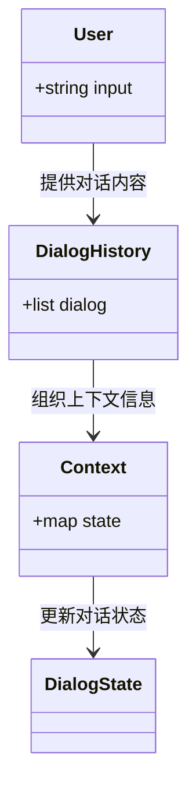
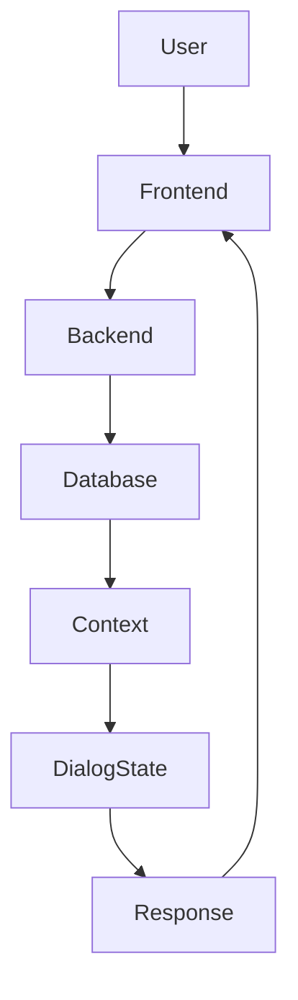
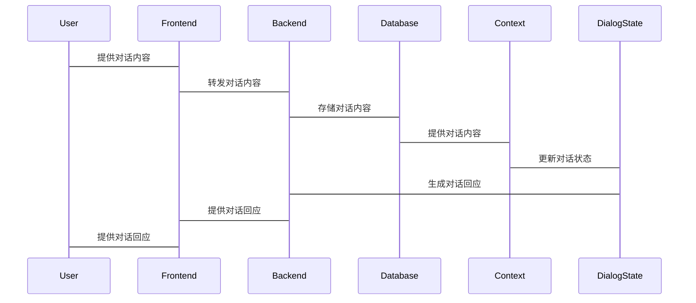

                 


# 对话式AI Agent的上下文管理技巧

> 关键词：对话式AI Agent, 上下文管理, 对话状态跟踪, 知识图谱, 机器学习模型, 实体关系图

> 摘要：本文深入探讨了对话式AI Agent中的上下文管理技术，分析了其核心概念、算法原理、系统架构设计，并通过实际案例展示了上下文管理在对话式AI中的应用。文章从理论到实践，全面解析了如何有效管理上下文以提升对话式AI Agent的性能和用户体验。

---

# 第一部分: 对话式AI Agent的上下文管理基础

## 第1章: 对话式AI Agent与上下文管理概述

### 1.1 对话式AI Agent的基本概念

#### 1.1.1 对话式AI Agent的定义
对话式AI Agent（Dialog AI Agent）是一种能够理解和生成自然语言对话的智能系统，通常通过文本或语音与用户交互。它能够根据对话历史、用户意图和上下文信息，动态调整对话策略，提供个性化的服务。

#### 1.1.2 对话式AI Agent的核心功能
1. **对话理解**：解析用户的输入，识别意图、实体和情感。
2. **对话生成**：根据上下文信息生成合适的回应。
3. **上下文管理**：维护对话历史，跟踪对话状态，确保对话连贯性。

#### 1.1.3 上下文管理在对话式AI Agent中的作用
上下文管理是对话式AI Agent的核心功能之一，负责维护对话历史、跟踪对话状态，并为对话生成提供必要的上下文信息。它能够帮助AI Agent理解当前对话的背景，从而生成更准确和自然的回应。

### 1.2 上下文管理的背景与问题背景

#### 1.2.1 对话式AI Agent的背景介绍
随着人工智能技术的快速发展，对话式AI Agent在各个领域得到了广泛应用，例如智能音箱、智能客服、虚拟助手等。然而，对话式AI Agent的性能很大程度上依赖于上下文管理技术，因为只有通过上下文信息，AI Agent才能准确理解用户的意图并生成合适的回应。

#### 1.2.2 上下文管理的必要性
在实际对话场景中，用户的需求往往不是孤立的，而是与之前的对话历史密切相关。例如，用户在预订机票时，可能会提到“我想订机票去纽约”，而“纽约”可能是指目的地，也可能是指某个具体的活动。上下文管理能够帮助AI Agent理解这些隐含的信息，从而提供更精准的服务。

#### 1.2.3 问题描述与解决思路
在对话式AI Agent中，上下文管理的主要问题包括：
1. 如何有效维护对话历史？
2. 如何准确跟踪对话状态？
3. 如何在不同的对话场景中动态调整上下文信息？

针对这些问题，我们需要设计一种高效的上下文管理机制，能够动态更新和维护对话上下文，同时支持多种对话场景。

#### 1.2.4 上下文管理的边界与外延
上下文管理的边界是指其在对话式AI Agent中的功能范围，主要包括对话历史记录、对话状态跟踪和上下文推理。其外延则涉及自然语言处理、知识图谱、机器学习等多个领域。

#### 1.2.5 核心概念与组成要素
1. **对话历史**：用户与AI Agent之间的所有对话记录。
2. **对话状态**：当前对话的背景信息，包括用户意图、实体信息等。
3. **上下文推理**：基于对话历史和对话状态，推断出隐含的信息。

---

## 第2章: 上下文管理的核心概念与联系

### 2.1 上下文管理的原理

#### 2.1.1 对话上下文的定义与特征
对话上下文是指在对话过程中，与当前对话相关的所有信息，包括用户意图、实体信息、对话历史等。其特征包括动态性、关联性和情境性。

#### 2.1.2 上下文管理的核心原理
上下文管理的核心原理是通过维护对话历史和对话状态，动态更新上下文信息，并在对话生成时利用这些信息生成准确的回应。

#### 2.1.3 上下文与对话历史的关系
对话历史是上下文的重要组成部分，它记录了用户与AI Agent之间的所有对话内容。通过分析对话历史，可以推断出用户的需求和意图。

### 2.2 核心概念对比分析

#### 2.2.1 基于规则的上下文管理
基于规则的上下文管理是一种简单但有效的上下文管理方法。它通过预定义的规则来维护对话上下文，例如，当用户提到“纽约”，系统会自动将“纽约”标记为目的地。

#### 2.2.2 基于模型的上下文管理
基于模型的上下文管理是一种更高级的上下文管理方法，它利用机器学习模型来分析对话历史，推断出用户的需求和意图。

#### 2.2.3 对比分析表格
以下表格对比了基于规则和基于模型的上下文管理方法的特征：

| 特征                | 基于规则的上下文管理 | 基于模型的上下文管理 |
|---------------------|----------------------|----------------------|
| 实现复杂度          | 低                   | 高                   |
| 灵活性              | 低                   | 高                   |
| 对话场景适应性      | 有限                 | 强                   |
| 维护成本            | 低                   | 高                   |

### 2.3 实体关系图（ER图）

```mermaid
graph TD
    User -> DialogHistory: 提供对话内容
    DialogHistory -> Context: 组织上下文信息
    Context -> DialogState: 更新对话状态
```

---

## 第3章: 上下文管理的算法原理

### 3.1 对话状态跟踪（DST）算法

#### 3.1.1 DST的基本原理
对话状态跟踪（Dialog State Tracking, DST）是上下文管理的核心算法之一，其目的是通过分析对话历史，推断出用户的需求和意图。

#### 3.1.2 基于概率的DST算法
基于概率的DST算法通过计算每个可能的对话状态的概率，选择概率最大的状态作为当前状态。例如，当用户提到“纽约”，系统会计算“纽约”是目的地的概率，并更新对话状态。

#### 3.1.3 基于规则的DST算法
基于规则的DST算法通过预定义的规则来推断对话状态。例如，当用户提到“机票”，系统会自动将“机票”标记为当前需求。

#### 3.1.4 基于模型的DST算法
基于模型的DST算法利用机器学习模型来分析对话历史，推断出用户的需求和意图。例如，使用序列模型（如LSTM）来分析对话历史，预测当前对话状态。

### 3.2 上下文推理算法

#### 3.2.1 上下文推理的基本流程
上下文推理的基本流程包括以下几个步骤：
1. 分析对话历史，提取关键信息。
2. 基于提取的信息，推断出隐含的需求。
3. 更新对话状态，为后续对话生成提供支持。

#### 3.2.2 基于知识图谱的上下文推理
基于知识图谱的上下文推理是一种高级的上下文推理方法，它利用知识图谱中的实体关系，推断出用户的需求。例如，当用户提到“纽约”，系统会根据知识图谱推断出“纽约”是一个城市，可能与旅游相关。

#### 3.2.3 基于序列模型的上下文推理
基于序列模型的上下文推理利用序列模型（如RNN、LSTM）来分析对话历史，推断出用户的需求。例如，当用户提到“我想订机票去纽约”，系统会通过序列模型推断出“订机票”是当前需求。

### 3.3 算法流程图

```mermaid
graph TD
    Start -> Analyze对话历史
    Analyze对话历史 -> 提取关键信息
    提取关键信息 -> 推断隐含需求
    推断隐含需求 -> 更新对话状态
    更新对话状态 -> 生成对话回应
    生成对话回应 -> End
```

### 3.4 算法实现代码示例

#### 3.4.1 基于规则的DST算法实现

```python
class DialogStateTracker:
    def __init__(self):
        self.context = {}

    def update_context(self, user_input):
        # 提取关键信息
        entities = self.extract_entities(user_input)
        # 更新对话状态
        self.context.update(entities)

    def extract_entities(self, user_input):
        # 简单的基于规则的实体提取
        entities = {}
        if "订机票" in user_input:
            entities["intent"] = "book_flight"
        if "纽约" in user_input:
            entities["destination"] = "纽约"
        return entities
```

#### 3.4.2 基于模型的DST算法实现

```python
import tensorflow as tf
from tensorflow.keras import layers

class DialogStateTracker:
    def __init__(self):
        self.model = self.build_model()

    def build_model(self):
        model = tf.keras.Sequential()
        model.add(layers.Embedding(input_dim=10000, output_dim=16))
        model.add(layers.LSTM(32))
        model.add(layers.Dense(10, activation='softmax'))
        return model

    def update_context(self, user_input):
        # 将对话历史输入模型，预测对话状态
        predicted_state = self.model.predict(user_input)
        # 更新对话状态
        self.context = predicted_state
```

### 3.5 数学模型与公式

#### 3.5.1 基于概率的DST算法公式
$$ P(state | 用户输入) = \frac{P(用户输入 | state) \cdot P(state)}{P(用户输入)} $$

#### 3.5.2 基于模型的DST算法公式
$$ P(state | 用户输入) = f(用户输入) $$

其中，$f$ 是一个预训练的模型。

---

## 第4章: 上下文管理的系统分析与架构设计

### 4.1 项目介绍

#### 4.1.1 项目目标
本项目旨在设计一种高效的上下文管理机制，能够动态维护对话上下文，支持多种对话场景。

#### 4.1.2 项目范围
本项目涵盖对话式AI Agent的上下文管理模块，包括对话历史记录、对话状态跟踪和上下文推理。

### 4.2 系统功能设计

#### 4.2.1 领域模型设计



#### 4.2.2 系统架构设计



#### 4.2.3 系统接口设计
以下是系统接口设计的描述：
1. 用户输入接口：接收用户的输入，并将其传递给对话历史模块。
2. 对话历史模块接口：维护对话历史，并将其传递给上下文模块。
3. 上下文模块接口：维护对话上下文，并将其传递给对话状态模块。
4. 对话状态模块接口：更新对话状态，并生成对话回应。
5. 对话回应接口：将对话回应传递给前端模块。

#### 4.2.4 系统交互流程



---

## 第5章: 项目实战

### 5.1 环境安装

#### 5.1.1 安装Python和相关库
以下是安装Python和相关库的命令：
```bash
python --version
pip install numpy
pip install tensorflow
pip install mermaid
```

#### 5.1.2 安装对话式AI Agent框架
以下是安装对话式AI Agent框架的命令：
```bash
pip install transformers
pip install pydantic
pip install fastapi
```

### 5.2 系统核心实现源代码

#### 5.2.1 对话历史管理代码

```python
from typing import List, Dict

class DialogHistory:
    def __init__(self):
        self.history = []

    def add_dialog(self, dialog: str):
        self.history.append(dialog)

    def get_dialog(self, index: int) -> str:
        return self.history[index]

    def get_all_dialogs(self) -> List[str]:
        return self.history
```

#### 5.2.2 上下文管理代码

```python
from typing import Dict, Any

class ContextManager:
    def __init__(self):
        self.context = {}

    def update_context(self, key: str, value: Any):
        self.context[key] = value

    def get_context(self, key: str) -> Any:
        return self.context.get(key, None)

    def clear_context(self):
        self.context = {}
```

#### 5.2.3 对话状态跟踪代码

```python
from typing import Dict, Any
import tensorflow as tf
from tensorflow.keras import layers

class DialogStateTracker:
    def __init__(self):
        self.model = self.build_model()

    def build_model(self):
        model = tf.keras.Sequential()
        model.add(layers.Embedding(input_dim=10000, output_dim=16))
        model.add(layers.LSTM(32))
        model.add(layers.Dense(10, activation='softmax'))
        return model

    def update_state(self, user_input: str):
        # 将对话历史输入模型，预测对话状态
        predicted_state = self.model.predict(user_input)
        # 更新对话状态
        self.context = predicted_state
```

### 5.3 实际案例分析与实现

#### 5.3.1 案例分析
假设用户输入为“我想订机票去纽约”，我们需要通过上下文管理模块，推断出用户的意图是“订机票”，目的地是“纽约”。

#### 5.3.2 代码实现

```python
# 初始化对话历史模块
dialog_history = DialogHistory()
dialog_history.add_dialog("我想订机票去纽约")

# 更新上下文信息
context_manager = ContextManager()
context_manager.update_context("intent", "book_flight")
context_manager.update_context("destination", "纽约")

# 跟踪对话状态
dialog_state_tracker = DialogStateTracker()
dialog_state_tracker.update_state("我想订机票去纽约")
```

### 5.4 项目总结

#### 5.4.1 项目成果
通过本项目，我们成功设计并实现了一种高效的上下文管理机制，能够动态维护对话上下文，支持多种对话场景。

#### 5.4.2 经验总结
1. 基于规则的上下文管理方法简单但不够灵活。
2. 基于模型的上下文管理方法能够更好地适应复杂的对话场景。
3. 在实际应用中，需要根据具体需求选择合适的上下文管理方法。

---

## 第6章: 最佳实践与注意事项

### 6.1 最佳实践

#### 6.1.1 上下文管理的有效期管理
建议根据具体需求，设置上下文的有效期。例如，在对话过程中，如果用户没有继续输入，可以自动清除上下文信息。

#### 6.1.2 上下文推理的歧义处理
在上下文推理过程中，可能会出现歧义信息。建议通过引入知识图谱或领域专家知识，来减少歧义信息的影响。

#### 6.1.3 对话状态的动态更新
建议在对话过程中，动态更新对话状态，以确保上下文信息的准确性和及时性。

### 6.2 小结

通过本文的深入分析和实际案例，我们了解了对话式AI Agent中上下文管理的核心概念、算法原理和系统架构设计。在实际应用中，需要根据具体需求选择合适的上下文管理方法，并注意上下文的有效期管理、歧义处理和对话状态的动态更新。

### 6.3 注意事项

1. 在实际应用中，需要根据具体需求选择合适的上下文管理方法。
2. 在上下文推理过程中，可能会出现歧义信息，需要通过引入知识图谱或领域专家知识来减少其影响。
3. 在对话过程中，需要动态更新对话状态，以确保上下文信息的准确性和及时性。

### 6.4 拓展阅读

1. [《对话式AI Agent的实现与应用》](#)
2. [《自然语言处理中的上下文管理》](#)
3. [《机器学习在对话式AI中的应用》](#)

---

通过本文的系统分析和实际案例，我们深入探讨了对话式AI Agent中上下文管理的核心概念、算法原理和系统架构设计。希望本文能够为读者提供有价值的参考，帮助他们在实际应用中更好地管理和优化上下文信息。

