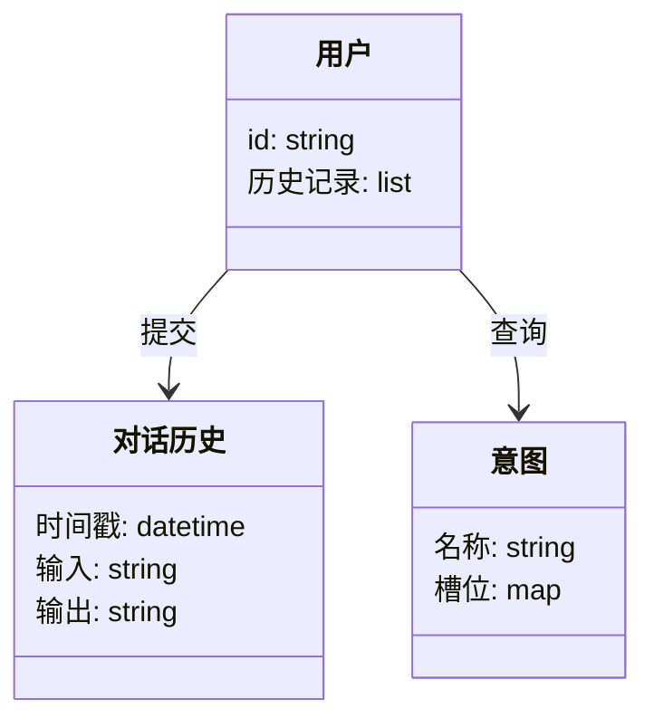
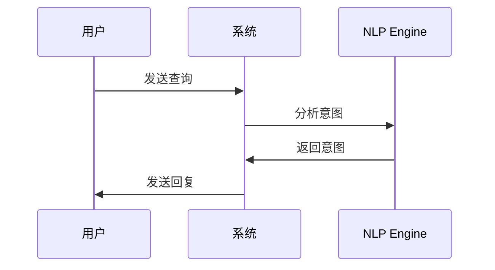

                 


```markdown
# 对话式AI Agent：提升用户交互体验

## 关键词：对话式AI Agent, 自然语言处理, 意图识别, 对话管理, 用户交互体验, 人工智能

## 摘要：对话式AI Agent是一种通过自然语言处理技术实现人机交互的智能系统，旨在提升用户体验。本文将从对话式AI Agent的核心概念、算法原理、系统架构、项目实战等方面进行详细探讨，分析其在提升用户交互体验中的应用与挑战，为读者提供全面的视角和深入的技术见解。

---

# 第1章: 对话式AI Agent概述

## 1.1 对话式AI Agent的定义与背景

### 1.1.1 什么是对话式AI Agent
对话式AI Agent（ Conversational AI Agent）是一种能够理解和生成自然语言的智能系统，通过模拟人类对话方式与用户交互，提供信息查询、任务执行等服务。

### 1.1.2 对话式AI Agent的发展历程
1. **早期阶段**：基于规则的对话系统，如简单的问答机器人。
2. **自然语言处理的突破**：引入统计学习和机器学习技术，提升对话理解和生成能力。
3. **当前阶段**：深度学习驱动的对话系统，如基于Transformer的模型。

### 1.1.3 当前对话式AI Agent的应用现状
- **智能家居**：如Alexa、Siri等。
- **客户服务**：自动应答用户咨询。
- **教育领域**：智能辅导系统。

### 1.1.4 对话式AI Agent的核心要素
- **用户需求分析**：识别用户的意图和情感。
- **对话流程设计**：构建合理的对话逻辑。
- **系统反馈机制**：根据用户反馈调整对话策略。

## 1.2 对话式AI Agent的优势与挑战

### 1.2.1 提升用户体验的优势
- **实时交互**：快速响应用户需求。
- **个性化服务**：根据用户行为和偏好提供定制化服务。

### 1.2.2 技术实现的挑战
- **上下文理解**：处理复杂对话中的上下文关系。
- **歧义处理**：解决用户表达的模糊性。

### 1.2.3 应用场景的边界
- **数据隐私**：处理用户敏感信息时需谨慎。
- **技术限制**：目前仍难以处理复杂的多轮对话。

## 1.3 对话式AI Agent的核心概念

### 1.3.1 对话式AI Agent的构成模块
- **自然语言理解模块**：负责解析用户输入。
- **对话管理模块**：维护对话状态。
- **响应生成模块**：生成合适的回复。

### 1.3.2 对话式AI Agent的工作流程
1. 用户输入：用户发送查询或指令。
2. 意图识别：系统解析用户的意图。
3. 对话管理：根据意图生成回复。
4. 响应生成：生成自然语言回复。

## 1.4 对话式AI Agent的核心要素

### 1.4.1 用户需求分析
- **意图识别**：识别用户的主要需求。
- **槽位填充**：提取关键信息。

### 1.4.2 对话流程设计
- **对话逻辑**：设计合理的对话流程。
- **异常处理**：应对用户输入的异常情况。

### 1.4.3 系统反馈机制
- **实时反馈**：及时响应用户。
- **状态管理**：维护对话上下文。

## 1.5 本章小结
本章介绍了对话式AI Agent的基本概念、发展历程、优势与挑战，并分析了其核心要素和工作流程。这些内容为后续章节的技术实现奠定了基础。

---

# 第2章: 对话式AI Agent的核心概念

## 2.1 对话式AI Agent的构成模块

### 2.1.1 自然语言理解模块
- **文本预处理**：分词、词性标注。
- **意图识别**：使用机器学习或深度学习模型识别用户意图。

### 2.1.2 对话管理模块
- **对话状态跟踪**：记录对话历史和当前状态。
- **对话策略**：根据状态选择合适的回复。

### 2.1.3 响应生成模块
- **文本生成**：使用生成模型生成回复。
- **语言优化**：优化生成文本的流畅性。

## 2.2 对话式AI Agent的工作流程

### 2.2.1 用户输入处理
1. 接收用户输入。
2. 进行文本预处理。

### 2.2.2 意图识别与槽位提取
- **意图识别**：使用模型预测用户意图。
- **槽位提取**：提取与意图相关的实体信息。

## 2.3 对话式AI Agent的核心技术

### 2.3.1 自然语言处理技术
- **分词**：将文本分割成词或短语。
- **句法分析**：分析句子结构。

### 2.3.2 意图识别与槽位填充
- **意图识别**：基于机器学习的分类任务。
- **槽位填充**：使用命名实体识别技术。

## 2.4 对话式AI Agent的核心原理

### 2.4.1 对话上下文管理
- **上下文表示**：使用向量表示对话历史。
- **上下文推理**：基于上下文进行推理。

### 2.4.2 对话策略制定
- **规则驱动**：基于预定义规则生成回复。
- **数据驱动**：基于训练数据生成回复。

## 2.5 本章小结
本章详细讲解了对话式AI Agent的构成模块、工作流程和技术原理，帮助读者理解其核心概念和实现原理。

---

# 第3章: 对话式AI Agent的算法原理

## 3.1 对话式AI Agent的算法概述

### 3.1.1 Seq2Seq模型
- **编码器**：将输入序列编码为向量。
- **解码器**：将编码向量解码为输出序列。

### 3.1.2 Transformer模型
- **自注意力机制**：捕捉文本中的长距离依赖。
- **前馈网络**：进行位置-wise的前馈计算。

## 3.2 对话式AI Agent的算法实现

### 3.2.1 Seq2Seq模型实现
```python
import tensorflow as tf
from tensorflow.keras.layers import Dense, LSTM, InputLayer

# 输入层
input_layer = InputLayer(input_shape=(None, input_dim))
# 编码器
lstm_encoder = LSTM(units=hidden_size, return_sequences=True)
encoder_output = lstm_encoder(input_layer)
# 解码器
lstm_decoder = LSTM(units=hidden_size, return_sequences=True)
decoder_output = lstm_decoder(encoder_output)
# 全连接层
dense_layer = Dense(output_dim, activation='softmax')
output = dense_layer(decoder_output)
```

### 3.2.2 Transformer模型实现
```python
import tensorflow as tf
from tensorflow.keras.layers import MultiHeadAttention, Dense, LayerNormalization

# 多头注意力
attention_layer = MultiHeadAttention(num_heads=num_heads, key_dim=key_dim)
attention_output = attention_layer(inputs, inputs)
# 前馈网络
ffn = Dense(units=hidden_size, activation='relu')
ffn_output = ffn(attention_output)
# 层规范化
layer_norm = LayerNormalization()
output = layer_norm(ffn_output)
```

## 3.3 对话式AI Agent的数学模型

### 3.3.1 Seq2Seq模型的损失函数
$$ \text{损失函数} = -\sum_{t=1}^{T} \text{log}(P(y_t|x)) $$

### 3.3.2 Transformer模型的注意力机制
$$ \text{注意力权重} = \frac{\exp(\text{QK}^T)}{\sum \exp(\text{QK}^T)} $$

## 3.4 对话式AI Agent的训练与优化

### 3.4.1 损失函数优化
- **交叉熵损失**：使用Adam优化器进行优化。

### 3.4.2 模型训练
- **数据预处理**：分词、去停用词。
- **模型训练**：使用训练数据训练模型。

## 3.5 本章小结
本章详细讲解了对话式AI Agent的算法原理，包括Seq2Seq和Transformer模型的实现及其数学基础，帮助读者理解其技术细节。

---

# 第4章: 对话式AI Agent的系统分析与架构设计

## 4.1 系统分析

### 4.1.1 项目背景
- **需求分析**：用户需要一个高效的对话系统。
- **技术选型**：选择合适的NLP框架和模型。

### 4.1.2 系统功能设计
- **用户输入处理**：接收用户的自然语言输入。
- **意图识别**：识别用户的意图和槽位。
- **对话管理**：维护对话状态，生成回复。

## 4.2 系统架构设计

### 4.2.1 领域模型设计


### 4.2.2 系统架构设计


## 4.3 系统接口设计

### 4.3.1 RESTful API设计
- **GET /dialog**：获取对话历史。
- **POST /intent**：识别意图。

### 4.3.2 数据接口设计
- **输入接口**：接收用户输入。
- **输出接口**：返回系统回复。

## 4.4 系统交互流程

### 4.4.1 用户与系统交互


## 4.5 本章小结
本章分析了对话式AI Agent的系统结构，设计了合理的系统架构和接口，为后续的实现提供了指导。

---

# 第5章: 对话式AI Agent的项目实战

## 5.1 环境搭建

### 5.1.1 安装Python
```bash
python --version
pip install --upgrade pip
```

### 5.1.2 安装必要的库
```bash
pip install tensorflow keras numpy
```

## 5.2 数据准备

### 5.2.1 数据收集
- **训练数据**：收集用户与系统的对话记录。
- **测试数据**：预留部分数据用于测试。

### 5.2.2 数据预处理
```python
import pandas as pd
df = pd.read_csv('dialogs.csv')
```

## 5.3 模型训练

### 5.3.1 模型实现
```python
class DialogModel:
    def __init__(self):
        self.model = self.build_model()

    def build_model(self):
        # 模型定义
        pass

    def train(self, data):
        # 模型训练
        pass
```

### 5.3.2 训练过程
```python
model = DialogModel()
model.train(train_data)
```

## 5.4 系统部署

### 5.4.1 服务启动
```python
from flask import Flask, request, jsonify

app = Flask(__name__)

@app.route('/dialog', methods=['POST'])
def handle_dialog():
    # 处理对话
    return jsonify({'response': 'Hello, World!'})
```

### 5.4.2 测试
```bash
curl -X POST http://localhost:5000/dialog -H "Content-Type: application/json" -d '{"input":"hello"}'
```

## 5.5 本章小结
本章通过实际项目展示了对话式AI Agent的实现过程，包括环境搭建、数据准备、模型训练和系统部署。

---

# 第6章: 对话式AI Agent的最佳实践与总结

## 6.1 最佳实践

### 6.1.1 数据质量管理
- **数据清洗**：去除噪声数据。
- **数据增强**：增加数据多样性。

### 6.1.2 模型选择
- **选择合适的模型**：根据需求选择Seq2Seq或Transformer。
- **模型调优**：优化超参数。

### 6.1.3 系统优化
- **性能优化**：优化响应时间。
- **资源优化**：减少计算资源消耗。

## 6.2 项目总结

### 6.2.1 核心收获
- **理解对话式AI Agent的技术细节**。
- **掌握项目实施的全过程**。

### 6.2.2 未来展望
- **多模态对话**：结合视觉信息进行对话。
- **更智能的对话管理**：引入强化学习提升对话质量。

## 6.3 本章小结
本章总结了对话式AI Agent的项目经验，提出了最佳实践建议，并展望了未来的发展方向。

---

# 附录

## 附录A: 参考文献
- [1] Vaswani, A., et al. "Attention Is All You Need." arXiv preprint arXiv:1706.03798, 2017.
- [2] Hochreiter, S., and J. Schmidhuber. "Long short-term memory." Neural computation, 1997.

## 附录B: 工具与API
- **Python库**：TensorFlow、Keras、NLTK。
- **NLP工具**：spaCy、Gensim。
- **API**：OpenAI API、Google Dialogflow。

## 附录C: 面试问题
- 什么是对话式AI Agent？
- 对话式AI Agent的核心技术有哪些？
- 如何设计一个高效的对话系统？

---

# 结束语

对话式AI Agent作为人工智能领域的重要应用，正在改变我们的生活方式。通过本文的深入探讨，读者可以全面理解其技术原理和实现方法。未来，随着技术的不断进步，对话式AI Agent将更加智能化和个性化，为用户提供更优质的交互体验。
```

