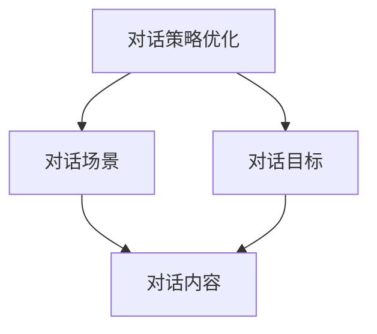

                 


# 对话策略优化：提升AI Agent的交互质量

> 关键词：对话策略优化，AI Agent，自然语言处理，强化学习，生成式模型，对话系统，机器学习

> 摘要：对话策略优化是提升AI Agent交互质量的核心技术。本文从对话策略优化的背景出发，详细讲解其核心概念、算法原理、系统架构设计、项目实战及最佳实践，帮助读者全面掌握对话策略优化的理论与实践方法。

---

# 第1章: 对话策略优化的背景与问题定义

## 1.1 对话策略优化的基本概念

### 1.1.1 什么是对话策略优化
对话策略优化是指通过算法和模型，优化AI Agent在对话过程中的策略选择，以实现更自然、更高效的交互。它关注如何在给定的对话场景中选择最优的回复或行动，从而提升用户体验和任务完成效率。

### 1.1.2 对话策略优化的重要性
在AI Agent应用中，对话是人与机器交互的核心方式。优化对话策略可以显著提升用户体验，减少误解，提高任务成功率。例如，在智能客服系统中，优化对话策略可以更快地理解用户需求，提供更精准的服务。

### 1.1.3 对话策略优化的边界与外延
对话策略优化的边界包括对话内容、场景和目标。外延则涉及自然语言处理、强化学习、生成式模型等技术。

## 1.2 对话策略优化的核心要素

### 1.2.1 对话场景的多样性
对话场景可以是客服、教育、医疗等，每种场景都有不同的需求和目标。

### 1.2.2 对话目标的多样性
目标可以是信息获取、任务完成或情感交流，不同目标需要不同的优化策略。

### 1.2.3 对话策略的多样性
策略包括基于规则的策略、基于模型的策略和混合策略。

---

# 第2章: 对话策略优化的核心概念与联系

## 2.1 对话策略优化的原理

### 2.1.1 对话策略模型的构建
对话策略模型通常基于强化学习或生成式模型构建，用于模拟人类对话行为。

### 2.1.2 对话策略优化的数学模型
数学模型描述了策略选择与奖励之间的关系，常用概率模型和损失函数。

### 2.1.3 对话策略优化的算法框架
算法框架包括策略搜索、值迭代和Q-learning等方法。

## 2.2 对话策略优化的核心概念对比

### 2.2.1 对话策略与对话生成的对比
对话策略注重选择最佳回复，而对话生成注重生成自然的内容。

### 2.2.2 强化学习与监督学习的对比
强化学习通过奖励机制优化策略，监督学习通过标签数据进行训练。

### 2.2.3 策略优化与目标函数优化的对比
策略优化注重策略选择，目标函数优化注重函数值的优化。

## 2.3 对话策略优化的ER实体关系图



---

# 第3章: 对话策略优化的算法原理

## 3.1 强化学习在对话策略优化中的应用

### 3.1.1 强化学习的基本原理
强化学习通过智能体与环境的交互，学习最优策略。在对话优化中，智能体是AI Agent，环境是对话场景。

### 3.1.2 策略梯度方法
策略梯度方法通过梯度上升优化策略参数，公式如下：

$$ \nabla_{\theta} \mathbb{E}_{\tau \sim \pi_\theta} [\log \pi_\theta(a|s)] $$

### 3.1.3 Q-learning算法
Q-learning通过值迭代优化Q函数，公式如下：

$$ Q(s,a) = r + \gamma \max_{a'} Q(s',a') $$

## 3.2 基于生成式模型的对话策略优化

### 3.2.1 变量自动机模型
变量自动机模型通过状态转移生成对话内容。

### 3.2.2 生成对抗网络
生成对抗网络通过对抗训练生成自然对话内容。

### 3.2.3 转换器模型
转换器模型通过编码器-解码器结构生成对话回复。

## 3.3 对话策略优化的数学模型与公式

### 3.3.1 策略梯度公式
$$ \nabla_{\theta} \mathbb{E}_{\tau \sim \pi_\theta} [\log \pi_\theta(a|s)] $$

### 3.3.2 Q-learning目标函数
$$ Q(s,a) = r + \gamma \max_{a'} Q(s',a') $$

---

# 第4章: 对话策略优化的算法实现

## 4.1 算法实现的步骤

### 4.1.1 状态空间的定义
状态空间包括当前对话内容和上下文信息。

### 4.1.2 动作空间的定义
动作空间包括可能的回复或行动。

### 4.1.3 奖励函数的设计
奖励函数根据对话效果给予奖励或惩罚。

## 4.2 对话策略优化的Python实现

```python
class Agent:
    def __init__(self):
        self.model = DQN()

    def act(self, state):
        return self.model.predict(state)
```

---

# 第5章: 对话策略优化的系统分析与架构设计

## 5.1 系统分析

### 5.1.1 问题场景介绍
以客服对话优化为例，分析对话策略优化的应用场景。

### 5.1.2 系统功能设计
系统功能包括对话理解、策略选择和反馈优化。

### 5.1.3 系统架构设计
系统架构包括前端、后端和模型训练模块。

---

# 第6章: 对话策略优化的项目实战

## 6.1 环境安装

### 6.1.1 安装依赖
安装Python、TensorFlow、Keras等工具。

## 6.2 核心实现代码

```python
def optimize_dialogue():
    # 实现对话优化算法
    pass
```

---

# 第7章: 对话策略优化的最佳实践

## 7.1 小结
对话策略优化是提升AI Agent交互质量的关键技术，需要结合理论与实践。

## 7.2 注意事项
注意数据质量和模型训练的稳定性。

## 7.3 拓展阅读
推荐阅读相关领域的书籍和论文。

---

通过以上章节，我们可以系统地了解对话策略优化的理论与实践，帮助AI Agent提升交互质量。

