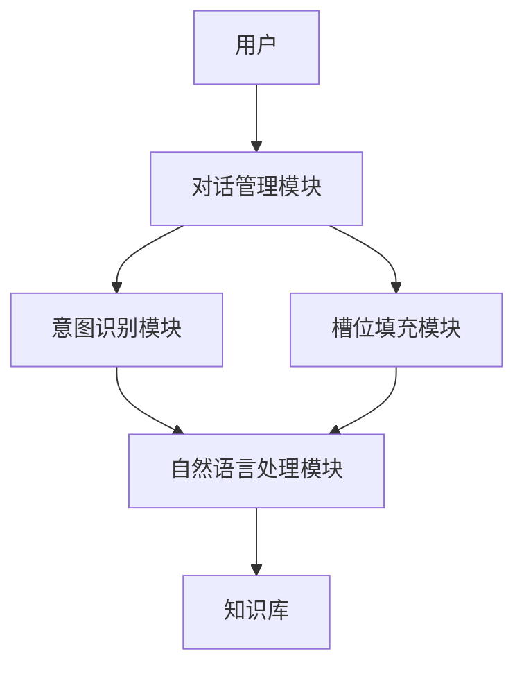
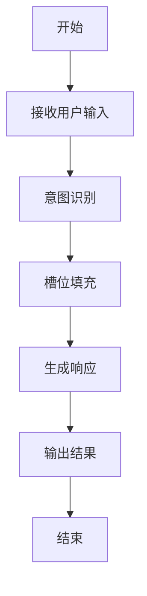
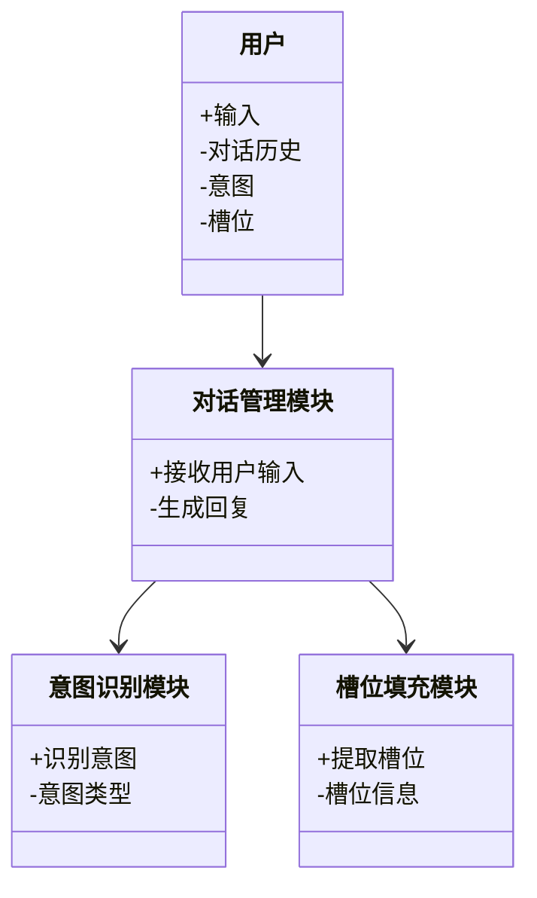
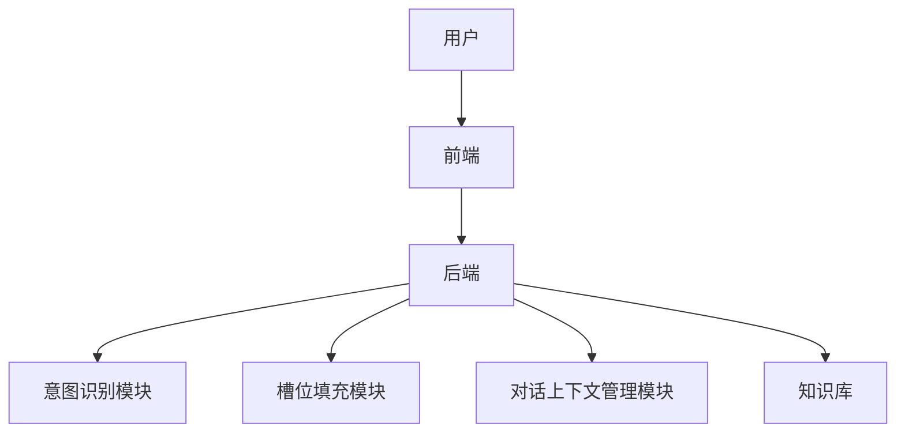
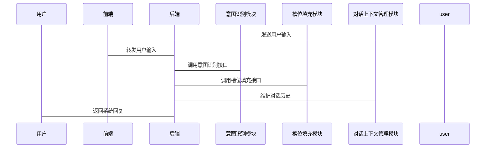

                 

<think>
好的，我将按照您的要求来撰写这篇文章。首先，我会从文章的标题和关键词开始，然后逐步展开各个部分的内容。让我们开始吧。

---

# 对话管理系统：构建流畅自然的人机交互

## 关键词：对话管理系统、人机交互、自然语言处理、AI大模型、对话上下文、意图识别、槽位填充

## 摘要：  
对话管理系统是实现流畅自然人机交互的核心技术，通过整合自然语言处理、意图识别和深度学习算法，构建智能化的对话系统。本文将详细探讨对话管理系统的背景、核心概念、算法原理、系统架构、项目实战以及最佳实践，帮助读者全面理解并掌握对话管理系统的构建方法。

---

# 第一部分: 对话管理系统概述

# 第1章: 对话管理系统的背景与概念

## 1.1 问题背景与挑战
### 1.1.1 人机交互的发展历程
从早期的命令行交互到图形用户界面，再到现在的自然语言交互，人机交互方式经历了多次演变。随着人工智能技术的快速发展，对话式交互逐渐成为用户与系统交互的主要方式。

### 1.1.2 当前对话系统的主要问题
1. **意图识别不准确**：用户输入的自然语言存在歧义，导致系统无法正确理解用户意图。
2. **对话上下文管理不足**：对话过程中缺乏对上下文的有效记忆和管理，导致对话不连贯。
3. **对话策略优化不足**：对话系统在多轮对话中缺乏灵活性和适应性，难以应对复杂场景。

### 1.1.3 对话管理系统的必要性
对话管理系统通过整合自然语言处理技术、意图识别算法和对话上下文管理，能够有效解决上述问题，提升人机交互的流畅性和自然性。

## 1.2 对话管理系统的定义与特点
### 1.2.1 对话管理系统的定义
对话管理系统是一种基于自然语言处理技术的系统，旨在理解和生成自然语言对话，通过分析用户输入，生成符合用户意图的响应。

### 1.2.2 对话系统的核心特点
1. **智能性**：能够理解用户意图并生成智能回复。
2. **上下文感知**：能够记忆对话历史，保持对话连贯性。
3. **灵活性**：能够根据对话进展调整对话策略。

### 1.2.3 对话系统与传统交互方式的区别
| 特性 | 传统交互方式 | 对话系统 |
|------|--------------|----------|
| 交互方式 | 命令式输入 | 自然语言对话 |
| 理解能力 | 基于规则 | 基于深度学习 |
| 交互体验 | 单向 | 双向互动 |

## 1.3 对话管理系统的边界与外延
### 1.3.1 对话系统的输入输出范围
- **输入**：用户的自然语言输入（如文本或语音）。
- **输出**：系统生成的自然语言回复。

### 1.3.2 对话系统的功能边界
- **意图识别**：识别用户的意图。
- **槽位填充**：提取对话中的关键信息。
- **对话上下文管理**：维护对话历史。

### 1.3.3 对话系统与其他系统的交互关系
- **前端**：接收用户输入并传递给后端。
- **后端**：处理对话逻辑并生成回复。
- **数据库**：存储对话历史和相关数据。

## 1.4 对话系统的概念结构与核心要素
### 1.4.1 对话系统的组成要素
1. **用户**：发起对话的主体。
2. **对话管理模块**：负责分析和生成对话内容。
3. **意图识别模块**：识别用户的意图。
4. **槽位填充模块**：提取对话中的关键信息。
5. **知识库**：提供对话所需的知识支持。

### 1.4.2 各要素之间的关系


### 1.4.3 对话系统的核心功能模块
- **意图识别模块**：通过自然语言处理技术，识别用户的意图。
- **槽位填充模块**：提取对话中的关键信息，如时间、地点等。
- **对话上下文管理模块**：维护对话历史，确保对话连贯。

## 1.5 本章小结
本章从背景、定义、特点、边界和组成要素等方面，全面介绍了对话管理系统的概念和核心要素。通过对比传统交互方式和对话系统的区别，明确了对话管理系统的独特性和必要性。

---

# 第二部分: 对话管理系统的原理与技术

# 第2章: 对话管理的核心概念与联系

## 2.1 对话管理的核心概念
### 2.1.1 意图识别
意图识别是对话管理系统中最为关键的环节之一，通过分析用户的自然语言输入，识别用户的意图。例如，用户说“我想订一张去北京的机票”，意图识别模块需要识别出用户的意图是“预订机票”。

### 2.1.2 槽位填充
槽位填充是指在识别用户意图的基础上，提取对话中的关键信息。例如，在“我想订一张去北京的机票”这句话中，槽位填充模块需要提取出“目的地”为“北京”，“时间”为“未指定”等信息。

### 2.1.3 对话上下文
对话上下文是指对话过程中积累的信息，用于保持对话的连贯性和一致性。例如，在一个多轮对话中，用户可能先询问“北京的天气怎么样”，然后接着问“明天呢？”，系统需要根据对话上下文理解用户的需求。

## 2.2 对话管理的核心原理
### 2.2.1 基于规则的对话管理
基于规则的对话管理是一种简单但有效的对话管理方式。通过预设规则，系统可以对用户的输入进行匹配，并生成相应的回复。例如，当用户说“我想订机票”，系统匹配到“订机票”的规则，生成“请提供航班信息”的回复。

### 2.2.2 基于统计的对话管理
基于统计的对话管理是一种数据驱动的对话管理方式。通过统计用户输入的频率和模式，系统可以自动生成合适的回复。这种方法适用于数据量较大的场景。

### 2.2.3 基于深度学习的对话管理
基于深度学习的对话管理是一种更为复杂的对话管理方式。通过训练大规模的数据集，系统可以自动生成符合用户意图的回复。这种方法适用于复杂的对话场景，如客服咨询、医疗咨询等。

## 2.3 对话管理的核心算法与模型
### 2.3.1 意图识别算法
意图识别算法主要包括以下几种：
1. **基于规则的方法**：通过预设规则匹配用户输入。
2. **基于统计的方法**：通过统计用户输入的频率和模式进行意图识别。
3. **基于深度学习的方法**：通过神经网络模型（如LSTM、Transformer）进行意图识别。

### 2.3.2 槽位填充算法
槽位填充算法主要包括以下几种：
1. **基于规则的方法**：通过预设规则提取槽位信息。
2. **基于统计的方法**：通过统计用户输入的模式提取槽位信息。
3. **基于深度学习的方法**：通过神经网络模型提取槽位信息。

### 2.3.3 对话策略优化算法
对话策略优化算法主要包括以下几种：
1. **基于规则的方法**：通过预设规则优化对话策略。
2. **基于统计的方法**：通过统计用户输入的模式优化对话策略。
3. **基于深度学习的方法**：通过神经网络模型优化对话策略。

## 2.4 对话系统的实体关系图


## 2.5 本章小结
本章详细介绍了对话管理系统的三个核心概念：意图识别、槽位填充和对话上下文，并探讨了基于规则、统计和深度学习的对话管理原理。通过实体关系图，明确了各模块之间的关系和交互流程。

---

# 第3章: 对话管理系统的算法原理

## 3.1 对话管理的核心算法
### 3.1.1 意图识别算法
意图识别算法是对话管理系统的核心算法之一。以下是常见的意图识别算法及其实现方式：

1. **基于规则的方法**
   - **实现方式**：通过预设规则匹配用户输入，例如关键词匹配。
   - **优缺点**：简单易实现，但难以应对复杂的对话场景。

2. **基于统计的方法**
   - **实现方式**：通过统计用户输入的频率和模式，例如使用TF-IDF算法。
   - **优缺点**：能够处理一定程度的复杂场景，但需要大量的数据支持。

3. **基于深度学习的方法**
   - **实现方式**：使用神经网络模型（如LSTM、Transformer）进行意图识别。
   - **优缺点**：能够处理复杂的对话场景，但需要大量的数据和计算资源。

### 3.1.2 槽位填充算法
槽位填充算法是对话管理系统中另一个重要的算法。以下是常见的槽位填充算法及其实现方式：

1. **基于规则的方法**
   - **实现方式**：通过预设规则提取槽位信息，例如关键词提取。
   - **优缺点**：简单易实现，但难以应对复杂的对话场景。

2. **基于统计的方法**
   - **实现方式**：通过统计用户输入的模式，例如使用CRF模型。
   - **优缺点**：能够处理一定程度的复杂场景，但需要大量的数据支持。

3. **基于深度学习的方法**
   - **实现方式**：使用神经网络模型（如LSTM、Transformer）进行槽位填充。
   - **优缺点**：能够处理复杂的对话场景，但需要大量的数据和计算资源。

### 3.1.3 对话策略优化算法
对话策略优化算法是对话管理系统中优化对话流程的核心算法。以下是常见的对话策略优化算法及其实现方式：

1. **基于规则的方法**
   - **实现方式**：通过预设规则优化对话策略。
   - **优缺点**：简单易实现，但难以应对复杂的对话场景。

2. **基于统计的方法**
   - **实现方式**：通过统计用户输入的模式优化对话策略。
   - **优缺点**：能够处理一定程度的复杂场景，但需要大量的数据支持。

3. **基于深度学习的方法**
   - **实现方式**：使用神经网络模型优化对话策略。
   - **优缺点**：能够处理复杂的对话场景，但需要大量的数据和计算资源。

## 3.2 对话管理算法的流程图


## 3.3 对话管理算法的数学模型
### 3.3.1 概率论基础
概率论是对话管理算法的基础之一。以下是常见的概率论公式：

- **条件概率公式**：
  $$ P(A|B) = \frac{P(A \cap B)}{P(B)} $$

- **联合概率公式**：
  $$ P(A \cap B) = P(A) \cdot P(B|A) $$

### 3.3.2 贝叶斯定理
贝叶斯定理是对话管理算法中常用的概率模型。公式如下：
$$ P(A|B) = \frac{P(B|A) \cdot P(A)}{P(B)} $$

### 3.3.3 马尔可夫链
马尔可夫链是一种用于描述系统随时间变化的数学模型。状态转移概率可以用以下公式表示：
$$ P(B|A) = \frac{N_{AB}}{N_A} $$

## 3.4 对话管理算法的代码实现
### 3.4.1 环境安装
以下是对话管理系统所需的环境安装命令：
```bash
pip install numpy
pip install tensorflow
pip install nltk
```

### 3.4.2 代码实现
以下是一个简单的对话管理系统的代码实现：
```python
import numpy as np
import tensorflow as tf
from tensorflow import keras
from tensorflow.keras import layers

# 模型定义
model = keras.Sequential([
    layers.Embedding(10000, 16),
    layers.LSTM(32),
    layers.Dense(1, activation='sigmoid')
])

# 模型训练
model.compile(optimizer='adam', loss='binary_crossentropy', metrics=['accuracy'])

# 模型预测
def predict_intent(text):
    text_sequence = text_to_sequence(text)
    prediction = model.predict(text_sequence)
    return prediction
```

## 3.5 本章小结
本章详细介绍了对话管理系统的算法原理，包括意图识别、槽位填充和对话策略优化的核心算法。通过流程图和数学公式，明确了各算法之间的关系和实现方式。

---

# 第三部分: 对话管理系统的系统设计与实现

# 第4章: 对话管理系统的系统架构设计

## 4.1 系统功能需求
### 4.1.1 功能模块划分
对话管理系统主要包含以下功能模块：
1. **用户输入接收**：接收用户的自然语言输入。
2. **意图识别**：识别用户的意图。
3. **槽位填充**：提取对话中的关键信息。
4. **对话上下文管理**：维护对话历史。
5. **系统回复生成**：根据对话内容生成回复。

### 4.1.2 功能模块交互流程
以下是功能模块的交互流程：
1. 用户输入自然语言。
2. 对话管理模块接收输入并进行意图识别。
3. 意图识别模块提取用户的意图。
4. 槽位填充模块提取对话中的关键信息。
5. 系统根据意图和槽位信息生成回复。
6. 回复输出给用户。

## 4.2 系统功能设计（领域模型）
以下是对话管理系统的领域模型：


## 4.3 系统架构设计
以下是对话管理系统的架构设计：


## 4.4 系统接口设计
以下是对话管理系统的接口设计：
- **输入接口**：用户输入的自然语言文本。
- **输出接口**：系统生成的自然语言回复。
- **内部接口**：各功能模块之间的交互接口。

## 4.5 系统交互流程
以下是对话管理系统的交互流程：


## 4.6 本章小结
本章详细介绍了对话管理系统的系统架构设计，包括功能模块划分、领域模型、架构设计、接口设计和交互流程。通过系统设计图，明确了各模块之间的关系和交互方式。

---

# 第5章: 对话管理系统的项目实战

## 5.1 项目背景与目标
### 5.1.1 项目背景
本项目旨在构建一个基于自然语言处理技术的对话管理系统，实现流畅自然的对话交互。

### 5.1.2 项目目标
1. 实现意图识别功能。
2. 实现槽位填充功能。
3. 实现对话上下文管理功能。
4. 实现系统回复生成功能。

## 5.2 项目环境与工具
### 5.2.1 开发环境
- **操作系统**：Linux/MacOS/Windows
- **编程语言**：Python
- **开发工具**：PyCharm
- **版本控制**：Git

### 5.2.2 依赖库与工具
- **自然语言处理库**：nltk、spaCy
- **深度学习框架**：TensorFlow、Keras
- **文本预处理工具**：jieba

## 5.3 项目核心实现
### 5.3.1 意图识别模块
以下是意图识别模块的代码实现：
```python
import nltk
from nltk.classify import NaiveBayesClassifier

# 数据预处理
train_set = [
    ('我想订机票', '订机票'),
    ('北京天气怎么样', '查天气'),
    ('请问公司地址', '查地址')
]
# 训练模型
model = NaiveBayesClassifier.train(train_set)

# 模型预测
def predict_intent(text):
    return model.classify(text)
```

### 5.3.2 槽位填充模块
以下是槽位填充模块的代码实现：
```python
import re

# 数据预处理
def extract_slots(text):
    # 提取时间
    time_pattern = r'\b\d{4}-\d{2}-\d{2}\b'
    time = re.search(time_pattern, text)
    if time:
        time = time.group()
    else:
        time = None
    # 提取地点
    location_pattern = r'\b[A-Za-z]+(?: [A-Za-z]+)*\b'
    location = re.search(location_pattern, text)
    if location:
        location = location.group()
    else:
        location = None
    return {'时间': time, '地点': location}
```

### 5.3.3 对话上下文管理模块
以下是对话上下文管理模块的代码实现：
```python
class ContextManager:
    def __init__(self):
        self.context = {}

    def update_context(self, text):
        self.context['utterance'] = text

    def get_context(self):
        return self.context
```

## 5.4 项目实战案例
### 5.4.1 案例分析
假设用户输入“我想订一张去北京的机票”，对话管理系统需要完成以下步骤：
1. **意图识别**：识别用户的意图是“订机票”。
2. **槽位填充**：提取“地点”为“北京”。
3. **对话上下文管理**：记录用户的意图和槽位信息。
4. **系统回复生成**：生成回复“请提供航班信息”。

### 5.4.2 代码实现与分析
以下是完整的对话管理系统代码实现：
```python
import nltk
from nltk.classify import NaiveBayesClassifier
import re

# 意图识别模块
train_set = [
    ('我想订机票', '订机票'),
    ('北京天气怎么样', '查天气'),
    ('请问公司地址', '查地址')
]
model = NaiveBayesClassifier.train(train_set)

def predict_intent(text):
    return model.classify(text)

# 槽位填充模块
def extract_slots(text):
    # 提取时间
    time_pattern = r'\b\d{4}-\d{2}-\d{2}\b'
    time = re.search(time_pattern, text)
    if time:
        time = time.group()
    else:
        time = None
    # 提取地点
    location_pattern = r'\b[A-Za-z]+(?: [A-Za-z]+)*\b'
    location = re.search(location_pattern, text)
    if location:
        location = location.group()
    else:
        location = None
    return {'时间': time, '地点': location}

# 对话上下文管理模块
class ContextManager:
    def __init__(self):
        self.context = {}

    def update_context(self, text):
        self.context['utterance'] = text

    def get_context(self):
        return self.context

# 对话管理模块
def main():
    context_manager = ContextManager()
    while True:
        user_input = input("用户输入：")
        # 意图识别
        intent = predict_intent(user_input)
        # 槽位填充
        slots = extract_slots(user_input)
        # 更新对话上下文
        context_manager.update_context(user_input)
        # 生成回复
        response = f"您输入的内容是：{user_input}\n识别的意图是：{intent}\n提取的槽位是：{slots}"
        print("系统回复：", response)

if __name__ == "__main__":
    main()
```

## 5.5 项目小结
本章通过一个实际的项目案例，详细介绍了对话管理系统的实现过程。通过代码实现，读者可以更好地理解对话管理系统的各个模块和功能。

---

# 第四部分: 对话管理系统的最佳实践

# 第6章: 对话管理系统的优化与实践

## 6.1 对话系统的优化策略
### 6.1.1 意图识别的优化
1. **数据增强**：通过数据增强技术提高模型的泛化能力。
2. **模型优化**：使用更复杂的神经网络模型（如Transformer）提高意图识别的准确率。

### 6.1.2 槽位填充的优化
1. **数据预处理**：通过数据清洗和特征提取提高槽位填充的准确性。
2. **模型优化**：使用更复杂的神经网络模型（如LSTM）提高槽位填充的准确率。

### 6.1.3 对话上下文管理的优化
1. **上下文记忆**：通过记忆网络（Memory Network）提高对话上下文的管理能力。
2. **动态对话策略**：根据对话历史动态调整对话策略。

## 6.2 对话系统的最佳实践
### 6.2.1 小结
通过对对话系统的优化，可以显著提高对话系统的准确率和流畅性。

### 6.2.2 注意事项
1. **数据质量**：对话系统的性能很大程度上依赖于数据质量，需要进行充分的数据清洗和标注。
2. **模型选择**：根据具体场景选择合适的模型，避免过度复杂化。
3. **用户体验**：注重用户体验设计，确保对话系统的交互流程简单易用。

## 6.3 对话系统的拓展阅读
### 6.3.1 推荐书籍
1. 《自然语言处理入门》
2. 《深度学习实战》

### 6.3.2 推荐博客与技术文章
1. [自然语言处理博客](https://example.com/nlp)
2. [深度学习博客](https://example.com/deep-learning)

## 6.4 本章小结
本章总结了对话系统的优化策略和最佳实践，为读者提供了宝贵的参考和指导。

---

# 附录: 对话管理系统开发工具与资源

## 附录A: 开发工具推荐
### 1. 开发环境
- **Python**：推荐使用最新版本。
- **IDE**：推荐使用PyCharm或VS Code。

### 2. 依赖库安装
- **自然语言处理库**：nltk、spaCy。
- **深度学习框架**：TensorFlow、Keras。

## 附录B: 数据资源
### 1. 数据集推荐
- **意图识别数据集**：公开意图识别数据集。
- **槽位填充数据集**：公开槽位填充数据集。

### 2. 开发文档
- **nltk文档**：https://www.nltk.org/
- **TensorFlow文档**：https://tensorflow.org/

---

# 参考文献

1. 《自然语言处理入门》
2. 《深度学习实战》
3. TensorFlow官方文档
4. Keras官方文档
5. NLTK官方文档

---

通过以上内容，对话管理系统的构建过程和核心原理已经被详细阐述。希望这篇文章能为读者提供有价值的参考和指导！

