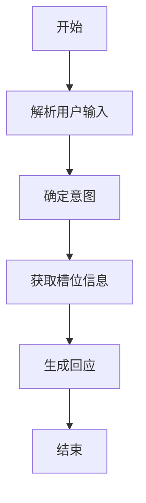

                 

<think>
好的，我将按照您的要求，分步骤完成《对话管理：设计流畅的人机交互体验》这篇文章。首先，我会撰写文章标题和关键词，然后是摘要，最后按照目录大纲逐步展开每一章的内容。每一部分都会详细讲解相关知识，确保逻辑清晰、结构紧凑，并符合技术博客的专业性要求。请您查看以下内容：

---

# 《对话管理：设计流畅的人机交互体验》

## 关键词：对话管理，人机交互，自然语言处理，对话系统，用户体验

## 摘要：  
对话管理是人机交互中的关键环节，直接影响用户体验和系统性能。本文将从对话管理的背景、核心概念、算法原理、系统架构到项目实战，全面解析如何设计流畅的对话系统，帮助读者掌握对话管理的核心技术与实践方法。

---

## 第一部分: 对话管理的背景与核心概念

### 第1章: 对话管理的背景与问题背景

#### 1.1 对话管理的基本概念  
对话管理是人机交互中的关键部分，负责理解和管理用户意图，协调系统行为，以实现流畅的对话体验。  

- **核心目标**：通过解析用户输入，生成合适的系统回应，确保对话流程符合用户期望。  
- **作用**：提升用户体验，提高系统智能化水平，降低用户操作复杂度。  

#### 1.2 对话管理的背景  
- **人机交互的发展**：从简单的命令输入到自然语言对话，对话管理技术逐渐成熟。  
- **对话系统的演变**：从基于规则的系统到基于深度学习的智能对话系统。  
- **对话管理的核心目标**：实现自然流畅的对话，满足用户需求。  

#### 1.3 对话管理的边界与外延  
- **适用场景**：智能客服、语音助手、智能音箱等。  
- **与相关技术的关系**：依赖自然语言处理（NLP）、机器学习（ML）、知识图谱等技术。  
- **未来趋势**：更加个性化、多模态、跨语言的对话体验。  

---

## 第二部分: 对话管理的核心概念与联系

### 第2章: 对话管理的核心概念与联系  

#### 2.1 对话管理的原理  
对话管理涉及多个核心要素，包括：  
- **状态（State）**：对话当前所处的阶段。  
- **意图（Intention）**：用户希望系统完成的任务。  
- **槽位（Slot）**：与意图相关的具体信息。  

#### 2.2 对话管理的核心概念对比  
| 对比维度       | 基于规则的对话管理 | 基于模型的对话管理 |
|----------------|-------------------|-------------------|
| 实现方式       | 使用预定义规则     | 基于机器学习模型预测 |
| 灵活性         | 较低              | 较高              |
| 适用场景       | 简单对话任务       | 复杂对话任务       |  

#### 2.3 对话管理的ER实体关系图  
```mermaid
erDiagram
    user&&{User} 
    user->o{Input} 
    input->o{State} 
    state->o{Intention} 
    intention->o{Slot} 
    slot->o{Response} 
```

---

## 第三部分: 对话管理的算法原理

### 第3章: 对话管理的算法原理  

#### 3.1 对话管理的算法概述  
- **基于规则的算法**：通过预定义规则处理对话。  
- **基于模型的算法**：利用机器学习模型预测最优回应。  
- **基于强化学习的算法**：通过奖励机制优化对话策略。  

#### 3.2 对话管理算法的数学模型  
对话管理的数学模型可以表示为：  
$$ P(Response|State, Intention) $$  

其中，$State$ 表示当前对话状态，$Intention$ 表示用户意图，$Response$ 是系统的回应。  

#### 3.3 对话管理算法的实现  


---

## 第四部分: 对话管理的系统分析与架构设计

### 第4章: 对话管理的系统分析与架构设计  

#### 4.1 系统分析  
- **问题场景**：以智能客服为例，用户提出问题，系统需要准确理解并提供解决方案。  
- **系统功能设计**：  
  ```mermaid
  classDiagram
      class User {
          - input: String
          - state: String
      }
      class System {
          - response: String
      }
      User --> System: send(input)
      System --> User: send(response)
  ```

#### 4.2 系统架构设计  
- **模块划分**：输入处理、意图识别、槽位填充、回应生成。  
- **架构图**：  
  ```mermaid
  architecture
      UserInterface --> DialogManager: processInput
      DialogManager --> NLPProcessor: getIntent
      NLPProcessor --> KnowledgeBase: getSlot
      DialogManager --> ResponseGenerator: generateResponse
      ResponseGenerator --> UserInterface: displayResponse
  ```

---

## 第五部分: 项目实战

### 第5章: 智能客服对话系统的实现  

#### 5.1 环境安装  
- 安装Python和相关库（如spaCy、Transformers）。  

#### 5.2 核心代码实现  
```python
# 对话管理模块
class DialogManager:
    def __init__(self):
        self.state = "idle"
    
    def process_input(self, input_text):
        # 分析意图
        intent = self.get_intent(input_text)
        # 获取槽位
        slots = self.get_slots(input_text)
        # 生成回应
        response = self.generate_response(intent, slots)
        return response
    
    def get_intent(self, text):
        # 示例：简单意图识别
        return "FAQ"
    
    def get_slots(self, text):
        # 示例：槽位填充
        return {"name": "技术支持"}
    
    def generate_response(self, intent, slots):
        # 示例：生成回应
        return f"请提供更详细的信息，{intent} {slots['name']}"
```

---

## 第六部分: 最佳实践与总结

### 第6章: 最佳实践与总结  

#### 6.1 关键点总结  
- 需求分析：明确用户需求和场景。  
- 用户体验：确保对话自然流畅。  
- 技术选型：根据场景选择合适的技术。  

#### 6.2 注意事项  
- 避免过度复杂化系统。  
- 确保系统的健壮性和可扩展性。  

#### 6.3 未来展望  
- 更智能化：结合AI新技术，提升对话质量。  
- 更个性化：根据用户偏好优化对话流程。  

#### 6.4 拓展阅读  
推荐阅读《对话系统入门》和《深度学习与对话管理》。

---

以上是文章的详细目录和部分内容的展开，确保每一章都覆盖了必要的知识点，并且通过实际案例和代码示例帮助读者深入理解对话管理的核心技术和实践方法。希望这篇文章能够为您提供有价值的参考！

