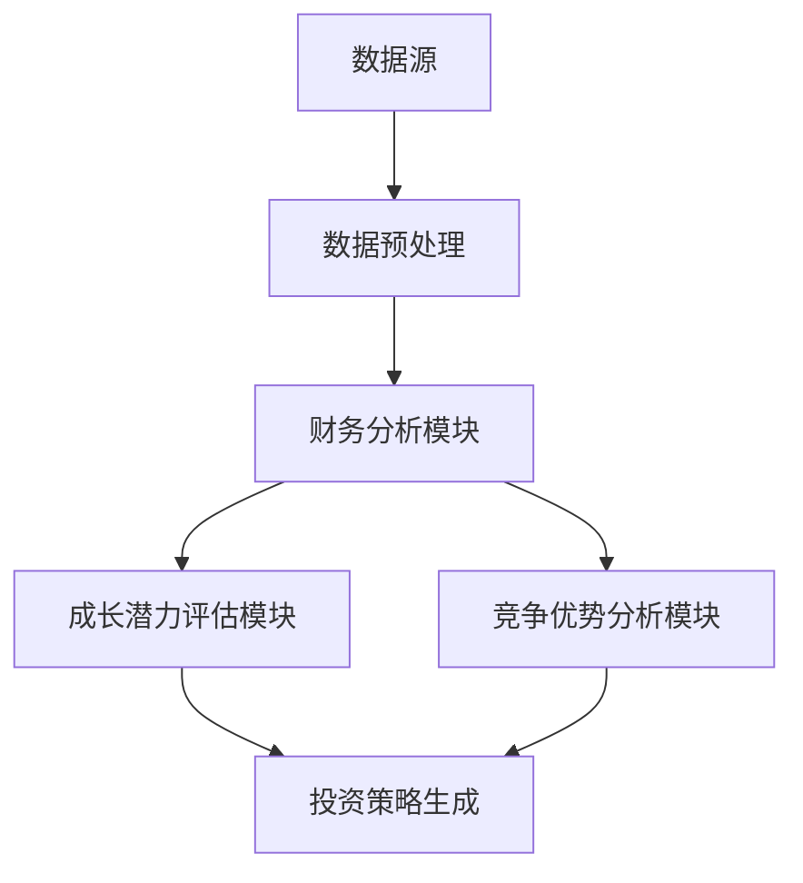

                 

# 小盘股投资策略：发掘高增长潜力的公司

> 关键词：小盘股投资，高增长潜力，财务分析，投资策略，风险管理，系统架构，项目实战

> 摘要：本文深入探讨了小盘股投资的策略与方法，从核心概念到系统架构，再到项目实战，全面解析如何在小盘股市场中发掘高增长潜力的公司。文章结合技术分析和实际案例，为投资者提供了详尽的指导，帮助读者在小盘股投资中做出明智决策。

---

## 第一部分：小盘股投资的背景与重要性

### 第1章：小盘股投资的背景

#### 1.1 小盘股的定义与特点
- **定义**：小盘股通常指市值较小的公司股票，一般在1亿至50亿美元之间。
- **特点**：流动性较低、波动性较高、增长潜力大、估值较低。
- **与大盘股的对比**：大盘股稳定性高，但增长空间有限；小盘股风险与机会并存。

#### 1.2 小盘股投资的吸引力
- **高增长潜力**：小盘股公司更容易通过增长实现市值提升。
- **估值优势**：小盘股通常估值较低，投资性价比较高。
- **市场流动性**：虽然流动性较低，但潜在回报更高。

#### 1.3 小盘股投资的风险与挑战
- **高波动性**：小盘股价格波动较大，容易受市场情绪影响。
- **信息不对称**：小盘股公司信息披露可能不完善，增加了投资难度。
- **市场周期性**：小盘股受市场周期影响较大，波动性较高。

---

## 第二部分：小盘股投资的核心概念与分析框架

### 第2章：小盘股的财务状况分析

#### 2.1 财务指标分析
- **盈利能力**：通过净利润率、ROE等指标评估公司盈利能力。
- **偿债能力**：通过资产负债率、流动比率等指标评估公司财务健康状况。
- **运营效率**：通过存货周转率、应收账款周转率等指标评估公司运营效率。

#### 2.2 小盘股的成长潜力评估
- **行业分析**：选择高增长行业的公司，如科技、医疗等。
- **管理层分析**：评估公司管理层的背景和过往业绩。
- **市场地位**：分析公司在行业中的市场份额和竞争地位。

#### 2.3 小盘股的投资策略选择
- **价值投资策略**：寻找被市场低估的小盘股。
- **成长投资策略**：投资于高增长的小盘股公司。
- **趋势投资策略**：基于市场趋势进行投资。
- **风险投资策略**：在高风险中寻找高回报机会。

---

## 第三部分：小盘股投资的系统分析与架构设计

### 第3章：小盘股投资的系统分析

#### 3.1 小盘股投资的系统目标
- **目标1**：通过系统分析筛选出具有高增长潜力的小盘股。
- **目标2**：构建一个动态的投资组合，实时跟踪市场变化。

#### 3.2 小盘股投资的系统范围
- **数据收集**：收集小盘股的历史财务数据、行业信息和市场数据。
- **分析模块**：包括财务分析、成长潜力评估和竞争优势分析。
- **决策支持**：基于分析结果生成投资策略。

### 第3.3 小盘股投资的系统功能
- **数据预处理**：清洗数据，处理缺失值和异常值。
- **财务分析**：计算各项财务指标，评估公司财务状况。
- **成长潜力评估**：预测公司未来增长潜力。
- **竞争优势分析**：评估公司在行业中的竞争优势。

### 第3.4 小盘股投资的系统架构设计

#### 3.4.1 系统架构图

#### 3.4.2 系统接口设计
- **数据接口**：与数据源对接，获取实时数据。
- **用户界面**：提供友好的操作界面，方便用户进行分析和决策。
- **系统交互流程**：用户输入查询条件，系统返回分析结果。

---

## 第四部分：小盘股投资的项目实战

### 第4章：小盘股筛选与分析

#### 4.1 小盘股筛选标准
- **市值范围**：筛选市值在1亿至50亿美元之间的公司。
- **财务健康**：筛选财务状况良好，无重大财务风险的公司。
- **增长潜力**：选择行业增长快，公司营收和利润持续增长的公司。

#### 4.2 小盘股财务数据收集与分析
- **数据来源**：使用公开的财务报表数据，如Yahoo Finance、Google Finance等。
- **分析工具**：使用Excel或Python进行数据分析和可视化。

#### 4.3 小盘股成长潜力评估
- **行业趋势分析**：分析行业发展趋势，判断公司是否符合行业增长趋势。
- **管理层评估**：研究公司管理层的背景和过往业绩。
- **竞争优势分析**：评估公司在行业中的竞争优势，如技术、成本、品牌等。

### 第4.4 小盘股投资组合构建

#### 4.4.1 投资组合的设计原则
- **分散投资**：避免将所有资金投入到少数几只股票中，降低风险。
- **长期持有**：小盘股通常需要较长的时间才能看到增长效果。
- **定期调整**：根据市场变化和公司业绩，定期调整投资组合。

#### 4.4.2 投资组合的构建步骤
1. **筛选小盘股**：根据上述标准筛选出符合条件的小盘股。
2. **评估公司价值**：通过财务分析和成长潜力评估，确定每只股票的投资价值。
3. **构建投资组合**：根据风险承受能力和收益目标，分配投资比例，构建投资组合。

#### 4.4.3 投资组合的风险控制
- **风险分散**：通过投资不同行业的股票，降低行业风险。
- **定期监控**：定期检查投资组合的表现，及时调整。
- **止损策略**：设定止损点，避免重大损失。

### 第4.5 小盘股投资的监控与调整

#### 4.5.1 投资组合监控
- **定期审查**：每季度或每半年审查一次投资组合，评估表现。
- **市场变化跟踪**：关注市场变化和公司动态，及时调整投资策略。
- **财务报告分析**：定期分析公司的财务报表，评估公司财务状况。

#### 4.5.2 投资组合调整
- **调整原因**：公司基本面发生变化，行业趋势变化，市场环境变化。
- **调整策略**：根据变化情况，增加或减少某只股票的投资比例。
- **再平衡**：根据调整情况，重新平衡投资组合，确保符合投资目标。

### 第4.6 实际案例分析

#### 4.6.1 案例背景
- **公司名称**：假设公司A，市值20亿美元，属于科技行业。
- **财务状况**：公司A近年来 revenue 增长迅速，净利润率稳步提升。
- **竞争优势**：公司在行业内具有技术优势，市场占有率逐步提高。

#### 4.6.2 分析过程
1. **财务分析**：公司A的净利润率从5%增长到8%，ROE从15%增长到20%。
2. **成长潜力评估**：公司所在行业预计未来5年年均增长15%，公司市场份额有望从5%提升至10%。
3. **竞争优势分析**：公司拥有专利技术，研发投入占比高，管理层经验丰富。

#### 4.6.3 投资决策
- **价值评估**：基于以上分析，公司A被评估为具有较高的投资价值。
- **投资策略**：决定买入公司A的股票，持有期为3年，目标收益率为30%。

#### 4.6.4 风险管理
- **止损点**：设定止损点为买入价的10%，即如果股价下跌10%，立即卖出。
- **止盈点**：设定止盈点为买入价的50%，即股价上涨50%，立即卖出。

---

## 第五部分：总结与展望

### 第5章：总结与展望

#### 5.1 总结
- 小盘股投资需要综合考虑财务状况、成长潜力和竞争优势。
- 通过系统分析和项目实战，可以有效提高投资成功的概率。
- 小盘股投资虽然风险较高，但潜在回报也更高。

#### 5.2 展望
- 随着科技的发展，数据分析和人工智能在小盘股投资中的应用将更加广泛。
- 小盘股投资策略将更加多元化，投资者需要不断提升自己的分析能力和市场敏感度。

---

## 结语

小盘股投资是一门艺术，也是一门科学。通过系统的分析和实践，投资者可以在小盘股市场中找到高增长潜力的公司，实现财富的增值。希望本文的策略和方法能为投资者提供有价值的参考，帮助他们在小盘股投资中取得成功。

