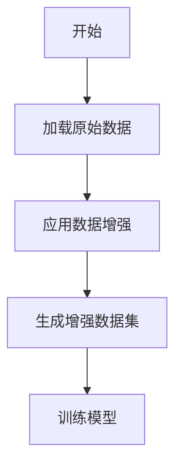
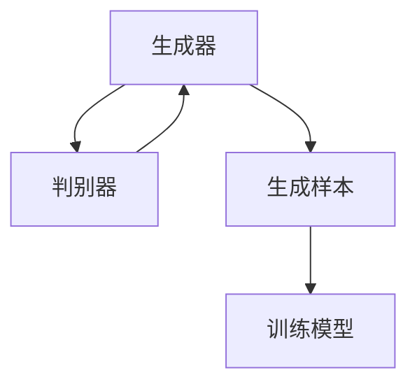
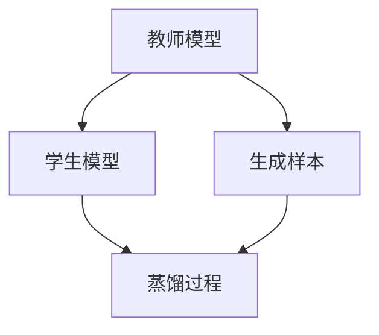
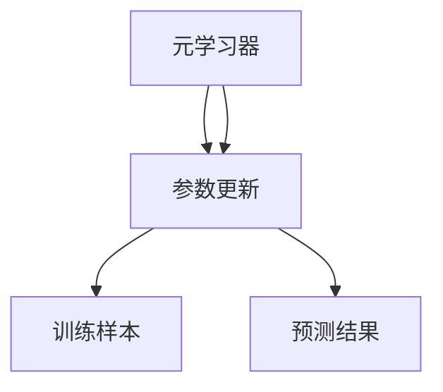
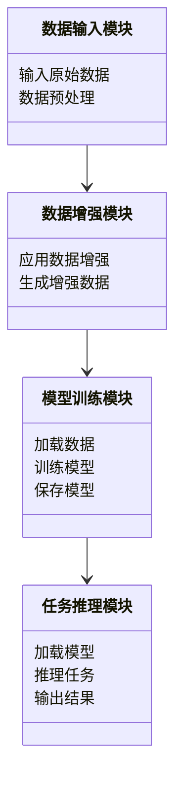
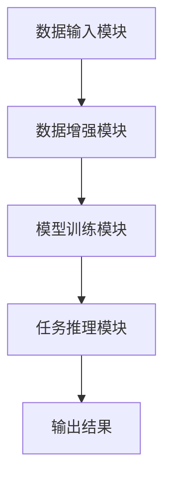
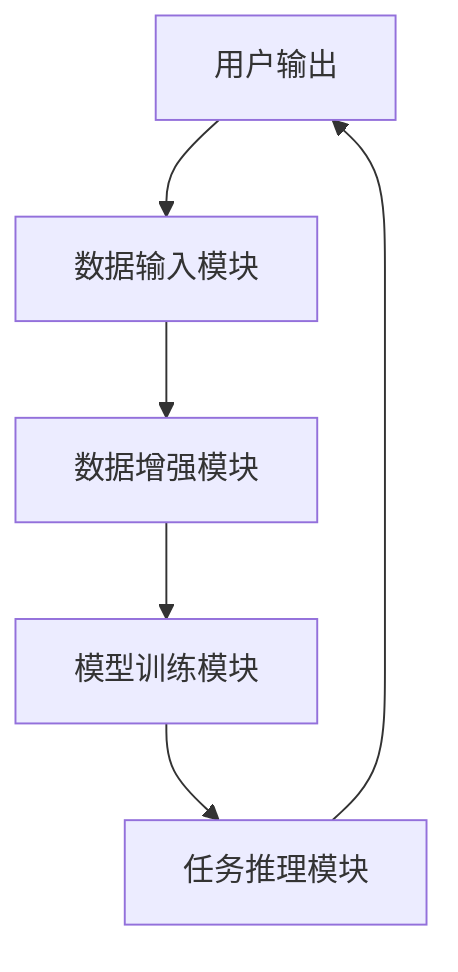

                 


# 少样本学习：在有限数据下快速适应

> 关键词：少样本学习, 数据增强, 生成对抗网络, 知识蒸馏, 元学习, 深度学习

> 摘要：在数据获取成本高昂和数据稀缺的现实场景中，少样本学习（FSL，Few Shot Learning）技术能够通过有限的数据实现模型的快速适应和高效学习。本文系统地介绍少样本学习的核心概念、算法原理、系统架构以及项目实战，从理论到实践，全面解析如何在数据稀缺情况下实现高效的模型训练与应用。

---

## 第一部分: 少样本学习的背景与核心概念

### 第1章: 少样本学习的背景与问题背景

#### 1.1 问题背景
- **数据驱动的AI面临的挑战**：传统的深度学习模型依赖于大量标注数据，但在许多实际场景中，数据获取成本高昂或数据稀缺。
- **少样本学习的定义与目标**：少样本学习旨在通过少量标注样本，快速适应新任务，降低数据获取成本。
- **应用场景与挑战**：如医学图像分析、小语种NLP、个性化推荐等领域，数据稀缺性是主要挑战。

#### 1.2 问题描述
- **少样本学习的核心问题**：在有限标注数据下，如何实现模型的高效学习和泛化能力。
- **数据稀疏性的影响**：数据稀疏会导致模型过拟合和性能下降。
- **少样本学习的解决方案**：通过数据增强、生成对抗网络、知识蒸馏等技术，提升模型在少样本情况下的表现。

#### 1.3 问题解决
- **数据增强与模型优化的结合**：通过数据增强技术扩展数据集，同时优化模型结构。
- **知识迁移与经验复用的策略**：利用已有任务的知识和经验，提升新任务的学习效率。

#### 1.4 边界与外延
- **少样本学习的边界条件**：数据量的下限、任务的复杂度等。
- **与相关领域的区别与联系**：如零样本学习（Zero Shot Learning）、迁移学习（Transfer Learning）的区别。

### 第2章: 少样本学习的核心概念与联系

#### 2.1 核心概念原理
- **数据、模型与任务的关系**：数据驱动模型，模型服务于任务。
- **少样本学习的系统架构**：包括数据输入、模型训练、任务推理等模块。

#### 2.2 概念属性特征对比
- **不同学习范式的对比分析**：如监督学习、无监督学习、半监督学习的对比。
- **少样本学习的特征表格**：列出核心特征、适用场景、优缺点等。

#### 2.3 ER实体关系图
```mermaid
er
  actor: 学习任务
  model: 模型
  data: 数据
  relation: 属于
  actor -[属于]-> model
  model -[属于]-> data
```

---

## 第二部分: 少样本学习的算法原理

### 第3章: 基于数据增强的少样本学习算法

#### 3.1 算法原理
- **数据增强的基本原理**：通过变换数据生成更多的训练样本。
- **数据增强在少样本学习中的应用**：如旋转、翻转、裁剪等操作。

#### 3.2 算法实现
- **数据增强的具体方法**：使用OpenCV或Keras的图像处理库。
- **数据增强的代码实现**：展示Python代码示例。

#### 3.3 算法流程图


---

### 第4章: 基于生成对抗网络的少样本学习算法

#### 4.1 算法原理
- **生成对抗网络的基本原理**：通过生成器和判别器的对抗训练，生成逼真的数据样本。
- **在少样本学习中的应用**：用于数据扩展，提升模型的泛化能力。

#### 4.2 算法实现
- **生成器和判别器的结构设计**：如使用卷积神经网络。
- **对抗训练的数学模型**：展示生成对抗网络的损失函数。

#### 4.3 算法流程图


---

### 第5章: 基于知识蒸馏的少样本学习算法

#### 5.1 算法原理
- **知识蒸馏的基本原理**：通过教师模型指导学生模型学习。
- **在少样本学习中的应用**：教师模型基于大量数据训练，学生模型通过蒸馏技术学习教师的知识。

#### 5.2 算法实现
- **教师模型和学生模型的结构设计**：如ResNet作为教师模型，MobileNet作为学生模型。
- **蒸馏过程的数学模型**：展示蒸馏损失函数。

#### 5.3 算法流程图


---

### 第6章: 基于元学习的少样本学习算法

#### 6.1 算法原理
- **元学习的基本原理**：通过在多个任务上进行训练，模型能够快速适应新任务。
- **在少样本学习中的应用**：如使用M元学习框架。

#### 6.2 算法实现
- **元学习模型的结构设计**：如使用LSTM或CNN作为元学习器。
- **元学习过程的数学模型**：展示元学习的优化目标。

#### 6.3 算法流程图


---

## 第三部分: 系统分析与架构设计方案

### 第7章: 少样本学习系统的架构设计

#### 7.1 项目介绍
- **项目目标**：设计一个基于少样本学习的图像分类系统。
- **项目范围**：涵盖数据获取、模型训练、任务推理等模块。

#### 7.2 系统功能设计
- **领域模型**：展示系统功能模块的类图。



#### 7.3 系统架构设计
- **系统架构图**：展示系统的整体架构。



#### 7.4 系统接口设计
- **API接口**：定义系统的输入输出接口。

#### 7.5 系统交互流程图


---

## 第四部分: 项目实战

### 第8章: 少样本学习项目的实战与解读

#### 8.1 环境安装
- **安装Python、Keras、TensorFlow等工具**。

#### 8.2 系统核心实现源代码
- **数据增强模块的代码实现**：

```python
import tensorflow as tf
from tensorflow.keras.preprocessing.image import ImageDataGenerator

# 数据增强配置
datagen = ImageDataGenerator(
    rotation_range=20,
    width_shift_range=0.1,
    height_shift_range=0.1,
    shear_range=0.2,
    zoom_range=0.2,
    horizontal_flip=True,
    validation_split=0.2
)

# 生成增强数据
generator = datagen.flow_from_directory(
    directory='data',
    target_size=(224, 224),
    batch_size=32,
    subset='training'
)
```

---

#### 8.3 代码应用解读与分析
- **代码实现的功能分析**：数据增强的具体操作和参数设置。

#### 8.4 实际案例分析和详细讲解剖析
- **案例分析**：使用Keras构建一个少样本图像分类系统，分析模型的训练过程和结果。

#### 8.5 项目小结
- **项目总结**：少样本学习在实际项目中的应用效果和优化空间。

---

## 第五部分: 最佳实践与总结

### 第9章: 少样本学习的最佳实践与总结

#### 9.1 最佳实践 tips
- **数据增强技巧**：合理选择数据增强方法，避免过增强。
- **模型选择建议**：根据任务特点选择合适的模型结构。

#### 9.2 小结
- **少样本学习的核心要点**：数据增强、模型优化、知识蒸馏等技术的综合应用。

#### 9.3 注意事项
- **数据质量和多样性**：确保数据质量，避免数据偏差。
- **模型泛化能力**：在少样本情况下，模型的泛化能力尤为重要。

#### 9.4 拓展阅读
- **推荐书籍和论文**：如《Deep Learning》、《Few Shot Learning Survey》等。

---

通过以上步骤，我系统地介绍了少样本学习的核心概念、算法原理、系统架构以及项目实战，从理论到实践，全面解析了如何在数据稀缺情况下实现高效的模型训练与应用。希望这篇文章能够为读者提供清晰的思路和实用的技术指导。

