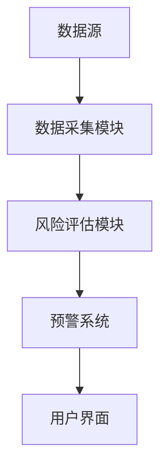

                 

# 尾部风险管理：防范极端市场事件的策略

## 关键词：
尾部风险管理、极端市场事件、系统性风险、概率统计、风险管理策略

## 摘要：
尾部风险管理是识别和应对市场中的极端事件，如金融危机，以防止重大损失的重要策略。本文从尾部事件的定义、概率统计基础、系统性风险分析、风险管理方法、系统架构设计、实战案例及总结等方面，全面阐述尾部风险管理的核心概念和应用策略。

---

# 第一部分：尾部风险管理概述

## 第1章：尾部事件的定义与特点

### 1.1 尾部事件的定义与特点
尾部事件是指在概率分布的长尾部分发生的低概率、高影响的极端事件。这些事件通常难以预测，但一旦发生，可能引发系统性风险。

#### 尾部事件的特点：
- **低概率**：发生频率极低，但影响巨大。
- **高影响**：可能导致市场崩盘或金融危机。
- **不可预测性**：传统模型难以捕捉。

### 1.2 尾部风险管理的重要性
尾部事件可能引发系统性风险，影响整个市场的稳定性。传统风险管理忽视了这些极端事件，因此必须采取专门策略。

---

## 第2章：风险管理的基本概念

### 2.1 风险管理的定义与目标
风险管理是识别、评估和应对潜在风险的过程，目标是减少损失和不确定性。

#### 风险管理的核心要素：
- **风险识别**：识别潜在风险。
- **风险评估**：量化风险影响。
- **风险应对**：制定应对策略。

### 2.2 尾部风险管理的核心原则
- **早期预警**：通过数据分析识别潜在风险。
- **压力测试**：评估系统在极端情况下的表现。
- **动态调整**：根据市场变化及时调整策略。

---

# 第二部分：尾部风险管理的理论基础

## 第3章：概率论与统计学基础

### 3.1 概率论基础
概率论是风险管理的数学基础，帮助我们理解事件发生的可能性。

#### 概率分布：
- **正态分布**：常见于日常数据，但尾部事件概率低。
- **幂律分布**：适用于极端事件，尾部概率较高。

### 3.2 统计学基础
统计学工具用于分析数据，识别潜在风险。

#### 常用统计指标：
- **均值与方差**：衡量数据分布中心和波动性。
- **分位数**：识别数据分布的尾部。

## 第4章：系统性风险与尾部事件

### 4.1 系统性风险的定义
系统性风险是影响整个金融系统的风险，尾部事件可能导致系统性风险爆发。

#### 系统性风险的特征：
- **传染性**：风险在市场间扩散。
- **杠杆效应**：放大风险影响。
- **复杂性**：涉及多个市场和机构。

---

# 第三部分：尾部风险管理的方法论

## 第5章：尾部风险识别与评估

### 5.1 尾部风险识别方法
- **数据分析法**：使用统计工具识别异常值。
- **情景分析法**：模拟极端市场情况。
- **压力测试法**：评估系统在压力下的表现。

#### 尾部风险识别流程：
1. 收集历史数据。
2. 使用统计模型识别异常值。
3. 模拟极端情景测试系统。

## 第6章：尾部风险应对策略

### 6.1 风险缓解措施
- **分散投资**：降低单一资产风险。
- **对冲交易**：利用衍生品抵消风险。
- **备用计划**：制定应对极端事件的预案。

---

# 第四部分：尾部风险管理的系统架构

## 第7章：系统设计与实现

### 7.1 系统架构设计
- **数据采集模块**：实时收集市场数据。
- **风险评估模块**：使用统计模型评估风险。
- **预警系统**：及时发出风险预警。

#### 系统架构图：

### 7.2 核心算法实现
- **VaR模型**：计算风险价值。
- **CVaR模型**：计算条件风险价值。

#### VaR算法流程：
1. 收集历史数据。
2. 计算收益分布。
3. 确定置信水平。
4. 计算VaR值。

---

# 第五部分：实战案例分析

## 第8章：案例分析

### 8.1 2008年金融危机
- **案例背景**：次贷危机引发全球金融危机。
- **风险管理失败原因**：忽视尾部风险。
- **经验教训**：加强尾部风险管理的重要性。

---

# 第六部分：总结与展望

## 第9章：总结

### 9.1 尾部风险管理的核心要点
- **识别与评估**：准确识别尾部事件。
- **系统设计**：构建高效的管理系统。
- **应对策略**：制定有效的应对措施。

### 9.2 未来展望
- **技术进步**：人工智能在风险管理中的应用。
- **数据驱动**：大数据技术提升风险管理能力。

---

# 第七部分：附录

## 附录A：常用风险管理工具
- **Python库**：如Pandas、NumPy用于数据分析。
- **可视化工具**：如Matplotlib用于数据可视化。

## 附录B：参考文献
- 建议阅读的经典文献和相关书籍。

---

通过以上结构，文章详细阐述了尾部风险管理的核心概念、理论基础、方法论和系统架构，并通过案例分析和总结展望，帮助读者全面理解尾部风险管理的重要性和应用策略。

