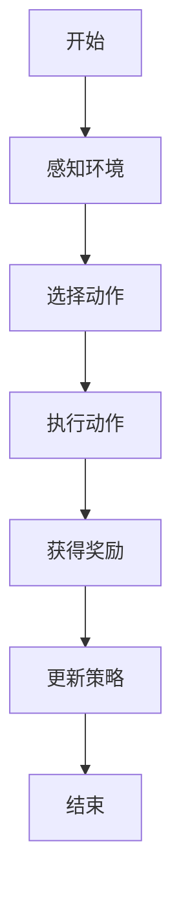
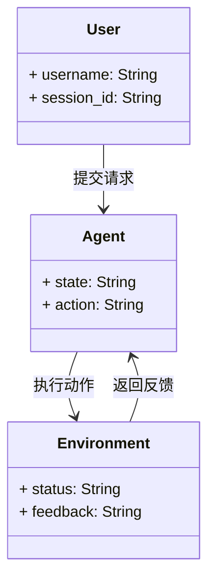
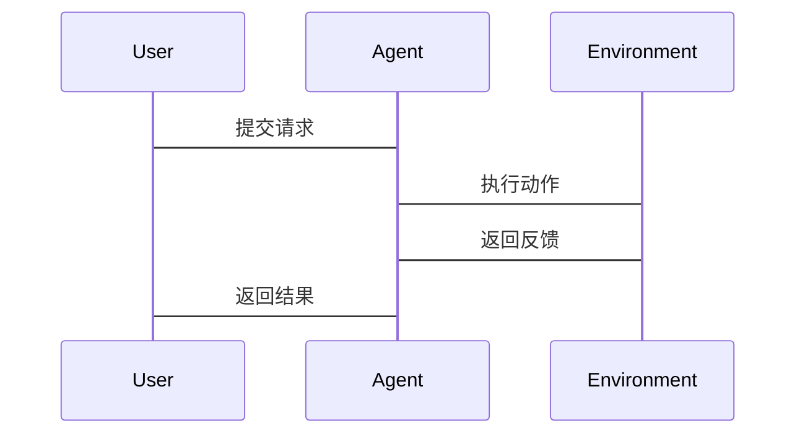

                 


# 展望未来：AI Agent技术发展趋势与机遇

---

## 关键词：
AI Agent，技术发展趋势，人工智能，智能系统，算法创新，应用场景，技术挑战，未来发展

---

## 摘要：
AI Agent（人工智能代理）作为人工智能领域的核心技术之一，正在迅速改变我们的生活方式、工作方式以及商业模式。随着技术的不断进步，AI Agent已经从简单的工具性应用发展为具备自主学习、决策和执行能力的智能系统。本文将从AI Agent的核心概念、算法原理、系统架构、应用场景以及未来发展趋势等多个维度进行深入分析，探讨AI Agent技术在当前和未来的发展机遇与挑战。

---

## 第一部分：AI Agent技术背景与核心概念

### 第1章：AI Agent概述

#### 1.1 AI Agent的基本概念
AI Agent是一种能够感知环境、自主决策并执行任务的智能系统。它通过感知环境中的信息，利用决策算法选择最优动作，并通过执行模块实现目标。AI Agent的核心特征包括自主性、反应性、目标导向性和学习能力。

#### 1.2 AI Agent的历史演变
AI Agent的概念起源于20世纪60年代的知识检索系统，经历了从基于规则的专家系统到基于机器学习的智能代理的转变。随着计算能力的提升和数据量的爆炸式增长，AI Agent逐渐发展为具备自主学习和决策能力的智能系统。

#### 1.3 AI Agent的分类与应用场景
AI Agent可以根据任务类型、智能水平和应用场景进行分类。例如，基于任务的AI Agent可以分为任务执行型和问题求解型；基于智能水平的AI Agent可以分为规则驱动型、机器学习驱动型和通用AI型。AI Agent广泛应用于智能客服、自动驾驶、智能助手、机器人控制等领域。

---

### 第2章：AI Agent的核心概念与原理

#### 2.1 AI Agent的核心组成模块
AI Agent的典型组成包括感知模块、决策模块和执行模块：
- **感知模块**：负责从环境中获取信息，例如通过传感器或API接口。
- **决策模块**：基于感知到的信息，利用算法选择最优动作。
- **执行模块**：将决策结果转化为实际操作。

#### 2.2 AI Agent的决策机制
AI Agent的决策机制可以分为基于规则的决策、基于概率的决策和基于强化学习的决策：
- **基于规则的决策**：通过预定义的规则进行判断，适用于简单任务。
- **基于概率的决策**：利用概率模型进行预测，适用于不确定性较高的场景。
- **基于强化学习的决策**：通过与环境的交互，逐步优化决策策略。

#### 2.3 AI Agent的感知与交互能力
AI Agent的感知能力包括多模态感知（如视觉、听觉、触觉）和自然语言处理能力。交互能力则体现在实时响应用户指令和与环境进行动态交互。

#### 2.4 AI Agent的自主学习能力
AI Agent的自主学习能力依赖于监督学习、无监督学习和强化学习等算法。例如，监督学习通过标注数据训练分类器，无监督学习通过聚类算法发现数据中的隐含模式，强化学习通过奖励机制优化决策策略。

---

### 第3章：AI Agent的算法原理与数学模型

#### 3.1 常见AI Agent算法概述
AI Agent的核心算法包括决策树、遗传算法和强化学习算法。这些算法通过不同的方式实现对环境的感知、决策和优化。

#### 3.2 决策树算法的数学模型
决策树是一种基于树状结构的分类方法，通过信息熵和信息增益进行节点分裂。例如，ID3算法通过最大化信息增益选择最优特征。

#### 3.3 强化学习算法的数学模型
强化学习通过状态-动作-奖励模型优化决策策略。Q-learning算法通过更新Q值表实现最优动作选择。

#### 3.4 算法原理的Mermaid流程图


#### 3.5 本章小结
通过数学模型和算法流程图，我们可以清晰地理解AI Agent的决策机制和优化过程。

---

## 第二部分：AI Agent的系统架构与应用场景

### 第4章：AI Agent的系统架构设计

#### 4.1 问题场景介绍
以智能客服系统为例，AI Agent需要通过自然语言处理技术理解用户需求，并通过决策算法匹配最优解决方案。

#### 4.2 系统功能设计
系统功能包括用户需求分析、问题分类、解决方案生成和反馈优化。

#### 4.3 系统架构设计
系统架构包括前端交互模块、后端业务逻辑模块和AI Agent决策模块。以下是系统架构的Mermaid图：


#### 4.4 系统接口设计
系统接口包括用户输入接口、环境反馈接口和决策模块接口。

#### 4.5 系统交互设计
系统交互通过Mermaid序列图展示：


---

### 第5章：AI Agent的应用场景与案例分析

#### 5.1 智能客服系统
AI Agent通过自然语言处理和决策树算法，实现用户需求分析和问题分类。

#### 5.2 自动驾驶系统
AI Agent通过强化学习和多模态感知技术，实现自动驾驶汽车的实时决策和路径规划。

#### 5.3 机器人控制
AI Agent通过强化学习和动态规划算法，实现机器人在复杂环境中的自主导航和任务执行。

---

## 第三部分：AI Agent技术发展趋势与未来机遇

### 第6章：AI Agent技术发展趋势

#### 6.1 AI Agent的算法创新
未来，AI Agent将更加依赖深度学习和强化学习算法，实现更复杂的决策和优化。

#### 6.2 AI Agent的多模态交互
随着技术的进步，AI Agent将具备更强大的多模态感知能力，实现更自然的与人类交互。

#### 6.3 AI Agent的边缘计算
AI Agent将结合边缘计算技术，实现低延迟、高效率的实时决策。

#### 6.4 AI Agent的伦理与安全
AI Agent的发展需要考虑伦理和安全问题，例如数据隐私和算法公平性。

---

### 第7章：AI Agent技术的未来机遇

#### 7.1 AI Agent在智能城市中的应用
AI Agent将在智能交通、智能安防等领域发挥重要作用。

#### 7.2 AI Agent在医疗健康中的应用
AI Agent将通过医疗数据分析和决策优化，提升诊断效率和治疗效果。

#### 7.3 AI Agent在教育领域的应用
AI Agent将通过个性化学习和智能辅导，提升教育质量和学习体验。

---

## 第四部分：总结与展望

### 第8章：总结与小结

#### 8.1 本章总结
AI Agent技术正在快速发展，其在算法创新、系统架构和应用场景方面都展现出巨大潜力。

#### 8.2 未来展望
AI Agent将更加智能化、个性化和人性化，成为人工智能领域的重要支柱。

---

## 附录：AI Agent开发与实践

### 附录A：AI Agent开发环境搭建
- 安装Python和相关库（如NumPy、Pandas、Scikit-learn）
- 安装深度学习框架（如TensorFlow、PyTorch）

### 附录B：AI Agent核心代码实现
```python
import numpy as np
from sklearn.tree import DecisionTreeClassifier

# 示例数据
X = np.array([[2, 3], [5, 4], [7, 8], [1, 2]])
y = np.array([0, 1, 1, 0])

# 训练决策树模型
model = DecisionTreeClassifier()
model.fit(X, y)

# 预测新样本
new_sample = np.array([[6, 7]])
print(model.predict(new_sample))
```

### 附录C：AI Agent开发中的注意事项
- 数据质量：确保数据的准确性和完整性。
- 算法选择：根据任务需求选择合适的算法。
- 系统优化：优化算法性能和系统架构。

---

通过本文的系统分析和深入探讨，我们可以看到AI Agent技术在未来的广阔前景和巨大机遇。无论是算法创新、系统架构还是应用场景，AI Agent都将继续推动人工智能技术的发展。

