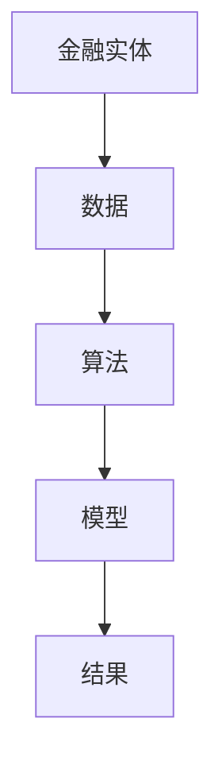
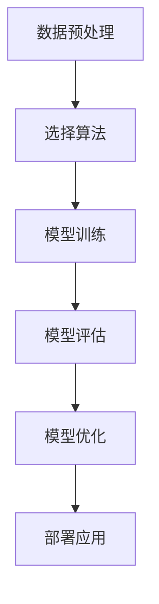

                 

# 《展望金融AI应用的未来发展趋势与挑战》

## 关键词：金融AI，人工智能，机器学习，深度学习，自然语言处理，金融科技

## 摘要：  
随着人工智能技术的飞速发展，金融行业正经历一场深刻的变革。本文将从金融行业的现状与挑战出发，探讨人工智能技术的核心概念及其在金融领域的应用场景，详细分析金融AI的算法原理、系统架构与项目实战。同时，本文还将展望金融AI的未来发展趋势，提出应对挑战的最佳实践与解决方案。

---

# 第一部分: 金融AI应用的背景与概述

## 第1章: 金融行业的现状与挑战

### 1.1 金融行业的数字化转型

#### 1.1.1 传统金融行业的发展现状  
金融行业作为现代经济的核心支柱，长期以来依赖于传统的业务模式，包括银行、证券、保险、基金等。然而，随着互联网技术的普及和用户需求的多样化，传统金融机构面临着效率低下、成本高昂、客户体验差等问题。

#### 1.1.2 数字化转型的必要性  
数字化转型已成为金融行业不可逆转的趋势。通过引入新兴技术（如人工智能、大数据、区块链等），金融机构可以提升业务效率、降低运营成本，并为客户提供更加智能化、个性化的服务。

#### 1.1.3 金融行业面临的痛点与挑战  
- **数据孤岛**：金融机构之间数据分散，难以实现高效共享与利用。  
- **业务复杂性**：金融业务涉及众多领域，且监管严格，业务逻辑复杂。  
- **用户体验**：传统金融服务往往以机构为中心，忽视用户的个性化需求。  

---

### 1.2 AI技术的定义与特点

#### 1.2.1 人工智能的基本概念  
人工智能（Artificial Intelligence, AI）是指模拟人类智能的技术，包括学习、推理、问题解决、自然语言处理等功能。AI的核心在于通过数据和算法，让计算机具备一定的“智能”。

#### 1.2.2 机器学习的核心原理  
机器学习（Machine Learning, ML）是人工智能的重要分支，通过训练模型从数据中学习规律，并用于预测或分类。其核心是“数据驱动”，模型通过大量数据训练，不断优化自身性能。

#### 1.2.3 深度学习与神经网络的简介  
深度学习（Deep Learning）是机器学习的一种，通过多层神经网络模拟人类大脑的工作方式。其优势在于处理非结构化数据（如图像、文本）的能力，且在金融领域的应用中表现出色。

---

### 1.3 金融与AI的结合

#### 1.3.1 金融AI的定义与范围  
金融AI是指将人工智能技术应用于金融领域，利用AI技术解决金融问题，优化金融业务流程。其范围涵盖智能投顾、风险管理、信用评估、欺诈检测等多个方面。

#### 1.3.2 金融AI的应用场景  
- **智能投顾**：为用户提供个性化的投资建议。  
- **风险管理**：通过AI技术预测市场风险，优化资产配置。  
- **信用评估**：利用机器学习模型评估客户的信用风险。  
- **欺诈检测**：实时监控交易行为，识别潜在的欺诈行为。  

#### 1.3.3 金融AI的核心优势与价值  
- **提升效率**：AI可以快速处理大量数据，提高决策效率。  
- **降低风险**：通过模型预测和分析，减少人为错误。  
- **个性化服务**：基于用户行为和需求，提供定制化服务。  

---

## 第2章: 金融AI应用的必要性与前景

### 2.1 金融行业对AI的需求

#### 2.1.1 数据量的爆炸性增长  
金融机构每天产生的数据量巨大，包括交易数据、用户行为数据、市场数据等。传统的人工处理方式已无法应对海量数据的挑战，AI技术成为必然选择。

#### 2.1.2 业务复杂性与个性化需求  
金融业务涉及众多领域，且用户的个性化需求日益增长。通过AI技术，金融机构可以更好地理解和满足用户需求。

#### 2.1.3 传统金融业务的效率瓶颈  
传统金融业务流程复杂、效率低下。AI技术可以通过自动化和智能化手段，显著提升业务效率。

---

### 2.2 AI在金融行业的应用前景

#### 2.2.1 金融智能化的趋势  
随着技术的不断进步，金融行业的智能化趋势不可逆转。AI将逐步渗透到金融业务的各个环节，从客户服务到风险管理，都将实现智能化。

#### 2.2.2 金融AI的市场规模与增长潜力  
根据市场研究机构的数据，全球金融AI市场规模预计在未来几年将以年均20%以上的速度增长，市场潜力巨大。

#### 2.2.3 全球金融AI应用的现状与趋势  
目前，全球范围内许多金融机构都已经开始尝试引入AI技术，如美国的FinTech公司、中国的互联网银行等。未来，AI技术将在金融行业的各个领域得到更广泛的应用。

---

## 第3章: 金融AI应用的核心概念与联系

### 3.1 核心概念的原理

#### 3.1.1 数据驱动的金融决策  
AI技术通过分析大量数据，帮助金融机构做出更科学的决策。例如，通过分析用户的交易行为，预测用户的信用风险。

#### 3.1.2 智能算法的金融应用  
机器学习算法（如随机森林、支持向量机等）在金融领域的应用广泛，包括股票价格预测、欺诈检测等。

#### 3.1.3 自动化交易的实现机制  
自动化交易系统通过AI算法实时分析市场数据，自动执行交易指令。这种交易方式不仅提高了交易效率，还能够捕捉市场中的微小机会。

---

### 3.2 核心概念的属性特征对比

| **核心概念** | **传统金融** | **AI金融** |
|---------------|---------------|------------|
| 数据处理     | 依赖人工处理 | 自动化处理  |
| 决策方式     | 依赖人工经验 | 数据驱动   |
| 业务效率     | 较低          | 显著提高    |

---

### 3.3 ER实体关系图

---

## 第4章: 金融AI应用的算法原理

### 4.1 机器学习算法

#### 4.1.1 线性回归模型  
线性回归是一种简单而有效的回归算法，适用于预测连续型变量。其数学公式为：

$$y = \beta_0 + \beta_1x + \epsilon$$

其中，$y$ 是目标变量，$x$ 是自变量，$\beta_0$ 和 $\beta_1$ 是回归系数，$\epsilon$ 是误差项。

#### 4.1.2 支持向量机（SVM）  
SVM是一种监督学习算法，适用于分类和回归问题。其核心思想是通过构建超平面将数据点分为不同的类别。

#### 4.1.3 随机森林  
随机森林是一种基于决策树的集成学习算法，通过构建多棵决策树并对结果进行投票或平均，提高模型的准确性和鲁棒性。

---

### 4.2 深度学习算法

#### 4.2.1 神经网络  
神经网络是深度学习的核心模型，通过多层神经元模拟人类大脑的工作方式。其典型结构包括输入层、隐藏层和输出层。

#### 4.2.2 卷积神经网络（CNN）  
CNN是一种专门用于处理图像数据的深度学习模型，广泛应用于金融领域的图像识别任务。

#### 4.2.3 循序神经网络（RNN）  
RNN适用于处理序列数据，如时间序列分析，在金融领域的股票价格预测中具有广泛应用。

---

### 4.3 算法实现流程图

---

## 第5章: 金融AI应用的系统分析与架构设计

### 5.1 项目介绍

#### 5.1.1 项目背景  
本项目旨在开发一个基于AI的智能投顾系统，帮助用户根据市场数据和自身需求，制定个性化的投资策略。

---

通过以上思考过程，我们可以逐步构建一个完整且详细的金融AI应用技术博客文章，涵盖背景、技术原理、应用场景、系统设计、项目实战等内容，并展望未来的发展趋势与挑战。

