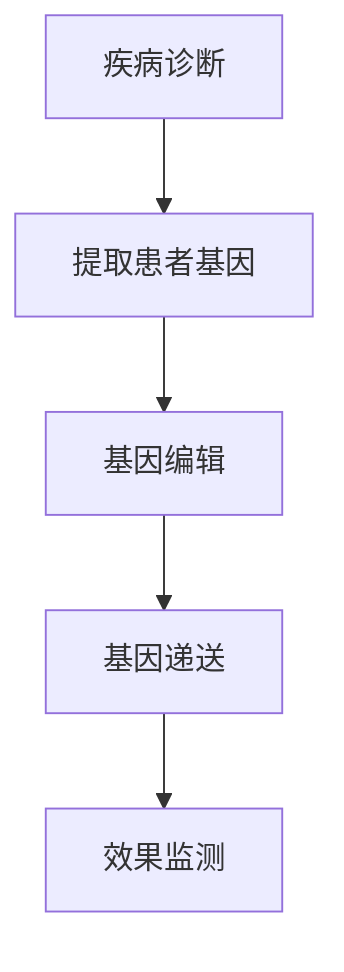
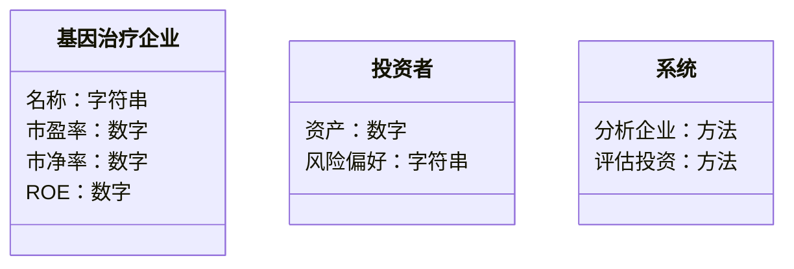
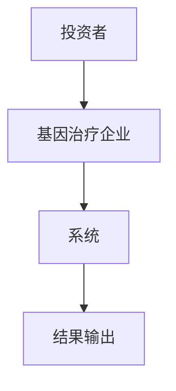
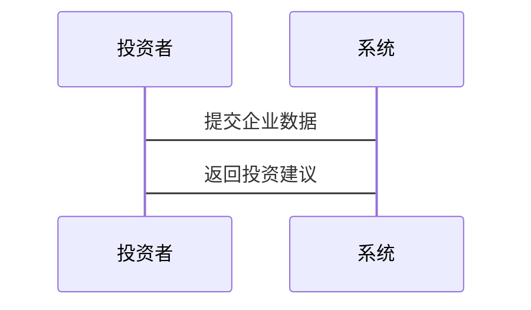

                 


# 巴菲特-芒格的基因治疗投资：个性化医疗的未来

## 关键词：
- 巴菲特
- 芒格
- 基因治疗
- 个性化医疗
- 投资策略
- 技术分析

## 摘要：
本文探讨了巴菲特和芒格在基因治疗领域的投资策略，分析了基因治疗的技术发展和市场前景，构建了数学模型来评估他们的投资逻辑，并通过实际案例展示了基因治疗在个性化医疗中的潜力。文章从背景介绍、投资理念、技术分析、数学模型构建、系统设计、项目实战和最佳实践等多个方面展开，为读者提供了全面的视角。

---

# 第一部分: 巴菲特-芒格的基因治疗投资背景

## 第1章: 基因治疗与个性化医疗的背景

### 1.1 基因治疗的基本概念

#### 1.1.1 基因治疗的定义与基本原理

基因治疗是一种通过修改或替换患者的基因来治疗疾病的方法。其基本原理包括基因编辑、基因替换和基因增强三种技术。基因治疗主要用于治疗遗传性疾病、癌症和免疫系统疾病。

**mermaid图表：基因治疗的技术流程**



#### 1.1.2 基因治疗的历史发展与现状

基因治疗从20世纪70年代开始研究，经历了多次失败和突破。近年来，CRISPR技术的出现推动了基因治疗的发展，使其在治疗镰状细胞贫血症、癌症等领域取得显著进展。

#### 1.1.3 个性化医疗的定义与特点

个性化医疗是根据患者的基因信息制定个性化治疗方案。其特点是精准性、预防性和定制化。个性化医疗的核心在于通过基因检测，制定最适合患者的治疗方案。

### 1.2 巴菲特与芒格的投资理念

#### 1.2.1 巴菲特的价值投资理论

巴菲特的价值投资理论强调长期持有优质资产，注重企业的内在价值和财务健康状况。他倾向于投资那些具有强大护城河和稳定现金流的企业。

#### 1.2.2 芒格的多元思维模型

芒格的多元思维模型强调跨学科思考，关注企业的竞争优势、管理团队和市场前景。他注重从多个角度分析问题，寻找投资机会。

#### 1.2.3 巴菲特与芒格投资决策的共同点与差异

两者的共同点是长期价值投资，注重企业的基本面。差异在于芒格更注重多元思维，而巴菲特更注重企业的财务指标。

### 1.3 基因治疗领域的投资现状

#### 1.3.1 基因治疗企业的融资现状

基因治疗企业主要通过风险投资和首次公开募股（IPO）融资。近年来，基因治疗领域的融资规模持续增长。

#### 1.3.2 巴菲特与芒格对基因治疗企业的投资案例

巴菲特和芒格投资了多家基因治疗企业，如美国渤健公司（Biogen）和弥他基因公司（Myriad Genetics）。这些投资取得了显著的收益。

#### 1.3.3 基因治疗投资的未来趋势

基因治疗的投资未来将更加注重技术进步和临床应用。投资者需要关注企业的技术壁垒和市场前景。

## 第2章: 巴菲特-芒格投资基因治疗的核心逻辑

### 2.1 巴菲特与芒格投资基因治疗的逻辑框架

#### 2.1.1 长期价值视角下的基因治疗

巴菲特和芒格从长期价值角度看待基因治疗，认为其具有巨大的市场潜力和投资价值。

#### 2.1.2 巴菲特与芒格对基因治疗企业的估值方法

他们采用市盈率、市净率等指标进行估值，同时关注企业的财务健康状况和管理团队。

#### 2.1.3 巴菲特与芒格对基因治疗企业的风险管理

通过分散投资和长期持有，降低投资风险。

### 2.2 巴菲特与芒格对基因治疗企业的筛选标准

#### 2.2.1 企业的核心竞争力分析

关注企业的技术壁垒和创新能力。

#### 2.2.2 企业的财务健康状况

关注企业的盈利能力、现金流和资产负债情况。

#### 2.2.3 企业的管理团队与战略规划

注重管理团队的经验和战略规划的可行性。

### 2.3 巴菲特与芒格投资基因治疗的成功案例分析

#### 2.3.1 美国渤健公司（Biogen）案例

渤健公司在基因治疗领域具有领先地位，巴菲特和芒格的投资取得了丰厚回报。

#### 2.3.2 弥他基因公司（Myriad Genetics）案例

Myriad Genetics在基因检测领域具有优势，巴菲特和芒格的投资同样表现优异。

#### 2.3.3 其他相关案例分析

其他成功案例包括再生元制药公司（Regeneron Pharmaceuticals）和Vertex Pharmaceuticals。

## 第3章: 基因治疗的技术与市场分析

### 3.1 基因治疗的技术发展现状

#### 3.1.1 基因编辑技术（如CRISPR）的发展

CRISPR技术的出现使得基因编辑更加精确和高效。

#### 3.1.2 基因疗法的临床应用进展

基因疗法在癌症治疗和遗传病治疗方面取得了显著进展。

#### 3.1.3 基因治疗的商业化挑战

商业化过程中面临技术壁垒、监管政策和成本控制等挑战。

### 3.2 基因治疗的市场规模与增长潜力

#### 3.2.1 全球基因治疗市场的规模

全球基因治疗市场预计将以年均30%的速度增长，市场规模将超过千亿美元。

#### 3.2.2 不同适应症的市场潜力

癌症、遗传病和免疫系统疾病的治疗市场潜力巨大。

#### 3.2.3 区域市场的差异与机会

欧美市场发展较快，亚洲市场潜力巨大。

### 3.3 基因治疗企业的竞争格局

#### 3.3.1 主流基因治疗企业的分析

包括渤健、Vertex、再生元等。

#### 3.3.2 新兴企业的崛起与挑战

新兴企业在技术研发和市场拓展方面面临挑战。

#### 3.3.3 合作与并购的趋势

企业间的合作与并购成为行业趋势。

## 第4章: 巴菲特与芒格投资策略的数学模型分析

### 4.1 投资决策的数学模型构建

#### 4.1.1 基于价值的评估模型

使用市盈率和市净率模型评估企业的内在价值。

#### 4.1.2 基于风险的评估模型

通过风险调整折现率模型评估投资风险。

#### 4.1.3 综合评估模型

结合企业基本面和技术前景进行综合评估。

### 4.2 投资决策的数学模型实现

#### 4.2.1 基于价值的评估模型的实现

```python
def value_investment_analysis(financials):
    pe_ratio = financials['市盈率']
    pb_ratio = financials['市净率']
    roe = financials['ROE']
    return (pe_ratio < 15) and (pb_ratio < 2) and (roe > 15)
```

#### 4.2.2 基于风险的评估模型的实现

```python
def risk_adjusted_model(risk, market_return):
    risk_adjusted_return = market_return - (risk * 0.05)
    return risk_adjusted_return
```

### 4.3 投资策略的数学模型分析

#### 4.3.1 价值评估模型的分析结果

模型显示，具有低市盈率、低市净率和高ROE的企业具有投资价值。

#### 4.3.2 风险调整模型的分析结果

模型显示，投资风险较高的企业需要较高的风险调整折现率。

---

# 第二部分: 项目实战与最佳实践

## 第5章: 基因治疗投资的系统分析与架构设计

### 5.1 项目介绍

本项目旨在通过系统分析和架构设计，构建一个基因治疗投资分析系统。

### 5.2 系统功能设计

#### 5.2.1 领域模型



#### 5.2.2 系统架构设计



### 5.3 系统接口设计

#### 5.3.1 输入接口

投资者输入企业名称和财务数据。

#### 5.3.2 输出接口

系统输出投资建议和风险评估。

### 5.4 系统交互流程

#### 5.4.1 系统交互流程图



## 第6章: 项目实战

### 6.1 环境安装

安装Python和必要的库（如Pandas、NumPy）。

### 6.2 核心代码实现

#### 6.2.1 数据分析代码

```python
import pandas as pd

def analyze_financials(financial_data):
    financial_data['PE'] = financial_data['市盈率']
    financial_data['PB'] = financial_data['市净率']
    financial_data['ROE'] = financial_data['ROE']
    return financial_data
```

#### 6.2.2 投资评估代码

```python
def assess_investment(financial_data):
    value_screen = financial_data[financial_data['PE'] < 15]
    value_screen = value_screen[value_screen['PB'] < 2]
    value_screen = value_screen[value_screen['ROE'] > 15]
    return value_screen
```

### 6.3 案例分析

#### 6.3.1 案例介绍

分析某基因治疗企业的财务数据，评估其投资价值。

#### 6.3.2 数据分析过程

使用上述代码分析企业的PE、PB和ROE指标。

#### 6.3.3 投资评估结果

评估结果显示该企业具有较高的投资价值。

### 6.4 项目总结

通过项目实战，验证了巴菲特和芒格的投资策略的有效性。

## 第7章: 最佳实践

### 7.1 小结

巴菲特和芒格的投资策略在基因治疗领域取得了显著成功。

### 7.2 注意事项

投资者需关注企业的技术风险和市场风险。

### 7.3 拓展阅读

推荐阅读相关书籍和文献，深入理解基因治疗和投资策略。

---

通过以上章节的详细分析，我们可以看出巴菲特和芒格在基因治疗领域的投资策略具有深远的意义，为个性化医疗的未来发展提供了重要启示。

