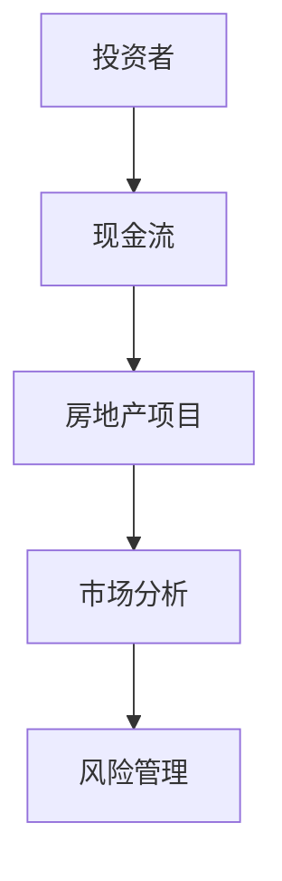
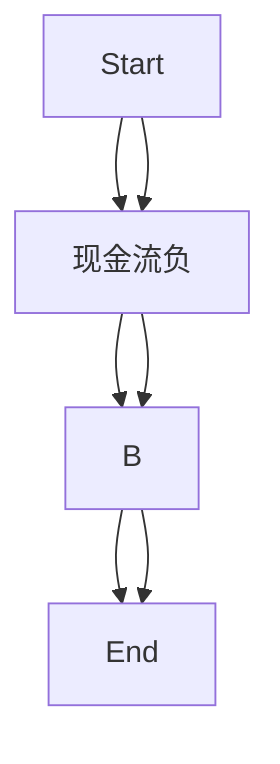
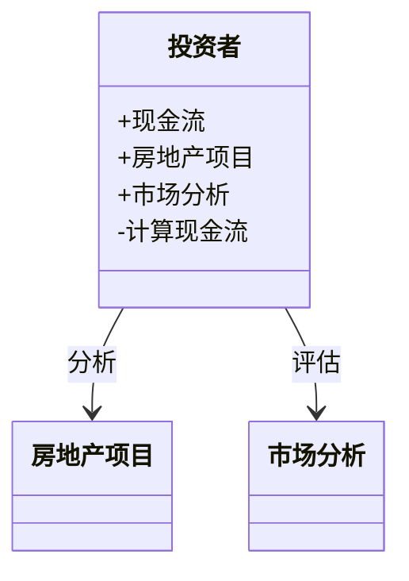
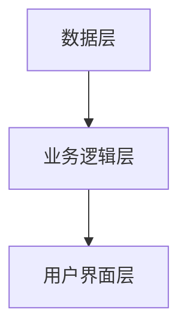

                 


# 巴菲特-芒格的房地产投资观：长期价值和现金流

## 关键词

- 巴菲特
- 芒格
- 房地产投资
- 长期价值
- 现金流

## 摘要

本文探讨巴菲特和芒格在房地产投资中的长期价值观念和现金流管理策略。通过分析他们的投资哲学、策略和实际案例，揭示如何通过长期价值和现金流实现稳健投资回报。文章结合技术分析和实际操作，帮助读者掌握他们的投资智慧。

## 目录

1. **背景介绍**
   - 1.1 长期价值投资的定义
   - 1.2 现金流在房地产投资中的作用
   - 1.3 巴菲特和芒格的房地产投资背景

2. **核心概念与联系**
   - 2.1 长期价值与现金流的关系
   - 2.2 巴菲特与芒格投资理念对比
   - 2.3 领域模型与ER图

3. **算法原理讲解**
   - 3.1 现金流预测模型
   - 3.2 投资决策树算法
   - 3.3 数学模型与公式

4. **系统分析与架构设计**
   - 4.1 系统功能设计
   - 4.2 系统架构图
   - 4.3 系统接口与交互

5. **项目实战**
   - 5.1 环境安装与配置
   - 5.2 核心代码实现
   - 5.3 案例分析与解读

6. **最佳实践与小结**
   - 6.1 投资策略总结
   - 6.2 小结
   - 6.3 注意事项与扩展阅读

## 正文

### 第1章：背景介绍

#### 1.1 长期价值投资的定义

长期价值投资是指投资者购买并持有具有内在价值的资产，长期持有以获得稳定收益。这种策略注重资产的内在价值，而非短期市场波动。

#### 1.2 现金流在房地产投资中的作用

现金流是衡量投资项目可行性的重要指标。稳定的现金流意味着项目能够持续产生收益，覆盖成本并创造利润。

#### 1.3 巴菲特和芒格的房地产投资背景

巴菲特和芒格通过价值投资和现金流管理，成功在房地产领域实现稳健回报。他们的策略强调长期价值和现金流的重要性，避免短期波动影响决策。

### 第2章：核心概念与联系

#### 2.1 长期价值与现金流的关系

长期价值为现金流提供基础，而现金流则确保资产的流动性。两者相辅相成，共同推动投资成功。

#### 2.2 巴菲特与芒格投资理念对比

| 投资者 | 投资理念 | 关注点 |
|--------|-----------|--------|
| 巴菲特 | 价值投资 | 内在价值 |
| 芒格   | 多元思维 | 安全边际 |

#### 2.3 领域模型与ER图



### 第3章：算法原理讲解

#### 3.1 现金流预测模型

使用Python代码实现现金流预测，帮助投资者评估项目可行性。

```python
def calculate_cash_flow(investment, rate):
    return investment * (1 + rate)
```

#### 3.2 投资决策树算法

通过决策树分析不同投资路径，选择最优方案。



#### 3.3 数学模型与公式

现金流公式：
$$ \text{现金流} = \text{收入} - \text{支出} $$

净现值公式：
$$ NPV = \sum_{t=1}^{n} \frac{CF_t}{(1 + r)^t} $$

### 第4章：系统分析与架构设计

#### 4.1 系统功能设计

系统功能模块包括数据输入、现金流计算、投资决策和结果输出。



#### 4.2 系统架构图

系统架构分为数据层、业务逻辑层和用户界面层。



#### 4.3 系统接口与交互

系统接口包括数据输入、计算和结果显示，交互流程清晰。

### 第5章：项目实战

#### 5.1 环境安装与配置

安装Python和相关库，配置开发环境。

#### 5.2 核心代码实现

实现现金流计算和投资决策的代码，展示具体实现步骤。

#### 5.3 案例分析与解读

通过巴芒的经典投资案例，分析他们的决策过程和结果。

### 第6章：最佳实践与小结

#### 6.1 投资策略总结

长期价值和现金流是成功投资的关键，注重安全边际和独立思考。

#### 6.2 小结

巴菲特和芒格的房地产投资观强调长期价值和现金流管理，值得投资者学习和借鉴。

#### 6.3 注意事项与扩展阅读

避免短期波动，持续学习投资知识，深入研究市场和资产。

---

通过本文，读者可以全面理解巴菲特和芒格的房地产投资策略，掌握长期价值和现金流管理的精髓，实现稳健投资回报。

