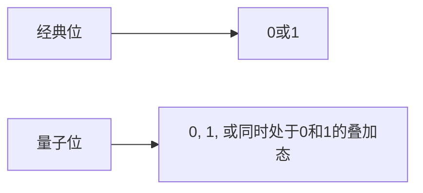
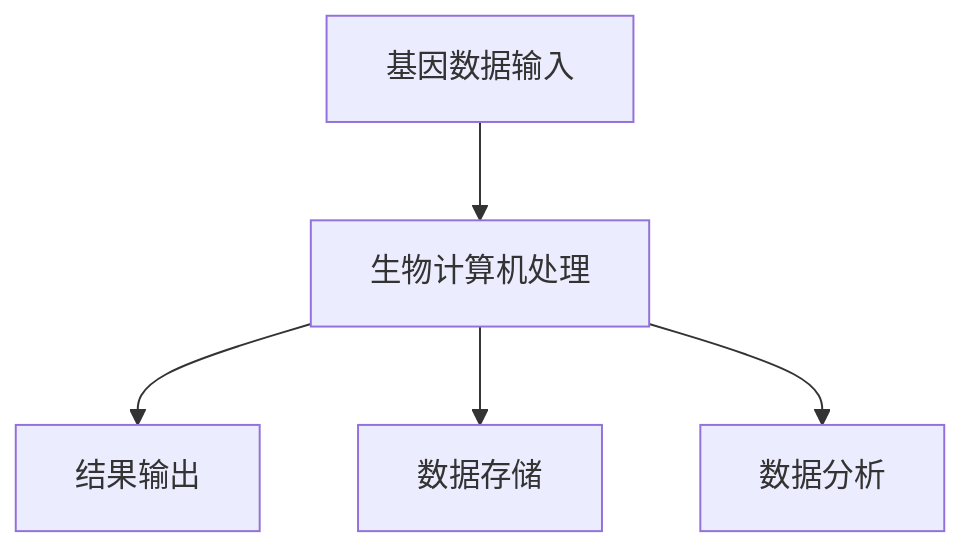
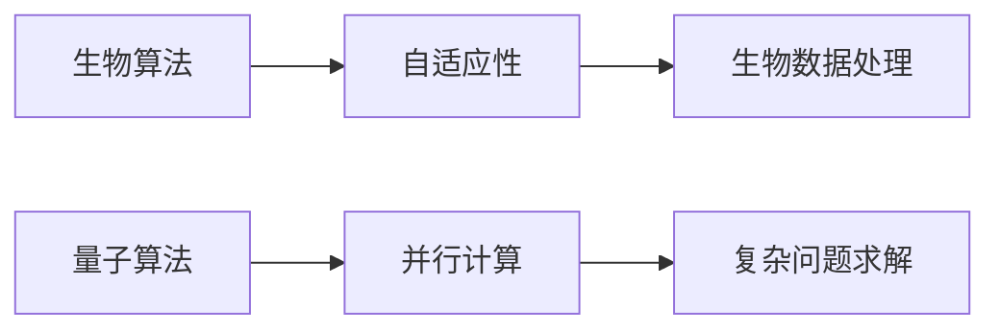
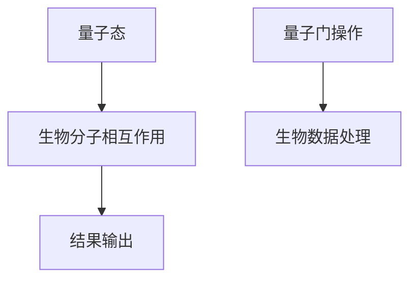

                 

# 巴菲特-芒格的量子生物计算机投资：生命科学与信息技术的终极融合

## 关键词：巴菲特，芒格，量子计算机，生物计算机，投资策略，技术融合

## 摘要：  
本文探讨了巴菲特和芒格在量子生物计算机领域的投资理念，分析了量子生物计算机的技术原理、市场潜力以及投资机会。通过结合价值投资与科技创新，文章揭示了生命科学与信息技术融合的未来趋势，并为投资者提供了深度分析与投资建议。

---

## 第一部分：巴菲特与芒格的投资理念

### 第1章：巴菲特与芒格的投资哲学

#### 1.1 巴菲特与芒格的投资理念概述

##### 1.1.1 巴菲特的价值投资理论
巴菲特的价值投资理论强调以合理价格购买优秀的公司，关注企业的长期盈利能力、财务健康状况和竞争优势。他主张“买入并持有”，避免频繁交易，追求安全边际。  
**关键词：安全边际、长期价值、企业护城河**

##### 1.1.2 芒格的多元思维模型
芒格提倡“多元思维模型”，即通过多个学科的交叉思考来理解问题，避免单一维度的决策。他认为，投资不仅是对公司的分析，更是对整个系统和人性的洞察。  
**关键词：多元思维、系统性思考、人性洞察**

##### 1.1.3 巴菲特与芒格投资理念的异同点
- **相同点**：都强调长期投资、价值导向、对公司基本面的深入分析。  
- **不同点**：巴菲特更关注财务指标和企业护城河，而芒格更注重跨学科的系统性思考。  
**图表：巴菲特与芒格投资理念对比表**

| **维度**       | **巴菲特**                     | **芒格**                       |
|----------------|-------------------------------|---------------------------------|
| 核心思想       | 价值投资、安全边际            | 多元思维模型、系统性思考       |
| 分析方法       | 财务分析、竞争优势             | 跨学科分析、人性洞察           |
| 投资策略       | 长期持有、买入优秀企业        | 逆向思维、寻找非共识机会       |

---

#### 1.2 巴菲特与芒格的投资策略

##### 1.2.1 巴菲特的长期价值投资
巴菲特的长期价值投资策略基于对公司内在价值的评估，寻找那些具有持续竞争优势且估值低于内在价值的企业。他倾向于投资那些能够持续创造价值的企业，而非短期炒作的股票。  
**案例：巴菲特投资IBM的逻辑**  
巴菲特在2011年投资IBM，看重其在科技领域的领先地位和长期盈利能力。尽管IBM的股价表现不佳，但巴菲特认为其核心业务和管理层能力是长期投资的价值所在。

##### 1.2.2 芒格的逆向思维与独立思考
芒格强调逆向思维，即在市场恐慌时寻找机会，在市场狂热时保持冷静。他主张独立思考，避免从众心理，寻找那些被市场忽视但具有潜在价值的投资标的。  
**关键词：逆向思维、独立思考、市场情绪**

##### 1.2.3 巴菲特与芒格投资理念的结合
两人投资理念的结合体现在对长期价值的追求、对企业基本面的深入分析以及对市场情绪的独立判断。这种结合不仅适用于传统投资领域，也可以延伸至新兴科技领域，如量子生物计算机的投资。

---

## 第二部分：量子生物计算机的技术与市场分析

### 第2章：量子生物计算机的基本概念

#### 2.1 量子计算机的基本原理

##### 2.1.1 量子计算机的定义与特点
量子计算机是一种基于量子力学原理的计算设备，其核心优势在于计算速度和处理复杂问题的能力远超经典计算机。  
**关键词：量子位、叠加态、纠缠态**

##### 2.1.2 量子位与经典位的区别
- **经典位**：二进制，0或1。  
- **量子位**：可以同时处于0和1的叠加态，具有并行计算能力。  
**图表：量子位与经典位对比图**

##### 2.1.3 量子计算机的工作原理
量子计算机通过量子门操作对量子位进行变换，利用量子叠加和量子纠缠的特性，实现对复杂问题的高效计算。  
**公式：量子门操作矩阵表示**

$$
U = \begin{bmatrix}
\cos\theta & -\sin\theta \\
\sin\theta & \cos\theta
\end{bmatrix}
$$

#### 2.2 生物计算机的概念与应用

##### 2.2.1 生物计算机的定义
生物计算机是一种利用生物分子（如DNA、RNA）进行信息处理的新型计算机，具有体积小、能耗低、信息存储密度高的特点。  
**关键词：生物分子、分子计算、生物电路**

##### 2.2.2 生物计算机的优势
- **能耗低**：利用生物分子的特性，大幅降低能源消耗。  
- **信息密度高**：生物分子可以存储大量信息，适合大数据处理。  
- **生物兼容性**：适用于医疗、生物技术等领域。  

##### 2.2.3 生物计算机在生命科学中的应用
生物计算机在基因测序、疾病诊断、药物研发等领域具有广泛应用潜力。例如，利用生物计算机分析基因数据，可以加速新药研发进程。  
**图表：生物计算机在基因测序中的应用流程图**

#### 2.3 量子生物计算机的概念
量子生物计算机是量子计算与生物计算的结合，利用量子力学特性处理生物数据，具有更高的计算效率和更广泛的应用场景。  
**关键词：量子生物计算、跨学科融合、高效计算**

---

### 第3章：量子生物计算机的技术分析

#### 3.1 量子生物计算机的算法原理

##### 3.1.1 量子算法的基本概念
量子算法是量子计算机的核心，利用量子叠加和量子纠缠的特性，实现对复杂问题的高效求解。  
**公式：量子算法的核心步骤**

$$
|\psi\rangle = \sum_{i=0}^{N-1} \alpha_i |i\rangle
$$

##### 3.1.2 生物算法的独特性
生物算法基于生物分子的特性，具有自适应性和生物兼容性，适用于生物数据的处理。  
**图表：生物算法与量子算法的对比图**

##### 3.1.3 量子生物算法的融合与优化
通过结合量子算法和生物算法的优势，量子生物算法可以在生物数据处理中实现更高的效率和准确性。  
**案例：量子生物算法在基因测序中的应用**

#### 3.2 量子生物计算机的数学模型

##### 3.2.1 量子计算的数学基础
量子计算的数学基础包括量子态、量子门和量子测量。  
**公式：量子态的表示**

$$
|\psi\rangle = a|0\rangle + b|1\rangle
$$

##### 3.2.2 生物计算的数学模型
生物计算的数学模型基于生物分子的相互作用和信息处理规则。  
**公式：生物分子相互作用的数学表达**

$$
E = k_1x + k_2y
$$

##### 3.2.3 量子生物计算的数学融合
通过将量子计算和生物计算的数学模型相结合，可以实现对生物数据的高效处理和分析。  
**图表：量子生物计算的数学模型**

---

### 第4章：量子生物计算机的投资机会分析

#### 4.1 当前量子生物计算机的技术发展现状

##### 4.1.1 量子计算机的技术瓶颈
当前量子计算机仍面临量子纠错、稳定性不足等问题，尚未实现大规模商业化应用。  
**关键词：技术瓶颈、稳定性、量子纠错**

##### 4.1.2 生物计算机的技术挑战
生物计算机在制造工艺、算法设计和数据处理方面仍面临诸多挑战，尚未达到实用化阶段。  
**关键词：制造工艺、算法设计、数据处理**

##### 4.1.3 量子生物计算机的未来发展方向
随着技术的进步，量子生物计算机将在生命科学、医学和数据处理等领域展现出巨大潜力。  
**关键词：技术进步、生命科学、医学应用**

#### 4.2 量子生物计算机的投资策略

##### 4.2.1 短期投资机会分析
短期内，投资者可以关注量子生物计算机领域的技术创新和龙头企业，寻找技术突破带来的投资机会。  
**案例：IBM在量子计算机领域的布局**

##### 4.2.2 中长期投资机会分析
中长期来看，量子生物计算机的商业化应用将带来巨大的市场潜力，投资者可以关注相关企业的技术研发和市场拓展。  
**关键词：商业化应用、市场潜力、技术研发**

##### 4.2.3 投资者如何选择量子生物计算机投资标的
投资者应关注企业的技术实力、管理团队、市场前景和财务状况，选择具有竞争优势的投资标的。  
**图表：量子生物计算机投资标的选择标准**

| **维度**       | **权重** | **关键指标**               |
|----------------|----------|-----------------------------|
| 技术实力       | 40%      | 专利数量、研发团队能力     |
| 管理团队       | 30%      | CEO背景、管理经验           |
| 市场前景       | 20%      | 市场需求、竞争格局         |
| 财务状况       | 10%      | 净利润、研发投入占比       |

---

## 第三部分：巴菲特与芒格的量子生物计算机投资逻辑

### 第5章：巴菲特与芒格的量子生物计算机投资逻辑

#### 5.1 巴菲特与芒格对量子生物计算机的认知

##### 5.1.1 巴菲特对量子生物计算机的态度
巴菲特对量子生物计算机持谨慎乐观态度，认为其技术潜力巨大，但商业化道路仍需时间。他倾向于投资那些具有长期竞争优势的企业。  
**关键词：谨慎乐观、长期竞争优势、商业化潜力**

##### 5.1.2 芒格对量子生物计算机的看法
芒格认为量子生物计算机是科技与生命的完美结合，具有革命性意义。他强调投资者需具备跨学科思维，才能抓住这一领域的投资机会。  
**关键词：跨学科思维、革命性意义、系统性思考**

#### 5.2 量子生物计算机的投资价值

##### 5.2.1 技术前景
量子生物计算机的结合了量子计算和生物技术，具有广阔的技术前景和应用潜力。  
**关键词：技术融合、应用潜力、技术前景**

##### 5.2.2 市场潜力
随着生命科学和信息技术的深度融合，量子生物计算机将在医疗、制药、农业等领域展现出巨大的市场潜力。  
**关键词：市场潜力、医疗、制药、农业**

##### 5.2.3 投资风险
量子生物计算机的投资风险包括技术不确定性、市场接受度、政策监管等。投资者需充分评估这些风险，制定合理的投资策略。  
**关键词：技术风险、市场风险、政策风险**

---

### 第6章：巴菲特与芒格投资案例分析

#### 6.1 巴菲特的经典投资案例

##### 6.1.1 巴菲特对IBM的投资
巴菲特在2011年投资IBM，看中其在科技领域的领先地位和长期盈利能力。尽管IBM的股价表现不佳，但巴菲特认为其核心业务和管理层能力是长期投资的价值所在。  
**案例分析：IBM的投资逻辑**

#### 6.2 芒格的经典投资案例

##### 6.2.1 芒格对苹果的投资
芒格通过多元思维模型，洞察到苹果公司在科技领域的领先地位和巨大市场潜力，因此选择投资苹果。  
**案例分析：苹果的投资逻辑**

---

## 第四部分：量子生物计算机的未来展望与投资建议

### 第7章：量子生物计算机的未来发展趋势

#### 7.1 技术融合的加速
随着量子计算和生物技术的进一步融合，量子生物计算机将在更多领域展现出应用潜力。  
**关键词：技术融合、应用潜力、未来趋势**

#### 7.2 市场需求的扩大
生命科学和信息技术的深度融合将推动量子生物计算机的市场需求不断增长。  
**关键词：市场需求、技术融合、投资机会**

#### 7.3 政策支持的加强
政府和产业界对量子生物计算机的支持力度将加大，推动其更快发展。  
**关键词：政策支持、产业发展、技术创新**

---

### 第8章：投资建议与注意事项

#### 8.1 投资建议

##### 8.1.1 长期投资策略
投资者应采取长期投资策略，关注企业的技术研发和市场拓展，选择具有竞争优势的投资标的。  
**关键词：长期投资、技术研发、市场拓展**

##### 8.1.2 风险控制
投资者需充分评估量子生物计算机的投资风险，制定合理的风险控制策略，避免过度集中投资。  
**关键词：风险控制、分散投资、风险评估**

#### 8.2 投资者注意事项

##### 8.2.1 关注技术创新
投资者应密切关注量子生物计算机的技术进展，选择具有技术优势的企业。  
**关键词：技术创新、技术优势、技术进展**

##### 8.2.2 保持独立思考
投资者需保持独立思考，避免从众心理，寻找那些被市场忽视但具有潜在价值的投资标的。  
**关键词：独立思考、市场情绪、价值投资**

---

## 第五部分：量子生物计算机的技术与应用

### 第9章：量子生物计算机的技术与应用

#### 9.1 量子生物计算机的技术实现

##### 9.1.1 量子生物算法的实现
通过结合量子算法和生物算法，量子生物计算机可以在生物数据处理中实现更高的效率和准确性。  
**关键词：量子生物算法、生物数据处理、计算效率**

##### 9.1.2 量子生物计算机的硬件实现
量子生物计算机的硬件实现涉及量子位的设计、量子门的操作以及生物分子的处理。  
**关键词：硬件实现、量子位、量子门**

#### 9.2 量子生物计算机的应用场景

##### 9.2.1 医疗领域
量子生物计算机在疾病诊断、药物研发、基因编辑等领域具有广泛应用潜力。  
**关键词：医疗领域、疾病诊断、药物研发**

##### 9.2.2 生物技术领域
量子生物计算机在生物技术领域的应用包括生物分子设计、生物过程优化等。  
**关键词：生物技术领域、生物分子设计、生物过程优化**

##### 9.2.3 数据处理领域
量子生物计算机在大数据处理、模式识别等领域展现出巨大潜力。  
**关键词：数据处理领域、大数据、模式识别**

---

### 第10章：量子生物计算机的未来发展与投资机会

#### 10.1 量子生物计算机的未来发展趋势

##### 10.1.1 技术融合的深化
随着量子计算和生物技术的进一步融合，量子生物计算机将在更多领域展现出应用潜力。  
**关键词：技术融合、应用潜力、未来趋势**

#### 10.2 投资机会与挑战

##### 10.2.1 投资机会
量子生物计算机的投资机会包括技术创新、市场需求和政策支持。  
**关键词：投资机会、技术创新、市场需求、政策支持**

##### 10.2.2 投资挑战
量子生物计算机的投资挑战包括技术不确定性、市场接受度和政策监管。  
**关键词：投资挑战、技术不确定性、市场接受度、政策监管**

---

## 结语

量子生物计算机是生命科学与信息技术的终极融合，具有广阔的技术前景和市场潜力。巴菲特和芒格的投资理念为这一领域的投资提供了重要启示。投资者应结合价值投资与科技创新，选择具有竞争优势的投资标的，抓住量子生物计算机带来的投资机会。

---

## 参考文献

1. 巴菲特股东大会讲话集。  
2. 芒格股东大会讲话集。  
3. 量子计算机与生物计算机的相关学术论文。  
4. 科技与投资领域的权威书籍。  

---

**全文完。**

