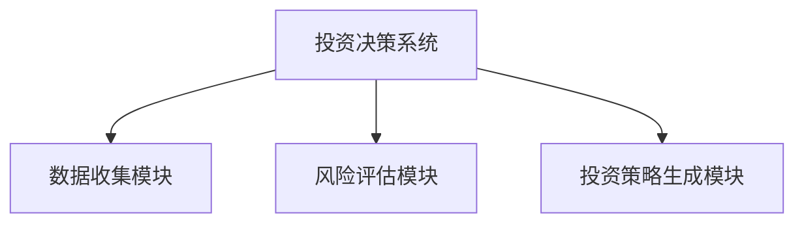

                 

# 巴菲特-芒格看气候变化：对投资决策的影响

## 关键词：巴菲特，芒格，气候变化，投资决策，风险管理，可持续发展，经济影响

## 摘要

本文探讨了巴菲特和芒格如何从投资角度分析气候变化的影响，特别是气候变化如何影响企业价值和投资决策。文章详细介绍了气候变化对全球经济的潜在影响，分析了传统投资模型在气候变化下的局限性，并提出了新的投资策略。通过案例分析和数学模型，展示了如何将气候变化因素纳入投资决策过程，以实现可持续投资。

---

# 目录大纲

## 第1章：背景介绍

### 1.1 巴菲特与芒格的投资理念

- **1.1.1 价值投资的核心原则**：巴菲特的价值投资强调企业内在价值和长期表现，芒格的多元思维模型涵盖多个学科的交叉思考。
- **1.1.2 气候变化的经济影响**：气候变化可能导致全球经济波动，影响企业盈利能力和资产价值。

### 1.2 气候变化与投资决策

- **1.2.1 气候变化的定义与现状**：气候变化不仅是环境问题，更是经济问题，涉及能源结构转型和政策变化。
- **1.2.2 气候变化对全球经济的影响**：极端天气、资源短缺和政策变化可能引发经济危机，影响企业运营和投资回报。

---

## 第2章：气候变化对投资的影响机制

### 2.1 气候变化与企业价值

- **2.1.1 气候风险对企业利润的影响**：极端天气可能导致生产中断和成本增加，影响企业利润。
- **2.1.2 可持续发展与企业竞争优势**：注重环保和可持续发展的企业更具竞争优势，吸引更多投资。

### 2.2 气候变化与投资决策

- **2.2.1 气候变化对资产估值的影响**：碳排放政策变化可能导致资产重估，高碳企业面临估值下调。
- **2.2.2 碳排放政策对企业投资决策的影响**：严格的碳排放政策可能迫使企业转型，影响投资决策。

---

## 第3章：气候变化与投资模型

### 3.1 气候变化风险的量化

- **3.1.1 气候风险评估方法**：使用概率模型和贝叶斯网络量化气候变化的不确定性。
- **3.1.2 碳相关财务披露框架**：TCFD要求企业披露碳排放信息，帮助投资者评估风险。

### 3.2 气候变化对投资组合的影响

- **3.2.1 传统投资模型的局限性**：传统模型忽视气候变化的长期影响，可能低估风险。
- **3.2.2 纳入气候变化因素的投资模型**：调整CAPM模型，考虑碳排放成本和政策变化。

---

## 第4章：气候变化风险评估模型

### 4.1 模糊性与概率模型

- **4.1.1 气候变化风险的不确定性**：气候变化的预测存在不确定性，影响模型的准确性。
- **4.1.2 贝叶斯网络的应用**：通过贝叶斯网络量化风险，分析不同情景下的概率。

### 4.2 气候变化对资产定价的影响

- **4.2.1 资产价格与碳排放的关系**：高碳资产可能面临价格下跌，低碳资产价格上涨。
- **4.2.2 碳定价模型的构建**：基于碳排放配额和碳税，建立碳定价模型。

---

## 第5章：投资决策系统的架构

### 5.1 系统功能设计

- **5.1.1 数据收集模块**：收集企业碳排放数据和政策信息。
- **5.1.2 风险评估模块**：评估气候变化对企业价值和投资组合的影响。
- **5.1.3 投资策略生成模块**：根据评估结果制定投资策略。

### 5.2 系统架构图

---

## 第6章：案例分析与投资策略

### 6.1 案例分析：可再生能源投资

- **6.1.1 项目背景与目标**：分析可再生能源公司的投资价值，考虑政策支持和市场需求。
- **6.1.2 数据收集与分析**：收集公司财务数据和碳排放数据，评估其风险和收益。
- **6.1.3 投资策略制定**：基于分析结果，制定长期投资策略，强调可持续发展。

### 6.2 投资组合优化

- **6.2.1 数据分析与建模**：使用优化模型调整投资组合，降低气候变化风险。
- **6.2.2 优化结果与策略调整**：根据模型结果，调整投资比例，分散风险。

---

## 第7章：总结与投资建议

### 7.1 气候变化对投资的长期影响

- **7.1.1 可持续投资的重要性**：长期来看，投资于环保和可持续发展的企业更具价值。
- **7.1.2 投资者应关注的领域**：低碳技术、可再生能源和绿色金融等领域具有较大潜力。

### 7.2 投资建议

- **7.2.1 采用可持续投资策略**：将气候变化因素纳入投资决策，选择具有可持续发展潜力的企业。
- **7.2.2 持续关注政策变化**：及时了解气候变化政策，调整投资组合以适应变化。

---

## 附录

- **A.1 贝叶斯网络模型代码**：Python代码实现贝叶斯网络，用于量化气候变化风险。
- **A.2 碳定价模型代码**：Python代码实现碳定价模型，评估碳排放成本。
- **A.3 投资组合优化代码**：Python代码实现投资组合优化，考虑气候变化风险。

---

通过以上内容，读者可以深入了解巴菲特和芒格如何将气候变化纳入投资决策，并掌握相关的数学模型和系统设计方法。

